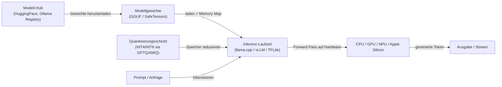
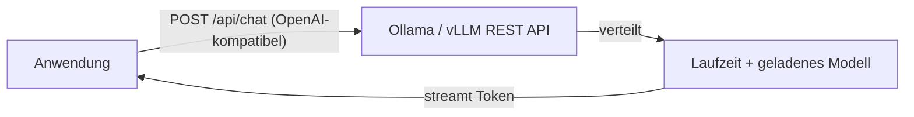

# Lokale Inferenz

## Definition

Lokale Inferenz bedeutet, [LLMs](/docs/llms), Vision-Modelle oder andere KI-Modelle vollständig auf eigener Hardware auszuführen — einem Entwickler-Laptop, einer Workstation, einem On-Premises-Server oder einem Edge-Gerät — ohne Daten an einen Cloud-API-Anbieter zu senden. Jedes generierte Token bleibt in der eigenen Umgebung, was direkt **Datenschutz**, **reduzierte Latenz**, **vorhersagbare Kosten** und **Offline-Betrieb** unterstützt.

Die praktische Machbarkeit der lokalen Inferenz hängt von [Modellkomprimierung](/docs/model-compression) ab: Frontier-Modelle in voller Präzision (FP16/BF16) benötigen typischerweise 80–320 GB GPU-Speicher, was sie für die meiste lokale Hardware unerreichbar macht. [Quantisierung](/docs/quantization) (INT8, INT4, GPTQ, AWQ) reduziert den Speicher um 2–8x, was 7B–70B-Parameter-Modelle auf Consumer- oder Prosumer-GPUs (16–48 GB VRAM) und sogar auf CPU-only-Hardware über das GGUF-Format ausführbar macht. Laufzeitumgebungen wie Ollama, LM Studio, llama.cpp, vLLM und TensorFlow Lite handhaben Modell-Laden, Speicherverwaltung und Inferenz-Ausführung mit minimaler Konfiguration.

Lokale Inferenz ist keine einzelne Technologie, sondern ein Stack: Modellgewichte (GGUF, SafeTensors, ONNX) + Laufzeit (llama.cpp, Ollama, vLLM, TFLite) + optionale Serving-Schicht (OpenAI-kompatible REST API). Dieser Stack kann assembliert werden, um einen einzelnen Entwickler interaktiv zu bedienen oder auf einen On-Premises-Cluster zu skalieren, der Hunderte von gleichzeitigen Benutzern bedient, alles ohne Cloud-Abhängigkeit.

## Funktionsweise

### Inferenz-Stack



### Serving-Schicht (optional)



### Laufzeitvergleich

| Laufzeit | Am besten für | Format | GPU erforderlich |
|---------|---------|--------|-------------|
| llama.cpp | Ressourcenarme CPU/GPU-Inferenz | GGUF | Nein (CPU-fähig) |
| Ollama | Entwicklerfreundliches lokales LLM-Serving | GGUF / Modelfile | Nein (CPU-fähig) |
| vLLM | Hochdurchsatz On-Prem-Server | HuggingFace / safetensors | Ja (CUDA) |
| TensorFlow Lite | Mobile und Mikrocontroller-Inferenz | .tflite | Nein |
| LM Studio | GUI für lokale LLM-Erkundung | GGUF | Nein (CPU-fähig) |

## Wann verwenden / Wann NICHT verwenden

| Szenario | Lokale Inferenz verwenden | Lokale Inferenz NICHT verwenden |
|----------|--------------------|-----------------------------|
| Daten dürfen das Netzwerk nicht verlassen (Gesundheit, Recht, Finanzen) | Ja — Daten verlassen nie lokale Hardware | |
| Niedrig-latente Assistenz- oder IDE-Integration | Ja — kein Netzwerk-Roundtrip | |
| Entwicklung und Tests ohne API-Schlüssel oder Nutzungslimits | Ja — kostenlos und offline | |
| Air-Gapped oder eingeschränkte Netzwerkumgebungen | Ja — keine externe Konnektivität erforderlich | |
| Frontier-Modell-Qualität benötigt (GPT-4o, Claude 3.7) | | Cloud-APIs bieten größere, leistungsfähigere Modelle |
| Unvorhersagbare oder stoßartige Lastmuster | | Cloud-Auto-Scaling ist kosteneffektiver |
| Keine GPU-Hardware verfügbar und niedrige Latenz kritisch | | Cloud-Inferenz ist auf schwacher Hardware schneller |

## Vor- und Nachteile

| Vorteile | Nachteile |
|------|------|
| Daten bleiben auf eigener Infrastruktur — starke Datenschutzgarantie | Kleinere oder quantisierte Modelle können geringere Qualität haben |
| Keine Pro-Token-API-Kosten bei der Inferenz | Eigene Hardware, Betrieb und Modell-Updates |
| Funktioniert offline und in eingeschränkten Netzwerken | Durchsatz und Kontextlänge durch Hardware begrenzt |
| Vollständige Kontrolle über Modellversion und Verhalten | [Quantisierung](/docs/quantization) und [Komprimierung](/docs/model-compression) für größere Modelle erforderlich |

## Code-Beispiele

```bash
# Install Ollama and run a local LLM
curl -fsSL https://ollama.ai/install.sh | sh

# Pull and run a model interactively
ollama run llama3.2

# Serve an OpenAI-compatible REST API (runs on localhost:11434 by default)
ollama serve &

# Call the API from Python using the OpenAI client
python3 - <<'EOF'
from openai import OpenAI

client = OpenAI(base_url="http://localhost:11434/v1", api_key="ollama")

response = client.chat.completions.create(
    model="llama3.2",
    messages=[{"role": "user", "content": "Explain quantization in one paragraph."}],
    stream=True,
)
for chunk in response:
    print(chunk.choices[0].delta.content or "", end="", flush=True)
EOF
```

## Tipps für effektive Nutzung

- Mit GGUF Q4_K_M-Quantisierung für eine gute Genauigkeits-Geschwindigkeits-Balance beginnen; nur bei kritisch eingeschränktem Speicher auf Q3 oder Q2 reduzieren.
- Ollama für Entwicklermaschinen und vLLM für On-Premises-Server verwenden, die mehrere Benutzer gleichzeitig bedienen.
- Modellversionen in der `Modelfile`- oder Konfigurationsdatei anheften, um stille Qualitätsänderungen bei Updates zu verhindern.
- Token-Durchsatz und First-Token-Latenz überwachen — diese zeigen, ob die Hardware der Engpass ist oder das Modell zu stark quantisiert ist.
- Für Apple Silicon (M1/M2/M3/M4) verwenden llama.cpp und Ollama automatisch das Metal-GPU-Backend und liefern nahezu GPU-ähnlichen Durchsatz.

## Praktische Ressourcen

- [Ollama](https://ollama.ai/) — LLMs lokal mit einfacher CLI und OpenAI-kompatibler API ausführen
- [llama.cpp](https://github.com/ggerganov/llama.cpp) — C++-Inferenz-Engine für LLaMA und kompatible Modelle, GGUF-Format
- [vLLM](https://docs.vllm.ai/) — Hochdurchsatz-LLM-Serving mit Continuous Batching und PagedAttention
- [LM Studio](https://lmstudio.ai/) — GUI zum Entdecken, Herunterladen und Ausführen lokaler LLMs
- [TensorFlow Lite](https://www.tensorflow.org/lite) — On-Device-Inferenz für Mobile und Edge

## Siehe auch

- [Quantisierung](/docs/quantization)
- [Modellkomprimierung](/docs/model-compression)
- [Infrastruktur](/docs/infrastructure)
- [Edge Reasoning](/docs/edge-reasoning)
