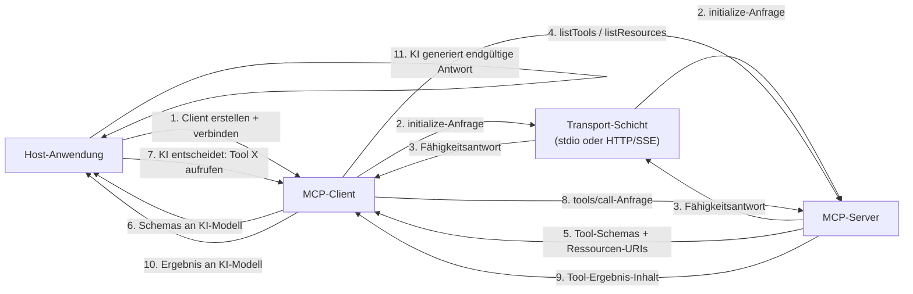

# MCP-Clients erstellen

## Definition

Ein **MCP-Client** ist die Komponente innerhalb einer Host-Anwendung, die die Verbindung zu einem einzelnen MCP-Server verwaltet und die Absicht des KI-Modells in protokollseitige Anfragen übersetzt. Die Host-Anwendung – eine Chat-Oberfläche, ein Coding-Assistent, ein autonomer Agent – erstellt für jeden Server, zu dem sie sich verbinden möchte, einen Client. Der Client handhabt den gesamten Protokoll-Lebenszyklus: Aufbau der Transport-Verbindung, Abschluss des Initialisierungs-Handshakes, Entdeckung der Server-Fähigkeiten, Aufruf von Tools im Namen der KI, Lesen von Ressourcen und Abrufen von Prompts. Aus der Perspektive der Host-Anwendung ist der Client die API-Oberfläche zur Welt des Servers.

Die Rolle des Clients in der Host-Anwendung ist die eines intelligenten Vermittlers. Er entscheidet nicht, welche Tools aufgerufen werden – das ist die Verantwortung des KI-Modells. Stattdessen stellt der Client der KI strukturierte Fähigkeitsbeschreibungen (Tool-Schemas, Ressourcen-URIs, Prompt-Definitionen) bereit und führt dann treu aus, was die KI anfordert, und gibt Ergebnisse in einem Format zurück, über das die KI nachdenken kann. Ein gut gebauter Client isoliert alle Protokollkomplexität von der Host-Anwendung: Der Host fragt einfach „was kann dieser Server tun?" und „ruf dieses Tool mit diesen Argumenten auf", und der Client handhabt alles andere.

Fähigkeitserkennung ist eine der wichtigsten Verantwortlichkeiten des Clients. Nach dem Initialisierungs-Handshake fragt der Client den Server nach seinem vollständigen Fähigkeitsmanifest, indem er `tools/list`, `resources/list` und `prompts/list` aufruft. Diese Antworten enthalten Namen, Beschreibungen, Eingabe-Schemas und URI-Vorlagen – alles, was das KI-Modell benötigt, um zu verstehen, wie und wann jede Fähigkeit verwendet werden soll. In dynamischen Umgebungen (Server, die ihr Tool-Set zur Laufzeit ändern) können Clients auf `notifications/tools/list_changed`-Ereignisse lauschen und das Manifest auf Anfrage erneut abfragen, um sicherzustellen, dass die KI immer mit einer aktuellen Ansicht der verfügbaren Fähigkeiten arbeitet.

## Funktionsweise

### Client-Initialisierung und der Handshake

Das Erstellen eines MCP-Clients erfordert zwei Dinge: eine Client-Identität (Name und Version) und eine Fähigkeitserklärung. Die Fähigkeitserklärung teilt dem Server mit, welche Protokollerweiterungen der Client unterstützt – zum Beispiel, ob er Ressourcen-Abonnements oder Prompt-Argument-Validierung handhaben kann. Nach der Instanziierung wird der Client mit einem Transport verbunden, was die `initialize`-Anfrage auslöst. Der Server antwortet mit seiner eigenen Identität, Protokollversion und Fähigkeiten. Der Client sendet dann eine `initialized`-Benachrichtigung, um zu bestätigen, dass der Handshake abgeschlossen ist. Erst nach dieser Sequenz kann der Client Fähigkeits- oder Aufruf-Anfragen stellen. Das SDK handhabt all dies automatisch, wenn Sie `client.connect(transport)` aufrufen.

### Fähigkeitserkennung

Nach der Verbindung entdeckt der Client, was der Server anbietet. `client.listTools()` gibt alle Tool-Definitionen zurück, einschließlich ihrer Namen, Beschreibungen und JSON-Schema-Eingabespezifikationen. `client.listResources()` gibt statische Ressourcen-URIs und Metadaten zurück. `client.listResourceTemplates()` gibt URI-Vorlagen für dynamische Ressourcen zurück. `client.listPrompts()` gibt Prompt-Namen und ihre Argumentdefinitionen zurück. In einer typischen KI-Anwendung findet die Erkennung einmal beim Sitzungsstart statt, und die Ergebnisse werden dem KI-Modell als Kontext bereitgestellt – entweder in den System-Prompt injiziert oder als strukturierte Daten an eine Funktionsaufruf-API übergeben. Die von `listTools()` zurückgegebenen Tool-Schemas entsprechen direkt dem JSON-Schema-Format, das von den meisten LLM-Funktionsaufruf-APIs verwendet wird, was die Konvertierung entdeckter MCP-Tools in LLM-Tool-Definitionen einfach macht.

### Tool-Aufruf

Das Aufrufen eines Tools erfordert einen Tool-Namen und ein Argumentobjekt, das das Eingabe-Schema des Tools erfüllt. `client.callTool({ name, arguments })` sendet eine `tools/call`-Anfrage an den Server und gibt eine Antwort zurück, die ein `content`-Array von Content-Blöcken enthält. Jeder Block hat ein `type`-Feld (`text`, `image` oder `resource`) und die entsprechenden Daten. Text-Blöcke enthalten Zeichenkettenergebnisse; Bild-Blöcke enthalten base64-kodierte Bilddaten mit einem MIME-Typ; Ressourcen-Blöcke betten eine Ressource inline ein. Die Aufgabe des Clients besteht darin, diese Content-Blöcke an das KI-Modell zurückzugeben – typischerweise als Tool-Ergebnis-Nachrichten in einem Gesprächszug. Wenn die Antwort `isError: true` hat, sollte der Client dies klar anzeigen, damit die KI den Fehler handhaben kann (wiederholen, zurückfallen oder dem Benutzer melden).

### Ressourcen-Lesen

Ressourcen werden über `client.readResource({ uri })` gelesen, was ein `contents`-Array von Ressourceninhalt-Elementen zurückgibt. Jedes Element hat eine URI, einen MIME-Typ und entweder ein `text`-Feld (für textbasierte Ressourcen) oder ein `blob`-Feld (für binäre Ressourcen). Ressourcen werden verwendet, um der KI großen, strukturierten Kontext bereitzustellen – Dateiinhalte, Datenbankdatensätze, API-Antworten – ohne den Tool-Aufruf-Roundtrip zu durchlaufen. Der Client kann Ressourcen-Updates abonnieren (`client.subscribeResource({ uri })`) und `notifications/resources/updated`-Ereignisse empfangen, wenn der Server feststellt, dass sich der Ressourceninhalt geändert hat, was eine Echtzeit-Kontext-Aktualisierung ermöglicht.

### Transport-Auswahl

Die Transport-Wahl hängt davon ab, wo der Server läuft. **stdio-Transport** (`StdioClientTransport`) wird verwendet, wenn der Server als lokaler Kindprozess läuft – der Client startet den Serverprozess direkt und kommuniziert über seine stdin/stdout. Dies ist konfigurationslos und ideal für Entwicklungstools, lokale Dateisystem-Server und jeden Server, der auf eine einzelne Benutzersitzung beschränkt sein sollte. **SSE-Transport** (`SSEServerTransport` auf der Client-Seite) wird für Remote-Server verwendet – der Client verbindet sich mit einem HTTP-Endpunkt und verwendet Server-Sent Events für Streaming-Antworten. Dies eignet sich für gemeinsam genutzte organisationale Server, cloud-gehostete Fähigkeiten und Produktionsbereitstellungen, bei denen mehrere Client-Instanzen denselben Server teilen müssen. Die Wahl des Transports ist für die Fähigkeitserkennung und Aufruf-APIs vollständig transparent; Sie können Transporte wechseln, ohne anderen Client-Code zu ändern.



## Wann verwenden / Wann NICHT verwenden

| Szenario | MCP-Client erstellen | Alternativen erwägen |
|---|---|---|
| Eine KI-Anwendung mit einem oder mehreren MCP-Servern verbinden | Erforderlich — dies ist der beabsichtigte Anwendungsfall | Direkte API-Aufrufe, wenn der Server kein MCP verwendet |
| Einen allgemeinen KI-Assistenten erstellen, der Community-MCP-Server unterstützen soll | Beste Wahl — jeder MCP-Server funktioniert automatisch | Benutzerdefinierte Tool-Integrationen, wenn das Tool-Set fest und klein ist |
| KI in eine Anwendung integrieren, die bereits Service-Abhängigkeiten hat | MCP-Client pro Service bietet einheitlichen Tool-Zugriff | Provider-spezifischer Funktionsaufruf, wenn an einen LLM-Anbieter gebunden |
| Tooling entwickeln, das lokal auf dem Rechner des Benutzers läuft | stdio-Transport erfordert einen MCP-Client | Shell-Skripte oder direkte Bibliotheksaufrufe, wenn KI nicht involviert ist |
| Fähigkeiten von mehreren spezialisierten Servern aggregieren | Ein Client pro Server, Host verwaltet alle Clients | Einzelne monolithische Tool-Liste, wenn alle Tools an einem Ort leben |
| Einen Server konsumieren, der HTTP/SSE für Remote-Zugriff verwendet | SSE-Transport-Client handhabt dies nativ | WebSocket oder REST-Client, wenn der Server ein Nicht-MCP-Protokoll verwendet |

## Code-Beispiele

### Vollständiger MCP-Client — verbinden, entdecken, aufrufen, lesen

```typescript
import { Client } from "@modelcontextprotocol/sdk/client/index.js";
import { StdioClientTransport } from "@modelcontextprotocol/sdk/client/stdio.js";

async function main() {
  // -----------------------------------------------------------------------
  // 1. Transport erstellen — startet den Server als Kindprozess
  // -----------------------------------------------------------------------
  const transport = new StdioClientTransport({
    command: "node",
    args: ["./file-and-weather-server.js"], // Pfad zu Ihrem MCP-Server
  });

  // -----------------------------------------------------------------------
  // 2. Client erstellen und verbinden (löst den initialize-Handshake aus)
  // -----------------------------------------------------------------------
  const client = new Client(
    { name: "demo-client", version: "1.0.0" },
    {
      capabilities: {
        // Deklarieren, welche Protokollerweiterungen dieser Client unterstützt
        roots: { listChanged: true },
      },
    }
  );

  await client.connect(transport);
  console.log("Connected to MCP server");

  // -----------------------------------------------------------------------
  // 3. Fähigkeiten entdecken
  // -----------------------------------------------------------------------
  const { tools } = await client.listTools();
  console.log(
    "\nAvailable tools:",
    tools.map((t) => `${t.name}: ${t.description}`)
  );

  const { resources } = await client.listResources();
  console.log(
    "\nAvailable resources:",
    resources.map((r) => r.uri)
  );

  const { prompts } = await client.listPrompts();
  console.log(
    "\nAvailable prompts:",
    prompts.map((p) => p.name)
  );

  // -----------------------------------------------------------------------
  // 4. Ein Tool aufrufen
  // -----------------------------------------------------------------------
  console.log("\n--- Calling get_weather tool ---");
  const weatherResult = await client.callTool({
    name: "get_weather",
    arguments: { city: "Tokyo", units: "celsius" },
  });

  // weatherResult.content ist ein Array von Content-Blöcken
  if (!weatherResult.isError) {
    for (const block of weatherResult.content) {
      if (block.type === "text") {
        console.log("Weather result:", block.text);
      }
    }
  } else {
    console.error("Tool returned an error:", weatherResult.content);
  }

  // -----------------------------------------------------------------------
  // 5. Ein weiteres Tool aufrufen
  // -----------------------------------------------------------------------
  console.log("\n--- Calling list_directory tool ---");
  const dirResult = await client.callTool({
    name: "list_directory",
    arguments: { dir_path: "/tmp" },
  });

  if (!dirResult.isError) {
    const textBlock = dirResult.content.find((b) => b.type === "text");
    if (textBlock && textBlock.type === "text") {
      console.log("Directory listing:", textBlock.text);
    }
  }

  // -----------------------------------------------------------------------
  // 6. Eine Ressource lesen
  // -----------------------------------------------------------------------
  console.log("\n--- Reading a resource ---");
  try {
    const resourceResult = await client.readResource({
      uri: "file:///etc/hostname",
    });

    for (const item of resourceResult.contents) {
      console.log(`Resource [${item.uri}]:`, "text" in item ? item.text : "(binary)");
    }
  } catch (err) {
    console.error("Resource read failed:", (err as Error).message);
  }

  // -----------------------------------------------------------------------
  // 7. Einen Prompt abrufen
  // -----------------------------------------------------------------------
  console.log("\n--- Fetching a prompt ---");
  try {
    const promptResult = await client.getPrompt({
      name: "analyze_file",
      arguments: {
        file_path: "/tmp/example.txt",
        focus: "structure and formatting",
      },
    });

    console.log("Prompt messages:");
    for (const msg of promptResult.messages) {
      console.log(`  [${msg.role}]:`, JSON.stringify(msg.content).slice(0, 120) + "...");
    }
  } catch (err) {
    console.error("Prompt fetch failed:", (err as Error).message);
  }

  // -----------------------------------------------------------------------
  // 8. Aufräumen
  // -----------------------------------------------------------------------
  await client.close();
  console.log("\nClient disconnected.");
}

main().catch((err) => {
  console.error("Client error:", err);
  process.exit(1);
});
```

### Verbindung zu einem Remote-Server über SSE-Transport

```typescript
import { Client } from "@modelcontextprotocol/sdk/client/index.js";
import { SSEClientTransport } from "@modelcontextprotocol/sdk/client/sse.js";

async function connectRemote() {
  // Auf den SSE-Endpunkt Ihres Remote-MCP-Servers zeigen
  const transport = new SSEClientTransport(
    new URL("http://localhost:3000/sse")
  );

  const client = new Client(
    { name: "remote-client", version: "1.0.0" },
    { capabilities: {} }
  );

  await client.connect(transport);

  // Von hier aus ist die API identisch mit dem stdio-Client-Beispiel
  const { tools } = await client.listTools();
  console.log("Remote tools:", tools.map((t) => t.name));

  // Ein Tool auf dem Remote-Server aufrufen
  const result = await client.callTool({
    name: "get_weather",
    arguments: { city: "Berlin" },
  });
  console.log(result.content);

  await client.close();
}

connectRemote().catch(console.error);
```

### Entdeckte MCP-Tools in LLM-Funktionsaufruf-Schemas konvertieren

```typescript
import { Client } from "@modelcontextprotocol/sdk/client/index.js";
import { StdioClientTransport } from "@modelcontextprotocol/sdk/client/stdio.js";
import type { Tool } from "@modelcontextprotocol/sdk/types.js";

// Eine MCP-Tool-Definition in das OpenAI-Funktionsaufruf-Format konvertieren
function mcpToolToOpenAIFunction(tool: Tool) {
  return {
    type: "function" as const,
    function: {
      name: tool.name,
      description: tool.description ?? "",
      parameters: tool.inputSchema,
    },
  };
}

async function getToolsForLLM(serverCommand: string, serverArgs: string[]) {
  const transport = new StdioClientTransport({
    command: serverCommand,
    args: serverArgs,
  });

  const client = new Client(
    { name: "llm-bridge", version: "1.0.0" },
    { capabilities: {} }
  );

  await client.connect(transport);

  const { tools } = await client.listTools();

  // In OpenAI-Format konvertieren — diese können direkt an die Chat Completions API übergeben werden
  const openAITools = tools.map(mcpToolToOpenAIFunction);

  return { client, openAITools };
}

// Verwendung:
// const { client, openAITools } = await getToolsForLLM("node", ["./my-server.js"]);
// openAITools an openai.chat.completions.create({ tools: openAITools, ... }) übergeben
// Wenn das LLM einen Tool-Aufruf zurückgibt, verwenden Sie: client.callTool({ name, arguments })
```

## Praktische Ressourcen

- [MCP TypeScript SDK — Client-API-Referenz](https://github.com/modelcontextprotocol/typescript-sdk/tree/main/src/client) — Quellcode und Inline-Dokumentation für `Client`, alle Transport-Klassen und clientseitige Typen.
- [MCP-Client-Beispiele und Integrationen](https://modelcontextprotocol.io/clients) — Eine kuratierte Liste bestehender MCP-Client-Integrationen über Editoren, KI-Plattformen und Entwicklertools.
- [MCP-Protokollspezifikation — Client-Verhalten](https://spec.modelcontextprotocol.io/specification/client/) — Maßgebliche Referenz für Client-Verantwortlichkeiten einschließlich Initialisierung, Fähigkeitsaushandlung und Anfrage-Lebenszyklus.
- [MCP-Integrationsleitfaden](https://modelcontextprotocol.io/docs/concepts/architecture) — Konzeptioneller Überblick darüber, wie Clients, Server und Host-Anwendungen zusammenhängen, mit Diagrammen und Entscheidungshilfen.

## Siehe auch

- [Model Context Protocol Übersicht](/docs/mcp)
- [MCP-Server erstellen](/docs/mcp/building-servers)
- [KI-Agenten](/docs/agents)
