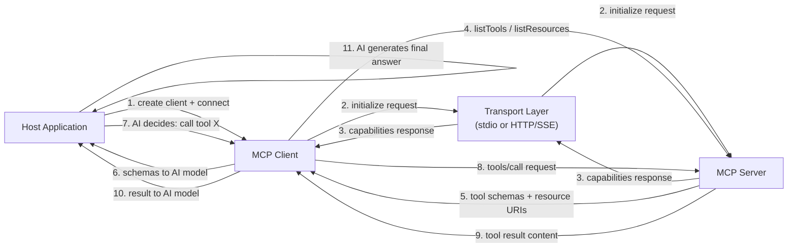

# MCP-Clients erstellen

## Definition

Ein **MCP-Client** ist die Komponente innerhalb einer Host-Anwendung, die die Verbindung zu einem einzelnen MCP-Server verwaltet und die Absicht des KI-Modells in protokollseitige Anfragen übersetzt. Die Host-Anwendung – eine Chat-Schnittstelle, ein Coding-Assistent, ein autonomer Agent – erstellt einen Client pro Server, mit dem sie sich verbinden möchte. Der Client übernimmt den gesamten Protokoll-Lebenszyklus: Herstellen der Transport-Verbindung, Abschluss des Initialisierungs-Handshakes, Entdeckung von Server-Fähigkeiten, Aufruf von Tools im Namen der KI, Lesen von Ressourcen und Abrufen von Prompts. Aus der Perspektive der Host-Anwendung ist der Client die API-Oberfläche zur Welt des Servers.

Die Rolle des Clients in der Host-Anwendung ist die eines intelligenten Vermittlers. Er entscheidet nicht, welche Tools aufzurufen sind – das ist die Verantwortung des KI-Modells. Stattdessen stellt der Client der KI strukturierte Fähigkeitsbeschreibungen bereit (Tool-Schemas, Ressourcen-URIs, Prompt-Definitionen) und führt dann treu aus, was die KI verlangt, und gibt Ergebnisse in einem Format zurück, über das die KI schlussfolgern kann. Ein gut gebauter Client isoliert die gesamte Protokollkomplexität von der Host-Anwendung: Der Host fragt einfach "Was kann dieser Server tun?" und "Ruf dieses Tool mit diesen Argumenten auf", und der Client kümmert sich um alles andere.

Fähigkeitsentdeckung ist eine der wichtigsten Verantwortlichkeiten des Clients. Nach dem Initialisierungs-Handshake fragt der Client den Server nach seinem vollständigen Fähigkeitsmanifest ab, indem er `tools/list`, `resources/list` und `prompts/list` aufruft. Diese Antworten enthalten Namen, Beschreibungen, Eingabe-Schemas und URI-Vorlagen – alles, was das KI-Modell benötigt, um zu verstehen, wie und wann jede Fähigkeit zu nutzen ist. In dynamischen Umgebungen (Server, die ihren Tool-Satz zur Laufzeit ändern) können Clients auf `notifications/tools/list_changed`-Ereignisse hören und das Manifest bei Bedarf erneut abfragen, um sicherzustellen, dass die KI immer mit einer aktuellen Sicht der verfügbaren Fähigkeiten arbeitet.

## Funktionsweise

### Client-Initialisierung und der Handshake

Das Erstellen eines MCP-Clients erfordert zwei Dinge: eine Client-Identität (Name und Version) und eine Fähigkeitsdeklaration. Die Fähigkeitsdeklaration teilt dem Server mit, welche Protokollerweiterungen der Client unterstützt – zum Beispiel, ob er Ressourcen-Abonnements oder Prompt-Argument-Validierung verarbeiten kann. Nach der Instanziierung wird der Client mit einem Transport verbunden, was die `initialize`-Anfrage auslöst. Der Server antwortet mit seiner eigenen Identität, Protokollversion und Fähigkeiten. Der Client sendet dann eine `initialized`-Benachrichtigung, um zu bestätigen, dass der Handshake abgeschlossen ist. Erst nach dieser Sequenz kann der Client Fähigkeits- oder Aufrufanfragen stellen. Das SDK übernimmt all dies automatisch, wenn Sie `client.connect(transport)` aufrufen.

### Fähigkeitsentdeckung

Nach der Verbindung entdeckt der Client, was der Server anbietet. `client.listTools()` gibt alle Tool-Definitionen einschließlich ihrer Namen, Beschreibungen und JSON-Schema-Eingabespezifikationen zurück. `client.listResources()` gibt statische Ressourcen-URIs und Metadaten zurück. `client.listResourceTemplates()` gibt URI-Vorlagen für dynamische Ressourcen zurück. `client.listPrompts()` gibt Prompt-Namen und ihre Argument-Definitionen zurück. In einer typischen KI-Anwendung erfolgt die Entdeckung einmal beim Sitzungsstart und die Ergebnisse werden dem KI-Modell als Kontext bereitgestellt – entweder in den System-Prompt eingefügt oder als strukturierte Daten an eine Funktionsaufruf-API übergeben. Die von `listTools()` zurückgegebenen Tool-Schemas entsprechen direkt dem JSON-Schema-Format, das von den meisten LLM-Funktionsaufruf-APIs verwendet wird, was die Konvertierung von entdeckten MCP-Tools in LLM-Tool-Definitionen unkompliziert macht.

### Tool-Aufruf

Das Aufrufen eines Tools erfordert einen Tool-Namen und ein Argumentobjekt, das dem Eingabeschema des Tools entspricht. `client.callTool({ name, arguments })` sendet eine `tools/call`-Anfrage an den Server und gibt eine Antwort zurück, die ein `content`-Array von Inhaltsblöcken enthält. Jeder Block hat ein `type`-Feld (`text`, `image` oder `resource`) und die entsprechenden Daten. Textblöcke enthalten Zeichenkettenergebnisse; Bildblöcke enthalten Base64-kodierte Bilddaten mit einem MIME-Typ; Ressourcenblöcke betten eine Ressource inline ein. Die Aufgabe des Clients besteht darin, diese Inhaltsblöcke an das KI-Modell zurückzugeben – typischerweise als Tool-Ergebnisnachrichten in einem Gesprächszug. Wenn die Antwort `isError: true` hat, sollte der Client dies klar kommunizieren, damit die KI den Fehler behandeln kann (Wiederholung, Fallback oder Meldung an den Benutzer).

### Ressourcenlesen

Ressourcen werden über `client.readResource({ uri })` gelesen, was ein `contents`-Array von Ressourceninhaltelementen zurückgibt. Jedes Element hat einen URI, einen MIME-Typ und entweder ein `text`-Feld (für textbasierte Ressourcen) oder ein `blob`-Feld (für binäre Ressourcen). Ressourcen werden verwendet, um der KI großen, strukturierten Kontext bereitzustellen – Dateiinhalte, Datenbankdatensätze, API-Antworten – ohne den Tool-Aufruf-Umlauf. Der Client kann Ressourcenaktualisierungen abonnieren (`client.subscribeResource({ uri })`) und `notifications/resources/updated`-Ereignisse empfangen, wenn der Server feststellt, dass der Ressourceninhalt sich geändert hat, was eine Echtzeit-Kontextaktualisierung ermöglicht.

### Transport-Auswahl

Die Transport-Wahl hängt davon ab, wo der Server läuft. Der **stdio-Transport** (`StdioClientTransport`) wird verwendet, wenn der Server als lokaler Child-Prozess läuft – der Client erzeugt den Serverprozess direkt und kommuniziert über seine stdin/stdout. Dies ist null-Konfiguration und ideal für Entwicklungstools, lokale Dateisystem-Server und jeden Server, der auf eine einzige Benutzersitzung beschränkt sein soll. Der **SSE-Transport** (`SSEServerTransport` auf der Client-Seite) wird für Remote-Server verwendet – der Client verbindet sich mit einem HTTP-Endpunkt und verwendet Server-Sent-Events für Streaming-Antworten. Dies eignet sich für gemeinsame Organisationsserver, cloud-gehostete Fähigkeiten und Produktionsbereitstellungen, bei denen mehrere Client-Instanzen denselben Server teilen müssen. Die Wahl des Transports ist für die Fähigkeitsentdeckungs- und Aufruf-APIs völlig transparent; Sie können Transporte wechseln, ohne anderen Client-Code zu ändern.



## Wann verwenden / Wann NICHT verwenden

| Szenario | MCP-Client erstellen | Alternativen in Betracht ziehen |
|---|---|---|
| Verbindung einer KI-Anwendung mit einem oder mehreren MCP-Servern | Erforderlich — dies ist der beabsichtigte Anwendungsfall | Direkte API-Aufrufe, wenn der Server kein MCP verwendet |
| Erstellen eines Allzweck-KI-Assistenten, der Community-MCP-Server unterstützen soll | Beste Wahl — jeder MCP-Server funktioniert automatisch | Benutzerdefinierte Tool-Integrationen, wenn der Tool-Satz fest und klein ist |
| Integration von KI in eine Anwendung, die bereits Service-Abhängigkeiten hat | MCP-Client pro Service bietet einheitlichen Tool-Zugang | Anbieterspezifischer Funktionsaufruf, wenn an einen LLM-Anbieter gebunden |
| Entwicklung von Tooling, das lokal auf der Maschine des Benutzers läuft | stdio-Transport erfordert einen MCP-Client | Shell-Skripte oder direkte Bibliotheksaufrufe, wenn KI nicht beteiligt ist |
| Aggregieren von Fähigkeiten aus mehreren spezialisierten Servern | Ein Client pro Server, Host verwaltet alle Clients | Einzelne monolithische Tool-Liste, wenn alle Tools an einem Ort liegen |
| Verarbeitung eines Servers, der HTTP/SSE für Remote-Zugang verwendet | SSE-Transport-Client übernimmt dies nativ | WebSocket- oder REST-Client, wenn der Server ein Nicht-MCP-Protokoll verwendet |

## Codebeispiele

### Vollständiger MCP-Client — verbinden, entdecken, aufrufen, lesen

```typescript
import { Client } from "@modelcontextprotocol/sdk/client/index.js";
import { StdioClientTransport } from "@modelcontextprotocol/sdk/client/stdio.js";

async function main() {
  // -----------------------------------------------------------------------
  // 1. Create transport — spawns the server as a child process
  // -----------------------------------------------------------------------
  const transport = new StdioClientTransport({
    command: "node",
    args: ["./file-and-weather-server.js"], // Path to your MCP server
  });

  // -----------------------------------------------------------------------
  // 2. Create client and connect (triggers the initialize handshake)
  // -----------------------------------------------------------------------
  const client = new Client(
    { name: "demo-client", version: "1.0.0" },
    {
      capabilities: {
        // Declare which protocol extensions this client supports
        roots: { listChanged: true },
      },
    }
  );

  await client.connect(transport);
  console.log("Connected to MCP server");

  // -----------------------------------------------------------------------
  // 3. Discover capabilities
  // -----------------------------------------------------------------------
  const { tools } = await client.listTools();
  console.log(
    "\nAvailable tools:",
    tools.map((t) => `${t.name}: ${t.description}`)
  );

  const { resources } = await client.listResources();
  console.log(
    "\nAvailable resources:",
    resources.map((r) => r.uri)
  );

  const { prompts } = await client.listPrompts();
  console.log(
    "\nAvailable prompts:",
    prompts.map((p) => p.name)
  );

  // -----------------------------------------------------------------------
  // 4. Invoke a tool
  // -----------------------------------------------------------------------
  console.log("\n--- Calling get_weather tool ---");
  const weatherResult = await client.callTool({
    name: "get_weather",
    arguments: { city: "Tokyo", units: "celsius" },
  });

  // weatherResult.content is an array of content blocks
  if (!weatherResult.isError) {
    for (const block of weatherResult.content) {
      if (block.type === "text") {
        console.log("Weather result:", block.text);
      }
    }
  } else {
    console.error("Tool returned an error:", weatherResult.content);
  }

  // -----------------------------------------------------------------------
  // 5. Invoke another tool
  // -----------------------------------------------------------------------
  console.log("\n--- Calling list_directory tool ---");
  const dirResult = await client.callTool({
    name: "list_directory",
    arguments: { dir_path: "/tmp" },
  });

  if (!dirResult.isError) {
    const textBlock = dirResult.content.find((b) => b.type === "text");
    if (textBlock && textBlock.type === "text") {
      console.log("Directory listing:", textBlock.text);
    }
  }

  // -----------------------------------------------------------------------
  // 6. Read a resource
  // -----------------------------------------------------------------------
  console.log("\n--- Reading a resource ---");
  try {
    const resourceResult = await client.readResource({
      uri: "file:///etc/hostname",
    });

    for (const item of resourceResult.contents) {
      console.log(`Resource [${item.uri}]:`, "text" in item ? item.text : "(binary)");
    }
  } catch (err) {
    console.error("Resource read failed:", (err as Error).message);
  }

  // -----------------------------------------------------------------------
  // 7. Fetch a prompt
  // -----------------------------------------------------------------------
  console.log("\n--- Fetching a prompt ---");
  try {
    const promptResult = await client.getPrompt({
      name: "analyze_file",
      arguments: {
        file_path: "/tmp/example.txt",
        focus: "structure and formatting",
      },
    });

    console.log("Prompt messages:");
    for (const msg of promptResult.messages) {
      console.log(`  [${msg.role}]:`, JSON.stringify(msg.content).slice(0, 120) + "...");
    }
  } catch (err) {
    console.error("Prompt fetch failed:", (err as Error).message);
  }

  // -----------------------------------------------------------------------
  // 8. Clean up
  // -----------------------------------------------------------------------
  await client.close();
  console.log("\nClient disconnected.");
}

main().catch((err) => {
  console.error("Client error:", err);
  process.exit(1);
});
```

### Verbindung zu einem Remote-Server über SSE-Transport

```typescript
import { Client } from "@modelcontextprotocol/sdk/client/index.js";
import { SSEClientTransport } from "@modelcontextprotocol/sdk/client/sse.js";

async function connectRemote() {
  // Point to the SSE endpoint of your remote MCP server
  const transport = new SSEClientTransport(
    new URL("http://localhost:3000/sse")
  );

  const client = new Client(
    { name: "remote-client", version: "1.0.0" },
    { capabilities: {} }
  );

  await client.connect(transport);

  // From here, the API is identical to the stdio client example
  const { tools } = await client.listTools();
  console.log("Remote tools:", tools.map((t) => t.name));

  // Call a tool on the remote server
  const result = await client.callTool({
    name: "get_weather",
    arguments: { city: "Berlin" },
  });
  console.log(result.content);

  await client.close();
}

connectRemote().catch(console.error);
```

### Konvertierung entdeckter MCP-Tools in LLM-Funktionsaufruf-Schemas

```typescript
import { Client } from "@modelcontextprotocol/sdk/client/index.js";
import { StdioClientTransport } from "@modelcontextprotocol/sdk/client/stdio.js";
import type { Tool } from "@modelcontextprotocol/sdk/types.js";

// Convert an MCP tool definition to OpenAI function-calling format
function mcpToolToOpenAIFunction(tool: Tool) {
  return {
    type: "function" as const,
    function: {
      name: tool.name,
      description: tool.description ?? "",
      parameters: tool.inputSchema,
    },
  };
}

async function getToolsForLLM(serverCommand: string, serverArgs: string[]) {
  const transport = new StdioClientTransport({
    command: serverCommand,
    args: serverArgs,
  });

  const client = new Client(
    { name: "llm-bridge", version: "1.0.0" },
    { capabilities: {} }
  );

  await client.connect(transport);

  const { tools } = await client.listTools();

  // Convert to OpenAI format — these can be passed directly to the Chat Completions API
  const openAITools = tools.map(mcpToolToOpenAIFunction);

  return { client, openAITools };
}

// Usage:
// const { client, openAITools } = await getToolsForLLM("node", ["./my-server.js"]);
// Pass openAITools to openai.chat.completions.create({ tools: openAITools, ... })
// When the LLM returns a tool call, use: client.callTool({ name, arguments })
```

## Praktische Ressourcen

- [MCP TypeScript SDK — Client-API-Referenz](https://github.com/modelcontextprotocol/typescript-sdk/tree/main/src/client) — Quellcode und Inline-Dokumentation für `Client`, alle Transport-Klassen und clientseitige Typen.
- [MCP-Client-Beispiele und Integrationen](https://modelcontextprotocol.io/clients) — Eine kuratierte Liste bestehender MCP-Client-Integrationen über Editoren, KI-Plattformen und Entwicklertools hinweg.
- [MCP-Protokollspezifikation — Client-Verhalten](https://spec.modelcontextprotocol.io/specification/client/) — Maßgebliche Referenz für Client-Verantwortlichkeiten einschließlich Initialisierung, Fähigkeitsverhandlung und Anfrage-Lebenszyklus.
- [MCP-Integrationsleitfaden](https://modelcontextprotocol.io/docs/concepts/architecture) — Konzeptioneller Überblick darüber, wie Clients, Server und Host-Anwendungen zusammenhängen, mit Diagrammen und Entscheidungshilfen.

## Siehe auch

- [Model Context Protocol-Übersicht](/docs/mcp)
- [MCP-Server erstellen](/docs/mcp/building-servers)
- [KI-Agenten](/docs/agents)
