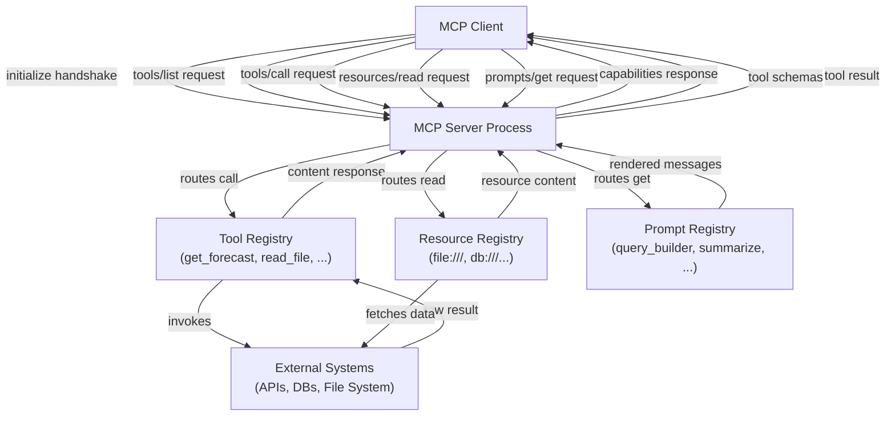

# MCP-Server erstellen

## Definition

Ein **MCP-Server** ist ein Prozess, der Fähigkeiten für MCP-kompatible KI-Anwendungen über das Model Context Protocol bereitstellt. Er fungiert als Brücke zwischen einem KI-Modell und einem externen System – einem Dateisystem, einer REST-API, einer Datenbank, einem Code-Runner – indem er die Funktionalität dieses Systems in einer gut definierten, entdeckbaren Schnittstelle verpackt. Der Server besitzt die Implementierungsdetails; der Client muss nur das Protokoll kennen. Jeder MCP-konforme Client kann sich mit jedem MCP-Server verbinden und sofort seine Fähigkeiten entdecken und nutzen, ohne individuelle Integrationsarbeit.

Ein MCP-Server kann drei Kategorien von Fähigkeiten bereitstellen. **Tools** sind aufrufbare Funktionen, die strukturierte Eingaben akzeptieren und Ausgaben zurückgeben – die KI ruft sie auf, um Aktionen auszuführen oder dynamische Informationen abzurufen. **Ressourcen** sind schreibgeschützte, URI-adressierte Datenquellen, die die KI für Kontext lesen kann – Dateien, Datenbankdatensätze, API-Snapshots. **Prompts** sind wiederverwendbare, parametrisierte Prompt-Vorlagen, die auf dem Server gespeichert sind und die Clients an Benutzer weitergeben oder in Gespräche einfügen können. Ein einzelner Server kann jede Kombination dieser Typen anbieten; viele Server stellen nur Tools bereit.

Der **Server-Lebenszyklus** folgt einem vorhersehbaren Muster: Der Server startet und bindet sich an einen Transport (stdio oder HTTP/SSE), wartet darauf, dass sich ein Client verbindet, schließt den `initialize`-Handshake ab, um Protokollversionen und Fähigkeiten zu verhandeln, und tritt dann in seine Hauptschleife ein, die auf Anfragen antwortet. Wenn der Client die Verbindung trennt oder ein Shutdown-Signal sendet, führt der Server eine Bereinigung durch und beendet sich. Da das Protokoll innerhalb einer Sitzung zustandsbehaftet ist, kann der Server einen pro-Verbindungs-Zustand aufrechterhalten – zum Beispiel das Caching teurer API-Antworten für die Dauer einer Sitzung.

## Funktionsweise

### Server-Setup und Initialisierung

Das Einrichten eines MCP-Servers beginnt mit dem Erstellen einer `McpServer`-Instanz (aus dem hochstufigen SDK) oder einer `Server`-Instanz (aus dem niederstufigen SDK) mit einem Namen und einer Version. Name und Version werden während des `initialize`-Handshakes an den Client gesendet und helfen beim Debugging und Logging. Nach dem Erstellen des Servers registrieren Sie Fähigkeiten – Tools, Ressourcen, Prompts – bevor Sie sich mit einem Transport verbinden. Die hochstufige `McpServer`-Klasse des SDKs bietet ergonomische `server.tool()`-, `server.resource()`- und `server.prompt()`-Methoden, die Anfrage-Routing und Schema-Validierung intern übernehmen. Der Verbindungsschritt (`server.connect(transport)`) startet die Ereignisschleife und blockiert bis zum Ende der Sitzung.

### Tools definieren

Tools sind die am häufigsten verwendete MCP-Fähigkeit. Jedes Tool hat drei erforderliche Elemente: einen **Namen** (einen kurzen, kleingeschriebenen Identifier, der in `tools/call`-Anfragen verwendet wird), eine **Beschreibung** (eine natürlichsprachige Erklärung, die die KI verwendet, um zu entscheiden, wann und wie das Tool aufzurufen ist), und ein **Eingabeschema** (ein Zod-Schema im TypeScript-SDK, das für das Protokoll in JSON-Schema konvertiert wird). Wenn ein Client ein Tool aufruft, validiert das SDK die eingehenden Argumente gegen das Schema, bevor Ihre Handler-Funktion aufgerufen wird, sodass Sie typsichere, validierte Eingaben erhalten. Der Handler gibt ein `content`-Array von Inhaltsblöcken zurück – Text, Bilder oder eingebettete Ressourcen – das der Client an das KI-Modell zurückgibt. Tools können auch `isError: true` in ihrer Antwort setzen, um einen behebbaren Fehler zu signalisieren, was der KI ermöglicht, Wiederholungen durchzuführen oder ordnungsgemäß zurückzufallen.

### Ressourcen definieren

Ressourcen stellen dateiähnliche Daten bereit, die die KI für Kontext lesen kann. Eine Ressource wird durch einen URI identifiziert (z. B. `file:///path/to/data.json` oder `postgres://mydb/users/123`) und hat einen MIME-Typ, der dem Client mitteilt, wie der Inhalt zu behandeln ist. Ressourcen werden über `resources/list` entdeckt und über `resources/read` gelesen. Das SDK unterstützt sowohl **statische Ressourcen** (mit einem festen URI und Inhalt registriert) als auch **dynamische Ressourcen** (mit einem URI-Vorlagenmuster registriert, zur Lesezeit aufgelöst). Ressourcenvorlagen verwenden die URI-Vorlagensyntax nach RFC 6570 – zum Beispiel entspricht `file:///{path}` jedem Dateipfad. Wenn der Client eine Ressource-URI liest, die einer Vorlage entspricht, erhält Ihr Handler die extrahierten Vorlagenvariablen und gibt den Inhalt zurück. Ressourcen sollten für Daten verwendet werden, die die KI lesen, aber nicht ändern muss; für Schreiboperationen verwenden Sie ein Tool.

### Prompts definieren

Prompts sind wiederverwendbare Interaktionsvorlagen. Ein Prompt hat einen Namen, eine Beschreibung und eine optionale Liste von Argumenten (Name, Beschreibung, erforderliches Flag). Wenn ein Client einen Prompt über `prompts/get` anfordert, erhält Ihr Handler die Argumentwerte und gibt eine Liste von Nachrichten zurück – typischerweise eine Mischung aus `user`- und `assistant`-Rollennachrichten – die der Client in das Gespräch einfügt. Prompts ermöglichen es Server-Autoren, Domänenwissen darüber zu kodieren, wie mit den Fähigkeiten des Servers interagiert werden soll. Zum Beispiel könnte ein Datenbankserver einen `query_builder`-Prompt bereitstellen, der eine natürlichsprachige Beschreibung einer Abfrage akzeptiert und einen strukturierten Prompt zurückgibt, der die KI dazu leitet, sicheres, parametrisiertes SQL zu produzieren.

### Transport-Konfiguration

Die Transport-Schicht bestimmt, wie der Server mit Clients kommuniziert. Der **stdio-Transport** (`StdioServerTransport`) liest von `process.stdin` und schreibt nach `process.stdout`. Dies ist der Standard für lokale Tool-Server – die Host-Anwendung erzeugt den Server als Child-Prozess und kommuniziert über die Prozessströme. Es ist keine Netzwerkkonfiguration erforderlich, und das stderr des Servers ist für Logging verfügbar, ohne das Protokoll zu stören. Der **HTTP-mit-SSE-Transport** (`SSEServerTransport`) akzeptiert HTTP-POST-Anfragen für Client-zu-Server-Nachrichten und streamt Server-zu-Client-Nachrichten über einen `/sse`-Server-Sent-Events-Endpunkt. Dies ist geeignet für gemeinsam genutzte Server, mit denen sich mehrere Clients gleichzeitig verbinden können, oder für Server, die als langlebige Dienste statt als On-Demand-Prozesse laufen müssen.



## Wann verwenden / Wann NICHT verwenden

| Szenario | MCP-Server erstellen | Alternativen in Betracht ziehen |
|---|---|---|
| Bereitstellen einer vorhandenen API oder eines Dienstes für mehrere KI-Anwendungen | Beste Wahl — ein Server, jeder Client kann ihn nutzen | Direkter Funktionsaufruf, wenn nur ein Anbieter und eine App wichtig sind |
| Verpacken eines Dateisystems, einer Datenbank oder einer internen Datenquelle für KI-Kontext | Beste Wahl — Ressourcen und Tools entsprechen natürlich | Benutzerdefinierte RAG-Pipeline, wenn semantischer Abruf der primäre Bedarf ist |
| Bereitstellen domänenspezifischer Prompt-Vorlagen für KI-Benutzer | Prompts-Fähigkeit ist speziell dafür konzipiert | System-Prompt-Einspeisung, wenn Vorlagen einfach und statisch sind |
| Aufbau von Tooling für eine einzelne interne KI-Anwendung mit einem Anbieter | MCP fügt nützliche Struktur hinzu, kann aber überdimensioniert sein | In-Prozess-Tool-Funktionen sind einfacher |
| Bereitstellen von Tools, die Echtzeit-Streaming-Ergebnisse erfordern | Unterstützt über SSE-Transport | WebSockets oder benutzerdefiniertes Streaming, wenn Protokollaufwand wichtig ist |
| Tools, die pro-Benutzer langlebigen Zustand über Sitzungen hinweg aufrechterhalten müssen | Erfordert sorgfältiges Server-Design — Sitzungen sind 1:1 | Zustandsbehafteter Backend-Dienst mit einem dünnen MCP-Wrapper |

## Codebeispiele

### Vollständiger MCP-Server mit Tools, Ressourcen und einem Prompt

```typescript
import { McpServer, ResourceTemplate } from "@modelcontextprotocol/sdk/server/mcp.js";
import { StdioServerTransport } from "@modelcontextprotocol/sdk/server/stdio.js";
import { z } from "zod";
import * as fs from "fs/promises";
import * as path from "path";

const server = new McpServer({
  name: "file-and-weather-server",
  version: "1.0.0",
});

// -----------------------------------------------------------------------
// Tool 1: Get weather forecast (mock — replace with a real weather API)
// -----------------------------------------------------------------------
server.tool(
  "get_weather",
  "Fetches the current weather forecast for a given city. Returns temperature, conditions, and humidity.",
  {
    city: z.string().describe("The city name, e.g. 'Tokyo' or 'Berlin'"),
    units: z
      .enum(["celsius", "fahrenheit"])
      .default("celsius")
      .describe("Temperature units"),
  },
  async ({ city, units }) => {
    // In production, call a real weather API here (e.g. Open-Meteo, WeatherAPI)
    const mockData = {
      city,
      temperature: units === "celsius" ? 18 : 64,
      units,
      condition: "Partly cloudy",
      humidity_percent: 72,
      forecast: "Light rain expected in the evening",
    };

    return {
      content: [
        {
          type: "text",
          text: JSON.stringify(mockData, null, 2),
        },
      ],
    };
  }
);

// -----------------------------------------------------------------------
// Tool 2: List directory contents
// -----------------------------------------------------------------------
server.tool(
  "list_directory",
  "Lists the files and subdirectories in a given directory path. Use this to explore file system structure.",
  {
    dir_path: z
      .string()
      .describe("Absolute path to the directory to list"),
  },
  async ({ dir_path }) => {
    try {
      const entries = await fs.readdir(dir_path, { withFileTypes: true });
      const listing = entries.map((e) => ({
        name: e.name,
        type: e.isDirectory() ? "directory" : "file",
      }));

      return {
        content: [
          {
            type: "text",
            text: JSON.stringify(listing, null, 2),
          },
        ],
      };
    } catch (err) {
      return {
        isError: true,
        content: [
          {
            type: "text",
            text: `Error listing directory: ${(err as Error).message}`,
          },
        ],
      };
    }
  }
);

// -----------------------------------------------------------------------
// Resource: Read any text file by path (URI template)
// -----------------------------------------------------------------------
server.resource(
  "text-file",
  new ResourceTemplate("file:///{file_path}", { list: undefined }),
  async (uri, { file_path }) => {
    const resolvedPath = path.resolve(String(file_path));

    try {
      const content = await fs.readFile(resolvedPath, "utf-8");
      return {
        contents: [
          {
            uri: uri.href,
            mimeType: "text/plain",
            text: content,
          },
        ],
      };
    } catch (err) {
      throw new Error(`Cannot read file at ${resolvedPath}: ${(err as Error).message}`);
    }
  }
);

// -----------------------------------------------------------------------
// Prompt: Guided file analysis template
// -----------------------------------------------------------------------
server.prompt(
  "analyze_file",
  "Generates a structured prompt that guides the AI to analyze a text file for issues, patterns, or summaries.",
  {
    file_path: z.string().describe("Path to the file to analyze"),
    focus: z
      .string()
      .optional()
      .describe("Optional: specific aspect to focus on, e.g. 'security issues' or 'performance'"),
  },
  async ({ file_path, focus }) => {
    const focusInstruction = focus
      ? `Focus specifically on: ${focus}.`
      : "Provide a general analysis.";

    return {
      messages: [
        {
          role: "user",
          content: {
            type: "text",
            text: `Please analyze the file at \`${file_path}\`.

${focusInstruction}

Use the \`read_file\` resource (URI: file:///${file_path}) to read its contents, then provide:
1. A brief summary of what the file contains
2. Key observations or findings
3. Any recommendations or concerns

Be concise and structured.`,
          },
        },
      ],
    };
  }
);

// -----------------------------------------------------------------------
// Start the server
// -----------------------------------------------------------------------
async function main() {
  const transport = new StdioServerTransport();
  await server.connect(transport);
  // Log to stderr so it doesn't interfere with the stdio protocol
  console.error("file-and-weather-server is running on stdio");
}

main().catch((err) => {
  console.error("Server failed to start:", err);
  process.exit(1);
});
```

### HTTP/SSE-Transport (für gemeinsam genutzte Remote-Server)

```typescript
import { McpServer } from "@modelcontextprotocol/sdk/server/mcp.js";
import { SSEServerTransport } from "@modelcontextprotocol/sdk/server/sse.js";
import express from "express";

const app = express();
const server = new McpServer({ name: "remote-server", version: "1.0.0" });

// Register your tools, resources, and prompts here (same API as stdio)
// server.tool(...), server.resource(...), server.prompt(...)

// SSE endpoint: clients connect here to receive server-to-client messages
app.get("/sse", async (req, res) => {
  const transport = new SSEServerTransport("/messages", res);
  await server.connect(transport);
});

// POST endpoint: clients send messages here
app.post("/messages", express.json(), async (req, res) => {
  // The SSEServerTransport handles routing from the active session
  res.status(200).send("ok");
});

app.listen(3000, () => {
  console.log("MCP server listening on http://localhost:3000");
});
```

## Praktische Ressourcen

- [MCP TypeScript SDK — Server-API-Referenz](https://github.com/modelcontextprotocol/typescript-sdk/tree/main/src/server) — Quellcode und Inline-Dokumentation für `McpServer`, Transporte und alle serverseitigen Typen.
- [Offizielle MCP-Server-Beispiele](https://github.com/modelcontextprotocol/servers) — Referenzimplementierungen einschließlich Dateisystem, GitHub, PostgreSQL, Slack und mehr — unverzichtbar als Ausgangspunkte.
- [MCP-Transport-Dokumentation](https://spec.modelcontextprotocol.io/specification/architecture/) — Protokollspezifikationsabschnitt zu stdio, HTTP/SSE und Streamable HTTP Transporten im Detail.
- [Zod-Dokumentation](https://zod.dev) — Die Schema-Bibliothek, die vom TypeScript-SDK für die Eingabevalidierung verwendet wird; das Verständnis von Zod-Typen entspricht direkt Tool-Parameter-Schemas.

## Siehe auch

- [Model Context Protocol-Übersicht](/docs/mcp)
- [MCP-Clients erstellen](/docs/mcp/building-clients)
- [Agenten-Tools und -Aktionen](/docs/agents/tools-actions)
