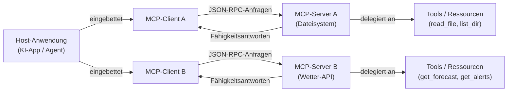

# Model Context Protocol (MCP)

## Definition

Das **Model Context Protocol (MCP)** ist ein offener Standard, der eine einheitliche Methode für KI-Anwendungen definiert, um sich mit externen Tools, Datenquellen und Diensten zu verbinden. Anstatt für jede Kombination aus KI-Modell und externem System eigene Integrationen zu erstellen, stellt MCP eine gemeinsame Sprache bereit: Eine Host-Anwendung kommuniziert mit einem MCP-Server über ein klar definiertes Protokoll, und der Server stellt Fähigkeiten (Tools, Ressourcen, Prompts) bereit, die jeder konforme KI-Client entdecken und nutzen kann. MCP wurde von Anthropic Ende 2024 eingeführt und sofort als offener Standard veröffentlicht, um das breitere Ökosystem zur Übernahme und Erweiterung einzuladen.

Vor MCP war die Tool-Integration für KI-Anwendungen fragmentiert. Jeder Anbieter hatte sein eigenes Funktionsaufruf-Format; jede Integration musste für jedes neue KI-Backend neu implementiert werden. Ein für ein Modell geschriebenes Code-Ausführungs-Tool musste beim Wechsel des Anbieters neu geschrieben werden, und eine neue Datenquelle erforderte benutzerdefinierte Klempnerarbeit für jede KI-Anwendung, die darauf zugreifen wollte. MCP löst dies, indem die Frage „wie spricht eine KI mit einem Tool" (das Protokoll) von „welche KI" und „welches Tool" getrennt wird, sodass jeder MCP-konforme Client jeden MCP-konformen Server ohne zusätzlichen Kleber-Code verwenden kann.

Die praktischen Auswirkungen sind erheblich: Entwickler können einen MCP-Server einmal erstellen – für eine Datenbank, ein Dateisystem, eine REST-API, einen Code-Runner – und jede MCP-fähige KI-Anwendung erhält Zugriff darauf. Das Protokoll ist transport-agnostisch (läuft über stdio für lokale Prozesse oder HTTP/SSE für Remote-Dienste), unterstützt bidirektionale Kommunikation und enthält einen Fähigkeitsaushandlungs-Handshake, damit Clients und Server genau ankündigen können, was sie unterstützen.

## Funktionsweise

### Client-Server-Architektur

MCP folgt einem strikten Client-Server-Modell mit drei verschiedenen Rollen. Die **Host-Anwendung** ist die KI-zugewandte Anwendung (eine Chat-Benutzeroberfläche, ein Coding-Assistent, ein autonomer Agent), die einen oder mehrere MCP-Clients einbettet. Jeder **MCP-Client** pflegt eine 1:1-Verbindung zu einem einzelnen **MCP-Server** und fungiert als Vermittler zwischen dem Host und den Fähigkeiten dieses Servers. Der **MCP-Server** ist der Prozess, der die tatsächlichen Fähigkeiten besitzt und bereitstellt – er weiß, wie man eine Wetter-API aufruft, eine Datei liest oder eine Datenbank abfragt. Diese Trennung bedeutet, dass eine einzelne Host-Anwendung gleichzeitig eine Verbindung zu vielen Servern herstellen kann, von denen jeder einen anderen Satz von Tools bereitstellt.



### Transport-Schicht

MCP ist transport-agnostisch: Das gleiche JSON-RPC 2.0-Nachrichtenformat läuft über zwei integrierte Transporte. **stdio-Transport** wird für lokale Server verwendet – der Host startet den Server als Kindprozess und kommuniziert über seine Standard-Eingabe- und Standard-Ausgabe-Streams. Dies ist die einfachste Bereitstellung: kein Netzwerk, keine Ports, kein Authentifizierungsaufwand. **HTTP mit SSE (Server-Sent Events) Transport** wird für Remote- oder gemeinsam genutzte Server verwendet: Der Client sendet Anfragen als HTTP-POST-Aufrufe und empfängt Streaming-Antworten über einen SSE-Endpunkt. Dies ermöglicht zentral gehostete Server, die mehrere Clients teilen können, und unterstützt die Bereitstellung in Cloud- oder Container-Umgebungen. Ein dritter Transporttyp, **Streamable HTTP**, wurde in der Protokollspezifikation als leistungsfähigerer Nachfolger von HTTP/SSE für bidirektionales Streaming eingeführt.

### Fähigkeiten: Tools, Ressourcen und Prompts

Ein MCP-Server stellt bis zu drei Arten von Fähigkeiten bereit. **Tools** sind aufrufbare Funktionen – analog zum Funktionsaufruf in LLM-APIs – die die KI aufrufen kann, um Aktionen durchzuführen oder Informationen abzurufen. Jedes Tool hat einen Namen, eine Beschreibung und ein JSON-Schema, das seine Eingabeparameter definiert. **Ressourcen** sind schreibgeschützte, dateiähnliche Datenquellen, auf die die KI zugreifen kann – eine lokale Datei, ein Datenbankdatensatz, ein Live-API-Schnappschuss – identifiziert durch eine URI. Ressourcen sind das MCP-Äquivalent von Kontext-Injektion: Sie ermöglichen es dem Server, der KI strukturierte Daten bereitzustellen, ohne dass ein Tool-Aufruf erforderlich ist. **Prompts** sind wiederverwendbare Prompt-Vorlagen, die auf dem Server gespeichert sind; sie ermöglichen es Server-Autoren, gängige Interaktionsmuster zu definieren (z. B. „diese Datei zusammenfassen"), die Clients direkt Benutzern zugänglich machen können.

### Fähigkeitsaushandlung und der Sitzungs-Lebenszyklus

Wenn ein Client eine Verbindung zu einem Server herstellt, beginnt das Protokoll mit einem `initialize`-Handshake. Der Client sendet seine Protokollversion und die Fähigkeiten, die er unterstützt; der Server antwortet mit seiner Protokollversion und den Fähigkeiten, die er anbietet. Diese Aushandlung stellt sicher, dass Clients und Server mit unterschiedlichen Funktionssätzen reibungslos zusammenarbeiten können – ein Client, der keine Prompts unterstützt, wird sie einfach nicht verwenden, selbst wenn der Server sie anbietet. Nach der Initialisierung ruft der Client `tools/list`, `resources/list` und `prompts/list` auf, um zu entdecken, was der Server bereitstellt. Erkennungsantworten enthalten vollständige Schemas, Beschreibungen und Metadaten. Von diesem Punkt an kann der Client im Namen des KI-Modells nach Bedarf während der gesamten Sitzung Fähigkeiten aufrufen.

## Wann verwenden / Wann NICHT verwenden

| Szenario | MCP | Benutzerdefinierte REST/API-Integration | Natives Funktionsaufruf |
|---|---|---|---|
| Tools erstellen, die über mehrere KI-Anbieter hinweg funktionieren sollen | Beste Wahl — einmal schreiben, mit jedem MCP-Client verwenden | Jeder Anbieter benötigt seine eigene Integration | An das API-Format eines einzelnen Anbieters gebunden |
| Tools über mehrere KI-Anwendungen in Ihrer Organisation teilen | Beste Wahl — ein Server, viele Clients | Erfordert das Duplizieren von Integrationscode in jeder App | Nicht für das Teilen zwischen Anwendungen konzipiert |
| Einfaches einmaliges Tool in einer Einzelanbieter-Anwendung | Überdimensioniert — fügt Protokoll-Overhead hinzu | Gut für einfache Fälle | Einfachste Option |
| Bestehende Datenquellen (Dateien, DBs) als KI-Kontext bereitstellen | Ressourcenfähigkeit ist dafür konzipiert | Erfordert benutzerdefinierte Abruflogik | Kein äquivalentes Konzept |
| Echtzeit-Streaming-Ergebnisse von lang laufenden Operationen | Über SSE-Transport unterstützt | Erfordert benutzerdefinierte Streaming-Logik | Eingeschränkte Unterstützung |
| Air-gapped oder streng eingeschränkte Umgebungen | stdio-Transport funktioniert ohne Netzwerk | Vollständige Kontrolle | Vollständige Kontrolle |

## Vergleiche

### MCP vs OpenAI-Funktionsaufruf

OpenAI-Funktionsaufruf und MCP ermöglichen beide KI-Modellen, strukturierte Tools aufzurufen, aber sie operieren auf verschiedenen Ebenen. Funktionsaufruf ist eine **API-Level-Funktion**: Die Tool-Schemas werden in der Anfrage-Payload übergeben, Tool-Implementierungen leben in Ihrem Anwendungscode, und das Muster ist spezifisch für das API-Format von OpenAI. MCP ist ein **Protokoll-Level-Standard**: Tools leben in separaten Serverprozessen, das Protokoll handhabt Erkennung und Aufruf, und jeder konforme Client kann jeden konformen Server verwenden, unabhängig davon, welcher KI-Anbieter den Client antreibt. Funktionsaufruf ist die richtige Wahl für einfache, prozessinterne Tools in einer Einzelanbieter-Anwendung; MCP ist die richtige Wahl, wenn Sie portable, wiederverwendbare Tool-Server wünschen, die über Anbieter und Anwendungen hinweg funktionieren.

### MCP vs LangChain-Tools

LangChain-Tools sind eine **Framework-Abstraktion**: Sie hüllen Python-Callables in eine standardisierte Schnittstelle, die die LangChain-Agenten-Runtime versteht. Sie sind mächtig innerhalb des LangChain-Ökosystems, definieren aber kein Interprozess-Kommunikationsprotokoll – ein LangChain-Tool kann von einer Nicht-LangChain-Anwendung ohne zusätzliche Klempnerarbeit nicht aufgerufen werden. MCP ist ein **Wire-Protokoll**: Es definiert genau, wie Nachrichten zwischen Prozessen serialisiert und transportiert werden. Ein in TypeScript geschriebener MCP-Server kann von einem Python MCP-Client ohne gemeinsame Framework-Abhängigkeit aufgerufen werden. Die beiden schließen sich nicht gegenseitig aus – LangChain und andere Frameworks können MCP-Clients implementieren, um MCP-Server zu verwenden.

### MCP vs direkte REST-API-Aufrufe

Direkte REST-API-Aufrufe bieten maximale Flexibilität und keinen Protokoll-Overhead, aber jede neue KI-Anwendung muss dieselbe Authentifizierung, Fehlerbehandlung und Ergebnisformatierung für jede aufgerufene API neu implementieren. MCP bietet einen einheitlichen Umschlag, der über diese Unterschiede abstrahiert: Die KI-Anwendung macht immer dieselbe `tools/call`-Anfrage, unabhängig davon, ob der Server eine Wetter-API, eine SQL-Datenbank oder ein GitHub-Repository trifft. Der Kompromiss besteht darin, dass MCP Server-Infrastruktur erfordert (ein laufender Serverprozess), während ein direkter REST-Aufruf nur eine HTTP-Anfrage ist.

## Code-Beispiele

### Minimaler MCP-Server

```typescript
import { McpServer } from "@modelcontextprotocol/sdk/server/mcp.js";
import { StdioServerTransport } from "@modelcontextprotocol/sdk/server/stdio.js";
import { z } from "zod";

// Die Server-Instanz mit einem Namen und einer Version erstellen
const server = new McpServer({
  name: "demo-server",
  version: "1.0.0",
});

// Ein Tool registrieren — die KI kann es aufrufen, um die aktuelle Uhrzeit zu erhalten
server.tool(
  "get_current_time",
  "Returns the current UTC time in ISO 8601 format.",
  {}, // Keine Eingabeparameter erforderlich
  async () => ({
    content: [
      {
        type: "text",
        text: new Date().toISOString(),
      },
    ],
  })
);

// Ein Tool mit Eingabeparametern registrieren
server.tool(
  "add_numbers",
  "Adds two numbers together and returns the result.",
  {
    a: z.number().describe("The first number"),
    b: z.number().describe("The second number"),
  },
  async ({ a, b }) => ({
    content: [
      {
        type: "text",
        text: String(a + b),
      },
    ],
  })
);

// Den Server mit stdio-Transport starten (läuft als Kindprozess)
const transport = new StdioServerTransport();
await server.connect(transport);
console.error("Demo MCP server running on stdio");
```

### Minimaler MCP-Client

```typescript
import { Client } from "@modelcontextprotocol/sdk/client/index.js";
import { StdioClientTransport } from "@modelcontextprotocol/sdk/client/stdio.js";

// Einen Transport erstellen, der den Server als Kindprozess startet
const transport = new StdioClientTransport({
  command: "node",
  args: ["./demo-server.js"],
});

// Den Client erstellen und verbinden
const client = new Client(
  { name: "demo-client", version: "1.0.0" },
  { capabilities: {} }
);

await client.connect(transport);

// Verfügbare Tools entdecken
const { tools } = await client.listTools();
console.log("Available tools:", tools.map((t) => t.name));

// Ein Tool aufrufen
const result = await client.callTool({
  name: "add_numbers",
  arguments: { a: 21, b: 21 },
});

console.log("Result:", result.content);
// Ausgabe: [{ type: 'text', text: '42' }]

await client.close();
```

## Praktische Ressourcen

- [Model Context Protocol Spezifikation](https://spec.modelcontextprotocol.io) — Die maßgebliche Protokollspezifikation, die alle Nachrichtentypen, Transporte und Fähigkeitsdefinitionen abdeckt.
- [MCP TypeScript SDK](https://github.com/modelcontextprotocol/typescript-sdk) — Das offizielle TypeScript/JavaScript SDK zum Erstellen von MCP-Servern und -Clients, gepflegt von Anthropic.
- [modelcontextprotocol.io](https://modelcontextprotocol.io) — Die offizielle MCP-Website mit Schnellstart-Leitfäden, konzeptioneller Dokumentation und einem Register von community-erstellten Servern.
- [MCP-Server-Beispiele Repository](https://github.com/modelcontextprotocol/servers) — Eine kuratierte Sammlung von Referenz-MCP-Server-Implementierungen für Datenbanken, Dateisysteme, Websuche und mehr.

## Siehe auch

- [MCP-Server erstellen](/docs/mcp/building-servers)
- [MCP-Clients erstellen](/docs/mcp/building-clients)
- [KI-Agenten](/docs/agents)
- [Strukturierte Ausgaben](/docs/prompt-engineering/structured-outputs)
