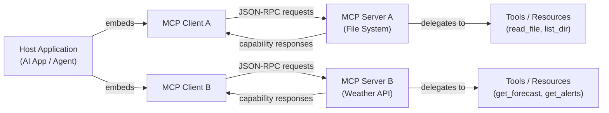

# Model Context Protocol (MCP)

## Definition

Das **Model Context Protocol (MCP)** ist ein offener Standard, der eine einheitliche Methode für KI-Anwendungen definiert, sich mit externen Tools, Datenquellen und Diensten zu verbinden. Anstatt für jede Kombination aus KI-Modell und externem System individuelle Integrationen zu erstellen, bietet MCP eine gemeinsame Sprache: Eine Host-Anwendung kommuniziert mit einem MCP-Server über ein klar definiertes Protokoll, und der Server stellt Fähigkeiten (Tools, Ressourcen, Prompts) bereit, die jeder konforme KI-Client entdecken und nutzen kann. MCP wurde von Anthropic Ende 2024 eingeführt und sofort als offener Standard veröffentlicht, um das breitere Ökosystem zur Übernahme und Erweiterung einzuladen.

Vor MCP war die Tool-Integration für KI-Anwendungen fragmentiert. Jeder Anbieter hatte sein eigenes Funktionsaufruf-Format; jede Integration musste für jeden neuen KI-Backend neu implementiert werden. Ein Code-Ausführungstool, das für ein Modell geschrieben wurde, musste beim Wechsel des Anbieters umgeschrieben werden, und eine neue Datenquelle erforderte benutzerdefinierte Verbindungen für jede KI-Anwendung, die darauf zugreifen wollte. MCP löst dies, indem es die Frage "Wie spricht eine KI mit einem Tool" (das Protokoll) von "welche KI" und "welches Tool" trennt, sodass jeder MCP-konforme Client jeden MCP-konformen Server ohne zusätzlichen Klebe-Code verwenden kann.

Die praktische Auswirkung ist erheblich: Entwickler können einmal einen MCP-Server erstellen – für eine Datenbank, ein Dateisystem, eine REST-API, einen Code-Runner – und jede MCP-fähige KI-Anwendung erhält Zugang dazu. Das Protokoll ist transport-agnostisch (läuft über stdio für lokale Prozesse oder HTTP/SSE für Remote-Dienste), unterstützt bidirektionale Kommunikation und enthält einen Capability-Negotiation-Handshake, sodass Clients und Server genau ankündigen können, was sie unterstützen.

## Funktionsweise

### Client-Server-Architektur

MCP folgt einem strikten Client-Server-Modell mit drei verschiedenen Rollen. Die **Host-Anwendung** ist die KI-seitige Anwendung (eine Chat-UI, ein Coding-Assistent, ein autonomer Agent), die einen oder mehrere MCP-Clients einbettet. Jeder **MCP-Client** unterhält eine 1:1-Verbindung zu einem einzelnen **MCP-Server** und fungiert als Vermittler zwischen dem Host und den Fähigkeiten dieses Servers. Der **MCP-Server** ist der Prozess, der die tatsächlichen Fähigkeiten besitzt und bereitstellt – er weiß, wie man eine Wetter-API aufruft, eine Datei liest oder eine Datenbank abfragt. Diese Trennung bedeutet, dass eine einzelne Host-Anwendung gleichzeitig mit vielen Servern verbunden sein kann, von denen jeder einen anderen Satz von Tools bereitstellt.



### Transport-Schicht

MCP ist transport-agnostisch: Dasselbe JSON-RPC-2.0-Nachrichtenformat läuft über zwei eingebaute Transporte. Der **stdio-Transport** wird für lokale Server verwendet – der Host erzeugt den Server als Child-Prozess und kommuniziert über seine Standard-Eingabe- und Standard-Ausgabeströme. Dies ist die einfachste Bereitstellung: kein Netzwerk, keine Ports, kein Authentifizierungsaufwand. Der **HTTP-mit-SSE-(Server-Sent-Events-)Transport** wird für Remote- oder gemeinsame Server verwendet: Der Client sendet Anfragen als HTTP-POST-Aufrufe und empfängt Streaming-Antworten über einen SSE-Endpunkt. Dies ermöglicht zentral gehostete Server, die mehrere Clients teilen können, und unterstützt die Bereitstellung in Cloud- oder Container-Umgebungen. Ein dritter Transport-Typ, **Streamable HTTP**, wurde in der Protokollspezifikation als leistungsfähigerer Nachfolger von HTTP/SSE für bidirektionales Streaming eingeführt.

### Fähigkeiten: Tools, Ressourcen und Prompts

Ein MCP-Server stellt bis zu drei Arten von Fähigkeiten bereit. **Tools** sind aufrufbare Funktionen – analog zum Funktionsaufruf in LLM-APIs – die die KI aufrufen kann, um Aktionen auszuführen oder Informationen abzurufen. Jedes Tool hat einen Namen, eine Beschreibung und ein JSON-Schema, das seine Eingabeparameter definiert. **Ressourcen** sind schreibgeschützte, dateiähnliche Datenquellen, auf die die KI zugreifen kann – eine lokale Datei, ein Datenbankdatensatz, ein Live-API-Snapshot – identifiziert durch einen URI. Ressourcen sind das MCP-Äquivalent zur Kontexteinspeisung: Sie ermöglichen es dem Server, der KI strukturierte Daten bereitzustellen, ohne einen Tool-Aufruf zu erfordern. **Prompts** sind wiederverwendbare Prompt-Vorlagen, die auf dem Server gespeichert sind; sie ermöglichen es Server-Autoren, gängige Interaktionsmuster zu definieren (z. B. "Diese Datei zusammenfassen"), die Clients direkt an Benutzer weitergeben können.

### Capability-Negotiation und der Sitzungslebenszyklus

Wenn sich ein Client mit einem Server verbindet, beginnt das Protokoll mit einem `initialize`-Handshake. Der Client sendet seine Protokollversion und die Fähigkeiten, die er unterstützt; der Server antwortet mit seiner eigenen Protokollversion und den Fähigkeiten, die er anbietet. Diese Verhandlung stellt sicher, dass Clients und Server mit unterschiedlichen Funktionssätzen problemlos interoperieren können – ein Client, der keine Prompts unterstützt, verwendet sie einfach nicht, auch wenn der Server sie anbietet. Nach der Initialisierung ruft der Client `tools/list`, `resources/list` und `prompts/list` auf, um zu entdecken, was der Server bereitstellt. Entdeckungsantworten enthalten vollständige Schemas, Beschreibungen und Metadaten. Von diesem Punkt an kann der Client Fähigkeiten im Namen des KI-Modells bei Bedarf während der gesamten Sitzung aufrufen.

## Wann verwenden / Wann NICHT verwenden

| Szenario | MCP | Benutzerdefinierte REST/API-Integration | Natives Funktionsaufruf |
|---|---|---|---|
| Aufbau von Tools, die über mehrere KI-Anbieter hinweg funktionieren sollen | Beste Wahl — einmal schreiben, mit jedem MCP-Client verwenden | Jeder Anbieter benötigt seine eigene Integration | An ein einzelnes Anbieter-API-Format gebunden |
| Teilen von Tools über mehrere KI-Anwendungen in Ihrer Organisation | Beste Wahl — ein Server, viele Clients | Erfordert Duplizierung des Integrationscodes in jeder App | Nicht für applikationsübergreifendes Teilen konzipiert |
| Einfaches einmaliges Tool in einer Einzelanbieter-Anwendung | Überdimensioniert — fügt Protokollaufwand hinzu | Gut für einfache Fälle | Einfachste Option |
| Bereitstellen vorhandener Datenquellen (Dateien, DBs) als KI-Kontext | Ressourcen-Fähigkeit ist dafür speziell konzipiert | Erfordert benutzerdefinierte Abruflogik | Kein äquivalentes Konzept |
| Echtzeit-Streaming-Ergebnisse aus langlebigen Operationen | Unterstützt über SSE-Transport | Erfordert benutzerdefinierte Streaming-Logik | Begrenzte Unterstützung |
| Air-Gap- oder stark eingeschränkte Umgebungen | stdio-Transport funktioniert ohne Netzwerk | Volle Kontrolle | Volle Kontrolle |

## Vergleiche

### MCP vs. OpenAI-Funktionsaufruf

OpenAIs Funktionsaufruf und MCP erlauben KI-Modellen beide, strukturierte Tools aufzurufen, aber sie funktionieren auf verschiedenen Ebenen. Funktionsaufruf ist eine **API-level-Funktion**: Die Tool-Schemas werden in der Anfrage-Nutzlast übergeben, Tool-Implementierungen liegen in Ihrem Anwendungscode, und das Muster ist spezifisch für OpenAIs API-Format. MCP ist ein **Protokollebenen-Standard**: Tools befinden sich in separaten Serverprozessen, das Protokoll übernimmt Entdeckung und Aufruf, und jeder konforme Client kann jeden konformen Server verwenden, unabhängig davon, welcher KI-Anbieter den Client antreibt. Funktionsaufruf ist die richtige Wahl für einfache, in-Prozess-Tools in einer Einzelanbieter-Anwendung; MCP ist die richtige Wahl, wenn Sie portable, wiederverwendbare Tool-Server wollen, die über Anbieter und Anwendungen hinweg funktionieren.

### MCP vs. LangChain-Tools

LangChain-Tools sind eine **Framework-Abstraktion**: Sie umhüllen Python-Callables in einer standardisierten Schnittstelle, die die LangChain-Agent-Runtime versteht. Sie sind innerhalb des LangChain-Ökosystems leistungsstark, definieren aber kein Interprozesskommunikationsprotokoll – ein LangChain-Tool kann ohne zusätzliche Verbindungen nicht von einer Nicht-LangChain-Anwendung aufgerufen werden. MCP ist ein **Wire-Protokoll**: Es definiert genau, wie Nachrichten zwischen Prozessen serialisiert und transportiert werden. Ein in TypeScript geschriebener MCP-Server kann von einem Python-MCP-Client ohne gemeinsame Framework-Abhängigkeit aufgerufen werden. Die beiden schließen sich nicht gegenseitig aus – LangChain und andere Frameworks können MCP-Clients implementieren, um MCP-Server zu nutzen.

### MCP vs. direkte REST-API-Aufrufe

Direkte REST-API-Aufrufe bieten maximale Flexibilität und keinen Protokollaufwand, aber jede neue KI-Anwendung muss dieselbe Authentifizierung, Fehlerbehandlung und Ergebnisformatierung für jede API, die sie aufruft, neu implementieren. MCP bietet einen einheitlichen Umschlag, der über diese Unterschiede abstrahiert: Die KI-Anwendung macht immer dieselbe `tools/call`-Anfrage, unabhängig davon, ob der Server eine Wetter-API, eine SQL-Datenbank oder ein GitHub-Repository anspricht. Der Kompromiss ist, dass MCP Server-Infrastruktur erfordert (ein laufender Serverprozess), während ein direkter REST-Aufruf nur eine HTTP-Anfrage ist.

## Codebeispiele

### Minimaler MCP-Server

```typescript
import { McpServer } from "@modelcontextprotocol/sdk/server/mcp.js";
import { StdioServerTransport } from "@modelcontextprotocol/sdk/server/stdio.js";
import { z } from "zod";

// Create the server instance with a name and version
const server = new McpServer({
  name: "demo-server",
  version: "1.0.0",
});

// Register a tool — the AI can call this to get the current time
server.tool(
  "get_current_time",
  "Returns the current UTC time in ISO 8601 format.",
  {}, // No input parameters required
  async () => ({
    content: [
      {
        type: "text",
        text: new Date().toISOString(),
      },
    ],
  })
);

// Register a tool with input parameters
server.tool(
  "add_numbers",
  "Adds two numbers together and returns the result.",
  {
    a: z.number().describe("The first number"),
    b: z.number().describe("The second number"),
  },
  async ({ a, b }) => ({
    content: [
      {
        type: "text",
        text: String(a + b),
      },
    ],
  })
);

// Start the server using stdio transport (runs as a child process)
const transport = new StdioServerTransport();
await server.connect(transport);
console.error("Demo MCP server running on stdio");
```

### Minimaler MCP-Client

```typescript
import { Client } from "@modelcontextprotocol/sdk/client/index.js";
import { StdioClientTransport } from "@modelcontextprotocol/sdk/client/stdio.js";

// Create a transport that spawns the server as a child process
const transport = new StdioClientTransport({
  command: "node",
  args: ["./demo-server.js"],
});

// Create and connect the client
const client = new Client(
  { name: "demo-client", version: "1.0.0" },
  { capabilities: {} }
);

await client.connect(transport);

// Discover available tools
const { tools } = await client.listTools();
console.log("Available tools:", tools.map((t) => t.name));

// Call a tool
const result = await client.callTool({
  name: "add_numbers",
  arguments: { a: 21, b: 21 },
});

console.log("Result:", result.content);
// Output: [{ type: 'text', text: '42' }]

await client.close();
```

## Praktische Ressourcen

- [Model-Context-Protocol-Spezifikation](https://spec.modelcontextprotocol.io) — Die maßgebliche Protokollspezifikation, die alle Nachrichtentypen, Transporte und Fähigkeitsdefinitionen abdeckt.
- [MCP TypeScript SDK](https://github.com/modelcontextprotocol/typescript-sdk) — Das offizielle TypeScript/JavaScript-SDK zum Erstellen von MCP-Servern und -Clients, gepflegt von Anthropic.
- [modelcontextprotocol.io](https://modelcontextprotocol.io) — Die offizielle MCP-Website mit Schnellstart-Leitfäden, konzeptioneller Dokumentation und einem Register von Community-erstellten Servern.
- [MCP-Server-Beispiel-Repository](https://github.com/modelcontextprotocol/servers) — Eine kuratierte Sammlung von Referenz-MCP-Server-Implementierungen zu Datenbanken, Dateisystemen, Websuche und mehr.

## Siehe auch

- [MCP-Server erstellen](/docs/mcp/building-servers)
- [MCP-Clients erstellen](/docs/mcp/building-clients)
- [KI-Agenten](/docs/agents)
- [Strukturierte Ausgaben](/docs/prompt-engineering/structured-outputs)
