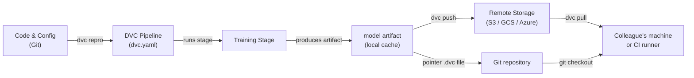

# Data Version Control (DVC)

## Definition

Data Version Control (DVC) ist ein Open-Source-Tool, das Git erweitert, um große Dateien, Datensätze und Modellartefakte zu verfolgen, die nicht effizient in einem Git-Repository gespeichert werden können. Während Git jede Änderung am Quellcode aufzeichnet, speichert DVC eine kleine Zeigerdatei (`.dvc`) im Repository und überträgt die eigentlichen Datenbytes an ein konfigurierbares Remote-Speicher-Backend — S3, GCS, Azure Blob, SSH oder sogar ein lokales Verzeichnis. Dadurch bleibt das Repository schlank und die vollständige Reproduzierbarkeit bleibt erhalten.

DVC geht über einfaches Datei-Versionierung hinaus. Es führt das Konzept von **Pipelines** ein — ein DAG (Directed Acyclic Graph) von Stufen, die in einer `dvc.yaml`-Datei definiert sind. Jede Stufe gibt ihren Befehl, ihre Eingaben (Abhängigkeiten) und ihre Ausgaben an, sodass DVC bestimmen kann, welche Stufen neu ausgeführt werden müssen, wenn sich Eingaben ändern. Das Ergebnis ist ein Build-System für ML: reproduzierbar, inkrementell und versionskontrolliert neben dem Code, der es produziert hat.

DVC ist eng mit Git-Workflows integriert. Eine `dvc.lock`-Datei, die in Git eingecheckt ist, erfasst den genauen Inhalts-Hash jeder Eingabe und Ausgabe zum Zeitpunkt der Ausführung einer Pipeline, sodass das Auschecken eines historischen Git-Commits und das Ausführen von `dvc pull` den genauen Datensatz und die Modellartefakte wiederherstellt, die zu diesem Zeitpunkt in der Geschichte existierten.

## Funktionsweise



### Ein DVC-Repository initialisieren

Das Ausführen von `dvc init` innerhalb eines Git-Repositories erstellt ein `.dvc/`-Verzeichnis, das DVCs Konfiguration und lokalen Cache enthält. DVC registriert einen `.gitignore`-Eintrag für den Cache-Ordner und fügt einige kleine Tracking-Dateien hinzu, die in Git committed werden müssen. Ab diesem Punkt erstellt `dvc add <file>` eine `.dvc`-Zeigerdatei für jede große Datei — die eigentlichen Bytes gehen in den lokalen Cache und werden nie in Git committed. Dieser zweischichtige Ansatz bedeutet, dass das Repository schnell zu klonen bleibt, während DVC die schweren Assets separat verwaltet.

### Pipelines definieren und ausführen

Eine `dvc.yaml`-Datei deklariert jede Pipeline-Stufe mit ihrem Befehl, Eingabe-Abhängigkeiten und Ausgabe-Artefakten. Wenn Sie `dvc repro` ausführen, untersucht DVC den Abhängigkeitsgraphen, vergleicht Inhalts-Hashes aller Eingaben mit dem `dvc.lock`-Snapshot und führt nur die Stufen erneut aus, deren Eingaben sich geändert haben. Dies ist analog zu `make`, aber inhaltsbasiert statt zeitstempelbasiert, sodass es deterministisch ist, selbst über Maschinen und CI-Runner hinweg. Pipelines können über eine `params.yaml`-Datei parametrisiert werden, und DVC zeichnet auf, welche Parameterwerte in jedem Lauf verwendet wurden.

### Remote-Speicher und Zusammenarbeit

Ein DVC-Remote ist ein mit `dvc remote add` konfigurierter Speicherort. Teams konfigurieren typischerweise einen gemeinsamen Cloud-Bucket, damit alle Mitglieder dieselben Daten abrufen. `dvc push` lädt neue oder geänderte Artefakte in das Remote hoch, und `dvc pull` lädt genau die Versionen herunter, auf die das `dvc.lock` des aktuellen Git-Commits verweist. Dieser Workflow bedeutet, dass das Einrichten eines neuen Teammitglieds `git clone` gefolgt von `dvc pull` ist — ein einziger Befehl, der den richtigen Datensatz und die Modellartefakte für diesen Branch materialisiert.

### Experimente

`dvc exp run` und `dvc exp show` bieten eine leichtgewichtige Experiment-Tracking-Schicht auf Pipelines. Jedes Experiment ist ein temporäres Git-Stash von Parameteränderungen und Ergebnismetriken, die in einer Tabelle verglichen und zu einem vollständigen Branch befördert werden können, wenn sie vielversprechend sind. Dies ist weniger funktionsreich als dedizierte Tools wie MLflow oder W&B, hat aber den Vorteil, dass keine zusätzliche Infrastruktur erforderlich ist — alles lebt im Git-Repository.

## Wann verwenden / Wann NICHT verwenden

| Verwenden wenn | Vermeiden wenn |
|---|---|
| Ihre Datensätze oder Modelldateien zu groß für Git sind (>100 MB) | Alle Daten passen komfortabel in Git LFS und es werden keine Pipelines benötigt |
| Sie reproduzierbare ML-Pipelines benötigen, die an Code-Versionen gebunden sind | Ihre Anforderungen an das Experiment-Tracking den leichtgewichtigen Ansatz von DVC übersteigen |
| Ihr Team Git verwendet und einen einheitlichen Versionskontroll-Workflow möchte | Sie eine vollständige Benutzeroberfläche für das Experiment-Management benötigen (bevorzugen Sie MLflow oder W&B) |
| CI/CD-Pipelines genaue Datenartefakte pro Branch abrufen müssen | Daten extrem sensibel sind und das On-Premises-Storage nicht verlassen können |
| Sie Experimentergebnisse ohne einen separaten Server vergleichen möchten | Das Projekt hat kein gemeinsames Remote und Zusammenarbeit ist kein Thema |

## Vergleiche

| Kriterium | DVC | Git LFS | MLflow Tracking |
|---|---|---|---|
| Hauptzweck | Daten + Pipeline-Versionierung | Versionierung großer Dateien | Experiment-Tracking + Modellregistrierung |
| Pipeline-Unterstützung | Ja (dvc.yaml DAG) | Nein | Nein (zeichnet nur Läufe auf) |
| Experimentvergleich | Einfach (dvc exp show) | Nein | Reich (UI + API) |
| Remote-Backends | S3, GCS, Azure, SSH, lokal | GitHub, GitLab LFS-Server | Lokal, S3, Azure, SFTP |
| Server erforderlich | Nein | Nein | Optional (MLflow-Server) |
| Git-Integration | Kerndesignprinzip | Kerndesignprinzip | Optional (via mlflow.log_param) |

## Vor- und Nachteile

| Vorteile | Nachteile |
|---|---|
| Kein zusätzlicher Server erforderlich — alles in Git + Objektspeicher | Lernkurve für Teams, die mit DAG-basierten Pipelines nicht vertraut sind |
| Reproduzierbare Pipelines mit inhaltsbasiertem Caching | Große dvc.lock-Konflikte können in sehr aktiven Monorepos schwierig sein |
| Funktioniert mit jedem Cloud-Speicher oder sogar lokalen Verzeichnissen | Experiment-UI ist minimal im Vergleich zu MLflow / W&B |
| Leichtgewichtig — DVC ist nur ein CLI-Tool | Übernimmt keine verteilte Trainingsorchestrierung |
| Erstklassige CI/CD-Integration über CML | Kosten für Remote-Speicher liegen in der Verantwortung des Teams |

## Codebeispiele

```bash
# --- DVC setup and basic data tracking ---

# 1. Initialize DVC inside an existing Git repository
git init my-ml-project && cd my-ml-project
dvc init
git add .dvc .dvcignore
git commit -m "Initialize DVC"

# 2. Configure a remote storage backend (AWS S3 example)
dvc remote add -d myremote s3://my-bucket/dvc-store
git add .dvc/config
git commit -m "Add DVC remote"

# 3. Track a large dataset — DVC creates data/train.csv.dvc
dvc add data/train.csv
git add data/train.csv.dvc data/.gitignore
git commit -m "Track training dataset with DVC"

# 4. Push data to the remote
dvc push

# --- Collaborator workflow ---

# 5. Clone the repo and pull the data artifacts
git clone https://github.com/org/my-ml-project
cd my-ml-project
dvc pull   # downloads data/train.csv from the configured remote
```

```yaml
# dvc.yaml — Define a two-stage pipeline: featurize -> train

stages:
  featurize:
    cmd: python src/featurize.py --input data/train.csv --output data/features.parquet
    deps:
      - src/featurize.py
      - data/train.csv
    outs:
      - data/features.parquet

  train:
    cmd: python src/train.py --features data/features.parquet --output models/
    deps:
      - src/train.py
      - data/features.parquet
      - params.yaml        # parameter file changes trigger re-run
    outs:
      - models/
    metrics:
      - reports/metrics.json:
          cache: false     # small metrics file — commit it to Git
```

```python
# src/train.py — DVC-compatible training script using joblib for model serialization

import json
import argparse
from pathlib import Path

import yaml
import joblib
import numpy as np
import pandas as pd
from sklearn.ensemble import GradientBoostingClassifier
from sklearn.model_selection import train_test_split
from sklearn.metrics import accuracy_score


def main(features_path: str, output_dir: str) -> None:
    # Load parameters tracked by DVC from params.yaml
    params = yaml.safe_load(Path("params.yaml").read_text())["train"]

    df = pd.read_parquet(features_path)
    X = df.drop(columns=["label"])
    y = df["label"]

    X_train, X_test, y_train, y_test = train_test_split(
        X, y, test_size=0.2, random_state=42
    )

    model = GradientBoostingClassifier(
        n_estimators=params["n_estimators"],
        max_depth=params["max_depth"],
        random_state=42,
    )
    model.fit(X_train, y_train)

    out = Path(output_dir)
    out.mkdir(parents=True, exist_ok=True)
    joblib.dump(model, out / "model.joblib")

    accuracy = float(accuracy_score(y_test, model.predict(X_test)))
    Path("reports").mkdir(exist_ok=True)
    Path("reports/metrics.json").write_text(
        json.dumps({"accuracy": accuracy}, indent=2)
    )
    print(f"Accuracy: {accuracy:.4f}")


if __name__ == "__main__":
    parser = argparse.ArgumentParser()
    parser.add_argument("--features", required=True)
    parser.add_argument("--output", required=True)
    args = parser.parse_args()
    main(args.features, args.output)
```

## Praktische Ressourcen

- [DVC offizielle Dokumentation](https://dvc.org/doc) — Umfassender Leitfaden zu Installation, Pipelines, Remotes und Experimenten.
- [DVC Get Started-Tutorial](https://dvc.org/doc/start) — Praktische Anleitung zum Einrichten eines DVC-Projekts von Grund auf.
- [Iterative blog: Git-based MLOps](https://iterative.ai/blog) — Artikel zu MLOps-Workflows, die DVC, CML und MLEM kombinieren.
- [DVC GitHub-Repository](https://github.com/iterative/dvc) — Quellcode und Community-Issues.

## Siehe auch

- [CI/CD für ML](/docs/mlops/cicd)
- [Experiment-Tracking](/docs/mlops/experiment-tracking)
- [MLflow](/docs/mlops/mlflow)
