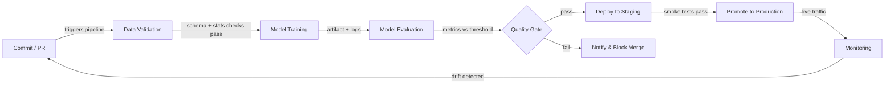

# CI/CD für ML

## Definition

Continuous Integration and Continuous Delivery (CI/CD) ist eine Softwareentwicklungspraxis, die das Erstellen, Testen und Bereitstellen von Code bei jeder Änderung automatisiert. Wenn sie auf maschinelles Lernen angewendet wird, erweitert sich der Umfang über Code hinaus: Datenqualität, Modellleistung und Artefakt-Versionierung werden alle zu erstklassigen Bestandteilen der Pipeline. Eine fehlerhafte ML-CI/CD-Pipeline kann ein Modell ausliefern, das in der Produktion stillschweigend degradiert, ohne dass eine einzige Zeile Anwendungscode geändert wird.

Traditionelles CI/CD validiert Logik und API-Verträge. ML-CI/CD muss zusätzlich statistische Eigenschaften der Daten validieren (Schema, Verteilungen, fehlende Werte), Modellqualitätsschwellenwerte (Genauigkeit, Latenz, Fairness) und Reproduzierbarkeit — die Fähigkeit, dasselbe Modell aus denselben Eingaben erneut zu trainieren. Tools wie [DVC](/docs/mlops/cicd/dvc) für die Datenversionierung und CML (Continuous Machine Learning) für die Berichtsmetriken in Pull Requests machen dies praktisch.

Das Endziel ist ein vollständig automatisierter Weg von einer Code- oder Datenänderung zu einem sicher bereitgestellten Modell, mit menschlichen Kontrollen nur dort, wo sie echten Mehrwert bieten — z. B. bei der Überprüfung einer Modellkarte vor einer Produktionsförderung.

## Funktionsweise



### Datenvalidierung

Bevor das Training beginnt, prüft die Pipeline, ob die eingehenden Daten dem erwarteten Schema und statistischen Profil entsprechen. Great Expectations oder TensorFlow Data Validation (TFDV) können bestätigen, dass Spaltentypen korrekt sind, Wertebereiche sinnvoll sind und keine unerwarteten Spitzen bei fehlenden Werten vorhanden sind. Ein frühzeitiges Scheitern an dieser Schranke verhindert verschwendete Rechenleistung bei korrumpierten Batches. Jede Schemadrift wird als fehlgeschlagene Prüfung im Pull Request sichtbar, was den Merge blockiert, bis das Problem verstanden und entweder behoben oder explizit akzeptiert wurde. Dieser Schritt ist das ML-Äquivalent zur Typprüfung von Code vor dem Ausführen von Tests.

### Modelltraining

Das Training wird als reproduzierbarer, parametrisierter Job ausgeführt — idealerweise containerisiert, sodass die genaue Umgebung (CUDA-Version, Bibliotheks-Pinning) erfasst wird. Ein gutes CI/CD-System übergibt Hyperparameter über Konfigurationsdateien, die in der Versionskontrolle verfolgt werden, nicht fest in Skripte kodiert. Tools wie [DVC](/docs/mlops/cicd/dvc) verfolgen, welche Datensatzversion und welche Konfiguration welches Modellartefakt erzeugt hat, sodass jedes trainierte Modell auf seine Eingaben zurückverfolgt werden kann. Trainingsläufe werden in einem Experiment-Tracker (MLflow, W&B) aufgezeichnet, sodass der Vergleich mit dem vorherigen Champion-Modell automatisch erfolgt.

### Modellbewertung

Nach dem Training berechnen automatisierte Bewertungsskripte die Zielmetriken auf einem zurückgehaltenen Testdatensatz und vergleichen sie mit einem definierten Schwellenwert oder dem aktuellen Produktionsmodell. CML (von Iterative.ai) kann einen Markdown-Bericht mit Metriktabellen und Diagrammen direkt im GitHub- oder GitLab-Pull Request posten, sodass Prüfer Leistungsregressionen sehen können, ohne ihren Code-Review-Workflow zu verlassen. Die Bewertung sollte auch slice-basierte Fairness-Metriken für regulierte Bereiche abdecken. Das Qualitäts-Gate passiert nur, wenn das neue Modell die Schwellenwerte erreicht oder übertrifft.

### Bereitstellung und Überwachung

Nach Bestehen des Qualitäts-Gates wird das Modellartefakt in einer [Modellregistrierung](/docs/mlops/cicd/model-registry) registriert und in einer Staging-Umgebung bereitgestellt, wo Smoke-Tests gegen Live- (oder repräsentativen) Datenverkehr ausgeführt werden. Die Förderung zur Produktion kann manuell (ein Klick in der Registry-UI) oder vollständig automatisiert sein. Einmal in der Produktion überwacht eine [Überwachungsebene](/docs/mlops/monitoring) Datendrift, Vorhersagedrift und Geschäfts-KPIs und kann einen Nachtrainings-Lauf auslösen — was die Rückkopplungsschleife zum Commit-Schritt schließt.

## Wann verwenden / Wann NICHT verwenden

| Verwenden wenn | Vermeiden wenn |
|---|---|
| Mehrere Datenwissenschaftler an gemeinsamem Modellcode committen | Einzeln an einem einmaligen Notebook-Experiment arbeiten |
| Modelle regelmäßig auf frischen Daten nachtrainiert werden | Das Modell statisch ist und einmalig trainiert wurde, nie aktualisiert |
| Produktionsfehler kostspielig sind (Betrug, Gesundheit, Sicherheit) | Prototyp-Phase, wo Iterationsgeschwindigkeit wichtiger ist als Korrektheit |
| Das Team Reproduzierbarkeit und Audit-Trails benötigt | Infrastruktur-/DevOps-Reife sehr gering ist |
| Regulatorische Compliance dokumentierte Modellversionierung erfordert | Datensatz klein ist und in einem einzelnen Notebook passt |

## Vergleiche

| Kriterium | Traditionelles CI/CD | ML CI/CD |
|---|---|---|
| Primäres Artefakt | Binär / Docker-Image | Modellartefakt + Datenversion |
| Testtypen | Unit, Integration, E2E | Unit + Datenqualität + Modellqualität + Fairness |
| Auslöser | Code-Push | Code-Push ODER neue Daten ODER geplantes Nachtraining |
| Rollback | Vorheriges Image erneut bereitstellen | Vorherige Modellversion aus Registry erneut bereitstellen |
| Beobachtbarkeit | Anwendungslogs, Traces | Datendrift, Vorhersagedrift, Geschäftsmetriken |

## Vor- und Nachteile

| Vorteile | Nachteile |
|---|---|
| Erkennt Regressionen bevor sie die Produktion erreichen | Höhere Einrichtungskosten als traditionelles CI/CD |
| Vollständiger Audit-Trail von Daten + Code + Modellversionen | Datenvalidierung erfordert Domänenexpertise zur korrekten Definition |
| Ermöglicht sichere, häufige Modellaktualisierungen | Trainings-Jobs können langsam sein, was CI-Rückkopplungsschleifen verlängert |
| Reduziert manuelle Übergaben zwischen Data Science und Ops | Erfordert Abstimmung zwischen Daten-, ML- und Plattformteams |
| Metriken in PRs verbessern die Code-Review-Qualität | Falsch konfigurierte Schwellenwerte können gültige Verbesserungen blockieren |

## Codebeispiele

```yaml
# .github/workflows/ml-pipeline.yml
# GitHub Actions workflow for a full ML CI/CD pipeline with CML reporting

name: ML Pipeline

on:
  push:
    branches: [main, "feat/**"]
  pull_request:
    branches: [main]

jobs:
  ml-pipeline:
    runs-on: ubuntu-latest

    steps:
      - name: Checkout code
        uses: actions/checkout@v4
        with:
          fetch-depth: 0

      - name: Set up Python 3.11
        uses: actions/setup-python@v5
        with:
          python-version: "3.11"

      - name: Install dependencies
        run: pip install -r requirements.txt

      - name: Pull DVC artifacts
        env:
          AWS_ACCESS_KEY_ID: ${{ secrets.AWS_ACCESS_KEY_ID }}
          AWS_SECRET_ACCESS_KEY: ${{ secrets.AWS_SECRET_ACCESS_KEY }}
        run: dvc pull

      - name: Validate data
        run: python src/validate_data.py --data data/train.csv

      - name: Train model
        run: python src/train.py --config configs/train.yaml

      - name: Evaluate model
        run: python src/evaluate.py --output reports/metrics.md

      - name: Post CML report
        uses: iterative/setup-cml@v2
        with:
          version: latest

      - name: Publish CML report
        env:
          REPO_TOKEN: ${{ secrets.GITHUB_TOKEN }}
        run: |
          echo "## Model evaluation report" >> reports/metrics.md
          cml comment create reports/metrics.md

      - name: Push DVC artifacts
        if: github.ref == 'refs/heads/main'
        env:
          AWS_ACCESS_KEY_ID: ${{ secrets.AWS_ACCESS_KEY_ID }}
          AWS_SECRET_ACCESS_KEY: ${{ secrets.AWS_SECRET_ACCESS_KEY }}
        run: dvc push
```

```python
# src/validate_data.py
# Simple data validation gate using pandas — replace with Great Expectations for production

import argparse
import sys
import pandas as pd

EXPECTED_COLUMNS = {"feature_a", "feature_b", "label"}
MAX_MISSING_RATE = 0.05  # 5% threshold


def validate(path: str) -> None:
    df = pd.read_csv(path)

    missing_cols = EXPECTED_COLUMNS - set(df.columns)
    if missing_cols:
        print(f"FAIL: Missing columns: {missing_cols}")
        sys.exit(1)

    for col in EXPECTED_COLUMNS:
        rate = df[col].isna().mean()
        if rate > MAX_MISSING_RATE:
            print(f"FAIL: Column '{col}' has {rate:.1%} missing values (threshold: {MAX_MISSING_RATE:.0%})")
            sys.exit(1)

    print("Data validation passed.")


if __name__ == "__main__":
    parser = argparse.ArgumentParser()
    parser.add_argument("--data", required=True)
    args = parser.parse_args()
    validate(args.data)
```

## Praktische Ressourcen

- [CML (Continuous Machine Learning) by Iterative](https://cml.dev/) — Offizielle Dokumentation zum Posten von ML-Metriken und Diagrammen direkt in GitHub/GitLab PRs.
- [GitHub Actions for ML — Iterative guide](https://iterative.ai/blog/github-actions-ml) — Anleitung zum Einrichten einer End-to-End-ML-Pipeline mit GitHub Actions und DVC.
- [Google MLOps: Continuous delivery and automation pipelines in ML](https://cloud.google.com/architecture/mlops-continuous-delivery-and-automation-pipelines-in-machine-learning) — Googles Referenzarchitektur, die drei Stufen der ML-Automatisierungsreife beschreibt.
- [Great Expectations documentation](https://docs.greatexpectations.io/) — Framework für Datenvalidierung und -dokumentation in ML-Pipelines.

## Siehe auch

- [Data Version Control (DVC)](/docs/mlops/cicd/dvc)
- [Modellregistrierung](/docs/mlops/cicd/model-registry)
- [MLOps-Übersicht](/docs/mlops)
