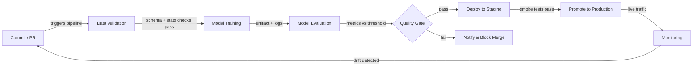

# CI/CD für ML

## Definition

Continuous Integration und Continuous Delivery (CI/CD) ist eine Software-Engineering-Praxis, die das Erstellen, Testen und Bereitstellen von Code bei jeder Änderung automatisiert. Bei Anwendung auf maschinelles Lernen erweitert sich der Geltungsbereich über Code hinaus: Datenqualität, Modellleistung und Artefakt-Versionierung werden allesamt zu erstklassigen Bürgern der Pipeline. Eine kaputte ML-CI/CD-Pipeline kann ein Modell ausliefern, das in der Produktion still abbaut, ohne dass eine einzige Zeile Anwendungscode geändert wird.

Traditionelles CI/CD validiert Logik und API-Verträge. ML-CI/CD muss zusätzlich statistische Eigenschaften von Daten (Schema, Verteilungen, fehlende Werte), Modellqualitätsschwellenwerte (Genauigkeit, Latenz, Fairness) und Reproduzierbarkeit validieren — die Fähigkeit, genau dasselbe Modell aus genau denselben Eingaben neu zu trainieren. Werkzeuge wie [DVC](/docs/mlops/cicd/dvc) für Datenversionierung und CML (Continuous Machine Learning) für die Berichterstattung von Metriken in Pull Requests machen dies praktikabel.

Das Endziel ist ein vollständig automatisierter Pfad von einer Code- oder Datenänderung zu einem sicher bereitgestellten Modell, mit menschlichen Gates nur dort, wo sie wirklich Mehrwert bieten — etwa beim Überprüfen einer Modellkarte vor einer Produktionspromotion.

## Funktionsweise



### Datenvalidierung

Bevor das Training beginnt, prüft die Pipeline, ob eingehende Daten dem erwarteten Schema und statistischen Profil entsprechen. Great Expectations oder TensorFlow Data Validation (TFDV) können sicherstellen, dass Spaltentypen korrekt, Wertebereiche sinnvoll sind und keine unerwarteten Anstiege bei fehlenden Werten vorliegen. Das frühe Scheitern dieses Gates verhindert verschwendete Rechenkapazität bei korrupten Batches. Jedes Schema-Drift wird als fehlgeschlagene Prüfung im Pull Request angezeigt, was den Merge blockiert, bis das Problem verstanden und entweder behoben oder explizit akzeptiert wird. Dieser Schritt ist das ML-Äquivalent der Typenprüfung von Code vor dem Ausführen von Tests.

### Modelltraining

Das Training wird als reproduzierbarer, parametrisierter Job ausgeführt — idealerweise containerisiert, sodass die genaue Umgebung (CUDA-Version, Bibliotheks-Pinning) erfasst wird. Ein gutes CI/CD-System übergibt Hyperparameter durch in der Versionskontrolle verfolgte Konfigurationsdateien, nicht fest codiert in Skripten. Werkzeuge wie [DVC](/docs/mlops/cicd/dvc) verfolgen, welche Datensatzversion und welche Konfiguration welches Modellartefakt erzeugt hat, sodass jedes trainierte Modell auf seine Eingaben zurückverfolgt werden kann. Trainingsläufe werden in einem Experiment-Tracker (MLflow, W&B) aufgezeichnet, sodass der Vergleich mit dem vorherigen Champion-Modell automatisch ist.

### Modellevaluierung

Nach dem Training berechnen automatisierte Evaluierungsskripte die Zielmetriken auf einem ausgelagerten Test-Set und vergleichen sie mit einem definierten Schwellenwert oder dem aktuellen Produktionsmodell. CML (von Iterative.ai) kann einen Markdown-Bericht mit Metrik-Tabellen und Plots direkt im GitHub- oder GitLab-Pull-Request posten, sodass Reviewer Leistungsrückschritte sehen, ohne den Code-Review-Workflow zu verlassen. Die Evaluierung sollte auch slice-basierte Fairness-Metriken für regulierte Bereiche abdecken. Das Qualitäts-Gate passiert nur, wenn das neue Modell die Schwellenwerte erfüllt oder übertrifft.

### Deployment und Monitoring

Nach dem Bestehen des Qualitäts-Gates wird das Modellartefakt in einer [Modell-Registry](/docs/mlops/cicd/model-registry) registriert und in einer Staging-Umgebung bereitgestellt, wo Smoke-Tests gegen echten (oder repräsentativen) Traffic laufen. Die Promotion zur Produktion kann manuell (ein Klick in der Registry-UI) oder vollständig automatisiert sein. Einmal in der Produktion verfolgt eine [Monitoring](/docs/mlops/monitoring)-Schicht Datendrift, Vorhersagedrift und Business-KPIs und kann einen Nachtraining-Lauf auslösen — wodurch die Feedback-Schleife zurück zum Commit-Schritt geschlossen wird.

## Wann verwenden / Wann NICHT verwenden

| Verwenden wenn | Vermeiden wenn |
|---|---|
| Mehrere Data Scientists gemeinsamen Modell-Code committen | Allein an einem einmaligen Notebook-Experiment gearbeitet wird |
| Modelle regelmäßig auf neuen Daten nachtrainiert werden | Das Modell statisch ist und einmalig trainiert wird, nie aktualisiert |
| Produktionsfehler kostspielig sind (Betrug, Gesundheit, Sicherheit) | Prototyp-Phase, wo Iterationsgeschwindigkeit wichtiger als Korrektheit ist |
| Das Team Reproduzierbarkeit und Audit-Trails benötigt | Infrastruktur/DevOps-Reife sehr niedrig ist |
| Regulatorische Compliance dokumentierte Modell-Versionierung erfordert | Datensatz klein ist und in ein einziges Notebook passt |

## Vergleiche

| Kriterium | Traditionelles CI/CD | ML-CI/CD |
|---|---|---|
| Primäres Artefakt | Binary / Docker-Image | Modellartefakt + Datenversion |
| Testtypen | Unit, Integration, E2E | Unit + Datenqualität + Modellqualität + Fairness |
| Auslöser | Code-Push | Code-Push ODER neue Daten ODER geplantes Nachtraining |
| Rollback | Vorheriges Image neu bereitstellen | Vorherige Modellversion aus der Registry neu bereitstellen |
| Beobachtbarkeit | Anwendungslogs, Traces | Datendrift, Vorhersagedrift, Business-Metriken |

## Vor- und Nachteile

| Vorteile | Nachteile |
|---|---|
| Fängt Regressionen ab, bevor sie die Produktion erreichen | Höhere Einrichtungskosten als traditionelles CI/CD |
| Vollständiger Audit-Trail von Daten + Code + Modellversionen | Datenvalidierung erfordert Domänenexpertise für korrekte Definition |
| Ermöglicht sichere, häufige Modellaktualisierungen | Trainingsjobs können langsam sein, was CI-Feedback-Schleifen verlängert |
| Reduziert manuelle Übergaben zwischen Data Science und Ops | Erfordert Abstimmung zwischen Daten-, ML- und Plattformteams |
| Metriken in PRs verbessern die Code-Review-Qualität | Falsch konfigurierte Schwellenwerte können gültige Verbesserungen blockieren |

## Code-Beispiele

```yaml
# .github/workflows/ml-pipeline.yml
# GitHub Actions workflow for a full ML CI/CD pipeline with CML reporting

name: ML Pipeline

on:
  push:
    branches: [main, "feat/**"]
  pull_request:
    branches: [main]

jobs:
  ml-pipeline:
    runs-on: ubuntu-latest

    steps:
      # 1. Check out the repository with full git history (needed for DVC)
      - name: Checkout code
        uses: actions/checkout@v4
        with:
          fetch-depth: 0

      # 2. Set up Python and install dependencies
      - name: Set up Python 3.11
        uses: actions/setup-python@v5
        with:
          python-version: "3.11"

      - name: Install dependencies
        run: pip install -r requirements.txt

      # 3. Pull data and model artifacts from DVC remote
      - name: Pull DVC artifacts
        env:
          AWS_ACCESS_KEY_ID: ${{ secrets.AWS_ACCESS_KEY_ID }}
          AWS_SECRET_ACCESS_KEY: ${{ secrets.AWS_SECRET_ACCESS_KEY }}
        run: dvc pull

      # 4. Validate data quality before training
      - name: Validate data
        run: python src/validate_data.py --data data/train.csv

      # 5. Train the model and save metrics to metrics.json
      - name: Train model
        run: python src/train.py --config configs/train.yaml

      # 6. Evaluate model and write report for CML
      - name: Evaluate model
        run: python src/evaluate.py --output reports/metrics.md

      # 7. Post CML report as a comment on the pull request
      - name: Post CML report
        uses: iterative/setup-cml@v2
        with:
          version: latest

      - name: Publish CML report
        env:
          REPO_TOKEN: ${{ secrets.GITHUB_TOKEN }}
        run: |
          # Append the confusion matrix image to the report
          echo "## Model evaluation report" >> reports/metrics.md
          cml comment create reports/metrics.md

      # 8. Push updated DVC artifacts (only on main)
      - name: Push DVC artifacts
        if: github.ref == 'refs/heads/main'
        env:
          AWS_ACCESS_KEY_ID: ${{ secrets.AWS_ACCESS_KEY_ID }}
          AWS_SECRET_ACCESS_KEY: ${{ secrets.AWS_SECRET_ACCESS_KEY }}
        run: dvc push
```

```python
# src/validate_data.py
# Simple data validation gate using pandas — replace with Great Expectations for production

import argparse
import sys
import pandas as pd

EXPECTED_COLUMNS = {"feature_a", "feature_b", "label"}
MAX_MISSING_RATE = 0.05  # 5% threshold


def validate(path: str) -> None:
    df = pd.read_csv(path)

    # Check that all required columns are present
    missing_cols = EXPECTED_COLUMNS - set(df.columns)
    if missing_cols:
        print(f"FAIL: Missing columns: {missing_cols}")
        sys.exit(1)

    # Check missing-value rates
    for col in EXPECTED_COLUMNS:
        rate = df[col].isna().mean()
        if rate > MAX_MISSING_RATE:
            print(f"FAIL: Column '{col}' has {rate:.1%} missing values (threshold: {MAX_MISSING_RATE:.0%})")
            sys.exit(1)

    print("Data validation passed.")


if __name__ == "__main__":
    parser = argparse.ArgumentParser()
    parser.add_argument("--data", required=True)
    args = parser.parse_args()
    validate(args.data)
```

## Praktische Ressourcen

- [CML (Continuous Machine Learning) von Iterative](https://cml.dev/) — Offizielle Dokumentation zum Posten von ML-Metriken und Plots direkt in GitHub/GitLab-PRs.
- [GitHub Actions für ML — Iterative-Leitfaden](https://iterative.ai/blog/github-actions-ml) — Anleitung zur Einrichtung einer End-to-End-ML-Pipeline mit GitHub Actions und DVC.
- [Google MLOps: Continuous delivery and automation pipelines in ML](https://cloud.google.com/architecture/mlops-continuous-delivery-and-automation-pipelines-in-machine-learning) — Googles Referenzarchitektur, die drei Ebenen der ML-Automationsreife beschreibt.
- [Great Expectations-Dokumentation](https://docs.greatexpectations.io/) — Framework für Datenvalidierung und Dokumentation in ML-Pipelines.

## Siehe auch

- [Data Version Control (DVC)](/docs/mlops/cicd/dvc)
- [Modell-Registry](/docs/mlops/cicd/model-registry)
- [MLOps-Übersicht](/docs/mlops)
