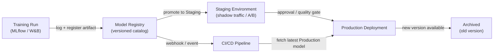

# Modell-Registry

## Definition

Eine Modell-Registry ist ein zentralisierter Katalog, der trainierte ML-Modellartefakte während ihres Lebenszyklus speichert, versioniert und verwaltet — von der anfänglichen Experimentierung über Staging, Produktionsbereitstellung bis hin zur schließlichen Außerbetriebnahme. Stellen Sie sich das als Äquivalent eines Software-Artefakt-Repositories (wie Nexus oder Artifactory) vor, das aber speziell für maschinelles Lernen entwickelt wurde, mit zusätzlichen Metadaten über Trainingsdaten, Evaluierungsmetriken und Genehmigungsstatus zu jeder Version.

Ohne eine Registry teilen Teams Modelle häufig über Ad-hoc-Kanäle: Slack-Nachrichten mit S3-Links, gemeinsame Verzeichnisse oder fest kodierte Pfade in Deployment-Skripten. Das macht es unmöglich, grundlegende Governance-Fragen zu beantworten wie "welches Modell ist aktuell in der Produktion?", "wer hat dieses Modell für die Bereitstellung genehmigt?" oder "welcher Datensatz wurde verwendet, um die Version zu trainieren, die den Vorfall letzte Woche verursacht hat?". Eine Registry macht diese Fragen trivial beantwortbar.

Modell-Registries integrieren sich sowohl mit der Trainingsseite (Experiment-Tracker protokollieren einen Lauf, und das Artefakt des besten Laufs wird registriert) als auch mit der Deployment-Seite (CI/CD oder Serving-Infrastruktur zieht das Artefakt im `Production`-Stage). Sie erzwingen typischerweise einen Promotions-Workflow — `None → Staging → Production → Archived` — der menschliche Genehmigung, automatisierte Qualitäts-Gates oder beides erfordern kann, bevor ein Modell zur nächsten Stufe übergeht.

## Funktionsweise



### Modellregistrierung

Nachdem ein Trainingslauf abgeschlossen und Metriken in einem Experiment-Tracker protokolliert wurden, wird das beste Artefakt in der Registry mit `mlflow.register_model()` oder dem entsprechenden SDK-Aufruf registriert. Jede Registrierung erstellt eine neue **Version** eines benannten Modells (z. B. `fraud-detector`). Versionen sind unveränderlich — eine registrierte Version kann nicht überschrieben, nur eine neue erstellt werden. Metadaten wie die Lauf-ID, Datensatz-Hash, Trainingsparameter und Evaluierungsmetriken sind der Version beigefügt und über die Registry-API oder -UI abfragbar.

### Staging-Workflow

Neu registrierte Versionen beginnen im `None`- (oder `Candidate`-) Stage. Ein Data Scientist oder ein automatisiertes Gate promoviert eine Version zu `Staging` für tiefere Validierung — Integrationstests, Shadow-Deployment, Canary-Traffic-Splitting oder A/B-Vergleich mit dem aktuellen Produktionsmodell. Staging ist eine sichere Umgebung, in der Regressionen eingedämmt werden; jeder Fehler hier verhindert, dass das Modell die Produktion erreicht, ohne das Serving-System zu blockieren.

### Produktionspromotion und Governance

Die Promotion zu `Production` kann einen menschlichen Genehmigungsschritt erfordern, besonders in regulierten Branchen. Viele Teams implementieren ein Pull-Request-ähnliches Review: Die Registry sendet einen Webhook, ein Reviewer prüft die Modellkarte (die Trainingsdaten, Fairness-Metriken und bekannte Einschränkungen dokumentiert), und die Promotion wird in einem Audit-Log mit der Identität des Genehmigers und einem Zeitstempel aufgezeichnet. Die Serving-Infrastruktur abonniert den `Production`-Stage und lädt automatisch die neue Modellversion bei Promotion, was Zero-Downtime-Modellaktualisierungen ermöglicht.

### Archivierung und Rollback

Wenn eine neue Version `Production` erreicht, wird die alte Version zu `Archived` übergeleitet. Archivierung löscht das Artefakt nicht — es bleibt vollständig abrufbar für Rollback oder forensische Analyse. Wenn die neue Produktionsversion sich verschlechtert (erkannt durch [Monitoring](/docs/mlops/monitoring)), kann das Ops-Team die archivierte Version in Sekunden zu `Production` re-promovieren und so ohne Code-Deployment zurückrollen.

## Wann verwenden / Wann NICHT verwenden

| Verwenden wenn | Vermeiden wenn |
|---|---|
| Mehrere Modelle oder Modellversionen gleichzeitig bereitgestellt werden | Ein einzelnes Modell einmalig trainiert wird ohne Pläne zur Aktualisierung |
| Regulatorische oder Audit-Anforderungen Modellherkunft verlangen | Das Team sich in der frühen F&E-Phase ohne Produktionsbereitstellung befindet |
| Verschiedene Teams Training vs. Deployment besitzen | Eine einzelne Person trainiert und in einem einzigen Skript bereitstellt |
| Rollback-Fähigkeit für Produktionsmodelle benötigt wird | Der Overhead des Governance-Prozesses nicht durch das Risikoniveau gerechtfertigt ist |
| A/B-Tests oder Shadow-Deployment das Verwalten mehrerer Live-Versionen erfordert | Experiment-Tracking allein bereits die Governance-Anforderungen erfüllt |

## Vergleiche

| Kriterium | MLflow Model Registry | W&B Registry | AWS SageMaker Model Registry |
|---|---|---|---|
| Hosting | Self-hosted oder Databricks verwaltet | SaaS (W&B Cloud) | Vollständig verwalteter AWS-Service |
| Integration | MLflow-Tracking-Server | W&B-Experiment-Tracking | SageMaker Training + Endpoints |
| Stage-Workflow | None → Staging → Production → Archived | Alias-basiert (benutzerdefinierte Stages) | Pending → Approved → Rejected |
| Genehmigungsprozess | Manuell via UI/API | Manuell via UI/API | Integration mit AWS IAM / CodePipeline |
| Kosten | Open Source (self-hosted kostenlos) | Kostenloser Tier + kostenpflichtige Pläne | Pay-per-use AWS-Preisgestaltung |

## Vor- und Nachteile

| Vorteile | Nachteile |
|---|---|
| Einzige Quelle der Wahrheit für alle Produktionsmodelle | Fügt Prozess-Overhead hinzu — Teams müssen daran denken, Artefakte zu registrieren |
| Ermöglicht Rollback in Sekunden ohne Code-Deployment | Self-hosted Registries erfordern Infrastrukturwartung |
| Vollständiger Audit-Trail mit Genehmigeridentität und Zeitstempeln | Integrationsarbeit erforderlich, um Trainingspipelines mit der Registry zu verbinden |
| Entkoppelt Modell-Promotion von Code-Deployment-Zyklen | Governance-Prozesse können schnell agierende Teams verlangsamen, wenn übertrieben |
| Ermöglicht sicheres A/B-Testing durch Serving mehrerer registrierter Versionen | Artefakt-Speicherkosten wachsen mit der Zeit, wenn Versionen sich anhäufen |

## Code-Beispiele

```python
# model_registry_example.py
# Demonstrates registering, transitioning, and loading models with MLflow Model Registry

import mlflow
import mlflow.sklearn
from mlflow.tracking import MlflowClient
from sklearn.datasets import make_classification
from sklearn.ensemble import RandomForestClassifier
from sklearn.model_selection import train_test_split
from sklearn.metrics import accuracy_score

# --- 1. Train and log a model to MLflow tracking server ---

mlflow.set_tracking_uri("http://localhost:5000")  # or your MLflow server URI
mlflow.set_experiment("fraud-detection")

X, y = make_classification(n_samples=5000, n_features=20, random_state=42)
X_train, X_test, y_train, y_test = train_test_split(X, y, test_size=0.2, random_state=42)

with mlflow.start_run(run_name="rf-baseline") as run:
    model = RandomForestClassifier(n_estimators=100, random_state=42)
    model.fit(X_train, y_train)

    accuracy = accuracy_score(y_test, model.predict(X_test))

    mlflow.log_param("n_estimators", 100)
    mlflow.log_metric("accuracy", accuracy)

    signature = mlflow.models.infer_signature(X_train, model.predict(X_train))
    mlflow.sklearn.log_model(
        sk_model=model,
        artifact_path="model",
        signature=signature,
        registered_model_name="fraud-detector",
    )

    run_id = run.info.run_id
    print(f"Run ID: {run_id} | Accuracy: {accuracy:.4f}")

# --- 2. Transition the newly registered version to Staging ---

client = MlflowClient()

latest_versions = client.get_latest_versions("fraud-detector", stages=["None"])
new_version = latest_versions[0].version

client.transition_model_version_stage(
    name="fraud-detector",
    version=new_version,
    stage="Staging",
    archive_existing_versions=False,
)
print(f"Version {new_version} promoted to Staging")

# --- 3. After validation, promote Staging model to Production ---

client.transition_model_version_stage(
    name="fraud-detector",
    version=new_version,
    stage="Production",
    archive_existing_versions=True,
)
print(f"Version {new_version} is now Production")

client.update_model_version(
    name="fraud-detector",
    version=new_version,
    description="Promoted after passing shadow traffic test with 0.1% error rate improvement.",
)

# --- 4. Load the Production model ---

production_model = mlflow.sklearn.load_model("models:/fraud-detector/Production")
predictions = production_model.predict(X_test)
print(f"Loaded Production model accuracy: {accuracy_score(y_test, predictions):.4f}")
```

## Praktische Ressourcen

- [MLflow Model Registry-Dokumentation](https://mlflow.org/docs/latest/model-registry.html) — Offizieller Leitfaden mit Python-API-Referenz und UI-Anleitung.
- [Weights & Biases Registry](https://docs.wandb.ai/guides/model_registry) — W&Bs Modell-Registry mit verlinkten Artefakten und Herkunftsgraphen.
- [AWS SageMaker Model Registry](https://docs.aws.amazon.com/sagemaker/latest/dg/model-registry.html) — Verwaltete Registry, integriert mit SageMaker Pipelines und CodePipeline.
- [Google Vertex AI Model Registry](https://cloud.google.com/vertex-ai/docs/model-registry/introduction) — GCPs verwaltete Lösung für Modell-Versionierung und Deployment.

## Siehe auch

- [MLflow](/docs/mlops/mlflow)
- [Weights & Biases (W&B)](/docs/mlops/wandb)
- [Model Serving](/docs/mlops/deployment/model-serving)
