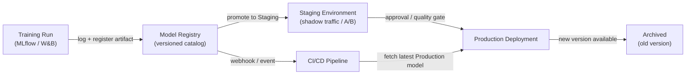

# Modellregistrierung

## Definition

Eine Modellregistrierung ist ein zentralisierter Katalog, der trainierte ML-Modellartefakte während ihres gesamten Lebenszyklus speichert, versioniert und verwaltet — von der anfänglichen Experimentierung über das Staging, die Produktionsbereitstellung bis hin zur eventuellen Außerbetriebnahme. Betrachten Sie sie als das Äquivalent eines Software-Artefakt-Repositories (wie Nexus oder Artifactory), aber zweckgebaut für maschinelles Lernen, mit zusätzlichen Metadaten über Trainingsdaten, Bewertungsmetriken und Genehmigungsstatus, die jeder Version angehängt sind.

Ohne eine Registrierung teilen Teams Modelle häufig über Ad-hoc-Kanäle: Slack-Nachrichten mit S3-Links, gemeinsame Verzeichnisse oder fest kodierte Pfade in Bereitstellungsskripten. Dies macht es unmöglich, grundlegende Governance-Fragen zu beantworten wie "Welches Modell ist derzeit in der Produktion?", "Wer hat dieses Modell für die Bereitstellung genehmigt?" oder "Welcher Datensatz wurde verwendet, um die Version zu trainieren, die den Vorfall letzte Woche verursacht hat?". Eine Registrierung macht diese Fragen trivial beantwortbar.

Modellregistrierungen integrieren sich sowohl auf der Trainingsseite (Experiment-Tracker protokollieren einen Lauf, und das Artefakt des besten Laufs wird registriert) als auch auf der Bereitstellungsseite (CI/CD oder Serving-Infrastruktur ruft das Artefakt in der `Production`-Stufe ab). Sie erzwingen typischerweise einen Förderungs-Workflow — `None → Staging → Production → Archived` — der menschliche Genehmigung, automatisierte Qualitätsgates oder beides erfordern kann, bevor ein Modell in die nächste Stufe übergeht.

## Funktionsweise



### Modellregistrierung

Nachdem ein Trainingslauf abgeschlossen ist und Metriken in einem Experiment-Tracker protokolliert wurden, wird das beste Artefakt mit `mlflow.register_model()` oder dem äquivalenten SDK-Aufruf in der Registrierung registriert. Jede Registrierung erstellt eine neue **Version** eines benannten Modells (z. B. `fraud-detector`). Versionen sind unveränderlich — Sie können eine registrierte Version nicht überschreiben, sondern nur eine neue erstellen. Metadaten wie die Run-ID, der Datensatz-Hash, Trainingsparameter und Bewertungsmetriken werden der Version angehängt und sind über die Registrierungs-API oder UI abfragbar.

### Staging-Workflow

Neu registrierte Versionen beginnen in der `None`- (oder `Candidate`-) Stufe. Ein Datenwissenschaftler oder ein automatisiertes Gate befördert eine Version in das `Staging` zur tieferen Validierung — Integrationstests, Shadow-Deployment, Canary-Traffic-Splitting oder A/B-Vergleich mit dem aktuellen Produktionsmodell. Staging ist eine sichere Umgebung, in der Regressionen eingedämmt werden; jedes Scheitern hier verhindert, dass das Modell die Produktion erreicht, ohne das Serving-System zu blockieren.

### Produktionsförderung und Governance

Die Förderung zur `Production` kann einen menschlichen Genehmigungsschritt erfordern, besonders in regulierten Branchen. Viele Teams implementieren eine Pull-Request-ähnliche Überprüfung: Die Registrierung sendet einen Webhook, ein Prüfer untersucht die Modellkarte (die Trainingsdaten, Fairness-Metriken und bekannte Einschränkungen dokumentiert), und die Förderung wird in einem Audit-Log mit der Identität des Genehmigenden und dem Zeitstempel aufgezeichnet. Die Serving-Infrastruktur abonniert die `Production`-Stufe und lädt automatisch die neue Modellversion, wenn eine Förderung erfolgt, was Zero-Downtime-Modellaktualisierungen ermöglicht.

### Archivierung und Rollback

Wenn eine neue Version `Production` erreicht, wird die alte Version zu `Archived` überführt. Das Archivieren löscht das Artefakt nicht — es bleibt vollständig für Rollback oder forensische Analyse abrufbar. Wenn die neue Produktionsversion degradiert (erkannt durch [Überwachung](/docs/mlops/monitoring)), kann das Betriebsteam die archivierte Version in Sekunden erneut zu `Production` befördern und ohne Code-Deployment zurückrollen.

## Wann verwenden / Wann NICHT verwenden

| Verwenden wenn | Vermeiden wenn |
|---|---|
| Mehrere Modelle oder Modellversionen gleichzeitig bereitgestellt werden | Sie ein einzelnes Modell haben, das einmalig trainiert wurde und keine Aktualisierungen geplant sind |
| Regulatorische oder Audit-Anforderungen Modell-Provenienz erfordern | Das Team in früher F&E-Phase ist ohne Produktionsbereitstellung |
| Verschiedene Teams Training und Bereitstellung besitzen | Eine einzelne Person trainiert und stellt in einem einzigen Skript bereit |
| Sie Rollback-Fähigkeit für Produktionsmodelle benötigen | Der Overhead des Governance-Prozesses durch das Risikoniveau nicht gerechtfertigt ist |
| A/B-Tests oder Shadow-Deployment das Verwalten mehrerer Live-Versionen erfordern | Experiment-Tracking allein Ihren Governance-Anforderungen bereits entspricht |

## Vergleiche

| Kriterium | MLflow Modellregistrierung | W&B Registry | AWS SageMaker Modellregistrierung |
|---|---|---|---|
| Hosting | Self-hosted oder Databricks verwaltet | SaaS (W&B Cloud) | Vollständig verwalteter AWS-Dienst |
| Integration | MLflow-Tracking-Server | W&B-Experiment-Tracking | SageMaker Training + Endpunkte |
| Stufen-Workflow | None → Staging → Production → Archived | Alias-basiert (benutzerdefinierte Stufen) | Pending → Approved → Rejected |
| Genehmigungsprozess | Manuell über UI/API | Manuell über UI/API | Integration mit AWS IAM / CodePipeline |
| Kosten | Open Source (self-hosted kostenlos) | Kostenloser Tarif + kostenpflichtige Pläne | Pay-per-use AWS-Preisgestaltung |

## Vor- und Nachteile

| Vorteile | Nachteile |
|---|---|
| Einzige Wahrheitsquelle für alle Produktionsmodelle | Fügt Prozess-Overhead hinzu — Teams müssen daran denken, Artefakte zu registrieren |
| Ermöglicht Rollback in Sekunden ohne Code-Deployment | Self-hosted Registrierungen erfordern Infrastrukturwartung |
| Vollständiger Audit-Trail mit Genehmigenden-Identität und Zeitstempeln | Integrationsarbeit erforderlich, um Trainingspipelines mit der Registrierung zu verbinden |
| Entkoppelt Modellförderung von Code-Bereitstellungszyklen | Governance-Prozesse können schnell arbeitende Teams verlangsamen, wenn übertechnisiert |
| Ermöglicht sicheres A/B-Testen durch mehrere registrierte Versionen | Artefakt-Speicherkosten wachsen im Laufe der Zeit, wenn sich Versionen ansammeln |

## Codebeispiele

```python
# model_registry_example.py
import mlflow
import mlflow.sklearn
from mlflow.tracking import MlflowClient
from sklearn.datasets import make_classification
from sklearn.ensemble import RandomForestClassifier
from sklearn.model_selection import train_test_split
from sklearn.metrics import accuracy_score

mlflow.set_tracking_uri("http://localhost:5000")
mlflow.set_experiment("fraud-detection")

X, y = make_classification(n_samples=5000, n_features=20, random_state=42)
X_train, X_test, y_train, y_test = train_test_split(X, y, test_size=0.2, random_state=42)

with mlflow.start_run(run_name="rf-baseline") as run:
    model = RandomForestClassifier(n_estimators=100, random_state=42)
    model.fit(X_train, y_train)
    accuracy = accuracy_score(y_test, model.predict(X_test))
    mlflow.log_param("n_estimators", 100)
    mlflow.log_metric("accuracy", accuracy)
    signature = mlflow.models.infer_signature(X_train, model.predict(X_train))
    mlflow.sklearn.log_model(
        sk_model=model,
        artifact_path="model",
        signature=signature,
        registered_model_name="fraud-detector",
    )
    run_id = run.info.run_id
    print(f"Run ID: {run_id} | Accuracy: {accuracy:.4f}")

client = MlflowClient()
latest_versions = client.get_latest_versions("fraud-detector", stages=["None"])
new_version = latest_versions[0].version

client.transition_model_version_stage(
    name="fraud-detector",
    version=new_version,
    stage="Staging",
    archive_existing_versions=False,
)
print(f"Version {new_version} promoted to Staging")

client.transition_model_version_stage(
    name="fraud-detector",
    version=new_version,
    stage="Production",
    archive_existing_versions=True,
)
print(f"Version {new_version} is now Production")

client.update_model_version(
    name="fraud-detector",
    version=new_version,
    description="Promoted after passing shadow traffic test with 0.1% error rate improvement.",
)

production_model = mlflow.sklearn.load_model("models:/fraud-detector/Production")
predictions = production_model.predict(X_test)
print(f"Loaded Production model accuracy: {accuracy_score(y_test, predictions):.4f}")
```

## Praktische Ressourcen

- [MLflow Modellregistrierungs-Dokumentation](https://mlflow.org/docs/latest/model-registry.html) — Offizieller Leitfaden mit Python-API-Referenz und UI-Walkthrough.
- [Weights & Biases Registry](https://docs.wandb.ai/guides/model_registry) — W&Bs Modellregistrierung mit verknüpften Artefakten und Lineage-Graphen.
- [AWS SageMaker Modellregistrierung](https://docs.aws.amazon.com/sagemaker/latest/dg/model-registry.html) — Verwaltete Registrierung integriert mit SageMaker Pipelines und CodePipeline.
- [Google Vertex AI Modellregistrierung](https://cloud.google.com/vertex-ai/docs/model-registry/introduction) — GCPs verwaltete Lösung für Modell-Versionierung und Bereitstellung.

## Siehe auch

- [MLflow](/docs/mlops/mlflow)
- [Weights & Biases (W&B)](/docs/mlops/wandb)
- [Modell-Serving](/docs/mlops/deployment/model-serving)
