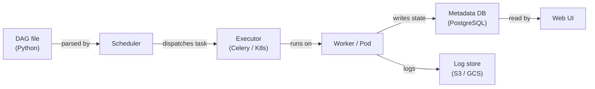

# Apache Airflow

## Definition

Apache Airflow ist eine Open-Source-Plattform zur programmatischen Erstellung, Planung und Überwachung von Workflows. Workflows werden als **Directed Acyclic Graphs (DAGs)** in Python ausgedrückt, was Ingenieuren die volle Ausdrucksstärke einer Programmiersprache für komplexe Abhängigkeiten, Verzweigungslogik, dynamische Task-Generierung und Retry-Richtlinien gibt. Airflow wurde ursprünglich 2014 bei Airbnb erstellt und später der Apache Software Foundation gespendet; es ist zum De-facto-Standard für Batch-Workflow-Orchestrierung in Data Engineering und MLOps geworden.

Im ML-Kontext orchestriert Airflow den gesamten Modell-Lebenszyklus: Datenaufnahme, Vorverarbeitung, Feature Engineering, Modelltraining, Evaluierung, Artefaktregistrierung und Deployment. Es führt die Berechnungen selbst nicht aus — stattdessen delegiert es an spezialisierte Systeme (Spark, dbt, SageMaker, Kubernetes) über sein umfangreiches Operator-Ökosystem. Diese Trennung von Orchestrierung und Ausführung ist eine wichtige architektonische Stärke: Die zugrunde liegende Berechnungsebene kann getauscht werden, ohne die DAG-Logik zu ändern.

Airflows Scheduler parst kontinuierlich DAG-Dateien, bewertet den Zustand jeder Task-Instanz und sendet bereite Tasks an einen Executor (LocalExecutor, CeleryExecutor oder KubernetesExecutor). Die Web-UI bietet Echtzeit-Sichtbarkeit in DAG-Läufe, Task-Logs und Herkunft. Airflow ist für Batch-Workloads mit bekannten Zeitplänen ausgelegt — es ist nicht für Sub-Minuten-Streaming oder ereignisgesteuerte Pipelines geeignet.

## Funktionsweise

### DAGs und Task-Abhängigkeiten

Ein DAG ist eine Python-Datei, die ein `airflow.DAG`-Objekt instanziiert und Tasks mit Operatoren definiert. Abhängigkeiten zwischen Tasks werden mit dem `>>`-Bitshift-Operator oder `set_downstream`/`set_upstream`-Aufrufen deklariert. Der Scheduler liest diese Dateien aus dem DAGs-Ordner, berechnet den Abhängigkeitsgraphen und löst Task-Instanzen aus, wenn alle Upstream-Abhängigkeiten im `success`-Zustand sind. DAG-Läufe können nach einem Cron-Ausdruck geplant oder extern über die REST-API oder den `TriggerDagRunOperator` ausgelöst werden.

### Operatoren, Sensoren und Hooks

**Operatoren** sind die atomaren Arbeitseinheiten in Airflow. Der `PythonOperator` führt ein Python-Callable aus; `BashOperator` führt einen Shell-Befehl aus; `SparkSubmitOperator` sendet einen Spark-Job; `BigQueryOperator` führt eine SQL-Abfrage aus. **Sensoren** sind eine spezielle Klasse von Operatoren, die blockieren, bis eine Bedingung erfüllt ist — eine Datei landet in S3, eine Partition erscheint in einer Hive-Tabelle oder ein externer DAG abgeschlossen wird. **Hooks** bieten wiederverwendbare Verbindungen zu externen Systemen (Datenbanken, Cloud-APIs, Message Queues) und werden intern von Operatoren verwendet, können aber auch direkt aufgerufen werden. Diese geschichtete Abstraktion bedeutet, dass die meisten Integrationen bereits in den `apache-airflow-providers-*`-Paketen vorhanden sind.

### XComs und Inter-Task-Kommunikation

**XComs** (Cross-Communications) ermöglichen Tasks, kleine Werte — Strings, Zahlen, JSON-Blobs — zwischen Task-Instanzen innerhalb desselben DAG-Laufs weiterzugeben. Ein Task schiebt ein XCom durch Rückgabe eines Werts aus seinem Python-Callable oder durch Aufruf von `context['ti'].xcom_push(key, value)`. Downstream-Tasks holen es mit `context['ti'].xcom_pull(task_ids='upstream_task', key='value')`. XComs werden in der Airflow-Metadatenbank gespeichert, sind also nicht für große Payloads geeignet (hierfür Object Storage verwenden). Sie eignen sich ideal für das Weitergeben von Modellevaluierungsmetriken, Artefaktpfaden oder Entscheidungs-Flags zwischen Pipeline-Schritten.

### Scheduler-Architektur

Der Airflow-Scheduler ist ein Python-Prozess, der DAG-Dateien in einem konfigurierbaren Intervall parst, berechnet, welche Task-Instanzen ausführungsbereit sind, und sie an den Executor übermittelt. Mit `CeleryExecutor` werden Tasks über einen Message Broker (Redis oder RabbitMQ) an einen Pool von Worker-Prozessen gesendet. Mit `KubernetesExecutor` erhält jede Task-Instanz ihren eigenen isolierten Kubernetes-Pod — was die gemeinsame Worker-Ressourcenkonflikte eliminiert und Pro-Task-Ressourcenspezifikationen ermöglicht. Die Metadatenbank (PostgreSQL oder MySQL in Produktion) speichert DAG-Laufzustand, Task-Instanzhistorie, XComs, Variablen und Verbindungen.



## Wann verwenden / Wann NICHT verwenden

| Verwenden wenn | Vermeiden wenn |
|----------|------------|
| Batch-Workflow-Orchestrierung mit komplexen Abhängigkeiten benötigt wird | Der Workload Sub-Minuten-Latenz erfordert oder ereignisgesteuert ist |
| Das Team mit dem Schreiben von Workflows in Python vertraut ist | Ein Low-Code- oder UI-first-Workflow-Builder gewünscht wird |
| Reiche Integration mit Cloud-Services (AWS, GCP, Azure) benötigt wird | DAGs extrem einfach sind und ein Cron-Job ausreichen würde |
| Detaillierte Audit-Trails, Wiederholungen und Alerting erforderlich sind | Ein verwalteter, Zero-Ops-Orchestrierungsservice benötigt wird |
| KubernetesExecutor für isolierte, reproduzierbare Task-Umgebungen gewünscht wird | Die Organisation den Airflow-Scheduler und die Worker nicht warten kann |

## Vergleiche

| Kriterium | Apache Airflow | Prefect |
|-----------|---------------|---------|
| Benutzerfreundlichkeit | Mittel — erfordert Verständnis des DAG-Modells, Scheduler-Setup und Executors | Hoch — Pythonische Flows mit minimalem Boilerplate; lokale Ausführung funktioniert einfach |
| Skalierbarkeit | Hoch — KubernetesExecutor skaliert Tasks unabhängig | Hoch — Prefect Cloud oder selbst gehosteter Server mit Work-Pools |
| UI-Qualität | Gut — DAG-Graph, Gantt, Task-Logs; etwas veraltetes Design | Ausgezeichnet — modernes UI mit Flow-Run-Beobachtbarkeit und Artefakt-Tracking |
| Kubernetes-Unterstützung | Erstklassig via KubernetesExecutor (ein Pod pro Task) | Via Kubernetes Work-Pools; einfacher zu konfigurieren als Airflow |
| Lernkurve | Steil — DAG-Semantik, XComs, Provider, Executor-Konfiguration | Sanft — fühlt sich an wie reguläres Python schreiben; weniger zu lernen von Anfang an |

## Vor- und Nachteile

| Vorteile | Nachteile |
|------|------|
| Reifes Ökosystem mit Hunderten von Provider-Integrationen | Erheblicher operativer Overhead (Scheduler, Worker, Metadatenbank) |
| Volle Python-Ausdrucksstärke für dynamische DAG-Generierung | DAG-Parse-Fehler können den Scheduler still beschädigen |
| Starke Community und Enterprise-Unterstützung (MWAA, Cloud Composer, Astronomer) | Nicht geeignet für Streaming oder Sub-Minuten-Scheduling |
| KubernetesExecutor ermöglicht Pro-Task-Ressourcenisolierung | XComs sind in der Größe begrenzt — nicht geeignet für große Artefakte |
| Umfangreiches UI mit Graph-Ansicht, Gantt-Diagramm und Task-Level-Logs | Konfigurationsausbreitung über DAG-Dateien, Umgebungsvariablen und Airflow-UI |

## Code-Beispiele

```python
"""
Airflow DAG for a complete ML pipeline:
  1. Extract training data from a source database
  2. Preprocess and validate the data
  3. Train a model and register it in a model registry

Requires: apache-airflow >= 2.7, apache-airflow-providers-postgres,
          scikit-learn, pandas, mlflow
"""

from __future__ import annotations

from datetime import datetime, timedelta

from airflow import DAG
from airflow.operators.python import PythonOperator

# --- Default arguments applied to every task ---
default_args = {
    "owner": "ml-team",
    "retries": 2,
    "retry_delay": timedelta(minutes=5),
    "email_on_failure": True,
    "email": ["ml-alerts@example.com"],
}

# ---------------------------------------------------------------------------
# Task callables
# ---------------------------------------------------------------------------

def extract_data(**context) -> None:
    """
    Pull the latest training window from the feature store and
    save it to a shared location. Push the output path via XCom.
    """
    import pandas as pd

    # In production, replace with a real DB/feature-store connection
    df = pd.DataFrame(
        {
            "feature_a": [1.0, 2.0, 3.0, 4.0, 5.0],
            "feature_b": [0.1, 0.4, 0.9, 1.6, 2.5],
            "label": [0, 0, 1, 1, 1],
        }
    )

    output_path = "/tmp/airflow/training_data.parquet"
    import pathlib
    pathlib.Path(output_path).parent.mkdir(parents=True, exist_ok=True)
    df.to_parquet(output_path, index=False)

    # Push artifact path to XCom so downstream tasks can consume it
    context["ti"].xcom_push(key="data_path", value=output_path)
    print(f"[extract] saved {len(df)} rows to {output_path}")


def preprocess_data(**context) -> None:
    """
    Load extracted data, validate schema, apply feature scaling,
    and persist the preprocessed dataset.
    """
    import pandas as pd
    from sklearn.preprocessing import StandardScaler

    # Pull the path produced by the extract task
    data_path = context["ti"].xcom_pull(task_ids="extract_data", key="data_path")
    df = pd.read_parquet(data_path)

    # Validate required columns
    required = {"feature_a", "feature_b", "label"}
    missing = required - set(df.columns)
    if missing:
        raise ValueError(f"Missing columns: {missing}")

    # Scale features
    scaler = StandardScaler()
    df[["feature_a", "feature_b"]] = scaler.fit_transform(
        df[["feature_a", "feature_b"]]
    )

    output_path = "/tmp/airflow/preprocessed_data.parquet"
    df.to_parquet(output_path, index=False)
    context["ti"].xcom_push(key="preprocessed_path", value=output_path)
    print(f"[preprocess] scaled and saved {len(df)} rows to {output_path}")


def train_model(**context) -> None:
    """
    Train a logistic regression model, evaluate on a hold-out split,
    and log the run to MLflow.
    """
    import pandas as pd
    import mlflow
    import mlflow.sklearn
    from sklearn.linear_model import LogisticRegression
    from sklearn.model_selection import train_test_split
    from sklearn.metrics import accuracy_score

    preprocessed_path = context["ti"].xcom_pull(
        task_ids="preprocess_data", key="preprocessed_path"
    )
    df = pd.read_parquet(preprocessed_path)

    X = df[["feature_a", "feature_b"]].values
    y = df["label"].values
    X_train, X_test, y_train, y_test = train_test_split(
        X, y, test_size=0.2, random_state=42
    )

    with mlflow.start_run(run_name="airflow-logistic-regression"):
        model = LogisticRegression()
        model.fit(X_train, y_train)

        accuracy = accuracy_score(y_test, model.predict(X_test))
        mlflow.log_metric("accuracy", accuracy)
        mlflow.sklearn.log_model(model, artifact_path="model")

        print(f"[train] accuracy={accuracy:.4f}")
        mlflow.register_model(
            f"runs:/{mlflow.active_run().info.run_id}/model",
            name="airflow-demo-model",
        )


# ---------------------------------------------------------------------------
# DAG definition
# ---------------------------------------------------------------------------

with DAG(
    dag_id="ml_training_pipeline",
    description="Extract → Preprocess → Train pipeline for nightly model refresh",
    default_args=default_args,
    start_date=datetime(2024, 1, 1),
    schedule="0 2 * * *",  # Run at 02:00 UTC daily
    catchup=False,
    tags=["ml", "training"],
) as dag:

    extract = PythonOperator(
        task_id="extract_data",
        python_callable=extract_data,
    )

    preprocess = PythonOperator(
        task_id="preprocess_data",
        python_callable=preprocess_data,
    )

    train = PythonOperator(
        task_id="train_model",
        python_callable=train_model,
    )

    # Define linear dependency: extract → preprocess → train
    extract >> preprocess >> train
```

## Praktische Ressourcen

- [Apache Airflow-Dokumentation](https://airflow.apache.org/docs/) — Offizielle Referenz für DAGs, Operatoren, Executors und Konfiguration
- [Astronomer — Airflow-Leitfäden](https://www.astronomer.io/docs/learn/) — Praktische Tutorials zu DAG-Erstellung, Testen und Deployment
- [Airflow Provider-Pakete-Index](https://airflow.apache.org/docs/#providers-packages-docs-apache-airflow-providers) — Alle offiziellen Integrationen durchsuchen (AWS, GCP, Spark, dbt usw.)
- [Managed Airflow — Amazon MWAA](https://docs.aws.amazon.com/mwaa/latest/userguide/what-is-mwaa.html) — AWS Managed Airflow Service-Referenz

## Siehe auch

- [Datenpipelines](/docs/mlops/data-engineering)
- [Apache Spark](/docs/mlops/data-engineering/spark)
- [MLOps CI/CD](/docs/mlops/cicd)
