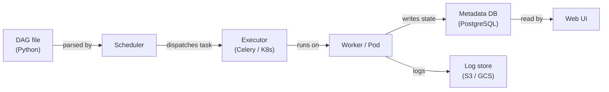

# Apache Airflow

## Definition

Apache Airflow ist eine Open-Source-Plattform zum programmatischen Erstellen, Planen und Überwachen von Workflows. Workflows werden als **Directed Acyclic Graphs (DAGs)** in Python ausgedrückt, was Ingenieuren die volle Ausdruckskraft einer Programmiersprache gibt, um komplexe Abhängigkeiten, Verzweigungslogik, dynamische Task-Generierung und Wiederholungsrichtlinien zu definieren. Airflow wurde ursprünglich 2014 bei Airbnb erstellt und später an die Apache Software Foundation gespendet; es hat sich zum De-facto-Standard für die Batch-Workflow-Orchestrierung in Data Engineering und MLOps entwickelt.

Im ML-Kontext orchestriert Airflow den gesamten Modell-Lebenszyklus: Daten-Ingestion, Vorverarbeitung, Feature Engineering, Modelltraining, Evaluierung, Artefakt-Registrierung und Bereitstellung. Es führt die Berechnung nicht selbst durch — stattdessen delegiert es an spezialisierte Systeme (Spark, dbt, SageMaker, Kubernetes) über sein umfangreiches Operator-Ökosystem. Diese Trennung von Orchestrierung und Ausführung ist eine wichtige architektonische Stärke: Sie können die zugrunde liegende Rechenschicht austauschen, ohne die DAG-Logik zu ändern.

## Funktionsweise

### DAGs und Task-Abhängigkeiten

Ein DAG ist eine Python-Datei, die ein `airflow.DAG`-Objekt instanziiert und Tasks mit Operatoren definiert. Abhängigkeiten zwischen Tasks werden mit dem `>>`-Operator oder `set_downstream`/`set_upstream`-Aufrufen deklariert. Der Scheduler liest diese Dateien aus dem DAGs-Ordner, berechnet den Abhängigkeitsgraphen und löst Task-Instanzen aus, wenn alle Upstream-Abhängigkeiten im `success`-Zustand sind.

### Operatoren, Sensoren und Hooks

**Operatoren** sind die atomaren Arbeitseinheiten in Airflow. `PythonOperator` führt ein Python-Callable aus; `BashOperator` führt einen Shell-Befehl aus; `SparkSubmitOperator` sendet einen Spark-Job. **Sensoren** sind eine spezielle Operatorklasse, die blockiert, bis eine Bedingung erfüllt ist. **Hooks** bieten wiederverwendbare Verbindungen zu externen Systemen.

### XComs und Inter-Task-Kommunikation

**XComs** ermöglichen Tasks das Schieben und Ziehen kleiner Werte — Strings, Zahlen, JSON-Blobs — zwischen Task-Instanzen innerhalb desselben DAG-Laufs. XComs werden in der Airflow-Metadatenbank gespeichert und eignen sich ideal zum Weitergeben von Modellbewertungsmetriken, Artefaktpfaden oder Entscheidungs-Flags.

### Scheduler-Architektur

Der Airflow-Scheduler ist ein Python-Prozess, der DAG-Dateien in einem konfigurierbaren Intervall analysiert, berechnet, welche Task-Instanzen ausgeführt werden können, und sie an den Executor übermittelt. Mit `KubernetesExecutor` erhält jede Task-Instanz einen eigenen isolierten Kubernetes-Pod.



## Wann verwenden / Wann NICHT verwenden

| Verwenden wenn | Vermeiden wenn |
|---|---|
| Sie Batch-Workflow-Orchestrierung mit komplexen Abhängigkeiten benötigen | Ihre Arbeitslast Sub-Minute-Latenz erfordert oder ereignisgesteuert ist |
| Ihr Team Workflows in Python schreiben möchte | Sie einen Low-Code-Workflow-Builder bevorzugen |
| Sie umfangreiche Integration mit Cloud-Diensten benötigen | Ihre DAGs extrem einfach sind und ein Cron-Job ausreicht |
| Sie detaillierte Audit-Trails, Wiederholungen und Alarmierung benötigen | Sie einen verwalteten Zero-Ops-Orchestrierungsdienst benötigen |

## Vergleiche

| Kriterium | Apache Airflow | Prefect |
|---|---|---|
| Benutzerfreundlichkeit | Mittel — erfordert DAG-Modell, Scheduler-Setup, Executors | Hoch — Pythonische Flows mit minimalem Boilerplate |
| Skalierbarkeit | Hoch — KubernetesExecutor skaliert Tasks unabhängig | Hoch — Prefect Cloud oder Self-hosted mit Work Pools |
| UI-Qualität | Gut — DAG-Graph, Gantt, Task-Logs | Hervorragend — moderne UI |
| Lernkurve | Steil — DAG-Semantik, XComs, Provider | Sanft — fühlt sich wie reguläres Python an |

## Vor- und Nachteile

| Vorteile | Nachteile |
|---|---|
| Reifes Ökosystem mit Hunderten von Provider-Integrationen | Erheblicher operativer Overhead (Scheduler, Worker, Metadaten-DB) |
| Volle Python-Ausdruckskraft für dynamische DAG-Generierung | DAG-Parsing-Fehler können den Scheduler stillschweigend unterbrechen |
| Starke Community und Enterprise-Support (MWAA, Cloud Composer) | Nicht geeignet für Streaming oder Sub-Minute-Scheduling |
| KubernetesExecutor ermöglicht Task-Ressourcenisolation | XComs sind in der Größe begrenzt — nicht für große Artefakte geeignet |

## Codebeispiel

```python
from __future__ import annotations
from datetime import datetime, timedelta
from airflow import DAG
from airflow.operators.python import PythonOperator

default_args = {
    "owner": "ml-team",
    "retries": 2,
    "retry_delay": timedelta(minutes=5),
    "email_on_failure": True,
    "email": ["ml-alerts@example.com"],
}

def extract_data(**context) -> None:
    import pandas as pd, pathlib
    df = pd.DataFrame({"feature_a": [1.0, 2.0], "feature_b": [0.1, 0.4], "label": [0, 1]})
    output_path = "/tmp/airflow/training_data.parquet"
    pathlib.Path(output_path).parent.mkdir(parents=True, exist_ok=True)
    df.to_parquet(output_path, index=False)
    context["ti"].xcom_push(key="data_path", value=output_path)

def train_model(**context) -> None:
    import pandas as pd, mlflow, mlflow.sklearn
    from sklearn.linear_model import LogisticRegression
    from sklearn.model_selection import train_test_split
    from sklearn.metrics import accuracy_score

    data_path = context["ti"].xcom_pull(task_ids="extract_data", key="data_path")
    df = pd.read_parquet(data_path)
    X = df[["feature_a", "feature_b"]].values
    y = df["label"].values
    X_train, X_test, y_train, y_test = train_test_split(X, y, test_size=0.2, random_state=42)
    with mlflow.start_run(run_name="airflow-logistic-regression"):
        model = LogisticRegression()
        model.fit(X_train, y_train)
        accuracy = accuracy_score(y_test, model.predict(X_test))
        mlflow.log_metric("accuracy", accuracy)
        mlflow.sklearn.log_model(model, artifact_path="model")

with DAG(
    dag_id="ml_training_pipeline",
    description="Extract -> Train pipeline for nightly model refresh",
    default_args=default_args,
    start_date=datetime(2024, 1, 1),
    schedule="0 2 * * *",
    catchup=False,
    tags=["ml", "training"],
) as dag:
    extract = PythonOperator(task_id="extract_data", python_callable=extract_data)
    train = PythonOperator(task_id="train_model", python_callable=train_model)
    extract >> train
```

## Praktische Ressourcen

- [Apache Airflow-Dokumentation](https://airflow.apache.org/docs/) — Offizielle Referenz für DAGs, Operatoren, Executors und Konfiguration.
- [Astronomer — Airflow-Leitfäden](https://www.astronomer.io/docs/learn/) — Praktische Tutorials zur DAG-Erstellung, -Tests und -Bereitstellung.
- [Airflow-Provider-Pakete](https://airflow.apache.org/docs/#providers-packages-docs-apache-airflow-providers) — Alle offiziellen Integrationen durchsuchen.
- [Verwaltetes Airflow — Amazon MWAA](https://docs.aws.amazon.com/mwaa/latest/userguide/what-is-mwaa.html) — AWS verwalteter Airflow-Dienst.

## Siehe auch

- [Datenpipelines](/docs/mlops/data-engineering)
- [Apache Spark](/docs/mlops/data-engineering/spark)
- [MLOps CI/CD](/docs/mlops/cicd)
