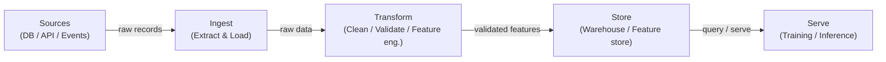

# Datenpipelines

## Definition

Eine Datenpipeline ist eine automatisierte Abfolge von Schritten, die Rohdaten von einer oder mehreren Quellen zu einem Ziel bewegt, wo sie konsumiert werden können — von Analysten, Dashboards oder Machine-Learning-Modellen. Im ML-Kontext geht es bei Pipelines nicht nur um das Bewegen von Daten: Sie stellen sicher, dass Daten in der richtigen Form, zur richtigen Zeit und mit verifizierbarer Qualität ankommen, damit Modelle vorhersehbar trainieren und bereitstellen. Ohne zuverlässige Pipelines ist jedes nachgelagerte Artefakt — Features, trainierte Modelle, Vorhersagen — fragwürdig.

Datenpipelines bilden das Fundament jedes MLOps-Systems. Sie umfassen die Aufnahme aus heterogenen Quellen (Datenbanken, APIs, Event-Streams, Dateien), Transformation zur Erzeugung sauberer und strukturierter Datensätze oder Feature-Vektoren, Speicherung in Data Warehouses oder Feature Stores sowie das Serving an Trainingsjobs oder Online-Inferenz-Endpoints. Die Designentscheidungen auf der Pipeline-Ebene — Batch vs. Streaming, Push vs. Pull, Schema-on-Read vs. Schema-on-Write — wirken sich bis hin zu Modelllatenz, Frische und Zuverlässigkeit aus.

Datenqualität ist der versteckte Vertrag zwischen Dateningenieuren und Modellteams. Schema-Drift, Null-Explosionen, Verteilungsverschiebungen und doppelte Datensätze gehören zu den häufigsten Ursachen für stille Modellverschlechterung. Moderne Pipelines betten Validierungsprüfpunkte ein (mit Werkzeugen wie Great Expectations oder dbt-Tests), um diese Probleme abzufangen, bevor schlechte Daten Training oder Serving erreichen.

## Funktionsweise

### Batch vs. Streaming

Batch-Pipelines verarbeiten Daten in begrenzten Chunks nach einem Zeitplan — stündlich, täglich oder durch Dateiankünfte ausgelöst. Sie sind einfacher zu bauen und zu verstehen und sind der richtige Standard, wenn der nachgelagerte Konsument (ein nächtlicher Trainingsjob, ein BI-Dashboard) keine Sub-Minuten-Frische benötigt. Streaming-Pipelines verarbeiten Datensätze bei ihrer Ankunft und ermöglichen nahezu Echtzeit-Features für Online-Modelle. Der Kompromiss ist die operative Komplexität: Es müssen späte Ankünfte, Ereignisse außer der Reihenfolge und genau-einmal Semantik behandelt werden. Die meisten reifen ML-Plattformen betreiben beide: Batch für groß angelegte Nachtraining und Offline-Evaluierung, Streaming für Online-Feature-Berechnung.

### ETL vs. ELT

Extract-Transform-Load (ETL) wendet Transformationen an, bevor Daten im Ziel-Store landen. Dies war das dominierende Muster, als Speicher teuer und Warehouses keine Rechenkapazität hatten. Extract-Load-Transform (ELT) lädt zuerst Rohdaten und transformiert sie dann innerhalb eines leistungsstarken Warehouses oder Lakehouses (z. B. BigQuery, Snowflake, Databricks). ELT bewahrt die Rohhistorie und ermöglicht Ad-hoc-Erkundung ohne erneute Aufnahme — ein großer Vorteil bei ML-Workloads, bei denen Feature-Engineering sich ständig weiterentwickelt. Die Wahl wird hauptsächlich durch Werkzeuge, Governance-Anforderungen und ob das Ziel-System die Transformations-Rechenkapazität effizient handhaben kann, bestimmt.

### Datenqualität und Schema-Validierung

Datenqualitätsprüfungen sollten in jeder Phase der Pipeline eingebettet werden, nicht am Ende angehängt. Bei der Aufnahme verifizieren Prüfungen, dass Quelldaten dem erwarteten Schema entsprechen (Spaltennamen, Typen, Nullable-Einschränkungen). Bei der Transformation prüfen Zeilen-Level-Checks Geschäftsregeln (nicht-negative Preise, gültige Datumsbereiche, referenzielle Integrität). Auf der Serving-Ebene erkennen statistische Prüfungen Verteilungsdrift — der stille Killer bereitgestellter Modelle. Schema-Validierung kann mit Werkzeugen wie Pandera, Great Expectations oder dbt-Tests durchgeführt werden; Verteilungs-Monitoring wird typischerweise von dedizierten Beobachtbarkeitsschichten behandelt.



## Wann verwenden / Wann NICHT verwenden

| Verwenden wenn | Vermeiden wenn |
|----------|------------|
| Mehrere Datenquellen für ML-Training konsolidiert werden müssen | Daten bereits in einer einzigen, sauberen Tabelle für direkte Nutzung vorhanden sind |
| Daten nach einem Zeitplan oder in Echtzeit aktualisiert werden müssen | Die Analyse eine einmalige Erkundung ist, die nicht wiederholt wird |
| Qualitätsgarantien (Schema, Vollständigkeit, Frische) von nachgelagerten Modellen benötigt werden | Der Overhead einer vollständigen Pipeline den Mehrwert für einen schnellen Prototyp übersteigt |
| Transformationen versioniert, getestet und reproduzierbar sein müssen | Das Datenvolumen trivial ist und ein einfaches Skript in einem Notebook ausreicht |
| Mehrere Konsumenten (Training, Dashboards, APIs) dieselben verarbeiteten Daten teilen | Das Quellsystem bereits eine saubere, vertraglich vereinbarte API bereitstellt |

## Vergleiche

| Kriterium | Batch-Pipeline | Streaming-Pipeline |
|-----------|---------------|--------------------|
| Datenfrische | Minuten bis Stunden (zeitplangesteuert) | Sub-Sekunde bis Sekunden |
| Komplexität | Niedrig — begrenzte Datensätze, einfache Wiederholungen | Hoch — späte Daten, Windowing, Zustand |
| Kosten | Vorhersehbare, stoßweise Rechenkapazität | Kontinuierliche Rechenkapazität, oft höhere Grundlast |
| Fehlertoleranz | Den fehlgeschlagenen Batch erneut ausführen | Genau-einmal oder mindestens-einmal Semantik erforderlich |
| Typischer ML-Anwendungsfall | Offline-Training, nächtliche Feature-Aktualisierung | Online Feature Store, Echtzeit-Scoring |

## Vor- und Nachteile

| Vorteile | Nachteile |
|------|------|
| Zentralisiert und standardisiert den Datenzugriff über Teams hinweg | Nicht triviale Anfangsinvestition zum Aufbau und zur Wartung |
| Ermöglicht reproduzierbare, getestete Datentransformationen | Pipeline-Fehler propagieren zu allen nachgelagerten Konsumenten |
| Bettete Qualitätsprüfungen ein, bevor schlechte Daten Modelle erreichen | Das Debuggen verteilter Pipelines ist komplex |
| Unterstützt Versionierung und Herkunftsverfolgung | Streaming fügt erheblichen operativen Overhead hinzu |
| Entkoppelt Produzenten von Konsumenten | Erfordert Daten-Governance und Eigentumskultur |

## Code-Beispiele

```python
"""
Simple batch data pipeline with pandas.
Reads raw CSV data, validates schema, applies transformations,
and writes a clean Parquet file ready for model training.
"""

import pandas as pd
import pandera as pa
from pandera import Column, DataFrameSchema, Check
from pathlib import Path


# --- Schema definition (contract between pipeline and consumers) ---
raw_schema = DataFrameSchema(
    {
        "user_id": Column(int, nullable=False),
        "event_ts": Column(str, nullable=False),
        "amount": Column(float, Check(lambda x: x >= 0), nullable=False),
        "category": Column(str, nullable=True),
    }
)

output_schema = DataFrameSchema(
    {
        "user_id": Column(int),
        "event_date": Column("datetime64[ns]"),
        "amount": Column(float),
        "category": Column(str),
        "log_amount": Column(float),
    }
)


def extract(source_path: str) -> pd.DataFrame:
    """Load raw data from CSV."""
    df = pd.read_csv(source_path)
    print(f"[extract] loaded {len(df):,} rows from {source_path}")
    return df


def validate(df: pd.DataFrame, schema: DataFrameSchema) -> pd.DataFrame:
    """Fail fast if data does not match the declared schema."""
    validated = schema.validate(df)
    print(f"[validate] schema check passed for {len(validated):,} rows")
    return validated


def transform(df: pd.DataFrame) -> pd.DataFrame:
    """Apply cleaning and feature engineering."""
    df = df.copy()

    # Parse timestamp column
    df["event_date"] = pd.to_datetime(df["event_ts"])
    df.drop(columns=["event_ts"], inplace=True)

    # Fill missing categories with a sentinel value
    df["category"] = df["category"].fillna("unknown")

    # Feature engineering: log-transform amount (handles skew)
    import numpy as np
    df["log_amount"] = np.log1p(df["amount"])

    # Drop duplicates based on user_id + date
    df.drop_duplicates(subset=["user_id", "event_date"], inplace=True)

    print(f"[transform] produced {len(df):,} clean rows")
    return df


def load(df: pd.DataFrame, dest_path: str) -> None:
    """Write clean data to Parquet for efficient downstream reads."""
    Path(dest_path).parent.mkdir(parents=True, exist_ok=True)
    df.to_parquet(dest_path, index=False)
    print(f"[load] wrote {len(df):,} rows to {dest_path}")


def run_pipeline(source: str, destination: str) -> None:
    """Orchestrate the full ETL pipeline."""
    raw = extract(source)
    validated_raw = validate(raw, raw_schema)
    clean = transform(validated_raw)
    validated_clean = validate(clean, output_schema)
    load(validated_clean, destination)
    print("[pipeline] completed successfully")


if __name__ == "__main__":
    run_pipeline(
        source="data/raw/events.csv",
        destination="data/processed/events.parquet",
    )
```

## Praktische Ressourcen

- [The Data Engineering Cookbook (Andreas Kretz)](https://github.com/andkret/Cookbook) — Umfassender Open-Source-Leitfaden zu Aufnahme-, Speicher- und Verarbeitungsmustern
- [dbt-Dokumentation](https://docs.getdbt.com/) — Der Standard für ELT-Transformationen in SQL mit eingebautem Testen und Herkunftsverfolgung
- [Great Expectations](https://docs.greatexpectations.io/) — Datenqualitäts- und Validierungs-Framework, das sich mit den meisten Pipeline-Werkzeugen integriert
- [Pandera](https://pandera.readthedocs.io/) — Leichtgewichtige Schema-Validierung für pandas- und Spark-DataFrames in Python
- [Fundamentals of Data Engineering (O'Reilly)](https://www.oreilly.com/library/view/fundamentals-of-data/9781098108298/) — Buch über den gesamten Data-Engineering-Lebenszyklus von der Aufnahme bis zum Serving

## Siehe auch

- [Apache Airflow](/docs/mlops/data-engineering/airflow)
- [Apache Spark](/docs/mlops/data-engineering/spark)
- [Apache Kafka](/docs/mlops/data-engineering/kafka)
- [MLOps](/docs/mlops)
