# Apache Kafka

## Definition

Apache Kafka ist eine verteilte Event-Streaming-Plattform, die ursprünglich bei LinkedIn entwickelt und 2011 als Open Source veröffentlicht wurde. Sie ist für die Verarbeitung von hochdurchsatzigen, latenzarmen, dauerhaften Ereignisströmen ausgelegt — Log-Nachrichten, Benutzeraktivitätsereignisse, Sensormesswerte, Transaktionen — über einen Cluster von Commodity-Hardware. Kafka fungiert als dauerhaftes, wiedergabefähiges Log: Produzenten schreiben Ereignisse in benannte **Topics**, und Konsumenten lesen aus diesen Topics in ihrem eigenen Tempo, unabhängig voneinander. Diese Entkopplung von Produzenten und Konsumenten ist die definierende Architektureigenschaft, die Kafka so leistungsstark als Integrations-Backbone macht.

Im maschinellen Lernkontext nimmt Kafka zwei kritische Rollen ein. Erstens dient es als Daten-Backbone für **Echtzeit-Feature-Pipelines**: Rohereignisse (Klicks, Transaktionen, Sensormesswerte) fließen durch Kafka, werden von Stream-Prozessoren ([Apache Spark](/docs/mlops/data-engineering/spark) Structured Streaming, Apache Flink oder Kafka Streams) konsumiert, in Feature-Vektoren transformiert und in einen Online Feature Store (z. B. Feast, Tecton) für latenzarmes Model Serving geschrieben. Zweitens wird Kafka für **Model-Serving-Pipelines** verwendet: Vorhersageanfragen kommen als Kafka-Nachrichten an, ein Konsument wendet das Modell an und erzeugt Vorhersageereignisse für ein Ergebnis-Topic, was asynchrone, entkoppelte Inferenz in großem Maßstab ermöglicht.

Kafkas Dauerhaftigkeitsgarantien — Nachrichten werden auf Disk gespeichert und über Broker repliziert — bedeuten, dass Konsumentengruppen das Ereignis-Log von jedem Offset aus wiedergeben können, was Backfills von Feature Stores bei der Bereitstellung neuer Feature-Definitionen ermöglicht und Genau-einmal-Semantik für kritische ML-Pipelines unterstützt.

## Funktionsweise

### Topics und Partitionen

Ein **Topic** ist ein benanntes, geordnetes, unveränderliches Log von Ereignissen. Topics werden in **Partitionen** unterteilt — die Parallelitätseinheit in Kafka. Jede Partition ist eine geordnete, append-only Folge von Datensätzen, die auf Disk gespeichert und über mehrere Broker repliziert wird. Die Anzahl der Partitionen bestimmt die maximale Parallelität von Konsumenten: Innerhalb einer Konsumentengruppe wird jede Partition genau einer Konsumenteninstanz zugewiesen. Die Wahl der richtigen Partitionsanzahl ist eine kritische Kapazitätsentscheidung — zu wenige begrenzen den Durchsatz, zu viele erhöhen den Broker-Overhead.

### Produzenten

Ein **Produzent** ist ein Client, der Datensätze in ein oder mehrere Topics veröffentlicht. Datensätze bestehen aus einem optionalen Schlüssel, einem Wert (typischerweise als JSON, Avro oder Protobuf serialisiert), einem optionalen Zeitstempel und optionalen Headern. Wenn ein Schlüssel vorhanden ist, verwendet Kafka konsistentes Hashing, um alle Datensätze mit demselben Schlüssel in dieselbe Partition zu routen — um die Reihenfolge für eine bestimmte Entität zu gewährleisten (z. B. landen alle Ereignisse für eine bestimmte `user_id` in derselben Partition). Produzenten konfigurieren Bestätigungssemantik: `acks=0` (fire and forget), `acks=1` (Leader-Bestätigung) oder `acks=all` (vollständige ISR-Replikation — höchste Dauerhaftigkeit).

### Konsumenten und Konsumentengruppen

Ein **Konsument** liest Datensätze aus einer oder mehreren Partitionen. Konsumenten organisieren sich in **Konsumentengruppen**: Jeder Datensatz wird genau einem Konsumenten innerhalb einer Gruppe geliefert, was horizontale Skalierung der Verarbeitung ermöglicht. Verschiedene Konsumentengruppen können dasselbe Topic unabhängig voneinander lesen — eine Feature-Pipeline-Konsumentengruppe, eine Monitoring-Konsumentengruppe und eine Replay-Konsumentengruppe können alle dieselben Rohereignisse konsumieren, ohne sich gegenseitig zu stören. Konsumenten-Offsets (die Position in jeder Partition) werden zurück in Kafka committed, was Fehlertoleranz bietet: Wenn ein Konsument abstürzt, nimmt eine andere Instanz vom letzten committed Offset auf.

### Kafka in Echtzeit-ML-Pipelines

Kafka wird typischerweise zwischen Rohereignisquellen und nachgelagerten ML-Systemen positioniert. Rohereignisse kommen von Anwendungs-Backends oder IoT-Geräten in ein Roh-Topic. Ein Stream-Prozessor (Spark Structured Streaming, Flink oder Kafka Streams) konsumiert diese Ereignisse, berechnet Features (rollende Aggregate, Entitätslookups, Embeddings) und schreibt die Ergebnisse in ein Feature-Topic oder direkt in einen Online Feature Store. Der Feature Store bedient latenzarme Lesevorgänge für die Model-Serving-Ebene. Vorhersageergebnisse können wiederum in ein Kafka-Topic zurückgeschrieben werden, das von Monitoring-Systemen, nachgelagerten Anwendungen oder Nachtraining-Triggern konsumiert wird.



```mermaid
flowchart LR
  Producer["Producer\n(App / IoT / DB CDC)"] -- "publish events" --> Topic["Kafka Topic\n(partitioned, replicated)"]
  Topic -- "consume raw events" --> StreamProcessor["Stream Processor\n(Spark / Flink / Kafka Streams)"]
  StreamProcessor -- "write features" --> FeatureStore["Online Feature Store\n(Feast / Redis)"]
  FeatureStore -- "low-latency read" --> ModelServer["Model Server\n(REST / gRPC)"]
  ModelServer -- "publish predictions" --> PredictionTopic["Prediction Topic"]
  PredictionTopic -- "consume" --> Consumer["Consumer\n(Monitoring / Downstream app)"]
```

## Wann verwenden / Wann NICHT verwenden

| Verwenden wenn | Vermeiden wenn |
|----------|------------|
| Hochdurchsatziges, dauerhaftes Event-Streaming benötigt wird (Millionen Events/Sek.) | Der Anwendungsfall einfaches Task-Queuing mit moderater Nachrichtenrate ist |
| Mehrere unabhängige Konsumentengruppen denselben Ereignisstrom lesen müssen | Komplexe Routing-Logik, Nachrichtenpriorität oder Dead-Letter-Queues out-of-the-box benötigt werden |
| Historische Ereignisse für Backfills von Feature Stores wiedergegeben werden müssen | Der operative Overhead eines Kafka-Clusters durch den Workload nicht gerechtfertigt ist |
| Echtzeit-Feature-Berechnung für Online-ML-Serving erforderlich ist | Nachrichten groß sind (> einige MB) — Kafka ist für kleine, häufige Datensätze optimiert |
| Ereignisreihenfolge pro Entität (z. B. pro Nutzer) beibehalten werden muss | Das Team einen vollständig verwalteten Message Broker mit minimalem Ops-Aufwand benötigt (SQS, Pub/Sub erwägen) |

## Vergleiche

| Kriterium | Apache Kafka | RabbitMQ |
|-----------|-------------|----------|
| Durchsatz | Extrem hoch — Millionen von Nachrichten/Sek. pro Cluster | Moderat — Hunderttausende/Sek. |
| Latenz | Niedrig (einstellige ms), aber für Durchsatz optimiert, nicht minimale Latenz | Sehr niedrig — Sub-Millisekunde in einigen Konfigurationen |
| Nachrichtenpersistenz | Nachrichten werden für einen konfigurierbaren Zeitraum gespeichert (Tage/Wochen); vollständig wiedergebbar | Nachrichten standardmäßig nach Bestätigung gelöscht; kein natives Replay |
| Konsumentenmodell | Pull-basiert; Konsumenten verfolgen eigene Offsets; mehrere Gruppen lesen unabhängig | Push-basiert; Broker routet Nachrichten; jede Nachricht an einen Konsumenten geliefert |
| Komplexität | Hoch — Broker-Cluster, ZooKeeper (vor 3.x) oder KRaft, Schema-Registry, Monitoring | Moderat — einfacher zu betreiben; gut für traditionelle Task-Queues |
| Bester ML-Anwendungsfall | Echtzeit-Feature-Pipelines, Event-Sourcing, Log-Aggregation | Task-Queues für async ML-Jobs (z. B. Vorverarbeitungsanfragen) |

## Vor- und Nachteile

| Vorteile | Nachteile |
|------|------|
| Extrem hoher Durchsatz und horizontale Skalierbarkeit | Erhebliche operative Komplexität — Cluster, Replikation, Monitoring |
| Dauerhaftes, wiedergebares Log ermöglicht Backfills und Auditierbarkeit | Nicht geeignet für sehr kleine oder seltene Nachrichten-Workloads |
| Entkoppelt Produzenten und Konsumenten — jeder skaliert unabhängig | Schema-Evolution erfordert eine Schema-Registry (Confluent Schema Registry) |
| Mehrere Konsumentengruppen können dasselbe Topic unabhängig lesen | Tuning von Partitionsanzahlen, Replikationsfaktoren und Retention erfordert Expertise |
| Starkes Ökosystem: Kafka Connect, Kafka Streams, ksqlDB, Confluent Cloud | Historisch höherer operativer Overhead als gehostete Alternativen (SQS, Pub/Sub) |

## Code-Beispiele

```python
"""
Kafka producer and consumer example using kafka-python.

Scenario: a feature pipeline for real-time ML scoring.
  - Producer: simulates user events (clicks) and publishes to Kafka.
  - Consumer: reads events, computes a simple feature, and logs predictions.

Requires: kafka-python >= 2.0
  pip install kafka-python

Start a local Kafka broker before running (e.g. via Docker):
  docker run -d -p 9092:9092 --name kafka \
    -e KAFKA_CFG_NODE_ID=0 \
    -e KAFKA_CFG_PROCESS_ROLES=controller,broker \
    -e KAFKA_CFG_LISTENERS=PLAINTEXT://:9092,CONTROLLER://:9093 \
    -e KAFKA_CFG_ADVERTISED_LISTENERS=PLAINTEXT://localhost:9092 \
    -e KAFKA_CFG_LISTENER_SECURITY_PROTOCOL_MAP=CONTROLLER:PLAINTEXT,PLAINTEXT:PLAINTEXT \
    -e KAFKA_CFG_CONTROLLER_QUORUM_VOTERS=0@kafka:9093 \
    -e KAFKA_CFG_CONTROLLER_LISTENER_NAMES=CONTROLLER \
    bitnami/kafka:latest
"""

import json
import time
import random
import threading
from datetime import datetime

from kafka import KafkaProducer, KafkaConsumer
from kafka.admin import KafkaAdminClient, NewTopic


BROKER = "localhost:9092"
EVENTS_TOPIC = "user-events"
PREDICTIONS_TOPIC = "predictions"


# ---------------------------------------------------------------------------
# Topic creation (idempotent)
# ---------------------------------------------------------------------------

def ensure_topics() -> None:
    """Create Kafka topics if they do not already exist."""
    admin = KafkaAdminClient(bootstrap_servers=BROKER)
    existing = admin.list_topics()
    topics_to_create = [
        NewTopic(name=t, num_partitions=3, replication_factor=1)
        for t in [EVENTS_TOPIC, PREDICTIONS_TOPIC]
        if t not in existing
    ]
    if topics_to_create:
        admin.create_topics(new_topics=topics_to_create, validate_only=False)
        print(f"[admin] created topics: {[t.name for t in topics_to_create]}")
    admin.close()


# ---------------------------------------------------------------------------
# Producer: simulate user click events
# ---------------------------------------------------------------------------

def run_producer(num_events: int = 20, delay: float = 0.5) -> None:
    producer = KafkaProducer(
        bootstrap_servers=BROKER,
        value_serializer=lambda v: json.dumps(v).encode("utf-8"),
        key_serializer=lambda k: k.encode("utf-8"),
        acks="all",
        retries=3,
    )

    for i in range(num_events):
        user_id = f"user_{random.randint(1, 5)}"
        event = {
            "event_id": i,
            "user_id": user_id,
            "page_id": random.choice(["home", "product", "checkout", "search"]),
            "dwell_time_sec": round(random.uniform(1.0, 120.0), 2),
            "timestamp": datetime.utcnow().isoformat(),
        }
        future = producer.send(
            topic=EVENTS_TOPIC,
            key=user_id,
            value=event,
        )
        record_metadata = future.get(timeout=10)
        print(
            f"[producer] sent event {i:02d} | user={user_id} | "
            f"partition={record_metadata.partition} offset={record_metadata.offset}"
        )
        time.sleep(delay)

    producer.flush()
    producer.close()
    print("[producer] finished")


# ---------------------------------------------------------------------------
# Consumer: compute features and produce a mock prediction
# ---------------------------------------------------------------------------

def score_event(event: dict) -> float:
    base = event["dwell_time_sec"] / 120.0
    multiplier = {"checkout": 1.5, "product": 1.2, "search": 0.9, "home": 0.7}.get(
        event["page_id"], 1.0
    )
    return min(round(base * multiplier, 4), 1.0)


def run_consumer(max_messages: int = 20) -> None:
    consumer = KafkaConsumer(
        EVENTS_TOPIC,
        bootstrap_servers=BROKER,
        group_id="ml-feature-pipeline",
        value_deserializer=lambda b: json.loads(b.decode("utf-8")),
        auto_offset_reset="earliest",
        enable_auto_commit=True,
        consumer_timeout_ms=5000,
    )

    prediction_producer = KafkaProducer(
        bootstrap_servers=BROKER,
        value_serializer=lambda v: json.dumps(v).encode("utf-8"),
        key_serializer=lambda k: k.encode("utf-8"),
    )

    count = 0
    for message in consumer:
        if count >= max_messages:
            break

        event = message.value
        score = score_event(event)

        prediction = {
            "event_id": event["event_id"],
            "user_id": event["user_id"],
            "purchase_probability": score,
            "scored_at": datetime.utcnow().isoformat(),
        }

        prediction_producer.send(
            topic=PREDICTIONS_TOPIC,
            key=event["user_id"],
            value=prediction,
        )
        print(
            f"[consumer] event={event['event_id']:02d} user={event['user_id']} "
            f"page={event['page_id']} score={score:.4f}"
        )
        count += 1

    consumer.close()
    prediction_producer.flush()
    prediction_producer.close()
    print(f"[consumer] processed {count} messages")


# ---------------------------------------------------------------------------
# Main: run producer and consumer concurrently
# ---------------------------------------------------------------------------

if __name__ == "__main__":
    ensure_topics()

    consumer_thread = threading.Thread(target=run_consumer, args=(20,))
    consumer_thread.start()

    time.sleep(1.0)

    run_producer(num_events=20, delay=0.3)

    consumer_thread.join()
    print("[main] pipeline demo complete")
```

## Praktische Ressourcen

- [Apache Kafka-Dokumentation](https://kafka.apache.org/documentation/) — Offizielle Referenz für Broker, Produzenten, Konsumenten, Kafka Streams und Kafka Connect
- [Confluent Developer — Kafka-Tutorials](https://developer.confluent.io/tutorials/) — Praxisanleitungen für Produzenten, Konsumenten, Schema-Registry und ksqlDB
- [Kafka: The Definitive Guide, 2. Auflage (O'Reilly)](https://www.oreilly.com/library/view/kafka-the-definitive/9781492043072/) — Umfassendes Buch zu Interna, Betrieb und Stream-Verarbeitung
- [kafka-python-Bibliothek](https://kafka-python.readthedocs.io/) — Python-Client-Dokumentation mit Produzenten-, Konsumenten- und Admin-API-Referenz
- [Feast — Open Source Feature Store](https://docs.feast.dev/) — Feature Store, der sich mit Kafka für Echtzeit-Feature-Aufnahme integriert

## Siehe auch

- [Datenpipelines](/docs/mlops/data-engineering)
- [Apache Spark](/docs/mlops/data-engineering/spark)
- [MLOps-Monitoring](/docs/mlops/monitoring)
