# Apache Kafka

## Definition

Apache Kafka ist eine verteilte Event-Streaming-Plattform, die ursprünglich bei LinkedIn entwickelt und 2011 als Open Source veröffentlicht wurde. Sie ist für die Verarbeitung von hochdurchsatz-, niedriglatenz-, dauerhaften Streams von Ereignissen ausgelegt — Log-Nachrichten, Benutzeraktivitätsereignisse, Sensorablesungen, Transaktionen — über ein Cluster von Standard-Hardware. Kafka fungiert als dauerhaftes, wiedergabefähiges Log: Produzenten schreiben Ereignisse in benannte **Topics**, und Konsumenten lesen aus diesen Topics in ihrem eigenen Tempo, unabhängig voneinander.

Im Machine-Learning-Kontext spielt Kafka zwei kritische Rollen. Erstens dient es als Daten-Backbone für **Echtzeit-Feature-Pipelines**: Rohereignisse fließen durch Kafka, werden von Stream-Prozessoren verarbeitet, in Feature-Vektoren transformiert und in einen Online-Feature-Store geschrieben. Zweitens wird Kafka für **Modell-Serving-Pipelines** verwendet: Vorhersageanfragen kommen als Kafka-Nachrichten an, ein Konsument wendet das Modell an und produziert Vorhersageereignisse zu einem Ergebnis-Topic.

## Funktionsweise

### Topics und Partitionen

Ein **Topic** ist ein benanntes, geordnetes, unveränderliches Log von Ereignissen. Topics werden in **Partitionen** aufgeteilt — die Einheit der Parallelität in Kafka. Die Anzahl der Partitionen bestimmt die maximale Parallelität der Konsumenten.

### Produzenten

Ein **Produzent** ist ein Client, der Datensätze in ein oder mehrere Topics veröffentlicht. Wenn ein Schlüssel vorhanden ist, verwendet Kafka konsistentes Hashing, um alle Datensätze mit demselben Schlüssel zur selben Partition zu leiten — was die Reihenfolge für eine gegebene Entität gewährleistet.

### Konsumenten und Konsumentengruppen

Ein **Konsument** liest Datensätze aus einer oder mehreren Partitionen. Konsumenten organisieren sich in **Konsumentengruppen**: Jeder Datensatz wird genau einem Konsumenten innerhalb einer Gruppe geliefert, was die horizontale Skalierung der Verarbeitung ermöglicht.

```mermaid
flowchart LR
  Producer["Producer\n(App / IoT / DB CDC)"] -- "publish events" --> Topic["Kafka Topic\n(partitioned, replicated)"]
  Topic -- "consume raw events" --> StreamProcessor["Stream Processor\n(Spark / Flink / Kafka Streams)"]
  StreamProcessor -- "write features" --> FeatureStore["Online Feature Store\n(Feast / Redis)"]
  FeatureStore -- "low-latency read" --> ModelServer["Model Server\n(REST / gRPC)"]
  ModelServer -- "publish predictions" --> PredictionTopic["Prediction Topic"]
  PredictionTopic -- "consume" --> Consumer["Consumer\n(Monitoring / Downstream app)"]
```



## Wann verwenden / Wann NICHT verwenden

| Verwenden wenn | Vermeiden wenn |
|---|---|
| Sie hochdurchsatz-, dauerhafte Event-Streaming benötigen (Millionen Ereignisse/Sek.) | Ihr Anwendungsfall einfaches Task-Queuing mit bescheidenem Nachrichtenaufkommen ist |
| Mehrere unabhängige Konsumentengruppen denselben Event-Stream lesen müssen | Sie komplexe Routing-Logik, Nachrichtenprioritäten oder Dead-Letter-Queues benötigen |
| Sie historische Ereignisse für Backfilling von Feature Stores wiedergeben müssen | Die operative Komplexität eines Kafka-Clusters nicht durch die Workload gerechtfertigt ist |
| Echtzeit-Feature-Berechnung für Online-ML-Serving erforderlich ist | Nachrichten groß sind (> einige MB) |
| Ereignisreihenfolge pro Entität bewahrt werden muss | Ihr Team einen vollständig verwalteten Message Broker benötigt |

## Vergleiche

| Kriterium | Apache Kafka | RabbitMQ |
|---|---|---|
| Durchsatz | Extrem hoch — Millionen Nachrichten/Sek. | Mittel — Hunderttausende/Sek. |
| Latenz | Niedrig (einstellige ms) | Sehr niedrig — Submillisekunden |
| Nachrichtenpersistenz | Nachrichten für konfigurierbaren Zeitraum aufbewahrt; vollständig wiedergabefähig | Nachrichten nach Bestätigung standardmäßig gelöscht |
| Konsumentenmodell | Pull-basiert; Konsumenten verfolgen eigene Offsets | Push-basiert; Broker leitet Nachrichten weiter |
| Komplexität | Hoch | Mittel |
| Bester ML-Anwendungsfall | Echtzeit-Feature-Pipelines, Event-Sourcing | Task-Queues für asynchrone ML-Jobs |

## Vor- und Nachteile

| Vorteile | Nachteile |
|---|---|
| Extrem hoher Durchsatz und horizontale Skalierbarkeit | Erhebliche operative Komplexität |
| Dauerhaftes, wiedergabefähiges Log ermöglicht Backfills und Auditierbarkeit | Nicht geeignet für sehr kleine oder seltene Nachrichten-Workloads |
| Entkoppelt Produzenten und Konsumenten | Schema-Evolution erfordert eine Schema-Registry |
| Mehrere Konsumentengruppen können dasselbe Topic unabhängig lesen | Abstimmung erfordert Expertise |
| Starkes Ökosystem: Kafka Connect, Kafka Streams, ksqlDB | Operativer Overhead historisch höher als gehostete Alternativen |

## Codebeispiel

```python
import json, time, random, threading
from datetime import datetime
from kafka import KafkaProducer, KafkaConsumer
from kafka.admin import KafkaAdminClient, NewTopic

BROKER = "localhost:9092"
EVENTS_TOPIC = "user-events"
PREDICTIONS_TOPIC = "predictions"

def ensure_topics() -> None:
    admin = KafkaAdminClient(bootstrap_servers=BROKER)
    existing = admin.list_topics()
    topics_to_create = [
        NewTopic(name=t, num_partitions=3, replication_factor=1)
        for t in [EVENTS_TOPIC, PREDICTIONS_TOPIC] if t not in existing
    ]
    if topics_to_create:
        admin.create_topics(new_topics=topics_to_create, validate_only=False)
    admin.close()

def run_producer(num_events: int = 20, delay: float = 0.5) -> None:
    producer = KafkaProducer(
        bootstrap_servers=BROKER,
        value_serializer=lambda v: json.dumps(v).encode("utf-8"),
        key_serializer=lambda k: k.encode("utf-8"),
        acks="all", retries=3,
    )
    for i in range(num_events):
        user_id = f"user_{random.randint(1, 5)}"
        event = {
            "event_id": i, "user_id": user_id,
            "page_id": random.choice(["home", "product", "checkout", "search"]),
            "dwell_time_sec": round(random.uniform(1.0, 120.0), 2),
            "timestamp": datetime.utcnow().isoformat(),
        }
        producer.send(topic=EVENTS_TOPIC, key=user_id, value=event)
        time.sleep(delay)
    producer.flush()
    producer.close()

def score_event(event: dict) -> float:
    base = event["dwell_time_sec"] / 120.0
    multiplier = {"checkout": 1.5, "product": 1.2, "search": 0.9, "home": 0.7}.get(event["page_id"], 1.0)
    return min(round(base * multiplier, 4), 1.0)

def run_consumer(max_messages: int = 20) -> None:
    consumer = KafkaConsumer(
        EVENTS_TOPIC, bootstrap_servers=BROKER,
        group_id="ml-feature-pipeline",
        value_deserializer=lambda b: json.loads(b.decode("utf-8")),
        auto_offset_reset="earliest", enable_auto_commit=True, consumer_timeout_ms=5000,
    )
    prediction_producer = KafkaProducer(
        bootstrap_servers=BROKER,
        value_serializer=lambda v: json.dumps(v).encode("utf-8"),
        key_serializer=lambda k: k.encode("utf-8"),
    )
    count = 0
    for message in consumer:
        if count >= max_messages:
            break
        event = message.value
        score = score_event(event)
        prediction = {
            "event_id": event["event_id"], "user_id": event["user_id"],
            "purchase_probability": score, "scored_at": datetime.utcnow().isoformat(),
        }
        prediction_producer.send(topic=PREDICTIONS_TOPIC, key=event["user_id"], value=prediction)
        count += 1
    consumer.close()
    prediction_producer.flush()
    prediction_producer.close()

if __name__ == "__main__":
    ensure_topics()
    consumer_thread = threading.Thread(target=run_consumer, args=(20,))
    consumer_thread.start()
    time.sleep(1.0)
    run_producer(num_events=20, delay=0.3)
    consumer_thread.join()
```

## Praktische Ressourcen

- [Apache Kafka-Dokumentation](https://kafka.apache.org/documentation/) — Offizielle Referenz für Broker, Produzenten, Konsumenten, Kafka Streams und Kafka Connect.
- [Confluent Developer — Kafka-Tutorials](https://developer.confluent.io/tutorials/) — Praktische Tutorials für Produzenten, Konsumenten, Schema-Registry und ksqlDB.
- [Kafka: The Definitive Guide, 2nd edition (O'Reilly)](https://www.oreilly.com/library/view/kafka-the-definitive/9781492043072/) — Umfassendes Buch zu Interna, Betrieb und Stream-Verarbeitung.
- [kafka-python-Bibliothek](https://kafka-python.readthedocs.io/) — Python-Client-Dokumentation.
- [Feast — Open Source Feature Store](https://docs.feast.dev/) — Feature Store, der mit Kafka für Echtzeit-Feature-Ingestion integriert.

## Siehe auch

- [Datenpipelines](/docs/mlops/data-engineering)
- [Apache Spark](/docs/mlops/data-engineering/spark)
- [MLOps-Überwachung](/docs/mlops/monitoring)
