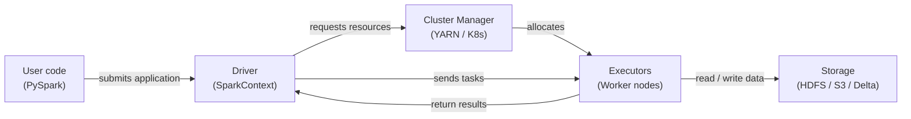

# Apache Spark

## Definition

Apache Spark ist eine Open-Source-Engine für verteiltes Computing, die für die großmaßstäbliche Datenverarbeitung ausgelegt ist. Sie wurde 2009 am AMPLab der UC Berkeley erstellt und der Apache Software Foundation gespendet, wo sie zum dominierenden Framework für Big-Data-Analytics wurde. Spark führt Berechnungen im Speicher über einen Cluster von Maschinen aus und übertrifft dabei disk-basierte Vorgänger wie Hadoop MapReduce für iterative Workloads erheblich — eine Eigenschaft, die es besonders gut für maschinelles Lernen geeignet macht.

Spark bietet eine einheitliche API für vier primäre Workloads: Batch-Verarbeitung, SQL-Analytics, Streaming (Structured Streaming) und maschinelles Lernen (MLlib). Diese Vereinheitlichung bedeutet, dass Teams einen einzigen Cluster und ein einziges Programmiermodell für die gesamte ML-Datenpipeline verwenden können — von der Rohdaten-Aufnahme und Feature Engineering im Petabyte-Maßstab bis hin zum verteilten Modelltraining mit MLlib. PySpark, die Python-API, ist die am weitesten verbreitete Schnittstelle in der Data-Science-Community.

Das Programmiermodell basiert auf Transformationen und Aktionen auf verteilten Sammlungen. Transformationen (map, filter, join, groupBy) sind lazy — sie erstellen einen Ausführungsplan, laufen aber erst, wenn eine Aktion (count, collect, write) aufgerufen wird. Sparks Optimizer (Catalyst) schreibt und optimiert diesen Plan vor der Ausführung und übertrifft oft handoptimiertes SQL. Das Ergebnis ist eine ausdrucksstarke, hochstufige API, die von einem Laptop (lokaler Modus) auf Tausende von Kernen skaliert, ohne Code-Änderungen.

## Funktionsweise

### RDDs und DataFrames

Resilient Distributed Datasets (RDDs) sind Sparks Low-Level-Abstraktion: unveränderliche, fehlertolerante, partitionierte Sammlungen von Datensätzen, die über einen Cluster verteilt sind. RDDs unterstützen beliebige Transformationen in Python, Scala oder Java, bieten aber keine Schema-Informationen, sodass der Optimizer nur begrenzten Einblick in die Daten hat. **DataFrames** (und ihr typisiertes Gegenstück, Datasets in Scala/Java) fügen ein benanntes Schema auf RDDs auf und stellen eine SQL-ähnliche API bereit. Der Catalyst-Optimizer kann Predicate-Pushdown, Column-Pruning und Join-Neuordnung auf DataFrame-Abfragen anwenden, was bei rohen RDDs nicht möglich ist. In der Praxis DataFrames verwenden, es sei denn, Funktionalität wird benötigt, die nur RDDs bereitstellen.

### Spark SQL

Spark SQL ermöglicht das Abfragen von DataFrames mit Standard-SQL-Syntax und das Mischen von SQL- und DataFrame-API-Aufrufen im selben Programm. Es verbindet sich mit Hive-Metastore, Delta Lake, Iceberg und anderen Tabellenformaten, wodurch Spark als Abfrage-Engine über einem Data Lakehouse fungieren kann. In ML-Pipelines wird Spark SQL für Feature-Aggregationsabfragen verwendet — rollende Fenster, Nutzer-Level-Aggregationen und Join-Operationen über große Tabellen — die auf einer einzelnen Maschine unerschwinglich langsam wären.

### MLlib

MLlib ist Sparks verteilte Machine-Learning-Bibliothek. Sie bietet Algorithmen für Klassifikation, Regression, Clustering, kollaboratives Filtern und Feature Engineering, die alle parallelisiert über den Cluster ausgeführt werden. Die Pipeline-API (`pyspark.ml`) spiegelt das Design von scikit-learn wider: `Transformer`-Schritte (Scaler, Encoder) und `Estimator`-Schritte (Modell-Fitting) werden in ein `Pipeline`-Objekt gekettet, das angepasst und serialisiert werden kann. MLlib ist am besten geeignet, wenn Trainingsdaten zu groß sind, um in den Speicher einer einzelnen Maschine zu passen, oder wenn verteilte Hyperparameter-Abstimmung via `CrossValidator` benötigt wird.

### Driver- und Executor-Architektur

Eine Spark-Anwendung hat einen **Driver**-Prozess und einen oder mehrere **Executor**-Prozesse. Der Driver führt das Benutzerprogramm aus, erstellt den logischen Plan, verhandelt Ressourcen mit dem Cluster-Manager (YARN, Kubernetes oder Spark Standalone) und teilt die Arbeit in **Tasks** auf. Executors sind JVM-Prozesse, die auf Worker-Knoten laufen; jeder Executor hält eine konfigurierbare Anzahl von CPU-Kernen und Speicher-Slots (Task-Slots). Tasks werden serialisiert und an Executors gesendet, die ihre zugewiesenen Datenpartitionen verarbeiten und Ergebnisse zurück in den Speicher, auf Disk oder in ein Output-Sink schreiben. Fehlertoleranz wird durch Neuberechnung verlorener Partitionen aus ihrer Herkunft (die Sequenz von Transformationen, die sie erzeugt haben) erreicht.



## Wann verwenden / Wann NICHT verwenden

| Verwenden wenn | Vermeiden wenn |
|----------|------------|
| Datensatz nicht in den RAM einer einzelnen Maschine passt (> ~50 GB) | Daten bequem in den Speicher passen — pandas oder Polars wird schneller sein |
| Feature Engineering Joins oder Aggregationen über Milliarden von Zeilen erfordert | Das Team keine Erfahrung mit verteilten Systemen und Cluster-Management hat |
| Verteiltes ML-Training (MLlib) oder Hyperparameter-Suche benötigt wird | Job-Startoverhead (JVM, Cluster-Zuteilung) für latenzempfindliche Tasks inakzeptabel ist |
| Bereits ein Spark-Cluster vorhanden ist (Databricks, EMR, Dataproc) | Echtzeit-Sub-Sekunden-Verarbeitung benötigt wird (Flink oder Kafka Streams verwenden) |
| Eine einheitliche Engine für Batch, SQL und Streaming auf denselben Daten gewünscht wird | Transformationen komplexe benutzerdefinierte Logik sind, die von Single-Thread-Debugging profitiert |

## Vergleiche

| Kriterium | Apache Spark | Pandas |
|-----------|-------------|--------|
| Datenskalierung | Petabytes — partitioniert über einen Cluster | Gigabytes — begrenzt durch RAM einer einzelnen Maschine |
| Ausführungsmodell | Verteilt, parallel, lazy Evaluation | In-Prozess, sofort, standardmäßig single-threaded |
| Setup-Komplexität | Hoch — Cluster, JVM, Dependency-Management | Niedrig — `pip install pandas` und ausführen |
| Leistung bei kleinen Daten | Langsam aufgrund von Serialisierungsoverhead und Task-Scheduling | Schnell — minimaler Overhead, cache-freundlich |
| API-Bekanntheit | PySpark ist ähnlich wie pandas, aber mit verteilter Semantik | Weit bekannt; der Standard für Data Science in Python |
| ML-Integration | MLlib für verteiltes Training; integriert sich mit XGBoost auf Spark | scikit-learn Ökosystem; erstklassig für Single-Machine-ML |

## Vor- und Nachteile

| Vorteile | Nachteile |
|------|------|
| Skaliert auf Petabytes ohne Code-Änderungen | Erhebliche Infrastruktur- und operative Komplexität |
| Einheitliche Engine für Batch, SQL und Streaming | JVM-Start und Task-Scheduling fügen Latenz hinzu — nicht geeignet für kleine Jobs |
| In-Memory-Verarbeitung dramatisch schneller als disk-basiertes MapReduce | Speicherverwaltung (Spills, GC-Druck) erfordert sorgfältiges Tuning |
| Reiches Ökosystem: Delta Lake, Iceberg, Hudi, MLflow-Integration | PySpark serialisiert Python-UDFs via Py4J — kann für benutzerdefinierte Logik langsam sein |
| Fehlertoleranz via Herkunftsneuberechnung | Das Debuggen verteilter Jobs ist schwieriger als Single-Machine-pandas-Code |

## Code-Beispiele

```python
"""
PySpark examples:
  1. DataFrame operations for feature engineering at scale
  2. MLlib Pipeline for training a logistic regression model

Requires: pyspark >= 3.4
Run locally with: spark-submit spark_ml_example.py
  or in a notebook with a SparkSession already available.
"""

from pyspark.sql import SparkSession
from pyspark.sql import functions as F
from pyspark.sql.types import DoubleType
from pyspark.ml import Pipeline
from pyspark.ml.feature import VectorAssembler, StandardScaler, StringIndexer
from pyspark.ml.classification import LogisticRegression
from pyspark.ml.evaluation import BinaryClassificationEvaluator


# --- 1. Create a SparkSession (local mode for demo) ---
spark = (
    SparkSession.builder
    .appName("MLPipelineExample")
    .master("local[*]")           # Use all local CPU cores
    .config("spark.sql.shuffle.partitions", "8")  # Reduce for small data
    .getOrCreate()
)

spark.sparkContext.setLogLevel("WARN")


# --- 2. Load raw data ---
# In production: spark.read.parquet("s3://bucket/path/") or .format("delta")
raw_df = spark.createDataFrame(
    [
        (1, 25.0, "engineer", 55000.0, 0),
        (2, 32.0, "manager", 85000.0, 1),
        (3, 28.0, "engineer", 62000.0, 0),
        (4, 45.0, "manager", 110000.0, 1),
        (5, 38.0, "analyst", 72000.0, 1),
        (6, 22.0, "analyst", 48000.0, 0),
        (7, 51.0, "manager", 125000.0, 1),
        (8, 29.0, "engineer", 59000.0, 0),
    ],
    schema=["id", "age", "role", "salary", "high_earner"],
)

print("=== Raw data ===")
raw_df.show()


# --- 3. DataFrame feature engineering ---
feature_df = (
    raw_df
    # Log-transform salary to reduce skew
    .withColumn("log_salary", F.log1p(F.col("salary")))
    # Normalized age within role group (window function)
    .withColumn(
        "age_norm",
        (F.col("age") - F.mean("age").over(
            __import__("pyspark.sql.window", fromlist=["Window"])
            .Window.partitionBy("role")
        )).cast(DoubleType())
    )
    # Drop the original salary column (replaced by log_salary)
    .drop("salary")
)

print("=== Engineered features ===")
feature_df.show()


# --- 4. MLlib Pipeline: encode → assemble → scale → train ---

# 4a. Encode categorical column 'role' to numeric index
role_indexer = StringIndexer(inputCol="role", outputCol="role_idx")

# 4b. Assemble feature columns into a single vector
assembler = VectorAssembler(
    inputCols=["age", "log_salary", "role_idx"],
    outputCol="raw_features",
)

# 4c. Standardize feature vector (zero mean, unit variance)
scaler = StandardScaler(
    inputCol="raw_features",
    outputCol="features",
    withMean=True,
    withStd=True,
)

# 4d. Logistic regression classifier
lr = LogisticRegression(
    featuresCol="features",
    labelCol="high_earner",
    maxIter=100,
    regParam=0.01,
)

# 4e. Build and fit the pipeline
pipeline = Pipeline(stages=[role_indexer, assembler, scaler, lr])

# Use the raw_df (with salary) because VectorAssembler picks log_salary after transform
train_df, test_df = raw_df.randomSplit([0.8, 0.2], seed=42)
model = pipeline.fit(train_df)

# --- 5. Evaluate ---
predictions = model.transform(test_df)
evaluator = BinaryClassificationEvaluator(labelCol="high_earner")
auc = evaluator.evaluate(predictions)
print(f"=== AUC on test set: {auc:.4f} ===")

predictions.select("id", "high_earner", "prediction", "probability").show()

# --- 6. Save model for serving ---
model.write().overwrite().save("/tmp/spark_lr_model")
print("Model saved to /tmp/spark_lr_model")

spark.stop()
```

## Praktische Ressourcen

- [Apache Spark-Dokumentation](https://spark.apache.org/docs/latest/) — Offizielle Referenz für alle APIs einschließlich PySpark, SQL, Streaming und MLlib
- [PySpark API-Referenz](https://spark.apache.org/docs/latest/api/python/) — Vollständige Python-API-Dokumentation für DataFrames, SQL und MLlib
- [Databricks — Spark-Tutorials](https://docs.databricks.com/en/getting-started/index.html) — Praxis-Notebooks zu Spark in großem Maßstab mit Delta Lake
- [Learning Spark, 2. Auflage (O'Reilly)](https://www.oreilly.com/library/view/learning-spark-2nd/9781492050032/) — Umfassendes Buch zu Spark 3.x, Structured Streaming und Delta Lake

## Siehe auch

- [Datenpipelines](/docs/mlops/data-engineering)
- [Apache Kafka](/docs/mlops/data-engineering/kafka)
- [Apache Airflow](/docs/mlops/data-engineering/airflow)
