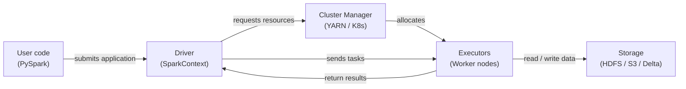

# Apache Spark

## Definition

Apache Spark ist eine Open-Source-Engine für verteiltes Computing, die für die groß angelegte Datenverarbeitung entwickelt wurde. Sie wurde 2009 am AMPLab der UC Berkeley erstellt und an die Apache Software Foundation gespendet, wo sie zum dominierenden Framework für Big-Data-Analysen wurde. Spark führt Berechnungen im Speicher über ein Cluster von Maschinen aus, was disk-basierte Vorgänger wie Hadoop MapReduce für iterative Workloads deutlich übertrifft — eine Eigenschaft, die es besonders gut für maschinelles Lernen geeignet macht.

Spark bietet eine einheitliche API über vier primäre Workloads: Batch-Verarbeitung, SQL-Analysen, Streaming (Structured Streaming) und maschinelles Lernen (MLlib). Diese Vereinheitlichung bedeutet, dass Teams ein einzelnes Cluster und ein einzelnes Programmiermodell für die gesamte ML-Datenpipeline verwenden können — von der Rohdaten-Ingestion und Feature-Engineering im Petabyte-Maßstab bis hin zum verteilten Modelltraining mit MLlib.

## Funktionsweise

### RDDs und DataFrames

Resilient Distributed Datasets (RDDs) sind Sparks Low-Level-Abstraktion: unveränderliche, fehlertolerante, partitionierte Datensatzsammlungen, die über ein Cluster verteilt sind. **DataFrames** fügen ein benanntes Schema auf RDDs hinzu und exponieren eine SQL-ähnliche API. Der Catalyst-Optimizer kann Predicate-Pushdown, Column-Pruning und Join-Reordering anwenden.

### Spark SQL

Spark SQL ermöglicht es, DataFrames mit standardmäßiger SQL-Syntax abzufragen und SQL- und DataFrame-API-Aufrufe im selben Programm zu mischen.

### MLlib

MLlib ist Sparks verteilte Machine-Learning-Bibliothek. Die Pipeline-API (`pyspark.ml`) spiegelt das Design von scikit-learn wider: `Transformer`-Schritte und `Estimator`-Schritte werden in ein `Pipeline`-Objekt gekettet.

### Treiber- und Executor-Architektur

Eine Spark-Anwendung hat einen **Treiber**-Prozess und einen oder mehrere **Executor**-Prozesse. Der Treiber führt das Programm des Benutzers aus, konstruiert den logischen Plan und teilt die Arbeit in **Tasks** auf.



## Wann verwenden / Wann NICHT verwenden

| Verwenden wenn | Vermeiden wenn |
|---|---|
| Datensatz passt nicht in den RAM einer einzelnen Maschine (> ~50 GB) | Daten passen komfortabel in den Speicher — pandas oder Polars sind schneller |
| Feature Engineering erfordert Joins oder Aggregationen über Milliarden von Zeilen | Ihrem Team fehlt Erfahrung mit verteilten Systemen |
| Sie verteiltes ML-Training (MLlib) oder Hyperparameter-Suche benötigen | Job-Startup-Overhead für latenzsensitive Aufgaben unakzeptabel ist |
| Sie bereits ein Spark-Cluster haben (Databricks, EMR, Dataproc) | Sie Echtzeit-Sub-Sekunden-Verarbeitung benötigen |

## Vergleiche

| Kriterium | Apache Spark | Pandas |
|---|---|---|
| Datenskalierung | Petabytes — partitioniert über ein Cluster | Gigabytes — begrenzt durch RAM einer Maschine |
| Ausführungsmodell | Verteilt, parallel, verzögerte Auswertung | In-Process, eager, standardmäßig single-threaded |
| Setup-Komplexität | Hoch | Niedrig |
| Leistung bei kleinen Daten | Langsam aufgrund Serialisierungs-Overhead | Schnell |
| API-Vertrautheit | PySpark ähnelt pandas, aber mit verteilter Semantik | Weit bekannt |

## Vor- und Nachteile

| Vorteile | Nachteile |
|---|---|
| Skaliert auf Petabytes ohne Code-Änderungen | Erhebliche Infrastruktur- und operative Komplexität |
| Einheitliche Engine für Batch, SQL und Streaming | JVM-Startup und Task-Scheduling fügen Latenz hinzu |
| In-Memory-Verarbeitung deutlich schneller als disk-basiertes MapReduce | Speicherverwaltung erfordert sorgfältige Abstimmung |
| Reiches Ökosystem: Delta Lake, Iceberg, Hudi, MLflow | PySpark serialisiert Python-UDFs über Py4J |

## Codebeispiel

```python
from pyspark.sql import SparkSession
from pyspark.sql import functions as F
from pyspark.ml import Pipeline
from pyspark.ml.feature import VectorAssembler, StandardScaler, StringIndexer
from pyspark.ml.classification import LogisticRegression
from pyspark.ml.evaluation import BinaryClassificationEvaluator

spark = (
    SparkSession.builder
    .appName("MLPipelineExample")
    .master("local[*]")
    .config("spark.sql.shuffle.partitions", "8")
    .getOrCreate()
)

raw_df = spark.createDataFrame(
    [(1, 25.0, "engineer", 55000.0, 0), (2, 32.0, "manager", 85000.0, 1),
     (3, 28.0, "engineer", 62000.0, 0), (4, 45.0, "manager", 110000.0, 1),
     (5, 38.0, "analyst", 72000.0, 1), (6, 22.0, "analyst", 48000.0, 0)],
    schema=["id", "age", "role", "salary", "high_earner"],
)

feature_df = raw_df.withColumn("log_salary", F.log1p(F.col("salary"))).drop("salary")

role_indexer = StringIndexer(inputCol="role", outputCol="role_idx")
assembler = VectorAssembler(inputCols=["age", "log_salary", "role_idx"], outputCol="raw_features")
scaler = StandardScaler(inputCol="raw_features", outputCol="features", withMean=True, withStd=True)
lr = LogisticRegression(featuresCol="features", labelCol="high_earner", maxIter=100, regParam=0.01)

pipeline = Pipeline(stages=[role_indexer, assembler, scaler, lr])
train_df, test_df = raw_df.randomSplit([0.8, 0.2], seed=42)
model = pipeline.fit(train_df)

predictions = model.transform(test_df)
evaluator = BinaryClassificationEvaluator(labelCol="high_earner")
auc = evaluator.evaluate(predictions)
print(f"=== AUC on test set: {auc:.4f} ===")

model.write().overwrite().save("/tmp/spark_lr_model")
spark.stop()
```

## Praktische Ressourcen

- [Apache Spark-Dokumentation](https://spark.apache.org/docs/latest/) — Offizielle Referenz für alle APIs.
- [PySpark API-Referenz](https://spark.apache.org/docs/latest/api/python/) — Vollständige Python-API-Dokumentation.
- [Databricks — Spark-Tutorials](https://docs.databricks.com/en/getting-started/index.html) — Praktische Notebooks mit Spark und Delta Lake.
- [Learning Spark, 2nd edition (O'Reilly)](https://www.oreilly.com/library/view/learning-spark-2nd/9781492050032/) — Umfassendes Buch zu Spark 3.x.

## Siehe auch

- [Datenpipelines](/docs/mlops/data-engineering)
- [Apache Kafka](/docs/mlops/data-engineering/kafka)
- [Apache Airflow](/docs/mlops/data-engineering/airflow)
