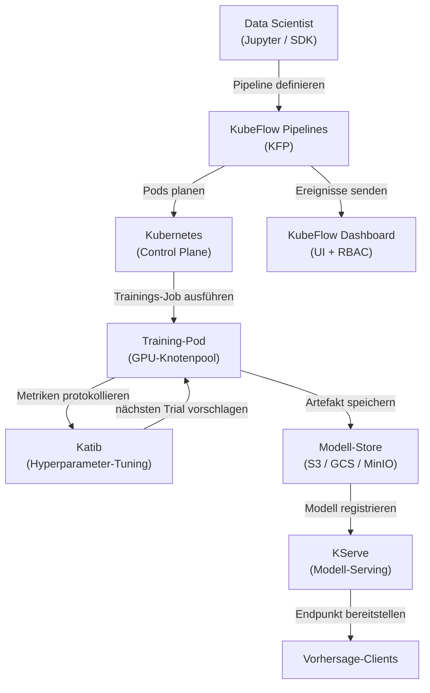

# KubeFlow

## Definition

KubeFlow ist ein quelloffenes ML-Toolkit, das das Deployment von ML-Workflows auf Kubernetes einfach, portabel und skalierbar machen soll. Es wurde ursprünglich von Google erstellt und ist jetzt ein Cloud Native Computing Foundation (CNCF)-Projekt mit breiter Branchenadoption. KubeFlow versucht nicht, eine einzige monolithische Plattform zu sein; stattdessen ist es eine kuratierte Sammlung von Kubernetes-nativen Komponenten, die jeweils ein bestimmtes ML-Infrastrukturproblem lösen.

Die Kernkomponenten sind: **KubeFlow Pipelines (KFP)** für die Definition und Ausführung von DAG-basierten ML-Workflows als Kubernetes-Jobs; **Katib** für automatisiertes Hyperparameter-Tuning und neuronale Architektursuche mittels Bayesianischer Optimierung, zufälliger Suche oder Reinforcement Learning; **KFServing (jetzt KServe)** für skalierbares Modell-Serving mit serverlosem Skalieren, Canary-Deployments und Unterstützung für mehrere Serving-Runtimes; und **Jupyter Notebook Server**, die vom KubeFlow-Dashboard für interaktive Entwicklung in einer Multi-Tenant-Umgebung verwaltet werden. Die gesamte Plattform wird über einen einzigen Satz von Kubernetes-Manifesten installiert und über eine Web-UI verwaltet.

KubeFlows Stärke liegt darin, dass es auf jedem Kubernetes-Cluster läuft — On-Premises, GKE, EKS, AKS oder einem lokalen kind-Cluster — was es für Organisationen geeignet macht, die verlangen, dass Daten innerhalb ihrer eigenen Infrastruktur verbleiben. Sein Hauptnachteil ist die Betriebskomplexität: Die Lernkurve ist steil, und der Betrieb von KubeFlow in der Produktion erfordert solide Kubernetes-Kenntnisse.

## Funktionsweise



### KubeFlow Pipelines (KFP)

KFP ermöglicht es Data Scientists, ML-Pipelines als Python-Code mit dem KFP SDK zu definieren. Jeder Pipeline-Schritt ist eine containerisierte Komponente: Eine mit `@dsl.component` dekorierte Python-Funktion wird in eine Container-Spezifikation kompiliert, die KFP als Kubernetes-Pod ausführt. Der Pipeline-DAG wird in eine Intermediate-Representation-Datei (IR YAML) kompiliert, die der Backend-Controller von KFP im Cluster plant. Dieser Ansatz bedeutet, dass jeder Schritt vollständig reproduzierbar ist: Das Container-Image ist festgelegt, Ein- und Ausgaben sind Artefakte, die im Metadaten-Store von KFP (ML Metadata / MLMD) verfolgt werden, und der gesamte Ausführungsgraph ist in der UI mit Logs, Eingaben, Ausgaben und Status pro Schritt sichtbar.

### Katib — Hyperparameter-Tuning

Katib ist KubeFlows AutoML-Komponente. Sie definiert eine `Experiment`-Kubernetes-Custom-Resource, die den Suchraum (Parameterbereiche und -typen), die Zielmetrik (Verlust minimieren, Genauigkeit maximieren) und den Suchalgorithmus (Bayesianische Optimierung via Gaussian Process, CMA-ES, zufällige Suche oder Grid Search) festlegt. Katib führt parallele Trials durch — jeder Trial ist ein vollständiger Trainings-Job — und verwendet die Ergebnisse, um bessere Konfigurationen für nachfolgende Trials vorzuschlagen. Die Integration mit KFP bedeutet, dass eine vollständige Pipeline (Daten → Feature Engineering → Training → Evaluierung) als ein einziger Katib-Trial behandelt werden kann, was End-to-End-AutoML über komplexe Pipelines hinweg ermöglicht.

### KServe (früher KFServing)

KServe erweitert Kubernetes um `InferenceService`-Custom-Resources, die Modell-Serving-Deployments deklarativ definieren. Man gibt das Framework (sklearn, xgboost, pytorch, tensorflow, custom) und den Modell-URI (S3-Pfad, PVC) an, und KServe übernimmt: Modell herunterladen, die richtige Serving-Runtime auswählen, den Sidecar-Proxy konfigurieren, den Endpunkt über Istio bereitstellen und Repliken auf null skalieren, wenn sie inaktiv sind (serverlosen Modus). Canary-Deployments teilen den Traffic prozentual zwischen zwei Modellversionen auf und ermöglichen sichere Rollouts. Die Transformer- und Explainer-Komponenten ermöglichen das Einstecken von Vorverarbeitungslogik und SHAP-basierter Erklärbarkeit neben dem Predictor.

### Multi-Tenancy und RBAC

Das KubeFlow-Dashboard implementiert Multi-Tenancy über Kubernetes-Namespaces: Jeder Benutzer oder jedes Team erhält einen isolierten Namespace mit eigenen Ressourcenkontingenten, Notebook-Servern und Pipeline-Läufen. Role-Based Access Control (RBAC) schränkt ein, welche Benutzer Pipelines und Modelle anzeigen, ausführen oder verwalten können. Dies macht KubeFlow für große Organisationen geeignet, in denen mehrere Teams einen einzigen GPU-Cluster teilen und Isolation ohne separate Cluster benötigen.

## Einsatzbereiche / Nicht geeignet für

| Geeignet wenn | Nicht geeignet wenn |
|---|---|
| ML-Workloads auf einem bestehenden Kubernetes-Cluster ausgeführt werden | Ihr Team keine Kubernetes-Kenntnisse und keinen dedizierten Platform-Engineer hat |
| Vollständige Pipeline-Orchestrierung, AutoML und Serving in einer Plattform benötigt wird | Ein verwalteter Dienst (SageMaker, Vertex AI) zur Cloud-Provider-Strategie passt |
| Datenresidenzanforderungen die Nutzung verwalteter Cloud-ML-Dienste verhindern | Nur Modell-Serving benötigt wird, keine vollständige Pipeline-Orchestrierung |
| Die Organisation einen gemeinsamen GPU-Cluster mit Multi-Tenancy-Bedarf betreibt | ML-Workflows einfach genug für ein einzelnes Trainingsskript sind |
| Erweiterte Serving-Funktionen (serverloses Skalieren, Canary, Transformer) erforderlich sind | Schnelle Produktionseinführung wichtiger als Infrastrukturkontrolle ist |

## Vergleiche

| Kriterium | KubeFlow | ML auf Kubernetes (vanilla) |
|---|---|---|
| Komplexität | Hoch — viele CRDs, Controller und Istio-Abhängigkeiten | Mittel — nur Standard-Kubernetes-Objekte |
| Funktionen | Pipelines, AutoML (Katib), Serving (KServe), Notebook-Verwaltung | Was auch immer manuell gebaut und konfiguriert wird |
| Lernkurve | Steil — erfordert Kubernetes + KubeFlow-Domänenwissen | Mittel — Standard-K8s-Kenntnisse ausreichend |
| Flexibilität | Moderat — erweiterbar, aber an KubeFlow-Abstraktionen gebunden | Hoch — volle Kontrolle über jede Kubernetes-Ressource |
| Verwaltete Optionen | Kubeflow auf GKE (Vertex AI Pipelines), AWS Managed KubeFlow | Jedes verwaltete Kubernetes (EKS, GKE, AKS) |
| Einrichtungszeit | Tage bis Wochen für eine produktionsreife Installation | Stunden bis Tage je nach Workload-Komplexität |

## Vor- und Nachteile

| Vorteile | Nachteile |
|---|---|
| Einheitliche ML-Plattform — Pipelines, Tuning, Serving in einem System | Sehr hohe Betriebskomplexität und viele bewegliche Teile |
| Cloud-agnostisch — läuft auf jedem Kubernetes-Cluster | Steile Lernkurve; erfordert Kubernetes-Kenntnisse für den Betrieb |
| Serverloses Modell-Serving mit automatischem Scale-to-Zero | Ressourcenintensive Installation (Istio, Argo Workflows, MLMD, Knative) |
| Starke Multi-Tenancy mit Namespace-Isolation und RBAC | Upgrades zwischen KubeFlow-Versionen können aufwändig sein |
| Aktive CNCF-Community und breite Ökosystem-Integrationen | Das Debuggen von Fehlern erfordert oft das Verständnis mehrerer Schichten (K8s → Argo → Python SDK) |

## Codebeispiele

```python
# kubeflow_pipeline.py
# KubeFlow Pipelines v2 SDK — definiert eine zweistufige ML-Pipeline:
#   1. Datenvorverarbeitungskomponente
#   2. Trainingskomponente
# Erfordert: pip install kfp==2.*

from kfp import dsl
from kfp.client import Client


# --- Komponente 1: Rohe CSV-Daten vorverarbeiten ---

@dsl.component(
    base_image="python:3.11-slim",
    packages_to_install=["pandas==2.2.0", "scikit-learn==1.4.0"],
)
def preprocess(
    raw_data_path: str,
    output_features: dsl.Output[dsl.Dataset],
) -> None:
    """
    Liest rohe CSV, wendet Feature Engineering an und schreibt Features als Parquet.
    KFP verfolgt output_features als Dataset-Artefakt mit URI und Metadaten.
    """
    import pandas as pd
    from sklearn.preprocessing import StandardScaler

    df = pd.read_csv(raw_data_path)

    # Einfaches Feature Engineering: numerische Spalten skalieren
    scaler = StandardScaler()
    numeric_cols = df.select_dtypes("number").columns.tolist()
    df[numeric_cols] = scaler.fit_transform(df[numeric_cols])

    # KFP stellt output_features.path bereit — Artefakt dorthin schreiben
    df.to_parquet(output_features.path, index=False)
    print(f"Wrote {len(df)} rows to {output_features.path}")


# --- Komponente 2: Modell auf vorverarbeiteten Features trainieren ---

@dsl.component(
    base_image="python:3.11-slim",
    packages_to_install=["pandas==2.2.0", "scikit-learn==1.4.0", "joblib==1.3.0"],
)
def train(
    features: dsl.Input[dsl.Dataset],
    n_estimators: int,
    model_output: dsl.Output[dsl.Model],
    metrics_output: dsl.Output[dsl.Metrics],
) -> None:
    """
    Trainiert einen RandomForestClassifier und schreibt das Modell-Artefakt + Metriken.
    """
    import json
    import joblib
    import pandas as pd
    from sklearn.ensemble import RandomForestClassifier
    from sklearn.model_selection import train_test_split
    from sklearn.metrics import accuracy_score

    df = pd.read_parquet(features.path)
    X = df.drop(columns=["label"]).values
    y = df["label"].values
    X_train, X_test, y_train, y_test = train_test_split(X, y, test_size=0.2, random_state=42)

    clf = RandomForestClassifier(n_estimators=n_estimators, random_state=42)
    clf.fit(X_train, y_train)

    accuracy = float(accuracy_score(y_test, clf.predict(X_test)))

    # Modell-Artefakt schreiben (KFP verfolgt URI und Herkunft)
    joblib.dump(clf, model_output.path)

    # Metriken protokollieren — in der KubeFlow Pipelines UI sichtbar
    metrics_output.log_metric("accuracy", accuracy)
    metrics_output.log_metric("n_estimators", n_estimators)
    print(f"Accuracy: {accuracy:.4f}")


# --- Pipeline-Definition ---

@dsl.pipeline(
    name="fraud-detection-pipeline",
    description="Zweistufige Pipeline: CSV-Daten vorverarbeiten, dann RandomForest trainieren.",
)
def fraud_pipeline(
    raw_data_path: str = "gs://my-bucket/data/train.csv",
    n_estimators: int = 100,
) -> None:
    # Schritt 1: Vorverarbeitung — läuft in eigenem Pod
    preprocess_task = preprocess(raw_data_path=raw_data_path)

    # Schritt 2: Training — hängt vom Dataset-Artefakt aus Schritt 1 ab
    train_task = train(
        features=preprocess_task.outputs["output_features"],
        n_estimators=n_estimators,
    )
    # Dieser Task dem Knotenpool mit GPU zuweisen (optionale Ressourcenanforderung)
    train_task.set_accelerator_type("NVIDIA_TESLA_T4").set_accelerator_limit(1)


# --- Pipeline an eine laufende KubeFlow Pipelines-Instanz senden ---

if __name__ == "__main__":
    # Mit KFP-Backend verbinden (Port-Forward: kubectl port-forward -n kubeflow svc/ml-pipeline 8888:8888)
    client = Client(host="http://localhost:8888")

    run = client.create_run_from_pipeline_func(
        pipeline_func=fraud_pipeline,
        arguments={
            "raw_data_path": "gs://my-bucket/data/train.csv",
            "n_estimators": 200,
        },
        run_name="fraud-pipeline-run-v1",
        experiment_name="fraud-detection",
    )
    print(f"Pipeline run created: {run.run_id}")
    print(f"View at: http://localhost:8888/#/runs/details/{run.run_id}")
```

## Praktische Ressourcen

- [Offizielle KubeFlow-Dokumentation](https://www.kubeflow.org/docs/) — Architekturübersicht, Komponentenanleitungen und Installationsanweisungen.
- [KubeFlow Pipelines SDK-Referenz](https://kubeflow-pipelines.readthedocs.io/) — Vollständige API-Referenz für das KFP v2 Python SDK.
- [KServe-Dokumentation](https://kserve.github.io/website/) — Serving-Runtime, InferenceService-Spezifikation und Canary-Rollout-Anleitung.
- [Katib-Anleitung für Hyperparameter-Tuning](https://www.kubeflow.org/docs/components/katib/overview/) — Experiment-Spezifikation, Suchalgorithmen und Integration mit Training Operators.

## Siehe auch

- [ML auf Kubernetes](/docs/mlops/deployment/ml-kubernetes)
- [Modell-Serving](/docs/mlops/deployment/model-serving)
- [Überwachung](/docs/mlops/monitoring)
