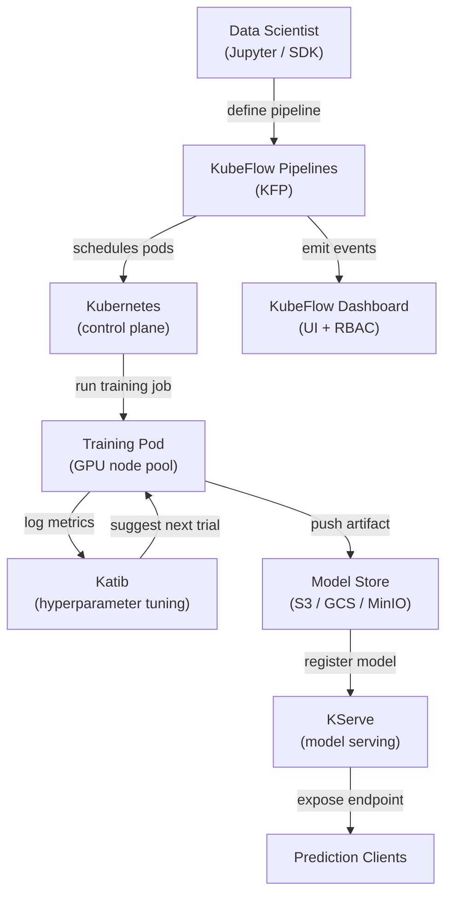

# KubeFlow

## Definition

KubeFlow ist ein Open-Source-ML-Toolkit, das darauf ausgelegt ist, das Deployment von ML-Workflows auf Kubernetes einfach, portabel und skalierbar zu machen. Es wurde ursprünglich von Google entwickelt und ist heute ein Cloud Native Computing Foundation (CNCF)-Projekt mit breiter Branchenadoption. KubeFlow versucht nicht, eine monolithische Plattform zu sein; stattdessen ist es eine kuratierte Sammlung Kubernetes-nativer Komponenten, die jeweils ein spezifisches ML-Infrastrukturproblem lösen.

Die Kernkomponenten sind: **KubeFlow Pipelines (KFP)** zur Definition und Ausführung DAG-basierter ML-Workflows als Kubernetes-Jobs; **Katib** für automatisiertes Hyperparameter-Tuning und Neuronale Architektursuche mit Bayesianischer Optimierung, Random Search oder Reinforcement Learning; **KFServing (jetzt KServe)** für skalierbares Modell-Serving mit serverlosem Skalieren, Canary-Deployments und Unterstützung mehrerer Serving-Runtimes; und **Jupyter Notebook Server**, die über das KubeFlow-Dashboard für interaktive Entwicklung in einer Multi-Tenant-Umgebung verwaltet werden. Die gesamte Plattform wird über einen einzigen Satz Kubernetes-Manifeste installiert und über eine Web-UI verwaltet.

KubeFlows Stärke liegt darin, dass es auf jedem Kubernetes-Cluster läuft — On-Premises, GKE, EKS, AKS oder einem lokalen kind-Cluster —, was es für Organisationen geeignet macht, die verlangen, dass Daten in ihrer eigenen Infrastruktur verbleiben. Seine Hauptkosten sind operationelle Komplexität: Die Lernkurve ist steil, und der Betrieb von KubeFlow in der Produktion erfordert solide Kubernetes-Expertise.

## Funktionsweise



### KubeFlow Pipelines (KFP)

KFP ermöglicht es Data Scientists, ML-Pipelines als Python-Code mit dem KFP-SDK zu definieren. Jeder Pipeline-Schritt ist eine containerisierte Komponente: Eine mit `@dsl.component` dekorierte Python-Funktion wird in eine Container-Spezifikation kompiliert, die KFP als Kubernetes-Pod ausführt. Der Pipeline-DAG wird in eine Intermediate Representation (IR YAML)-Datei kompiliert, die der Backend-Controller von KFP auf dem Cluster einplant. Dieser Ansatz stellt sicher, dass jeder Schritt vollständig reproduzierbar ist: Das Container-Image ist festgelegt, Eingaben und Ausgaben sind Artefakte, die im Metadaten-Store von KFP (ML Metadata / MLMD) verfolgt werden, und der gesamte Ausführungsgraph ist in der UI mit Logs, Eingaben, Ausgaben und Status pro Schritt sichtbar.

### Katib — Hyperparameter-Tuning

Katib ist KubeFlows AutoML-Komponente. Es definiert eine `Experiment`-Kubernetes-Custom-Resource, die den Suchraum (Parameterbereiche und -typen), die Zielmetrik (Verlust minimieren, Genauigkeit maximieren) und den Suchalgorithmus (Bayesianische Optimierung via Gaussian Process, CMA-ES, Random Search oder Grid Search) festlegt. Katib führt parallele Trials aus — jeder Trial ist ein vollständiger Trainingsjob — und nutzt die Ergebnisse, um bessere Konfigurationen für nachfolgende Trials vorzuschlagen. Die Integration mit KFP bedeutet, dass eine vollständige Pipeline (Daten → Feature Engineering → Training → Auswertung) als einzelner Katib-Trial behandelt werden kann, was End-to-End-AutoML über komplexe Pipelines ermöglicht.

### KServe (früher KFServing)

KServe erweitert Kubernetes um `InferenceService`-Custom-Resources, die Modell-Serving-Deployments deklarativ definieren. Man gibt das Framework (sklearn, xgboost, pytorch, tensorflow, custom) und den Modell-URI (S3-Pfad, PVC) an, und KServe übernimmt: Modell herunterladen, die richtige Serving-Runtime auswählen, den Sidecar-Proxy konfigurieren, den Endpunkt über Istio bereitstellen und Replikas auf null skalieren, wenn sie inaktiv sind (serverloser Modus). Canary-Deployments teilen Traffic prozentual zwischen zwei Modellversionen auf und ermöglichen sichere Rollouts. Die Transformer- und Explainer-Komponenten erlauben das Einbinden von Vorverarbeitungslogik und SHAP-basierter Erklärbarkeit neben dem Predictor.

### Multi-Tenancy und RBAC

Das KubeFlow-Dashboard implementiert Multi-Tenancy über Kubernetes-Namespaces: Jeder Benutzer oder jedes Team erhält einen isolierten Namespace mit eigenen Ressourcen-Quotas, Notebook-Servern und Pipeline-Ausführungen. Role-Based Access Control (RBAC) schränkt ein, welche Benutzer Pipelines und Modelle anzeigen, ausführen oder verwalten können. Dies macht KubeFlow geeignet für große Organisationen, in denen mehrere Teams einen einzigen GPU-Cluster teilen und Isolation ohne separate Cluster benötigen.

## Wann verwenden / Wann NICHT verwenden

| Verwenden wenn | Vermeiden wenn |
|---|---|
| ML-Workloads auf einem bestehenden Kubernetes-Cluster ausgeführt werden | Das Team keine Kubernetes-Expertise und keinen dedizierten Platform-Engineer hat |
| Vollständige Pipeline-Orchestrierung, AutoML und Serving in einer Plattform benötigt werden | Ein verwalteter Dienst (SageMaker, Vertex AI) zur Cloud-Provider-Strategie passt |
| Datenspeicheranforderungen die Nutzung verwalteter Cloud-ML-Dienste verhindern | Nur Modell-Serving benötigt wird, keine vollständige Pipeline-Orchestrierung |
| Die Organisation einen gemeinsamen GPU-Cluster mit Multi-Tenancy-Anforderungen betreibt | ML-Workflows einfach genug für ein einzelnes Trainingsskript sind |
| Erweiterte Serving-Features (serverlose Skalierung, Canary, Transformer) erforderlich sind | Schnelle Time-to-Production wichtiger ist als Infrastrukturkontrolle |

## Vergleiche

| Kriterium | KubeFlow | ML auf Kubernetes (Vanilla) |
|---|---|---|
| Komplexität | Hoch — viele CRDs, Controller und Istio-Abhängigkeiten | Mittel — nur Standard-Kubernetes-Objekte |
| Features | Pipelines, AutoML (Katib), Serving (KServe), Notebook-Verwaltung | Was manuell gebaut und konfiguriert wird |
| Lernkurve | Steil — erfordert Kubernetes- + KubeFlow-Domänenwissen | Mittel — Standard-K8s-Kenntnisse ausreichend |
| Flexibilität | Moderat — erweiterbar, aber an KubeFlow-Abstraktionen gebunden | Hoch — volle Kontrolle über jede Kubernetes-Ressource |
| Verwaltete Optionen | KubeFlow auf GKE (Vertex AI Pipelines), AWS Managed KubeFlow | Beliebiges verwaltetes Kubernetes (EKS, GKE, AKS) |
| Setup-Zeit | Tage bis Wochen für eine produktionsreife Installation | Stunden bis Tage je nach Workload-Komplexität |

## Vor- und Nachteile

| Vorteile | Nachteile |
|---|---|
| Einheitliche ML-Plattform — Pipelines, Tuning, Serving in einem System | Sehr hohe operationelle Komplexität und viele bewegliche Teile |
| Cloud-agnostisch — läuft auf jedem Kubernetes-Cluster | Steile Lernkurve; erfordert Kubernetes-Expertise für den Betrieb |
| Serverloses Modell-Serving mit automatischer Scale-to-Zero | Ressourcenintensive Installation (Istio, Argo Workflows, MLMD, Knative) |
| Starke Multi-Tenancy mit Namespace-Isolation und RBAC | Upgrades zwischen KubeFlow-Versionen können aufwendig sein |
| Aktive CNCF-Community und breite Ökosystem-Integrationen | Debugging-Fehler erfordert oft das Verständnis mehrerer Schichten (K8s → Argo → Python-SDK) |

## Code-Beispiele

```python
# kubeflow_pipeline.py
# KubeFlow Pipelines v2 SDK — defines a two-step ML pipeline:
#   1. Data preprocessing component
#   2. Training component
# Requires: pip install kfp==2.*

from kfp import dsl
from kfp.client import Client


# --- Component 1: Preprocess raw CSV data ---

@dsl.component(
    base_image="python:3.11-slim",
    packages_to_install=["pandas==2.2.0", "scikit-learn==1.4.0"],
)
def preprocess(
    raw_data_path: str,
    output_features: dsl.Output[dsl.Dataset],
) -> None:
    """
    Reads raw CSV, applies feature engineering, and writes features as Parquet.
    KFP tracks output_features as a Dataset artifact with URI and metadata.
    """
    import pandas as pd
    from sklearn.preprocessing import StandardScaler

    df = pd.read_csv(raw_data_path)

    # Simple feature engineering: scale numeric columns
    scaler = StandardScaler()
    numeric_cols = df.select_dtypes("number").columns.tolist()
    df[numeric_cols] = scaler.fit_transform(df[numeric_cols])

    # KFP provides output_features.path — write artifact there
    df.to_parquet(output_features.path, index=False)
    print(f"Wrote {len(df)} rows to {output_features.path}")


# --- Component 2: Train a model on the preprocessed features ---

@dsl.component(
    base_image="python:3.11-slim",
    packages_to_install=["pandas==2.2.0", "scikit-learn==1.4.0", "joblib==1.3.0"],
)
def train(
    features: dsl.Input[dsl.Dataset],
    n_estimators: int,
    model_output: dsl.Output[dsl.Model],
    metrics_output: dsl.Output[dsl.Metrics],
) -> None:
    """
    Trains a RandomForestClassifier and writes the model artifact + metrics.
    """
    import json
    import joblib
    import pandas as pd
    from sklearn.ensemble import RandomForestClassifier
    from sklearn.model_selection import train_test_split
    from sklearn.metrics import accuracy_score

    df = pd.read_parquet(features.path)
    X = df.drop(columns=["label"]).values
    y = df["label"].values
    X_train, X_test, y_train, y_test = train_test_split(X, y, test_size=0.2, random_state=42)

    clf = RandomForestClassifier(n_estimators=n_estimators, random_state=42)
    clf.fit(X_train, y_train)

    accuracy = float(accuracy_score(y_test, clf.predict(X_test)))

    # Write model artifact (KFP tracks the URI and lineage)
    joblib.dump(clf, model_output.path)

    # Log metrics — visible in the KubeFlow Pipelines UI
    metrics_output.log_metric("accuracy", accuracy)
    metrics_output.log_metric("n_estimators", n_estimators)
    print(f"Accuracy: {accuracy:.4f}")


# --- Pipeline definition ---

@dsl.pipeline(
    name="fraud-detection-pipeline",
    description="Two-stage pipeline: preprocess CSV data, then train RandomForest.",
)
def fraud_pipeline(
    raw_data_path: str = "gs://my-bucket/data/train.csv",
    n_estimators: int = 100,
) -> None:
    # Step 1: preprocess — runs in its own pod
    preprocess_task = preprocess(raw_data_path=raw_data_path)

    # Step 2: train — depends on the Dataset artifact from step 1
    train_task = train(
        features=preprocess_task.outputs["output_features"],
        n_estimators=n_estimators,
    )
    # Assign this task to a node pool with GPU (optional resource request)
    train_task.set_accelerator_type("NVIDIA_TESLA_T4").set_accelerator_limit(1)


# --- Submit the pipeline to a running KubeFlow Pipelines instance ---

if __name__ == "__main__":
    # Connect to KFP backend (port-forward: kubectl port-forward -n kubeflow svc/ml-pipeline 8888:8888)
    client = Client(host="http://localhost:8888")

    run = client.create_run_from_pipeline_func(
        pipeline_func=fraud_pipeline,
        arguments={
            "raw_data_path": "gs://my-bucket/data/train.csv",
            "n_estimators": 200,
        },
        run_name="fraud-pipeline-run-v1",
        experiment_name="fraud-detection",
    )
    print(f"Pipeline run created: {run.run_id}")
    print(f"View at: http://localhost:8888/#/runs/details/{run.run_id}")
```

## Praktische Ressourcen

- [Offizielle KubeFlow-Dokumentation](https://www.kubeflow.org/docs/) — Architekturübersicht, Komponentenleitfäden und Installationsanweisungen.
- [KubeFlow Pipelines SDK-Referenz](https://kubeflow-pipelines.readthedocs.io/) — Vollständige API-Referenz für das KFP-v2-Python-SDK.
- [KServe-Dokumentation](https://kserve.github.io/website/) — Serving-Runtime, InferenceService-Spezifikation und Canary-Rollout-Leitfaden.
- [Katib-Leitfaden für Hyperparameter-Tuning](https://www.kubeflow.org/docs/components/katib/overview/) — Experiment-Spezifikation, Suchalgorithmen und Integration mit Training-Operators.

## Siehe auch

- [ML auf Kubernetes](/docs/mlops/deployment/ml-kubernetes)
- [Model-Serving](/docs/mlops/deployment/model-serving)
- [Monitoring](/docs/mlops/monitoring)
