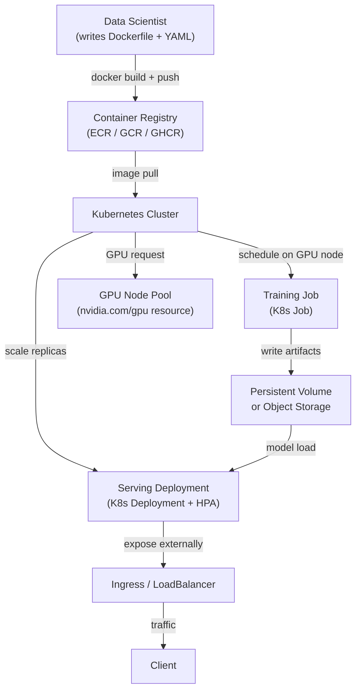

# ML auf Kubernetes

## Definition

Kubernetes (K8s) ist eine Container-Orchestrierungsplattform, die das Deployment, die Skalierung und das Management containerisierter Workloads automatisiert. Obwohl Kubernetes ursprünglich für zustandslose Webdienste konzipiert wurde, hat die ML-Community es als Infrastruktur-Backbone für Trainingsjobs, Batch-Scoring und Model-Serving weitgehend übernommen — denn es löst die schwierigsten ML-Infrastrukturprobleme: Ressourcenisolierung, reproduzierbare Umgebungen, GPU-Scheduling und horizontale Skalierung.

ML auf Vanilla-Kubernetes zu betreiben — ohne eine Abstraktion wie [KubeFlow](/docs/mlops/deployment/kubeflow) — bedeutet, Standard-Kubernetes-Primitive zu kombinieren: `Job` für einmalige Trainingsläufe, `CronJob` für geplantes Nachtraining, `Deployment` für dauerhaft laufende Serving-Instanzen und `HorizontalPodAutoscaler` für automatische Skalierung. Dieser Ansatz gibt Teams vollständige Kontrolle über jeden Aspekt ihrer Workloads, auf Kosten von mehr YAML-Authoring und weniger ML-spezifischem Tooling.

Der wesentliche Unterschied zu ML auf Bare-Metal-VMs besteht darin, dass Kubernetes deklaratives Ressourcenmanagement bietet: Man gibt an, wie viel CPU, RAM und GPU ein Trainingsjob benötigt, und der Scheduler platziert ihn automatisch auf einem geeigneten Knoten. Kubernetes behandelt außerdem Knotenausfälle, Pod-Neustarts und Rolling-Deployments ohne manuelles Eingreifen. Für ML-Teams, die bereits einen Kubernetes-Cluster betreiben (oder deren Organisation einen betreibt), ist dies oft der pragmatische Weg zur Produktion, bevor in eine vollständige Plattform wie KubeFlow investiert wird.

## Funktionsweise



### ML-Modelle containerisieren

Der erste Schritt beim Ausführen von ML auf Kubernetes besteht darin, den Modell-Code und seine Abhängigkeiten in ein Docker-Image zu verpacken. Ein gut strukturiertes ML-Dockerfile nutzt Multi-Stage-Builds, um die Abhängigkeitsinstallationsschicht (die sich selten ändert und cachebar ist) von der Anwendungs-Code-Schicht (die sich häufig ändert) zu trennen. Das Basis-Image sollte auf eine bestimmte Version festgelegt sein — für GPU-Workloads stellt NVIDIA `nvcr.io/nvidia/pytorch`- und `nvcr.io/nvidia/tensorflow`-Basis-Images bereit, die CUDA, cuDNN und NCCL vorinstalliert und gemeinsam validiert enthalten. Das fertige Image wird in eine Container-Registry gepusht und in Kubernetes-Manifesten per Name und Digest (nicht per `latest`) referenziert, sodass jedes Mal exakt dieselbe Umgebung verwendet wird.

### GPU-Scheduling und Ressourcenverwaltung

Kubernetes unterstützt GPU-Scheduling über das NVIDIA-Device-Plugin, das GPUs als planbare Ressource (`nvidia.com/gpu`) bereitstellt. Ein Pod, der `nvidia.com/gpu: 1` anfordert, wird nur auf einem Knoten eingeplant, der eine freie GPU besitzt, und die GPU wird diesem Pod für seine gesamte Lebensdauer exklusiv zugewiesen. Knoten-Pools werden typischerweise mit verschiedenen GPU-Typen konfiguriert (T4 für Inferenz, A100 für große Trainingsjobs) und entsprechend beschriftet, sodass Pods über `nodeSelector` oder `nodeAffinity` die passende Hardware auswählen können. Ressourcen-Quotas auf Namespace-Ebene verhindern, dass ein einzelnes Team die gesamte GPU-Kapazität des Clusters monopolisiert.

### Trainingsjobs

Einmalige Trainingsläufe werden als Kubernetes-`Job`-Objekte ausgedrückt. Ein Job erstellt einen oder mehrere Pods, wartet auf deren erfolgreichen Abschluss (Exit-Code 0) und zeichnet das Ergebnis auf. Für verteiltes Training über mehrere GPUs oder Knoten erweitert der `training-operator` (früher der Kubeflow Training Operator, aber auch eigenständig deploybar) Kubernetes um `PyTorchJob`- und `TFJob`-Custom-Resources, die Multi-Node-, Multi-GPU-Training mit PyTorch DDP oder Horovod koordinieren. Jeder Worker-Pod erhält dasselbe Container-Image, aber unterschiedliche Rang- und World-Size-Umgebungsvariablen, was daten-paralleles Training mit automatischem Rendezvous ermöglicht.

### Serving-Deployments und Autoskalierung

Model-Serving wird als Kubernetes-`Deployment` mit einer gewünschten Replikat-Anzahl und Ressourcenanforderungen/-limits ausgedrückt. Ein `Service` vom Typ `ClusterIP` routet Traffic zwischen den Replikas, und ein `Ingress`- oder `LoadBalancer`-Service macht den Endpunkt nach außen verfügbar. Der `HorizontalPodAutoscaler` (HPA) skaliert die Replikat-Anzahl basierend auf CPU-Auslastung, benutzerdefinierten Metriken (z. B. Anfragen pro Sekunde von Prometheus) oder externen Metriken (z. B. SQS-Warteschlangentiefe für Batch-Worker). Für latenzempfindliches Serving stellen `PodDisruptionBudgets` sicher, dass Rolling-Updates nie mehr als einen konfigurierbaren Anteil der Replikas gleichzeitig außer Betrieb nehmen.

## Wann verwenden / Wann NICHT verwenden

| Verwenden wenn | Vermeiden wenn |
|---|---|
| Die Organisation bereits einen Kubernetes-Cluster betreibt | Das Team keine Kubernetes-Erfahrung hat und kein Platform-Team zur Unterstützung vorhanden ist |
| Vollständige Kontrolle über die Infrastruktur erforderlich ist (On-Premises, air-gapped) | Ein verwalteter ML-Dienst (SageMaker, Vertex AI) verfügbar ist und den Anwendungsfall abdeckt |
| ML-Workloads einen Cluster mit anderen Engineering-Workloads teilen müssen | Die Einfachheit einer VM oder eines Cloud-Trainingsjobs ausreicht |
| GPU-Scheduling ohne den Overhead einer vollständigen ML-Plattform benötigt wird | Setup- und Wartungskosten von K8s die operativen Vorteile überwiegen |
| Portabilität über Cloud-Anbieter hinweg eine harte Anforderung ist | AutoML, Experiment-Tracking oder Multi-Tenancy benötigt wird (KubeFlow in Betracht ziehen) |

## Vergleiche

| Kriterium | ML auf Kubernetes (Vanilla) | KubeFlow |
|---|---|---|
| Komplexität | Mittel — Standard-K8s-Objekte | Hoch — viele CRDs, Istio, Argo, MLMD |
| Features | Manuell — was gebaut werden muss | Integriert: Pipelines, AutoML (Katib), Serving (KServe), Notebooks |
| Lernkurve | Mittel — K8s-Kenntnisse ausreichend | Steil — erfordert KubeFlow-spezifisches Wissen zusätzlich zu K8s |
| Flexibilität | Hoch — uneingeschränkte Nutzung von K8s-Primitiven | Moderat — an KubeFlow-Abstraktionen gebunden |
| Verwaltete Optionen | EKS, GKE, AKS (beliebiges verwaltetes K8s) | Vertex AI Pipelines (GKE-basiert), AWS Managed KubeFlow |
| Setup-Zeit | Stunden bis Tage | Tage bis Wochen |

## Vor- und Nachteile

| Vorteile | Nachteile |
|---|---|
| Volle Kontrolle — jede K8s-Ressource ohne Framework-Einschränkungen nutzen | Alle ML-spezifischen Werkzeuge (Pipeline-UI, Experiment-Tracking) müssen separat ergänzt werden |
| GPU-Scheduling und Multi-Node-Training mit dem Training-Operator | YAML-lastig — Manifest-Authoring kann mühsam und fehleranfällig sein |
| Funktioniert auf jedem Cloud- oder On-Premises-Cluster (kein Vendor-Lock-in) | GPU-Debugging auf K8s erfordert Vertrautheit mit Knoten-Taints, Limits und Device-Plugin |
| Rolling-Deployments und Autoskalierung mit Standard-K8s-HPA | Konfiguration von Ressourcen-Quotas und Node-Affinity erfordert Beteiligung des Platform-Teams |
| Passt in bestehende GitOps-Workflows (Argo CD, Flux) | Keine integrierte Modell-Registry, kein Experiment-Tracker und keine Pipeline-UI |

## Code-Beispiele

```dockerfile
# Dockerfile — Multi-stage build for an ML model serving image
# Stage 1: install Python dependencies (cacheable layer)
# Stage 2: copy application code on top

# --- Stage 1: dependency builder ---
FROM python:3.11-slim AS builder

WORKDIR /build

# Install build tools and compile dependencies
RUN apt-get update && apt-get install -y --no-install-recommends \
    gcc \
    libgomp1 \
 && rm -rf /var/lib/apt/lists/*

COPY requirements.txt .
# Install dependencies into an isolated prefix so we can copy only them to the final image
RUN pip install --prefix=/install --no-cache-dir -r requirements.txt


# --- Stage 2: lean runtime image ---
FROM python:3.11-slim AS runtime

WORKDIR /app

# Copy only the installed packages from the builder (keeps image small)
COPY --from=builder /install /usr/local

# Copy application source code
COPY src/ ./src/

# The model artifact is mounted via a Kubernetes PersistentVolumeClaim or downloaded at startup
# It is NOT baked into the image to keep image size manageable
ENV MODEL_PATH=/models/model.joblib
ENV MODEL_VERSION=unknown
ENV PORT=8080

EXPOSE 8080

# Run as non-root for security best practices
RUN useradd -m appuser
USER appuser

CMD ["python", "-m", "uvicorn", "src.fastapi_serving:app", "--host", "0.0.0.0", "--port", "8080"]
```

```yaml
# k8s-manifests.yaml
# Three Kubernetes resources:
#   1. Deployment — runs the model serving pods
#   2. Service — routes traffic to the pods
#   3. HorizontalPodAutoscaler — scales replicas based on CPU usage

---
apiVersion: apps/v1
kind: Deployment
metadata:
  name: fraud-detector
  namespace: ml-serving
  labels:
    app: fraud-detector
    version: v1
spec:
  replicas: 2
  selector:
    matchLabels:
      app: fraud-detector
  strategy:
    type: RollingUpdate
    rollingUpdate:
      maxSurge: 1          # allow one extra pod during rollout
      maxUnavailable: 0    # never take a pod down before a new one is ready
  template:
    metadata:
      labels:
        app: fraud-detector
        version: v1
    spec:
      # Pull the model from an init container instead of baking it into the image
      initContainers:
        - name: download-model
          image: amazon/aws-cli:2.15.0
          command:
            - aws
            - s3
            - cp
            - s3://my-ml-bucket/models/fraud-detector/v1/model.joblib
            - /models/model.joblib
          env:
            - name: AWS_REGION
              value: us-east-1
          volumeMounts:
            - name: model-volume
              mountPath: /models

      containers:
        - name: serving
          image: ghcr.io/org/fraud-detector:sha-abc1234  # pinned by digest, not latest
          ports:
            - containerPort: 8080
          env:
            - name: MODEL_PATH
              value: /models/model.joblib
            - name: MODEL_VERSION
              value: v1
          resources:
            requests:
              cpu: "500m"
              memory: "512Mi"
            limits:
              cpu: "1"
              memory: "1Gi"
              # Uncomment for GPU-based inference:
              # nvidia.com/gpu: "1"
          volumeMounts:
            - name: model-volume
              mountPath: /models
          # Liveness probe — restart if the app hangs
          livenessProbe:
            httpGet:
              path: /health
              port: 8080
            initialDelaySeconds: 15
            periodSeconds: 10
          # Readiness probe — do not send traffic until model is loaded
          readinessProbe:
            httpGet:
              path: /health
              port: 8080
            initialDelaySeconds: 10
            periodSeconds: 5

      volumes:
        - name: model-volume
          emptyDir: {}  # ephemeral volume shared between init and main containers

---
apiVersion: v1
kind: Service
metadata:
  name: fraud-detector
  namespace: ml-serving
spec:
  selector:
    app: fraud-detector
  ports:
    - name: http
      port: 80
      targetPort: 8080
  type: ClusterIP

---
apiVersion: autoscaling/v2
kind: HorizontalPodAutoscaler
metadata:
  name: fraud-detector-hpa
  namespace: ml-serving
spec:
  scaleTargetRef:
    apiVersion: apps/v1
    kind: Deployment
    name: fraud-detector
  minReplicas: 2
  maxReplicas: 10
  metrics:
    - type: Resource
      resource:
        name: cpu
        target:
          type: Utilization
          averageUtilization: 70   # scale out when average CPU exceeds 70%
```

```bash
# Useful kubectl commands for ML workloads on Kubernetes

# Check GPU node availability and allocatable GPUs
kubectl get nodes -l accelerator=nvidia-tesla-t4 -o custom-columns="NODE:.metadata.name,GPU:.status.allocatable.nvidia\.com/gpu"

# Watch pod startup (useful for debugging model download in init containers)
kubectl logs -n ml-serving deploy/fraud-detector -c download-model --follow

# View resource usage of serving pods
kubectl top pods -n ml-serving -l app=fraud-detector

# Scale the deployment manually (overrides HPA temporarily)
kubectl scale deploy/fraud-detector -n ml-serving --replicas=4

# Trigger a rolling update with a new image
kubectl set image deploy/fraud-detector serving=ghcr.io/org/fraud-detector:sha-def5678 -n ml-serving

# Watch rollout status
kubectl rollout status deploy/fraud-detector -n ml-serving
```

## Praktische Ressourcen

- [Offizielle Kubernetes-Dokumentation](https://kubernetes.io/docs/) — Umfassende Referenz für alle Kubernetes-Konzepte und API-Objekte.
- [NVIDIA GPU Operator für Kubernetes](https://docs.nvidia.com/datacenter/cloud-native/gpu-operator/overview.html) — Automatisiert die Einrichtung von GPU-Treibern, Device-Plugins und Monitoring auf K8s-Knoten.
- [Kubeflow Training Operator](https://www.kubeflow.org/docs/components/training/) — Eigenständige CRDs für PyTorchJob, TFJob und MPI-verteiltes Training (ohne vollständiges KubeFlow deploybar).
- [Kubernetes-HPA-Dokumentation](https://kubernetes.io/docs/tasks/run-application/horizontal-pod-autoscale/) — Offizieller Leitfaden für CPU-, Speicher- und Custom-Metrik-Autoskalierung.

## Siehe auch

- [KubeFlow](/docs/mlops/deployment/kubeflow)
- [Model-Serving](/docs/mlops/deployment/model-serving)
- [Terraform für ML-Infrastruktur](/docs/mlops/iac/terraform)
