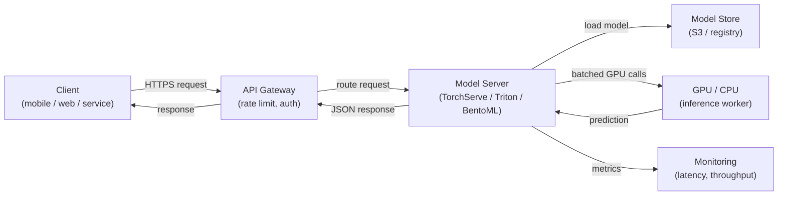

# Model Serving

## Definition

Model Serving ist der Prozess, ein trainiertes ML-Modell für die Inferenz verfügbar zu machen — Eingabedaten entgegenzunehmen, eine Vorhersage zu berechnen und Ergebnisse an Aufrufer zurückzugeben. Es ist die Brücke zwischen der Offline-Welt des Trainings und der Experimentierung und der Online-Welt der Produktionsanwendungen. Eine gut gestaltete Serving-Schicht ist genauso wichtig wie Modellqualität: Ein Modell mit 98% Genauigkeit, das mit 10 Sekunden Latenz bereitgestellt wird, ist in einem Produktkontext oft nutzlos.

Model Serving umfasst drei grundlegend verschiedene Paradigmen, die sich in ihrer Latenz, ihrem Durchsatz und ihren Infrastrukturanforderungen unterscheiden. **Batch-Inferenz** verarbeitet große Datenvolumen nach einem Zeitplan und schreibt Vorhersagen in eine Datenbank oder Datei; es ist die Option mit dem höchsten Durchsatz, kann aber nicht in Echtzeit auf einzelne Anfragen reagieren. **Echtzeit- (Online-) Inferenz** stellt einen API-Endpoint bereit, der Vorhersagen in Millisekunden zurückgibt; er priorisiert niedrige Latenz über Durchsatz. **Streaming-Inferenz** verarbeitet Ereignisse aus einer Warteschlange oder einem Stream, sobald sie ankommen, und liegt zwischen Batch und Echtzeit sowohl in Latenz als auch in Komplexität.

Die Skalierung eines Model-Serving-Systems beinhaltet Herausforderungen, die spezifisch für ML sind: Modelle sind typischerweise große Dateien, die in den Speicher (oder GPU-VRAM) geladen werden, die Startzeit spielt beim Autoskalieren eine Rolle, die GPU-Auslastung muss maximiert werden, um kosteneffektiv zu sein, und die Vorhersage-Latenz hat eine Tail-Verteilung, die unter Last unvorhersehbar sein kann. Frameworks wie NVIDIA Triton Inference Server, TorchServe und BentoML wurden speziell für diese Herausforderungen entwickelt.

## Funktionsweise



### Batch-Inferenz

Bei der Batch-Inferenz liest ein geplanter Job (Cron, Airflow DAG oder ein Cloud-Scheduler) einen Datensatz aus dem Speicher, führt Vorhersagen auf dem gesamten Set durch und schreibt die Ergebnisse zurück. Das Modell wird einmal pro Job-Lauf geladen, sodass die amortisierten Kosten pro Vorhersage für das Laden vernachlässigbar sind. Dieses Muster eignet sich für Anwendungsfälle wie das Generieren nächtlicher Empfehlungen, das Scoring aller Kunden auf Abwanderungsrisiko oder das Annotieren eines Data Warehouses mit vorhergesagter Stimmung. Der Hauptskalierungshebel ist Parallelität über Datenpartitionen — jede Partition kann von einem separaten Worker verarbeitet werden. Eine häufige Falle ist Training-Serving-Skew: Das Batch-Scoring-Skript verwendet unterschiedliche Vorverarbeitungslogik als die Trainingspipeline.

### Echtzeit-API-Inferenz

Echtzeit-Serving stellt das Modell hinter einem HTTP- (oder gRPC-) Endpoint bereit, der synchron auf einzelne Anfragen antwortet. Die wesentliche Engineering-Herausforderung ist die Latenz: Das Laden von Modellen ist langsam (Sekunden bis Minuten für große Modelle), daher müssen Instanzen warm gehalten oder vorab skaliert werden. Frameworks wie TorchServe und BentoML behandeln das Laden von Modellen, Anfrage-Deserialisierung, Batching gleichzeitiger Anfragen (Dynamic Batching) und Health Checks. Horizontale Skalierung via Kubernetes oder verwaltete Services (AWS SageMaker Endpoints, GCP Vertex AI Endpoints) fügt Replikas hinzu, wenn der Durchsatz einen Schwellenwert übersteigt. GPU-Speicher bestimmt, wie viele Modell-Replikas auf einem einzelnen Knoten passen, was direkt die Kosten beeinflusst.

### Streaming-Inferenz

Streaming-Inferenz verbindet den Model-Server mit einem Event-Stream (Kafka, Kinesis, Pub/Sub). Ereignisse kommen kontinuierlich an und Vorhersagen werden in ein Ausgabe-Topic emittiert. Dieses Muster eignet sich für Betrugserkennung auf Transaktionsströmen, Echtzeit-Anomalieerkennung auf Sensordaten oder jeden Anwendungsfall, bei dem ein neues Ereignis innerhalb von Hunderten von Millisekunden gescoret werden muss, aber das Volumen zu hoch für synchrones HTTP ist. Der Model-Server agiert als Konsumenten-Produzent: Er liest aus dem Eingabe-Topic, führt Inferenz durch und schreibt in das Ausgabe-Topic. Backpressure-Management ist kritisch — der Konsument darf während Traffic-Spitzen nicht hinter den Produzenten zurückfallen.

### Skalierungsüberlegungen

GPU-Scheduling ist der dominierende Kostenfaktor für große Modelle. Wesentliche Hebel umfassen: **Dynamic Batching** (Akkumulierung mehrerer Anfragen in einem einzigen GPU-Aufruf), **Modell-Quantisierung** (Reduzierung der Präzision von FP32 auf INT8, um mehr Modelle pro GPU unterzubringen), **Modell-Caching** (das Modell zwischen Anfragen im VRAM halten) und **Autoskalierung** (Replikas basierend auf Warteschlangentiefe oder Latenz-SLOs hinzufügen oder entfernen). Triton Inference Server unterstützt all dies mit einer deklarativen Konfigurationsdatei pro Modell, was ihn zur ersten Wahl für heterogene Modell-Fleets in Produktion macht.

## Wann verwenden / Wann NICHT verwenden

| Verwenden wenn | Vermeiden wenn |
|---|---|
| Eine nachgelagerte Anwendung Vorhersagen zur Anfragenzeit benötigt | Alle Konsumenten Vorhersagen tolerieren können, die Stunden im Voraus berechnet wurden |
| Vorhersagen sofort die neueste Modellversion widerspiegeln müssen | Der Datensatz klein genug ist, um in einem nächtlichen Batch kostengünstig gescoret zu werden |
| Ereignisgesteuertes Scoring benötigt wird (Streaming) | Das Modell nur für Offline-Analysen ohne nachgelagertes System verwendet wird |
| Modell-Inferenzkosten hoch sind und die GPU-Auslastung maximiert werden muss | Prototyp-Phase, wo ein direkt aufgerufenes einfaches Skript ausreicht |

## Vergleiche

| Kriterium | TorchServe | TF Serving | NVIDIA Triton | BentoML | FastAPI (custom) |
|---|---|---|---|---|---|
| Framework-Unterstützung | PyTorch-nativ | TensorFlow / Keras | Multi-Framework (ONNX, TF, PyTorch, TensorRT) | Framework-agnostisch | Framework-agnostisch |
| Dynamic Batching | Ja | Ja | Ja (hochkonfigurierbar) | Ja | Manuelle Implementierung |
| gRPC-Unterstützung | Ja | Ja | Ja | Ja | Via grpcio |
| GPU-Optimierung | Gut | Gut | Erstklassig | Gut | Manuell |
| Einrichtungsfreundlichkeit | Mittel | Mittel | Hoch (komplexe Konfiguration) | Niedrig (Python-nativ) | Sehr niedrig |
| Produktionsreife | Hoch | Hoch | Sehr hoch | Hoch | Hängt von der Implementierung ab |

## Vor- und Nachteile

| Vorteile | Nachteile |
|---|---|
| Entkoppelt Modellaktualisierungen von Anwendungs-Code-Releases | Fügt Infrastrukturkomplexität gegenüber dem direkten Ausführen von Inferenz hinzu |
| Ermöglicht unabhängige Skalierung der Inferenzkapazität | Cold-Start-Latenz kann für große Modelle erheblich sein |
| Zweckorientierte Frameworks behandeln Batching, Health Checks, Versionierung | GPU-Instanzen sind teuer; Kostenmanagement erfordert Sorgfalt |
| Unterstützt nativ A/B-Tests und Canary-Deployments | Streaming-Inferenz erfordert Kafka/Kinesis-Expertise neben ML |
| Monitoring-Hooks für Latenz, Durchsatz und Vorhersagedrift | Model-Serving-Skew (verschiedene Vorverarbeitung) ist ein dauerhaftes Risiko |

## Code-Beispiele

```python
# fastapi_serving.py
# Production-ready FastAPI model serving endpoint with dynamic model loading,
# input validation via Pydantic, and health check endpoint.

from __future__ import annotations

import os
from contextlib import asynccontextmanager
from typing import List

import joblib
import numpy as np
import uvicorn
from fastapi import FastAPI, HTTPException
from pydantic import BaseModel, Field

# --- Input/output schemas ---

class PredictionRequest(BaseModel):
    """Input features for a single inference request."""
    features: List[float] = Field(
        ...,
        min_length=20,
        max_length=20,
        description="Exactly 20 numerical features (must match training schema).",
        example=[0.1, -0.5, 1.2] + [0.0] * 17,
    )


class PredictionResponse(BaseModel):
    label: int
    probability: float
    model_version: str


# --- Model lifecycle management ---

MODEL: dict = {}  # holds the loaded model and metadata


@asynccontextmanager
async def lifespan(app: FastAPI):
    """Load model at startup; release resources on shutdown."""
    model_path = os.environ.get("MODEL_PATH", "models/model.joblib")
    model_version = os.environ.get("MODEL_VERSION", "unknown")

    if not os.path.exists(model_path):
        raise RuntimeError(f"Model file not found at {model_path}")

    MODEL["clf"] = joblib.load(model_path)
    MODEL["version"] = model_version
    print(f"Model v{model_version} loaded from {model_path}")
    yield
    MODEL.clear()
    print("Model unloaded.")


# --- API definition ---

app = FastAPI(
    title="ML Model Serving API",
    description="Real-time inference endpoint for the fraud detection model.",
    version="1.0.0",
    lifespan=lifespan,
)


@app.get("/health")
def health() -> dict:
    """Liveness probe — returns 200 when the model is loaded."""
    if "clf" not in MODEL:
        raise HTTPException(status_code=503, detail="Model not loaded")
    return {"status": "ok", "model_version": MODEL["version"]}


@app.post("/predict", response_model=PredictionResponse)
def predict(request: PredictionRequest) -> PredictionResponse:
    """
    Run inference on a single input vector.
    Returns the predicted label and the positive-class probability.
    """
    clf = MODEL.get("clf")
    if clf is None:
        raise HTTPException(status_code=503, detail="Model not ready")

    X = np.array(request.features).reshape(1, -1)
    label = int(clf.predict(X)[0])
    probability = float(clf.predict_proba(X)[0][label])

    return PredictionResponse(
        label=label,
        probability=probability,
        model_version=MODEL["version"],
    )


if __name__ == "__main__":
    # For local testing: MODEL_PATH=models/model.joblib MODEL_VERSION=v1 python fastapi_serving.py
    uvicorn.run(app, host="0.0.0.0", port=8080, log_level="info")
```

```python
# client_example.py
# Simple client that calls the FastAPI serving endpoint

import httpx

BASE_URL = "http://localhost:8080"

# Health check
response = httpx.get(f"{BASE_URL}/health")
print(response.json())  # {"status": "ok", "model_version": "v1"}

# Prediction
payload = {"features": [0.1, -0.5, 1.2] + [0.0] * 17}
response = httpx.post(f"{BASE_URL}/predict", json=payload)
print(response.json())
# {"label": 1, "probability": 0.87, "model_version": "v1"}
```

## Praktische Ressourcen

- [BentoML-Dokumentation](https://docs.bentoml.com/) — Framework-agnostisches Model Serving mit eingebautem Batching, Containerisierung und Deployment-Integrationen.
- [NVIDIA Triton Inference Server](https://docs.nvidia.com/deeplearning/triton-inference-server/user-guide/docs/index.html) — Hochleistungs-Serving für Multi-Framework-Modell-Fleets mit GPU-Optimierung.
- [TorchServe-Dokumentation](https://pytorch.org/serve/) — Offizielle PyTorch Model-Serving-Lösung mit Handler-Anpassung.
- [FastAPI-Dokumentation](https://fastapi.tiangolo.com/) — Modernes, hochleistungsfähiges Python-Web-Framework, das weitgehend für benutzerdefinierte ML-Serving-APIs verwendet wird.

## Siehe auch

- [KubeFlow](/docs/mlops/deployment/kubeflow)
- [ML auf Kubernetes](/docs/mlops/deployment/ml-kubernetes)
- [Monitoring](/docs/mlops/monitoring)
