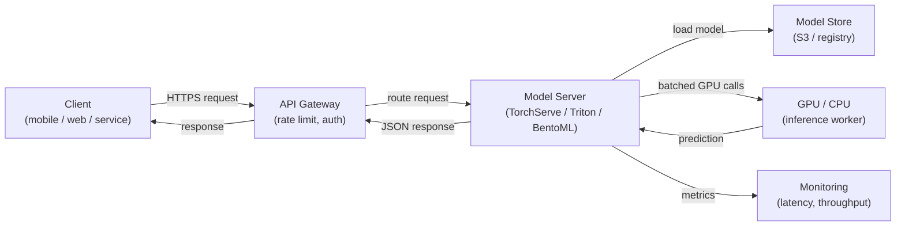

# Model-Serving

## Definition

Model-Serving ist der Prozess, ein trainiertes ML-Modell für Inferenz verfügbar zu machen — Eingabedaten entgegennehmen, eine Vorhersage ausführen und Ergebnisse an Aufrufer zurückgeben. Es ist die Brücke zwischen der Offline-Welt des Trainings und Experimentierens und der Online-Welt von Produktionsanwendungen. Eine gut konzipierte Serving-Schicht ist genauso wichtig wie die Modellqualität: Ein Modell mit 98 % Genauigkeit, das mit 10 Sekunden Latenz deployed wird, ist im Produktionskontext oft wertlos.

Model-Serving umfasst drei grundlegend verschiedene Paradigmen, die sich in Latenz, Durchsatz und Infrastrukturanforderungen unterscheiden. **Batch-Inferenz** verarbeitet große Datenmengen nach einem Zeitplan und schreibt Vorhersagen in eine Datenbank oder Datei; sie bietet den höchsten Durchsatz, kann jedoch nicht in Echtzeit auf einzelne Anfragen reagieren. **Echtzeit-(Online-)Inferenz** stellt einen API-Endpunkt bereit, der Vorhersagen in Millisekunden liefert; sie priorisiert niedrige Latenz gegenüber Durchsatz. **Streaming-Inferenz** verarbeitet Ereignisse aus einer Warteschlange oder einem Stream, sobald sie eintreffen, und liegt sowohl bei Latenz als auch Komplexität zwischen Batch und Echtzeit.

Das Skalieren eines Model-Serving-Systems bringt ML-spezifische Herausforderungen mit sich: Modelle sind typischerweise große Dateien, die in den Arbeitsspeicher (oder GPU-VRAM) geladen werden, die Startzeit ist für Autoskalierung relevant, die GPU-Auslastung muss für Kosteneffizienz maximiert werden, und die Vorhersagelatenz hat eine Tail-Verteilung, die unter Last unvorhersehbar sein kann. Frameworks wie NVIDIA Triton Inference Server, TorchServe und BentoML wurden speziell entwickelt, um diese Herausforderungen zu bewältigen.

## Funktionsweise



### Batch-Inferenz

Bei der Batch-Inferenz liest ein geplanter Job (Cron, Airflow-DAG oder ein Cloud-Scheduler) einen Datensatz aus dem Speicher, führt Vorhersagen für den gesamten Satz aus und schreibt die Ergebnisse zurück. Das Modell wird einmal pro Job-Ausführung geladen, sodass die amortisierten Ladekosten pro Vorhersage vernachlässigbar sind. Dieses Muster eignet sich für Anwendungsfälle wie das nächtliche Erstellen von Empfehlungen, die Bewertung aller Kunden hinsichtlich Abwanderungsrisiko oder die Annotation eines Data-Warehouses mit vorhergesagter Stimmung. Der wichtigste Skalierungshebel ist die Parallelisierung über Datenpartitionen — jede Partition kann von einem separaten Worker verarbeitet werden. Ein häufiger Fallstrick ist Training-Serving-Skew: Das Batch-Scoring-Skript verwendet eine andere Vorverarbeitungslogik als die Trainingspipeline.

### Echtzeit-API-Inferenz

Echtzeit-Serving stellt das Modell hinter einem HTTP- (oder gRPC-)Endpunkt bereit, der synchron auf einzelne Anfragen antwortet. Die wichtigste Engineering-Herausforderung ist die Latenz: Das Laden von Modellen ist langsam (Sekunden bis Minuten bei großen Modellen), daher müssen Instanzen warm gehalten oder vorab skaliert werden. Frameworks wie TorchServe und BentoML übernehmen Modell-Loading, Request-Deserialisierung, Batching gleichzeitiger Anfragen (Dynamic Batching) und Health-Checks. Horizontale Skalierung über Kubernetes oder verwaltete Dienste (AWS SageMaker Endpoints, GCP Vertex AI Endpoints) fügt Replikas hinzu, wenn der Durchsatz einen Schwellenwert überschreitet. Der GPU-Speicher bestimmt, wie viele Modell-Replikas auf einen einzelnen Knoten passen, was die Kosten direkt beeinflusst.

### Streaming-Inferenz

Streaming-Inferenz verbindet den Model-Server mit einem Ereignis-Stream (Kafka, Kinesis, Pub/Sub). Ereignisse treffen kontinuierlich ein, und Vorhersagen werden in ein Ausgabe-Topic emittiert. Dieses Muster eignet sich für Betrugserkennung in Transaktions-Streams, Echtzeit-Anomalieerkennung bei Sensordaten oder jeden Anwendungsfall, bei dem ein neues Ereignis innerhalb von Hunderten von Millisekunden bewertet werden muss, das Volumen aber für synchrones HTTP zu hoch ist. Der Model-Server agiert als Consumer-Producer: Er liest aus dem Eingabe-Topic, führt Inferenz durch und schreibt in das Ausgabe-Topic. Backpressure-Management ist entscheidend — der Consumer darf dem Producer bei Traffic-Spitzen nicht hinterherhinken.

### Skalierungsüberlegungen

GPU-Scheduling ist der dominante Kostenfaktor bei großen Modellen. Wichtige Hebel sind: **Dynamic Batching** (mehrere Anfragen in einem einzigen GPU-Aufruf bündeln), **Modell-Quantisierung** (Genauigkeit von FP32 auf INT8 reduzieren, um mehr Modelle pro GPU unterzubringen), **Modell-Caching** (Modell zwischen Anfragen im VRAM halten) und **Autoskalierung** (Replikas basierend auf Warteschlangentiefe oder Latenz-SLOs hinzufügen oder entfernen). Triton Inference Server unterstützt all dies mit einer deklarativen Konfigurationsdatei pro Modell und ist damit die erste Wahl für heterogene Modell-Flotten in der Produktion.

## Wann verwenden / Wann NICHT verwenden

| Verwenden wenn | Vermeiden wenn |
|---|---|
| Eine nachgelagerte Anwendung Vorhersagen zur Anfragelaufzeit benötigt | Alle Verbraucher Vorhersagen tolerieren können, die Stunden im Voraus berechnet wurden |
| Vorhersagen sofort die neueste Modellversion widerspiegeln müssen | Der Datensatz klein genug ist, um in einem nächtlichen Batch kostengünstig bewertet zu werden |
| Ereignisgesteuertes Scoring benötigt wird (Streaming) | Das Modell nur für Offline-Analysen ohne nachgelagertes System verwendet wird |
| Modell-Inferenzkosten hoch sind und GPU-Auslastung maximiert werden muss | Im Prototyp-Stadium ein einfaches, direkt aufgerufenes Skript ausreichend ist |

## Vergleiche

| Kriterium | TorchServe | TF Serving | NVIDIA Triton | BentoML | FastAPI (custom) |
|---|---|---|---|---|---|
| Framework-Unterstützung | PyTorch-nativ | TensorFlow / Keras | Multi-Framework (ONNX, TF, PyTorch, TensorRT) | Framework-agnostisch | Framework-agnostisch |
| Dynamic Batching | Ja | Ja | Ja (hochkonfigurierbar) | Ja | Manuelle Implementierung |
| gRPC-Unterstützung | Ja | Ja | Ja | Ja | Via grpcio |
| GPU-Optimierung | Gut | Gut | Beste Klasse | Gut | Manuell |
| Einrichtungsaufwand | Mittel | Mittel | Hoch (komplexe Konfiguration) | Niedrig (Python-nativ) | Sehr niedrig |
| Produktionsreife | Hoch | Hoch | Sehr hoch | Hoch | Abhängig von Implementierung |

## Vor- und Nachteile

| Vorteile | Nachteile |
|---|---|
| Trennt Modell-Updates von Anwendungs-Code-Releases | Erhöht die Infrastrukturkomplexität gegenüber Inline-Inferenz |
| Ermöglicht unabhängige Skalierung der Inferenzkapazität | Cold-Start-Latenz kann bei großen Modellen erheblich sein |
| Zweckgebaute Frameworks übernehmen Batching, Health-Checks und Versionierung | GPU-Instanzen sind teuer; Kostenmanagement erfordert Sorgfalt |
| Unterstützt nativ A/B-Tests und Canary-Deployments | Streaming-Inferenz erfordert Kafka/Kinesis-Expertise neben ML |
| Monitoring-Hooks für Latenz, Durchsatz und Vorhersage-Drift | Model-Serving-Skew (unterschiedliche Vorverarbeitung) ist ein dauerhaftes Risiko |

## Code-Beispiele

```python
# fastapi_serving.py
# Production-ready FastAPI model serving endpoint with dynamic model loading,
# input validation via Pydantic, and health check endpoint.

from __future__ import annotations

import os
from contextlib import asynccontextmanager
from typing import List

import joblib
import numpy as np
import uvicorn
from fastapi import FastAPI, HTTPException
from pydantic import BaseModel, Field

# --- Input/output schemas ---

class PredictionRequest(BaseModel):
    """Input features for a single inference request."""
    features: List[float] = Field(
        ...,
        min_length=20,
        max_length=20,
        description="Exactly 20 numerical features (must match training schema).",
        example=[0.1, -0.5, 1.2] + [0.0] * 17,
    )


class PredictionResponse(BaseModel):
    label: int
    probability: float
    model_version: str


# --- Model lifecycle management ---

MODEL: dict = {}  # holds the loaded model and metadata


@asynccontextmanager
async def lifespan(app: FastAPI):
    """Load model at startup; release resources on shutdown."""
    model_path = os.environ.get("MODEL_PATH", "models/model.joblib")
    model_version = os.environ.get("MODEL_VERSION", "unknown")

    if not os.path.exists(model_path):
        raise RuntimeError(f"Model file not found at {model_path}")

    MODEL["clf"] = joblib.load(model_path)
    MODEL["version"] = model_version
    print(f"Model v{model_version} loaded from {model_path}")
    yield
    MODEL.clear()
    print("Model unloaded.")


# --- API definition ---

app = FastAPI(
    title="ML Model Serving API",
    description="Real-time inference endpoint for the fraud detection model.",
    version="1.0.0",
    lifespan=lifespan,
)


@app.get("/health")
def health() -> dict:
    """Liveness probe — returns 200 when the model is loaded."""
    if "clf" not in MODEL:
        raise HTTPException(status_code=503, detail="Model not loaded")
    return {"status": "ok", "model_version": MODEL["version"]}


@app.post("/predict", response_model=PredictionResponse)
def predict(request: PredictionRequest) -> PredictionResponse:
    """
    Run inference on a single input vector.
    Returns the predicted label and the positive-class probability.
    """
    clf = MODEL.get("clf")
    if clf is None:
        raise HTTPException(status_code=503, detail="Model not ready")

    X = np.array(request.features).reshape(1, -1)
    label = int(clf.predict(X)[0])
    probability = float(clf.predict_proba(X)[0][label])

    return PredictionResponse(
        label=label,
        probability=probability,
        model_version=MODEL["version"],
    )


if __name__ == "__main__":
    # For local testing: MODEL_PATH=models/model.joblib MODEL_VERSION=v1 python fastapi_serving.py
    uvicorn.run(app, host="0.0.0.0", port=8080, log_level="info")
```

```python
# client_example.py
# Simple client that calls the FastAPI serving endpoint

import httpx

BASE_URL = "http://localhost:8080"

# Health check
response = httpx.get(f"{BASE_URL}/health")
print(response.json())  # {"status": "ok", "model_version": "v1"}

# Prediction
payload = {"features": [0.1, -0.5, 1.2] + [0.0] * 17}
response = httpx.post(f"{BASE_URL}/predict", json=payload)
print(response.json())
# {"label": 1, "probability": 0.87, "model_version": "v1"}
```

## Praktische Ressourcen

- [BentoML-Dokumentation](https://docs.bentoml.com/) — Framework-agnostisches Model-Serving mit integriertem Batching, Containerisierung und Deployment-Integrationen.
- [NVIDIA Triton Inference Server](https://docs.nvidia.com/deeplearning/triton-inference-server/user-guide/docs/index.html) — Hochleistungs-Serving für Multi-Framework-Modell-Flotten mit GPU-Optimierung.
- [TorchServe-Dokumentation](https://pytorch.org/serve/) — Offizielles PyTorch-Model-Serving mit anpassbaren Handlern.
- [FastAPI-Dokumentation](https://fastapi.tiangolo.com/) — Modernes, hochleistungsfähiges Python-Web-Framework, das für individuelle ML-Serving-APIs weit verbreitet ist.

## Siehe auch

- [KubeFlow](/docs/mlops/deployment/kubeflow)
- [ML auf Kubernetes](/docs/mlops/deployment/ml-kubernetes)
- [Monitoring](/docs/mlops/monitoring)
