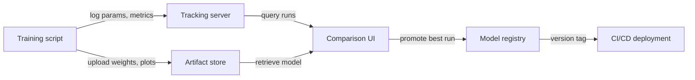

# Experiment-Tracking

## Definition

Experiment-Tracking ist die Praxis, jeden Detail eines ML-Trainingslaufs systematisch aufzuzeichnen, damit Ergebnisse reproduziert, verglichen und auditiert werden können. Ohne es verlieren Teams den Überblick, welche Hyperparameter welche Ergebnisse erzeugt haben, verschwenden Rechenkapazität beim Wiederentdecken von Konfigurationen und können bei hochriskanten Entscheidungen keine Compliance nachweisen.

Ein vollständiger Experimentdatensatz erfasst vier Informationskategorien. **Parameter** sind die Eingaben für das Training: Lernrate, Batch-Größe, Modellarchitektur-Entscheidungen, Feature-Sets. **Metriken** sind die Ausgaben: Verlust-Kurven, Genauigkeit, F1, AUC, Latenz. **Artefakte** sind die erzeugten Dateien: trainierte Modellgewichte, vorverarbeitete Datensätze, Evaluierungsplots, Konfusionsmatrizen. **Metadaten** sind der Kontext: Code-Version (git commit), Umgebung (Bibliotheksversionen, Hardware), Datensatzversion, Wanduhrzeit und der Name der Person, die es ausgeführt hat.

Modell-Versionierung ist die natürliche Erweiterung: Sobald Experimente verfolgt werden, kann das Artefakt des besten Laufs in eine Modell-Registry promoviert, mit einer semantischen Version markiert und jede Serving-Bereitstellung auf ein spezifisches Experiment zurückgeführt werden. Dies schließt die Lücke zwischen Experimentierung und Produktion, macht Rollbacks einfach und Audits möglich.

## Funktionsweise

### Instrumentierung

Das Trainingsskript wird mit einigen Zeilen SDK-Code instrumentiert, die während des Trainings einen "Lauf"-Kontext öffnen und Daten an einen zentralen Server protokollieren. Die meisten Frameworks (PyTorch Lightning, Hugging Face Trainer, Keras) bieten native Integrationen, die gängige Metriken ohne zusätzlichen Code automatisch protokollieren.

### Zentralisierte Speicherung

Protokollierte Daten werden in einem Backend-Store gespeichert — einem lokalen Dateisystem, einer verwalteten Cloud-Datenbank oder einer SaaS-Plattform. Parameter und Metriken werden als strukturierte Datensätze gespeichert; Artefakte werden in Object Storage (S3, GCS, Azure Blob) hochgeladen. Das Backend wird von der UI und dem SDK abgefragt.

### Vergleich und Analyse

Die Tracking-UI ermöglicht das Filtern, Sortieren und Vergleichen von Läufen über alle vier Dimensionen. Metrik-Kurven mehrerer Läufe können auf demselben Diagramm überlagert, nach Parameterwerten gruppiert und Ergebnisse in einen DataFrame für benutzerdefinierte Analysen exportiert werden. Das macht es einfach, Pareto-optimale Läufe zu identifizieren (z. B. beste Genauigkeit für ein gegebenes Latenz-Budget).

### Modell-Promotion

Das Artefakt des besten Laufs wird in einer Modell-Registry mit einer Versionsnummer und einem Übergangsstatus (Staging → Production → Archived) registriert. Nachgelagerte CI/CD-Systeme befragen die Registry, um zu wissen, welche Modellversion bereitgestellt werden soll, und schaffen so eine saubere Übergabe zwischen Experimentierung und Serving.



## Wann verwenden / Wann NICHT verwenden

| Verwenden wenn | Vermeiden wenn |
|----------------|----------------|
| Mehr als eine Handvoll Experimente durchgeführt werden und Ergebnisse verglichen werden müssen | Ein einmaliges Training durchgeführt wird, das nie wieder aufgegriffen wird |
| Reproduzierbarkeit erforderlich ist (regulierte Branche, Forschungsveröffentlichung) | Das Experiment trivial ist (z. B. eine Zwei-Parameter-Gittersuche mit offensichtlichen Ergebnissen) |
| Mehrere Teammitglieder Experimentergebnisse teilen | Das Team allein arbeitet und Notizen in einer persönlichen Tabelle ausreichend sind |
| Modellversionen systematisch in die Produktion promoviert werden sollen | Das Modell nie bereitgestellt wird und Ergebnisse nicht auditiert werden müssen |

## Vergleiche

| Kriterium | MLflow | Weights & Biases (W&B) |
|-----------|--------|------------------------|
| Einrichtungsfreundlichkeit | Self-hostbar mit `mlflow ui`; nur pip install | SaaS-Konto erforderlich; CLI-Installation; kostenloser Tarif verfügbar |
| UI-Qualität | Funktional aber schlicht; gut für tabellarischen Vergleich | Ausgefeilt, interaktiv; ausgezeichnet für Medien und Kurvenüberlagerungen |
| Zusammenarbeit | Gemeinsamer Server erforderlich; keine eingebaute Zugriffskontrolle in OSS | Team-Arbeitsbereiche, rollenbasierter Zugriff und Teilen eingebaut |
| Preisgestaltung | Kostenlos und Open Source; verwaltetes Angebot über Databricks | Kostenloser Tarif für Einzelpersonen; kostenpflichtig für große Teams |
| Integrationen | Tiefe Integration mit Databricks, Spark, sklearn, PyTorch | Breite Integrationen; stark in Forschung und Wissenschaft |

## Code-Beispiele

```python
# generic_tracking.py
# Framework-agnostic experiment tracking pattern.
# Works with any ML library; swap out the model training code as needed.
# pip install mlflow scikit-learn pandas

import mlflow
from sklearn.linear_model import LogisticRegression
from sklearn.datasets import make_classification
from sklearn.model_selection import train_test_split
from sklearn.metrics import accuracy_score, roc_auc_score
import numpy as np

# --- Configuration ---
EXPERIMENT_NAME = "binary-classification-demo"
PARAMS = {
    "C": 0.1,           # Regularization strength
    "max_iter": 1000,
    "solver": "lbfgs",
    "random_state": 42,
}

# --- Data preparation ---
X, y = make_classification(
    n_samples=2000, n_features=20, n_informative=10, random_state=42
)
X_train, X_test, y_train, y_test = train_test_split(
    X, y, test_size=0.2, random_state=42
)

# --- Tracking boilerplate (works with MLflow, swap with wandb.init() for W&B) ---
mlflow.set_experiment(EXPERIMENT_NAME)

with mlflow.start_run(run_name=f"logreg-C{PARAMS['C']}") as run:
    # 1. Log all hyperparameters at the start
    mlflow.log_params(PARAMS)

    # 2. Train the model
    model = LogisticRegression(**PARAMS)
    model.fit(X_train, y_train)

    # 3. Evaluate and log metrics
    y_pred = model.predict(X_test)
    y_prob = model.predict_proba(X_test)[:, 1]

    metrics = {
        "accuracy": accuracy_score(y_test, y_pred),
        "roc_auc": roc_auc_score(y_test, y_prob),
        "n_train": len(X_train),
        "n_test": len(X_test),
    }
    mlflow.log_metrics(metrics)

    # 4. Log the model artifact
    mlflow.sklearn.log_model(model, artifact_path="model")

    # 5. Log any extra files (e.g., feature importance, plots)
    import json, tempfile, os
    with tempfile.TemporaryDirectory() as tmp:
        meta_path = os.path.join(tmp, "run_metadata.json")
        with open(meta_path, "w") as f:
            json.dump({"git_commit": "abc1234", "dataset_version": "v1.3"}, f)
        mlflow.log_artifact(meta_path)

    print(f"Run ID : {run.info.run_id}")
    print(f"Accuracy: {metrics['accuracy']:.4f} | ROC-AUC: {metrics['roc_auc']:.4f}")
```

## Praktische Ressourcen

- [MLflow Tracking-Dokumentation](https://mlflow.org/docs/latest/tracking.html) — Offizieller Leitfaden zur Tracking-API, Backends, Artefakt-Stores und Autologging.
- [Weights & Biases – Experiment Tracking Quickstart](https://docs.wandb.ai/quickstart) — Schritt-für-Schritt-Anleitung zum Protokollieren des ersten W&B-Laufs in unter fünf Minuten.
- [Neptune.ai – Experiment Tracking Guide](https://neptune.ai/blog/ml-experiment-tracking) — Herstellerneutraler Überblick über was zu verfolgen ist, warum und wie Werkzeuge verglichen werden.
- [Made With ML – Experiment Tracking](https://madewithml.com/courses/mlops/experiment-tracking/) — Praktische Notebook-basierte Anleitung zur Integration von MLflow in eine echte Trainingsschleife.

## Siehe auch

- [MLflow](/docs/mlops/mlflow)
- [Weights & Biases](/docs/mlops/wandb)
- [MLOps](/docs/mlops)
