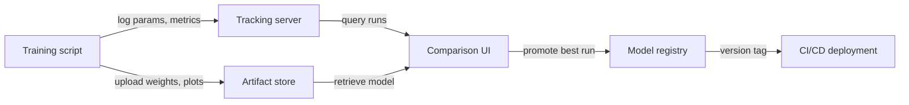

# Experiment-Tracking

## Definition

Experiment-Tracking ist die Praxis, jeden Detail eines ML-Trainingslaufs systematisch aufzuzeichnen, sodass Ergebnisse reproduziert, verglichen und auditiert werden können. Ohne es verlieren Teams den Überblick, welche Hyperparameter welche Ergebnisse erzeugt haben, verschwenden Rechenleistung beim Wiederentdecken von Konfigurationen und können keine Compliance nachweisen, wenn Modelle hochriskante Entscheidungen beeinflussen.

Ein vollständiger Experiment-Datensatz erfasst vier Informationskategorien. **Parameter** sind die Eingaben für das Training: Lernrate, Batch-Größe, Modellarchitektur, Feature-Sets. **Metriken** sind die Ausgaben: Loss-Kurven, Genauigkeit, F1, AUC, Latenz. **Artefakte** sind die erzeugten Dateien: trainierte Modellgewichte, vorverarbeitete Datasets, Evaluierungsplots, Konfusionsmatrizen. **Metadaten** ist der Kontext: Code-Version (Git-Commit), Umgebung (Bibliotheksversionen, Hardware), Dataset-Version, Wandzeit und der Name der Person, die den Lauf durchgeführt hat.

Modell-Versionierung ist die natürliche Erweiterung: Sobald Sie Experimente tracken, können Sie das beste Artefakt eines Laufs in eine Modellregistrierung promoten, es mit einer semantischen Version taggen und jede Serving-Bereitstellung auf ein spezifisches Experiment zurückführen. Dies schließt die Schleife zwischen Experimentierung und Produktion, macht Rollbacks unkompliziert und ermöglicht Audits.

## Funktionsweise

### Instrumentierung

Das Trainingsskript wird mit wenigen Zeilen SDK-Code instrumentiert, die einen "Lauf"-Kontext öffnen und Daten während des Trainings an einen zentralen Server protokollieren. Die meisten Frameworks (PyTorch Lightning, Hugging Face Trainer, Keras) haben native Integrationen, die gängige Metriken ohne zusätzlichen Code automatisch protokollieren.

### Zentraler Speicher

Protokollierte Daten werden in einem Backend-Store persistiert — einem lokalen Dateisystem, einer verwalteten Cloud-Datenbank oder einer SaaS-Plattform. Parameter und Metriken werden als strukturierte Datensätze gespeichert; Artefakte werden in Objektspeicher hochgeladen (S3, GCS, Azure Blob). Das Backend wird von der UI und dem SDK abgefragt.

### Vergleich und Analyse

Die Tracking-UI ermöglicht das Filtern, Sortieren und Vergleichen von Läufen über alle vier Dimensionen. Sie können Metrik-Kurven für viele Läufe im selben Chart plotten, nach Parameter-Werten gruppieren und Ergebnisse in einen Dataframe für benutzerdefinierte Analysen exportieren. Dies erleichtert die Identifikation der Pareto-optimalen Läufe (beste Genauigkeit für ein gegebenes Latenzbudget, zum Beispiel).

### Modell-Promotion

Das beste Artefakt eines Laufs wird in einer Modellregistrierung mit einer Versionsnummer und einem Übergangszustand registriert (Staging → Production → Archived). Nachgelagerte CI/CD-Systeme fragen die Registry ab, um zu wissen, welche Modellversion bereitgestellt werden soll, und schaffen so eine saubere Übergabe zwischen Experimentierung und Serving.





## Wann verwenden / Wann NICHT verwenden

| Mehr als eine Handvo... | Ein einzelner, einma... |
|----------|------------|
| Mehr als eine Handvoll Experimente durchgeführt werden und Ergebnisse verglichen werden müssen | Ein einzelner, einmaliger Trainingslauf durchgeführt wird und nie mehr darauf zurückgegriffen wird |
| Reproduzierbarkeit erforderlich ist (regulierte Branche, Forschungsveröffentlichung) | Das Experiment trivial ist (z.B. eine Zwei-Parameter-Grid-Suche mit offensichtlichen Ergebnissen) |
| Mehrere Teammitglieder Experimentergebnisse teilen | Das Team alleine arbeitet und Notizen in einer persönlichen Tabelle ausreichen |
| Modellversionen systematisch in die Produktion promoten werden sollen | Das Modell nie bereitgestellt wird und Ergebnisse nicht auditiert werden müssen |

## Code-Beispiele

```python
# generic_tracking.py
# Framework-agnostic experiment tracking pattern.
# Works with any ML library; swap out the model training code as needed.
# pip install mlflow scikit-learn pandas

import mlflow
from sklearn.linear_model import LogisticRegression
from sklearn.datasets import make_classification
from sklearn.model_selection import train_test_split
from sklearn.metrics import accuracy_score, roc_auc_score
import numpy as np

# --- Configuration ---
EXPERIMENT_NAME = "binary-classification-demo"
PARAMS = {
    "C": 0.1,           # Regularization strength
    "max_iter": 1000,
    "solver": "lbfgs",
    "random_state": 42,
}

# --- Data preparation ---
X, y = make_classification(
    n_samples=2000, n_features=20, n_informative=10, random_state=42
)
X_train, X_test, y_train, y_test = train_test_split(
    X, y, test_size=0.2, random_state=42
)

mlflow.set_experiment(EXPERIMENT_NAME)

with mlflow.start_run(run_name=f"logreg-C{PARAMS['C']}") as run:
    mlflow.log_params(PARAMS)

    model = LogisticRegression(**PARAMS)
    model.fit(X_train, y_train)

    y_pred = model.predict(X_test)
    y_prob = model.predict_proba(X_test)[:, 1]

    metrics = {
        "accuracy": accuracy_score(y_test, y_pred),
        "roc_auc": roc_auc_score(y_test, y_prob),
        "n_train": len(X_train),
        "n_test": len(X_test),
    }
    mlflow.log_metrics(metrics)

    mlflow.sklearn.log_model(model, artifact_path="model")

    import json, tempfile, os
    with tempfile.TemporaryDirectory() as tmp:
        meta_path = os.path.join(tmp, "run_metadata.json")
        with open(meta_path, "w") as f:
            json.dump({"git_commit": "abc1234", "dataset_version": "v1.3"}, f)
        mlflow.log_artifact(meta_path)

    print(f"Run ID : {run.info.run_id}")
    print(f"Accuracy: {metrics['accuracy']:.4f} | ROC-AUC: {metrics['roc_auc']:.4f}")
```


## Vergleiche

| Kriterium | MLflow | Weights & Biases (W&B) |
|-----------|--------|------------------------|
| Einrichtungsaufwand | Selbst hostbar mit `mlflow ui`; nur pip install | SaaS-Account erforderlich; CLI-Installation; kostenloser Tier verfügbar |
| UI-Qualität | Funktional, aber schlicht; gut für tabellarischen Vergleich | Poliert, interaktiv; ausgezeichnet für Medien und Kurven-Überlagerungen |
| Zusammenarbeit | Geteilter Server erforderlich; keine integrierte Zugriffskontrolle in OSS | Team-Workspaces, rollenbasierter Zugriff und Sharing integriert |
| Preisgestaltung | Kostenlos und Open-Source; verwaltetes Angebot über Databricks | Kostenloser Tier für Einzelpersonen; bezahlt für große Teams |
| Integrationen | Tiefe Integration mit Databricks, Spark, sklearn, PyTorch | Breite Integrationen; stark in Forschung und Wissenschaft |

## Praktische Ressourcen

- [MLflow Tracking Documentation](https://mlflow.org/docs/latest/tracking.html) — Offizieller Leitfaden für die Tracking-API, Backends, Artefakt-Stores und Autologging.
- [Weights & Biases – Experiment Tracking Quickstart](https://docs.wandb.ai/quickstart) — Schritt-für-Schritt-Anleitung zum Protokollieren des ersten W&B-Laufs in unter fünf Minuten.
- [Neptune.ai – Experiment Tracking Guide](https://neptune.ai/blog/ml-experiment-tracking) — Vendor-neutraler Überblick darüber, was zu tracken ist, warum und wie Werkzeuge zu vergleichen sind.
- [Made With ML – Experiment Tracking](https://madewithml.com/courses/mlops/experiment-tracking/) — Praktischer notebook-basierter Walkthrough zur Integration von MLflow in eine echte Trainingsschleife.

## Siehe auch

- [MLflow](/docs/mlops/mlflow)
- [Weights & Biases](/docs/mlops/wandb)
- [MLOps](/docs/mlops)
