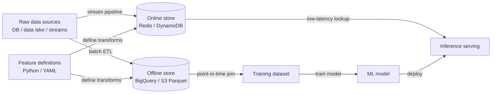

# Feature Stores

## Definition

Ein Feature Store ist ein Datensystem, das speziell für die Verwaltung des Lebenszyklus von ML-Features entwickelt wurde — von der Rohdatentransformation über die Speicherung bis hin zum latenzarmen Serving — auf eine Weise, die zwischen Modelltraining und Produktionsinferenz konsistent ist. Ohne einen Feature Store stoßen Teams häufig auf **Training-Serving-Skew**: Die offline während des Trainings ausgeführte Feature-Berechnungslogik unterscheidet sich subtil von der beim Serving verwendeten Logik, wodurch Produktionsmodelle im Vergleich zur Offline-Evaluierung schlechter abschneiden.

Feature Stores lösen dies, indem Feature-Definitionen als Code gespeichert und dieselbe Transformationslogik in beiden Kontexten ausgeführt wird. Sie unterhalten zwei komplementäre Speicherebenen: einen **Offline Store** (ein Data Warehouse oder Data Lake, z. B. BigQuery, Redshift, Parquet-Dateien auf S3), der große historische Datensätze für Training und Batch-Scoring enthält, und einen **Online Store** (eine latenzarme Key-Value-Datenbank, z. B. Redis, DynamoDB, Cassandra), der vorberechnete Feature-Werte für Modelle zur Inferenzzeit mit Submillisekunden-Latenz bereitstellt.

Das Problem des Training-Serving-Skews und der Bedarf an Feature-Wiederverwendung wird bei zunehmender Skalierung akut. Eine große Organisation kann Dutzende von Teams haben, die ähnliche Features (Kundenausgaben in den letzten 7 Tagen, Sitzungslänge, Gerätetyp) unabhängig voneinander berechnen, mit subtilen Unterschieden in der Geschäftslogik. Ein Feature Store bietet einen verwalteten Katalog, in dem Features einmal definiert, validiert und teamübergreifend wiederverwendet werden, was den doppelten Engineering-Aufwand und das Risiko inkonsistenter Feature-Logik drastisch reduziert.

## Funktionsweise

### Feature-Definition und Transformationspipelines

Features werden als Code definiert — Python-Klassen oder YAML-Manifeste — die die Datenquelle, Transformationslogik und den Entity-Schlüssel (den Bezeichner für Feature-Lookups, z. B. `user_id`, `product_id`) spezifizieren. Batch-Transformationspipelines laufen nach einem Zeitplan, um Features in den Offline Store zu materialisieren. Stream-Transformationspipelines (z. B. mit Flink oder Spark Structured Streaming) halten den Online Store für zeitkritische Features wie Echtzeit-Betrugssignale aktuell.

### Offline Store: Abruf von Trainingsdaten

Beim Training eines Modells wird ein Datensatz erzeugt, indem eine Liste von Entity-Schlüsseln und eine Menge von Zeitstempeln (ein "Point-in-Time-Join") angegeben wird. Der Feature Store ruft die Feature-Werte ab, die zum jeweiligen Zeitstempel korrekt waren, und vermeidet so zukünftige Datenlecks. Diese zeitpunktgenaue Korrektheit ist eines der schwierigsten Dinge ohne einen Feature Store korrekt zu implementieren und eine der wertvollsten Garantien, die er bietet.

### Online Store: Latenzarmes Serving

Bevor ein Modell eine Vorhersage macht, benötigt es Feature-Werte für die zu bewertende Entität (z. B. den Nutzer, der eine Anfrage stellt). Der Feature-Store-Client fragt den Online Store nach dem Entity-Schlüssel ab und gibt in Millisekunden einen Feature-Vektor zurück. Da dieselben Feature-Definitionen sowohl dem Offline- als auch dem Online-Store zugrunde liegen, sind die Werte garantiert identisch berechnet.

### Feature-Registry und Governance

Ein Feature-Katalog dokumentiert jedes Feature: seine Definition, Besitzer, Datentyp, Frische-Garantie und welche Modelle es konsumieren. Diese Governance-Schicht ermöglicht Auffindbarkeit — ein neues Team kann vorhandene Features durchsuchen, bevor es eigene schreibt — und Impact-Analyse — zu verstehen, welche Modelle betroffen sind, wenn sich die Upstream-Datenquelle eines Features ändert.

### Materialisierungsjobs

Materialisierung ist der Prozess, Transformationspipelines auszuführen und Ergebnisse in die Stores zu schreiben. Offline-Materialisierung läuft als geplanter Batch-Job. Online-Materialisierung kopiert eine Teilmenge der Offline-Daten in den Online Store für schnellen Abruf oder wird von Streaming-Pipelines angetrieben, wenn Echtzeit-Frische erforderlich ist. Feast, Tecton und Hopsworks bieten alle CLI-Befehle oder Orchestrierungsintegrationen zum Auslösen und Überwachen der Materialisierung.



## Wann verwenden / Wann NICHT verwenden

| Verwenden wenn | Vermeiden wenn |
|----------------|----------------|
| Mehrere Teams oder Modelle dieselbe Feature-Logik teilen und Konsistenz kritisch ist | Ein einzelnes Modell mit einem kleinen, stabilen Feature-Set vorhanden ist, das sich nie ändert |
| Training-Serving-Skew Produktionsvorfälle oder Genauigkeitslücken verursacht hat | Inferenzlatenzanforderungen entspannt sind und Batch-Scoring ausreicht |
| Zeitpunktgenaue Trainingsdatensätze zur Vermeidung von Datenlecks benötigt werden | Der Engineering-Overhead eines Feature Stores die Projektgröße übersteigt |
| Features bei Echtzeit-Vorhersagen mit Submillisekunden-Latenz bereitgestellt werden müssen | In früher Erkundungsphase und Features noch nicht stabil genug zum Formalisieren sind |
| Regulatorische Anforderungen einen verwalteten, auditierbaren Feature-Katalog verlangen | Das Data-Science-Team klein ist und ML-Engineering-Unterstützung zur Infrastrukturverwaltung fehlt |

## Vergleiche

| Kriterium | Feast | Tecton | Hopsworks |
|-----------|-------|--------|-----------|
| Open Source | Ja (Apache 2.0) | Nein (SaaS / verwaltet) | Ja Kern; Enterprise kostenpflichtig |
| Verwaltetes Angebot | Nein (nur self-hosted) | Ja (vollständig verwaltet) | Ja (Cloud oder On-Prem) |
| Streaming Features | Begrenzt (via Kafka-Quelle) | Nativ, produktionsreif | Nativ mit Flink-Integration |
| Feature-Monitoring | Grundlegend | Erweitert (eingebauter Drift) | Erweitert |
| Am besten für | Teams, die OSS-Kontrolle wollen | Unternehmen, die verwaltete Echtzeit-Features benötigen | Teams, die vollständig Open-Source wollen |

## Vor- und Nachteile

| Vorteile | Nachteile |
|----------|-----------|
| Eliminiert Training-Serving-Skew durch gemeinsame Transformationslogik | Erhebliche Engineering-Investition zur Einrichtung und zum Betrieb |
| Ermöglicht Feature-Wiederverwendung über Teams hinweg, reduziert doppelten Aufwand | Fügt eine operationale Abhängigkeit zum Serving-Pfad hinzu (Online-Store-Verfügbarkeit) |
| Point-in-Time-Joins verhindern Datenlecks in Trainingsdaten | Feature-Definitionen können zu einem Engpass werden, wenn Governance zu starr ist |
| Zentralisiert Feature-Governance und Dokumentation | Lernkurve für Data Scientists, die mit der Abstraktion nicht vertraut sind |
| Unterstützt sowohl Batch- als auch Echtzeit-Feature-Serving | Überdimensioniert für Teams mit wenigen Modellen und stabilen Features |

## Code-Beispiele

```python
# feast_feature_store_example.py
# Demonstrates defining, materializing, and retrieving features with Feast.
# Prerequisites:
#   pip install feast pandas scikit-learn
#   feast init my_feature_repo && cd my_feature_repo
#   (Adjust the data source path below to match your environment.)

# ── feature_repo/features.py ──────────────────────────────────────────────────
# This file defines the feature views and entities in your Feast registry.

from datetime import timedelta
import pandas as pd
from feast import (
    Entity,
    FeatureStore,
    FeatureView,
    Field,
    FileSource,
)
from feast.types import Float32, Int64

# 1. Define the entity — the primary key used to look up features
driver = Entity(
    name="driver",
    description="A taxi driver identified by driver_id",
)

# 2. Define the data source (parquet file for local demo; swap for BigQuery etc.)
driver_stats_source = FileSource(
    path="data/driver_stats.parquet",   # generated below
    timestamp_field="event_timestamp",
    created_timestamp_column="created",
)

# 3. Define a FeatureView — the transformation and storage spec
driver_stats_fv = FeatureView(
    name="driver_hourly_stats",
    entities=[driver],
    ttl=timedelta(days=7),              # how long features stay valid
    schema=[
        Field(name="conv_rate", dtype=Float32),
        Field(name="acc_rate", dtype=Float32),
        Field(name="avg_daily_trips", dtype=Int64),
    ],
    online=True,                        # materialize to online store
    source=driver_stats_source,
)


# ── generate_sample_data.py ───────────────────────────────────────────────────
# Run this once to create sample data before materializing.
def generate_driver_stats(path: str = "data/driver_stats.parquet") -> None:
    import os
    os.makedirs("data", exist_ok=True)

    rng = pd.date_range(end=pd.Timestamp.now(tz="UTC"), periods=48, freq="h")
    df = pd.DataFrame({
        "driver_id": [1001, 1002, 1003] * 16,
        "event_timestamp": list(rng[:48]),
        "created": pd.Timestamp.now(tz="UTC"),
        "conv_rate": [0.8, 0.6, 0.9] * 16,
        "acc_rate": [0.95, 0.88, 0.92] * 16,
        "avg_daily_trips": [150, 200, 175] * 16,
    })
    df.to_parquet(path, index=False)
    print(f"Sample data written to {path}")


# ── training_data_retrieval.py ────────────────────────────────────────────────
# Retrieve a point-in-time correct training dataset.
def get_training_data(repo_path: str = ".") -> pd.DataFrame:
    store = FeatureStore(repo_path=repo_path)

    # Entity DataFrame: the entities and timestamps we want features for
    entity_df = pd.DataFrame({
        "driver_id": [1001, 1002, 1003],
        "event_timestamp": [
            pd.Timestamp("2024-01-15 10:00:00", tz="UTC"),
            pd.Timestamp("2024-01-15 11:00:00", tz="UTC"),
            pd.Timestamp("2024-01-15 12:00:00", tz="UTC"),
        ],
        "label": [1, 0, 1],   # target variable for supervised training
    })

    # Point-in-time join: retrieves feature values as-of each row's timestamp
    training_df = store.get_historical_features(
        entity_df=entity_df,
        features=[
            "driver_hourly_stats:conv_rate",
            "driver_hourly_stats:acc_rate",
            "driver_hourly_stats:avg_daily_trips",
        ],
    ).to_df()

    print("Training dataset:")
    print(training_df.to_string())
    return training_df


# ── online_serving.py ─────────────────────────────────────────────────────────
# Retrieve features for real-time inference after materialization.
def get_online_features(driver_ids: list, repo_path: str = ".") -> dict:
    store = FeatureStore(repo_path=repo_path)

    # Materialize features to the online store first:
    # store.materialize_incremental(end_date=pd.Timestamp.now(tz="UTC"))

    feature_vector = store.get_online_features(
        features=[
            "driver_hourly_stats:conv_rate",
            "driver_hourly_stats:acc_rate",
            "driver_hourly_stats:avg_daily_trips",
        ],
        entity_rows=[{"driver_id": did} for did in driver_ids],
    ).to_dict()

    print("Online feature vector:")
    for key, values in feature_vector.items():
        print(f"  {key}: {values}")
    return feature_vector


# ── main ──────────────────────────────────────────────────────────────────────
if __name__ == "__main__":
    generate_driver_stats()
    # After running `feast apply` to register the feature views:
    # training_df = get_training_data()
    # online_fv   = get_online_features([1001, 1002])
    print("Feature definitions ready. Run `feast apply` to register them.")
```

## Praktische Ressourcen

- [Feast-Dokumentation](https://docs.feast.dev/) — Offizielle Dokumentation des am weitesten verbreiteten Open-Source-Feature-Stores, einschließlich Quickstart, Feature-View-API und Deployment-Leitfäden.
- [Tecton – Feature Store Concepts](https://docs.tecton.ai/docs/introduction/feature-store-concepts) — Herstellerneutraler konzeptioneller Überblick über Online/Offline-Stores, Point-in-Time-Joins und Feature-Pipelines vom Team, das Ubers Michelangelo gebaut hat.
- [Hopsworks-Dokumentation](https://docs.hopsworks.ai/) — Full-Stack-Feature-Store mit nativem Flink-Streaming, Feature-Monitoring und einer Modell-Registry.
- [Feature Store for ML – O'Reilly](https://www.featurestore.org/) — Community-Ressource mit Forschungsarbeiten, Blogbeiträgen und Vorträgen zu Feature-Store-Designmustern.
- [Chip Huyen – Feature Engineering for ML Systems](https://huyenchip.com/2022/01/02/real-time-machine-learning-challenges-and-solutions.html) — Tiefgang in die Engineering-Herausforderungen der Echtzeit-Feature-Berechnung und wie Feature Stores sie lösen.

## Siehe auch

- [MLOps](/docs/mlops)
- [MLflow](/docs/mlops/mlflow)
- [Experiment-Tracking](/docs/mlops/experiment-tracking)
