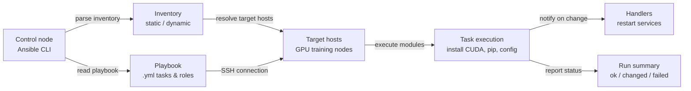

# Ansible

## Definition

Ansible ist ein von Red Hat erstelltes Open-Source-Automatisierungswerkzeug, das Konfigurationsmanagement, Anwendungsdeployment und Task-Automatisierung über eine Flotte von Servern mit einfachen, für Menschen lesbaren YAML-Dateien namens **Playbooks** handhabt. Seine definierende Architekturrentscheidung ist **agentenlos**: Ansible verbindet sich über SSH (Linux) oder WinRM (Windows) mit verwalteten Knoten und führt Tasks direkt aus, ohne dass Daemon- oder Agentensoftware auf den Zielmaschinen erforderlich ist. Dies macht es deutlich einfacher einzuführen als agentenbasierte Werkzeuge — man kann mit der Verwaltung bestehender Server beginnen, ohne vorab installierte Software außer Python und einem SSH-Server zu benötigen.

Ansible arbeitet nach einem **Push-Modell**: Ein Operator führt ein Playbook von einem Kontrollknoten aus, Ansible verbindet sich mit dem Zielinventar von Hosts und führt Tasks der Reihe nach aus. Tasks rufen **Module** auf — idempotente Arbeitseinheiten, die wissen, wie Pakete installiert, Dateien verwaltet, Services gestartet, Befehle ausgeführt und mit Cloud-APIs interagiert werden. Community- und offizielle Module decken praktisch jeden Linux-Paketmanager, Service, Cloud-Anbieter, Netzwerkgerät und jede Anwendung ab. Rollen bündeln verwandte Tasks, Dateien, Templates und Variablen in wiederverwendbare, teilbare Einheiten, die auf Ansible Galaxy veröffentlicht oder in internen Git-Repositories gepflegt werden können.

In ML- und Data-Engineering-Kontexten füllt Ansible die Lücke, die [Terraform](/docs/mlops/iac/terraform) hinterlässt. Terraform stellt Infrastruktur bereit (erstellt die GPU-Instanz, die VPC, den S3-Bucket); Ansible konfiguriert, was auf dieser Infrastruktur läuft (installiert die korrekte CUDA-Version, konfiguriert die Python-Umgebung, richtet verteilte Trainingsabhängigkeiten ein und stellt sicher, dass GPU-Monitoring-Werkzeuge laufen). Die beiden Werkzeuge sind komplementär, nicht konkurrierend: Ein typischer MLOps-Workflow verwendet Terraform zur Bereitstellung von Cloud-Ressourcen und Ansible zum Bootstrapping dieser Ressourcen in einen trainingsbereit Zustand.

## Funktionsweise

### Inventar

Das Inventar definiert, welche Hosts Ansible verwaltet. Ein statisches Inventar ist eine INI- oder YAML-Datei, die Hostnamen oder IP-Adressen gruppiert nach Rolle auflistet (z. B. `[gpu_training_nodes]`, `[model_serving]`). Dynamische Inventare befragen Cloud-APIs (AWS EC2, GCP Compute, Azure VMs) zur Laufzeit, um die Host-Liste aus der Live-Infrastruktur zu erstellen — unerlässlich für Auto-Scaling-Umgebungen. Host- und Gruppen-Variablen definieren pro-Host- oder pro-Gruppen-Konfigurationswerte, die in Playbooks referenziert werden.

### Playbooks und Tasks

Ein Playbook ist eine YAML-Datei mit einem oder mehreren **Plays**. Jedes Play zielt auf eine Gruppe von Hosts und eine Liste von **Tasks** ab. Jeder Task ruft ein Modul mit Argumenten auf und kann optional Bedingungen (`when`), Schleifen (`loop`) und Handler definieren, die bei Änderungen ausgelöst werden. Tasks werden innerhalb eines Plays sequenziell ausgeführt; Plays können parallel über Hosts laufen. Das Ergebnis jedes Tasks ist eines von: `ok` (keine Änderung nötig), `changed` (Änderung wurde vorgenommen), `failed` oder `skipped`. Ansible gibt nach jedem Playbook-Lauf eine Zusammenfassung dieser Ergebnisse aus.

### Rollen

Rollen bieten eine standardisierte Verzeichnisstruktur zur Organisation verwandter Automatisierung: `tasks/`, `handlers/`, `templates/`, `files/`, `vars/`, `defaults/` und `meta/`. Eine Rolle kann auf mehrere Plays in mehreren Playbooks angewendet werden, und Rollen können von anderen Rollen abhängen. Ansible Galaxy hostet Tausende von Community-Rollen (z. B. `geerlingguy.docker`, `nvidia.nvidia_driver`), die mit `ansible-galaxy install` installiert und direkt in Playbooks verwendet werden können.

### Variablen und Templating

Ansible verwendet die Jinja2-Template-Engine in Playbooks und Template-Dateien. Variablen können auf mehreren Ebenen definiert werden (Rollen-Defaults, Gruppen-Variablen, Host-Variablen, Playbook-Variablen, Extra-Variablen mit `-e`) mit einer klaren Prioritätsreihenfolge. Templates (`.j2`-Dateien) generieren dynamisch Konfigurationsdateien — zum Beispiel eine verteilte Trainingskonfigurationsdatei mit der richtigen Master-Knoten-IP, Anzahl der GPUs und Batch-Größe für jede Umgebung.

### Idempotenz und Handler

Ansible-Module sind für Idempotenz ausgelegt: Das mehrfache Ausführen eines Playbooks erzeugt denselben Endzustand ohne unbeabsichtigte Nebeneffekte. Wenn ein Paket bereits in der korrekten Version installiert ist, meldet der Task `ok` und tut nichts. **Handler** sind spezielle Tasks, die am Ende eines Plays nur ausgeführt werden, wenn sie von einem Task benachrichtigt wurden, der zu `changed` führte — verwendet, um Services (wie einen CUDA-beschleunigten Training-Daemon) nur dann neu zu starten, wenn ihre Konfiguration tatsächlich geändert wurde.



## Wann verwenden / Wann NICHT verwenden

| Verwenden wenn | Vermeiden wenn |
|----------|------------|
| Software auf bestehenden Servern konfiguriert werden soll: CUDA, Python, pip-Pakete, System-Services installieren | Neue Cloud-Infrastruktur von Grund auf bereitgestellt werden soll (dafür Terraform verwenden) |
| GPU-Trainingsknoten nach der Terraform-Erstellung bootstrapped werden sollen | Feingranulares State-Tracking über Hunderte von Ressourcen benötigt wird (Ansible hat keine State-Datei) |
| Konsistente ML-Umgebungen über Entwicklungs-, Staging- und Produktionsmaschinen eingerichtet werden sollen | Komplexe Abhängigkeitsgraphen zwischen Cloud-Ressourcen mit automatischer Reihenfolge benötigt werden |
| Ad-hoc-Befehle über eine Flotte von Servern ausgeführt werden sollen (z. B. eine Konfigurationsdatei überall aktualisieren) | Zielmaschinen nicht über SSH oder WinRM vom Kontrollknoten erreicht werden können |
| Anwendungs-Updates bereitgestellt oder Konfigurationsänderungen über viele Knoten hinweg ausgerollt werden sollen | Cloud-native Ressourcen bereitgestellt werden sollen (VPCs, IAM-Rollen, S3-Buckets) — Terraform verwenden |
| Teams, die IaC-Tooling mit flacher YAML-Lernkurve benötigen | Sehr schnelle parallele Ausführung benötigt wird; Ansibles SSH-Overhead begrenzt die Skalierbarkeit bei Tausenden von Knoten |

## Vergleiche

| Kriterium | Ansible | Terraform |
|-----------|---------|-----------|
| Paradigma | Prozedural mit idempotenten Modulen — Tasks laufen der Reihe nach | Deklarativ — gewünschten Zustand beschreiben, Terraform berechnet den Diff |
| State-Management | Zustandslos — kein eingebautes Tracking des vorher Angewendeten | Explizite State-Datei bildet Konfiguration auf echte Ressourcen-IDs ab |
| Primärer Anwendungsfall | Konfigurationsmanagement und Software-Deployment auf bestehenden Hosts | Cloud-Infrastruktur-Bereitstellung (Instanzen, Netzwerke, Speicher) |
| Cloud-Anbieter-Unterstützung | Cloud-Module existieren, sind aber weniger umfassend als Terraform-Provider | 1.000+ Provider mit tiefer, versionierter API-Abdeckung |
| Idempotenz | Task-Level — jedes Modul muss idempotent geschrieben sein | Nativ — plan/apply konvergiert immer zum deklarierten Zustand |
| Lernkurve | Niedrig — YAML-Tasks sind lesbar; keine neue Sprache erforderlich | Moderat — HCL-Syntax + State/Plan-Denkmodell zu erlernen |
| Agent erforderlich | Nein — agentenlos, verbindet sich über SSH | Nein — Terraform läuft auf dem Kontrollrechner, ruft Cloud-APIs auf |
| Wann zusammen verwenden | Ansible konfiguriert Software auf Infrastruktur, die Terraform bereitgestellt hat | Terraform stellt Ressourcen bereit; Ansible übernimmt OS- und App-Konfiguration |

## Vor- und Nachteile

| Aspekt | Vorteile | Nachteile |
|--------|------|------|
| Agentenlose Architektur | Keine Software auf Zielknoten zu installieren; funktioniert mit bestehendem SSH | SSH-Overhead begrenzt Performance bei sehr großem Maßstab (10.000+ Knoten) |
| YAML-Playbooks | Für Menschen lesbare, selbst-dokumentierende Automatisierung | Komplexe Logik (Schleifen, Bedingungen) wird in YAML ausführlich |
| Idempotente Module | Sicher erneut ausführbar; Drift-Korrektur ohne Nebeneffekte | Idempotenz hängt von Modulqualität ab; shell/command-Module sind nicht inhärent idempotent |
| Ansible Galaxy | Großes Ökosystem von Community-Rollen für gängige Software | Qualität der Community-Rollen variiert; Versionspinning von Rollen ist für Reproduzierbarkeit kritisch |
| Keine State-Datei | Einfach, kein State-Management-Overhead | Keine eingebaute Drift-Erkennung zwischen Läufen; manuelle oder Drittanbieter-Werkzeuge erforderlich |
| Jinja2-Templating | Mächtige dynamische Konfigurationsgenerierung | Template-Debugging ist schwieriger als nativer Code; Fehler treten zur Laufzeit auf |

## Code-Beispiele

```yaml
# ml_environment_setup.yml
# Ansible playbook to configure a GPU training node for ML workloads.
# Installs CUDA toolkit, cuDNN, Python 3.11, pip packages, and sets up
# a systemd service for the Prometheus node exporter.
#
# Usage:
#   ansible-playbook -i inventory.ini ml_environment_setup.yml
#
# inventory.ini example:
#   [gpu_training_nodes]
#   10.0.1.10 ansible_user=ubuntu ansible_ssh_private_key_file=~/.ssh/ml-key.pem
#   10.0.1.11 ansible_user=ubuntu ansible_ssh_private_key_file=~/.ssh/ml-key.pem

---
- name: Configure GPU training nodes for ML workloads
  hosts: gpu_training_nodes
  become: true  # Run tasks as root via sudo
  vars:
    cuda_version: "12.1"
    python_version: "3.11"
    pip_packages:
      - torch==2.3.0
      - torchvision==0.18.0
      - torchaudio==2.3.0
      - numpy==1.26.4
      - pandas==2.2.2
      - scikit-learn==1.4.2
      - mlflow==2.13.0
      - evidently==0.4.30
      - prometheus-client==0.20.0
    node_exporter_version: "1.8.1"
    ml_user: "mlops"
    ml_workdir: "/opt/ml"

  handlers:
    - name: restart node_exporter
      ansible.builtin.systemd:
        name: node_exporter
        state: restarted
        daemon_reload: true

  tasks:
    # --- System prerequisites ---

    - name: Update apt package cache
      ansible.builtin.apt:
        update_cache: true
        cache_valid_time: 3600  # Skip update if cache is less than 1 hour old

    - name: Install system dependencies
      ansible.builtin.apt:
        name:
          - build-essential
          - git
          - wget
          - curl
          - htop
          - nvtop          # GPU monitoring in terminal
          - python{{ python_version }}
          - python{{ python_version }}-dev
          - python{{ python_version }}-venv
          - python3-pip
        state: present

    # --- CUDA installation ---

    - name: Check if CUDA {{ cuda_version }} is already installed
      ansible.builtin.command: nvcc --version
      register: nvcc_check
      changed_when: false
      failed_when: false

    - name: Add CUDA repository keyring
      ansible.builtin.shell: |
        wget -qO /tmp/cuda-keyring.deb \
          https://developer.download.nvidia.com/compute/cuda/repos/ubuntu2204/x86_64/cuda-keyring_1.1-1_all.deb
        dpkg -i /tmp/cuda-keyring.deb
      when: cuda_version not in (nvcc_check.stdout | default(''))
      args:
        creates: /usr/share/keyrings/cuda-archive-keyring.gpg

    - name: Install CUDA toolkit {{ cuda_version }}
      ansible.builtin.apt:
        name: cuda-toolkit-{{ cuda_version | replace('.', '-') }}
        state: present
        update_cache: true
      when: cuda_version not in (nvcc_check.stdout | default(''))

    - name: Set CUDA environment variables in /etc/environment
      ansible.builtin.lineinfile:
        path: /etc/environment
        line: "{{ item }}"
        state: present
      loop:
        - 'CUDA_HOME=/usr/local/cuda'
        - 'PATH=/usr/local/cuda/bin:$PATH'
        - 'LD_LIBRARY_PATH=/usr/local/cuda/lib64:$LD_LIBRARY_PATH'

    # --- ML user and workspace ---

    - name: Create dedicated ML user
      ansible.builtin.user:
        name: "{{ ml_user }}"
        shell: /bin/bash
        home: "/home/{{ ml_user }}"
        create_home: true
        state: present

    - name: Create ML working directory
      ansible.builtin.file:
        path: "{{ ml_workdir }}"
        state: directory
        owner: "{{ ml_user }}"
        group: "{{ ml_user }}"
        mode: "0755"

    # --- Python virtual environment and packages ---

    - name: Create Python virtual environment
      ansible.builtin.command:
        cmd: python{{ python_version }} -m venv {{ ml_workdir }}/venv
        creates: "{{ ml_workdir }}/venv/bin/python"
      become_user: "{{ ml_user }}"

    - name: Upgrade pip in virtual environment
      ansible.builtin.pip:
        name: pip
        state: latest
        virtualenv: "{{ ml_workdir }}/venv"
      become_user: "{{ ml_user }}"

    - name: Install ML Python packages
      ansible.builtin.pip:
        name: "{{ pip_packages }}"
        virtualenv: "{{ ml_workdir }}/venv"
        state: present
      become_user: "{{ ml_user }}"

    - name: Write requirements.txt for reproducibility
      ansible.builtin.copy:
        dest: "{{ ml_workdir }}/requirements.txt"
        content: "{{ pip_packages | join('\n') }}\n"
        owner: "{{ ml_user }}"
        group: "{{ ml_user }}"
        mode: "0644"

    # --- Prometheus Node Exporter for infrastructure monitoring ---

    - name: Check if node_exporter is already installed
      ansible.builtin.stat:
        path: /usr/local/bin/node_exporter
      register: node_exporter_stat

    - name: Download Prometheus node_exporter {{ node_exporter_version }}
      ansible.builtin.get_url:
        url: "https://github.com/prometheus/node_exporter/releases/download/v{{ node_exporter_version }}/node_exporter-{{ node_exporter_version }}.linux-amd64.tar.gz"
        dest: /tmp/node_exporter.tar.gz
        mode: "0644"
      when: not node_exporter_stat.stat.exists

    - name: Extract and install node_exporter
      ansible.builtin.unarchive:
        src: /tmp/node_exporter.tar.gz
        dest: /tmp
        remote_src: true
      when: not node_exporter_stat.stat.exists

    - name: Copy node_exporter binary to /usr/local/bin
      ansible.builtin.copy:
        src: "/tmp/node_exporter-{{ node_exporter_version }}.linux-amd64/node_exporter"
        dest: /usr/local/bin/node_exporter
        mode: "0755"
        remote_src: true
      when: not node_exporter_stat.stat.exists
      notify: restart node_exporter

    - name: Create node_exporter systemd service
      ansible.builtin.copy:
        dest: /etc/systemd/system/node_exporter.service
        content: |
          [Unit]
          Description=Prometheus Node Exporter
          After=network.target

          [Service]
          User=nobody
          ExecStart=/usr/local/bin/node_exporter \
            --collector.systemd \
            --collector.processes
          Restart=on-failure

          [Install]
          WantedBy=multi-user.target
        mode: "0644"
      notify: restart node_exporter

    - name: Enable and start node_exporter
      ansible.builtin.systemd:
        name: node_exporter
        enabled: true
        state: started
        daemon_reload: true

    # --- Verification ---

    - name: Verify GPU is visible to CUDA
      ansible.builtin.command: nvidia-smi
      register: nvidia_smi_output
      changed_when: false
      failed_when: nvidia_smi_output.rc != 0

    - name: Print GPU info
      ansible.builtin.debug:
        var: nvidia_smi_output.stdout_lines

    - name: Verify PyTorch can see the GPU
      ansible.builtin.command:
        cmd: "{{ ml_workdir }}/venv/bin/python -c \"import torch; print('CUDA available:', torch.cuda.is_available()); print('GPU count:', torch.cuda.device_count())\""
      register: torch_check
      changed_when: false
      become_user: "{{ ml_user }}"

    - name: Print PyTorch GPU availability
      ansible.builtin.debug:
        var: torch_check.stdout_lines
```

## Praktische Ressourcen

- [Ansible-Dokumentation](https://docs.ansible.com/ansible/latest/index.html) — Offizielle Dokumentation zu Playbooks, Modulen, Rollen, Inventar und Best Practices.
- [Ansible Galaxy](https://galaxy.ansible.com/) — Community-Hub für wiederverwendbare Ansible-Rollen und -Sammlungen, einschließlich NVIDIA GPU-Treiber, Docker und Kubernetes-Rollen.
- [Jeff Geerling — Ansible for DevOps](https://www.ansiblefordevops.com/) — Umfassendes Buch und zugehöriges GitHub-Repository, das Ansible von Grundlagen bis zu Produktionsmustern behandelt.
- [NVIDIA Ansible-Sammlung](https://github.com/nvidia/ansible-collection-nvidia-gpu) — Offizielle NVIDIA Ansible-Sammlung zur Verwaltung von GPU-Treibern, CUDA und NCCL-Installationen.
- [Ansible Best Practices Guide](https://docs.ansible.com/ansible/latest/tips_tricks/ansible_tips_tricks.html) — Offizielle Tipps und Tricks zu Verzeichnisstruktur, Variablenverwaltung und Leistungsoptimierung.

## Siehe auch

- [Terraform](/docs/mlops/iac/terraform)
- [ML Kubernetes](/docs/mlops/deployment/ml-kubernetes)
- [MLOps](/docs/mlops)
