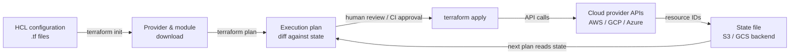

# Terraform

## Definition

Terraform ist ein Open-Source-Infrastructure-as-Code-Werkzeug (IaC) von HashiCorp, das es ermöglicht, Cloud- und On-Premises-Infrastruktur mithilfe einer deklarativen Konfigurationssprache namens HCL (HashiCorp Configuration Language) zu definieren, bereitzustellen und zu verwalten. Man beschreibt den gewünschten Endzustand der Infrastruktur — welche Ressourcen existieren sollen, wie sie konfiguriert sein sollen und wie sie miteinander in Beziehung stehen — und Terraform ermittelt, was zu erstellen, zu aktualisieren oder zu löschen ist, um diesen Zustand zu erreichen. Dieses deklarative Modell unterscheidet sich grundlegend von imperativen Scripting-Ansätzen, bei denen man die Abfolge der auszuführenden Schritte beschreibt.

Das Herzstück von Terraforms Architektur ist sein **Provider**-Ökosystem. Ein Provider ist ein Plugin, das HCL-Ressourcendefinitionen in API-Aufrufe gegen eine bestimmte Plattform übersetzt: AWS, Google Cloud, Azure, Kubernetes, Datadog, GitHub und Hunderte mehr. Jeder Provider pflegt seinen eigenen versionierten Release-Zyklus, und Terraform lädt Provider automatisch basierend auf `required_providers`-Blöcken herunter. Das bedeutet, dass eine einzige Terraform-Konfiguration gleichzeitig ein AWS-GPU-Trainingscluster, einen GCS-Bucket für Trainingsdaten, einen Kubernetes-Namespace für Model-Serving und ein Grafana-Dashboard für Monitoring bereitstellen kann — mit konsistenten Werkzeugen über alle Plattformen hinweg.

**State-Management** macht Terraform idempotent und planbar. Terraform pflegt eine State-Datei, die jede Ressource in der Konfiguration ihrem realen Gegenstück zuordnet (identifiziert durch Cloud-Provider-Ressourcen-IDs). Wenn `terraform plan` ausgeführt wird, vergleicht Terraform die aktuelle State-Datei mit der Konfiguration und der lebenden Infrastruktur und erstellt ein Diff, das genau zeigt, was sich ändern wird, bevor eine Änderung vorgenommen wird. Für Team-Workflows wird der Zustand in einem gemeinsamen Backend (S3, GCS, Terraform Cloud) mit Sperren gespeichert, um gleichzeitige Änderungen zu verhindern. Diese Nachvollziehbarkeit und Vorhersagbarkeit machen Terraform zum dominanten IaC-Werkzeug für die Bereitstellung von ML-Training- und -Serving-Infrastruktur in regulierten und kollaborativen Umgebungen.

## Funktionsweise

### Konfiguration schreiben

Ingenieure schreiben HCL-Dateien (`.tf`), die Ressourcen, Datenquellen, Variablen, Ausgaben und Module deklarieren. Ressourcen entsprechen Infrastrukturobjekten (eine EC2-Instanz, ein S3-Bucket, ein Kubernetes-Deployment). Datenquellen lesen bestehende Infrastruktur, ohne sie zu verwalten. Variablen parametrisieren Konfigurationen für die Wiederverwendung in verschiedenen Umgebungen. Module kapseln wiederverwendbare Ressourcenmengen — ein „GPU-Trainingscluster"-Modul kann mehrfach mit unterschiedlichen Instanztypen und Regionen instanziiert werden.

### Initialisieren und Planen

`terraform init` lädt erforderliche Provider und Module herunter und initialisiert das Backend. `terraform plan` erstellt einen menschenlesbaren Ausführungsplan: eine Liste von Ressourcen, die hinzugefügt (+), geändert (~) oder gelöscht (−) werden sollen. Die Plan-Phase ist schreibgeschützt — sie nimmt keine Änderungen an der Infrastruktur vor. Teams integrieren `terraform plan` typischerweise in CI-Pipelines, um Änderungen in Pull Requests vor dem Merge zu überprüfen.

### Anwenden und State-Management

`terraform apply` führt den Plan aus und ruft Provider-APIs auf, um Ressourcen in Abhängigkeitsreihenfolge zu erstellen, zu aktualisieren oder zu löschen. Terraform löst den Abhängigkeitsgraph automatisch basierend auf Referenzen zwischen Ressourcen auf (z. B. ein Subnetz, das auf eine VPC-ID verweist). Nach dem Apply wird die State-Datei aktualisiert, um den neuen Infrastrukturzustand widerzuspiegeln. Für ML-Infrastruktur bedeutet das, dass GPU-Instanzen, Speicher-Buckets, IAM-Rollen und Kubernetes-Cluster alle in der richtigen Reihenfolge mit den richtigen Konfigurationen in einem einzigen Befehl erstellt werden.

### Löschen und Lifecycle-Management

`terraform destroy` löscht alle von der Konfiguration verwalteten Ressourcen — nützlich für ephemere Trainingsumgebungen, die zwischen Trainingsjobs nicht laufen (und Geld kosten) sollen. Lifecycle-Meta-Argumente (`create_before_destroy`, `prevent_destroy`, `ignore_changes`) geben feingranulare Kontrolle darüber, wie Terraform mit sensiblen Ressourcen wie Modell-Artefakt-Speicher-Buckets umgeht, die niemals versehentlich gelöscht werden dürfen.



## Wann verwenden / Wann NICHT verwenden

| Verwenden wenn | Vermeiden wenn |
|----------|------------|
| Cloud-Infrastruktur bereitgestellt werden soll, die über Umgebungen hinweg reproduzierbar sein muss | Software in bestehenden Instanzen konfiguriert werden soll (dafür Ansible verwenden) |
| ML-Infrastruktur im großen Maßstab verwaltet wird: GPU-Cluster, Speicher, Netzwerk, Kubernetes | Das Team keine Cloud-Infrastruktur zu verwalten hat (keine Server, keine Cloud-Accounts) |
| Mehrere Teammitglieder an derselben Infrastruktur zusammenarbeiten müssen | Beliebige Shell-Befehle ausgeführt oder OS-Einstellungen auf Instanzen konfiguriert werden müssen |
| Infrastrukturänderungen vor der Anwendung via Pull Requests überprüft werden sollen | Bestehende Infrastruktur nicht mit Terraform erstellt wurde und Migrationskosten zu hoch sind |
| Infrastruktur versioniert, auditiert und zuverlässig zurückgerollt werden muss | Schnelle, iterative Änderungen an der Anwendungskonfiguration während der Entwicklung benötigt werden |
| In mehreren Cloud-Providern gearbeitet wird und ein einheitlicher Workflow gewünscht wird | Die Organisation bereits auf ein konkurrierendes IaC-Werkzeug (Pulumi, CDK) mit institutionellem Wissen standardisiert ist |

## Vergleiche

| Kriterium | Terraform | Ansible |
|-----------|-----------|---------|
| Paradigma | Deklarativ — gewünschten Zustand beschreiben | Prozedural — Schritte zum Erreichen des Zustands beschreiben |
| State-Management | Explizite State-Datei; verfolgt Ressourcen-IDs | Zustandslos — keine integrierte Zustandsverfolgung |
| Primärer Anwendungsfall | Cloud-Ressourcen-Bereitstellung (Instanzen, Netzwerke, Speicher) | Konfigurationsmanagement und Anwendungsdeployment auf bestehenden Instanzen |
| Cloud-Anbieter-Unterstützung | 1.000+ Provider via Plugin-Ökosystem | Module für große Clouds; weniger umfassend als Terraform |
| Idempotenz | Nativ — Plan/Apply konvergiert immer zum gewünschten Zustand | Aufgabenebene — jede Aufgabe muss idempotent geschrieben sein |
| Lernkurve | HCL-Syntax + State/Plan-Konzept | YAML-Playbooks; niedrigere anfängliche Hürde |
| Gemeinsamer Einsatz | Terraform stellt Infrastruktur bereit; Ansible konfiguriert Software darauf — sie ergänzen sich | Siehe oben |

## Vor- und Nachteile

| Aspekt | Vorteile | Nachteile |
|--------|------|------|
| Deklaratives Modell | Absicht ist klar; Plan zeigt exakte Änderungen vor dem Apply | Bedingte Logik oder komplexe Schleifen lassen sich schwer ausdrücken (obwohl HCL sich verbessert hat) |
| State-Datei | Ermöglicht genaue Planung und Drift-Erkennung | State-Datei ist sensibel; Beschädigung oder Verlust ist ein ernster Vorfall |
| Provider-Ökosystem | Deckt praktisch jeden Cloud-Dienst und jedes SaaS-Tool ab | Provider-Qualität variiert; einige Community-Provider sind schlecht gepflegt |
| Plan/Apply-Workflow | Änderungen sind vor der Ausführung überprüfbar | Langsamerer Iterationszyklus als imperative Skripte für schnelles Prototyping |
| Modul-Wiederverwendung | DRY-Infrastrukturmuster via veröffentlichten oder internen Modulen | Große Modulgraphen können bei der Initialisierung und Planung langsam sein |
| Idempotenz | Sicher mehrfach ausführbar; konvergentes Verhalten | Destroy/Recreate-Zyklen bei bestimmten Ressourcenänderungen (z. B. Umbenennung) verursachen Ausfallzeiten |

## Code-Beispiele

```hcl
# ml_infrastructure.tf
# Provisions an AWS GPU training instance and S3 bucket for ML artifacts.
# Prerequisites: AWS CLI configured, Terraform >= 1.5, appropriate IAM permissions.
# Run: terraform init && terraform plan && terraform apply

terraform {
  required_version = ">= 1.5"
  required_providers {
    aws = {
      source  = "hashicorp/aws"
      version = "~> 5.0"
    }
  }
  # Remote state backend — replace with your bucket and key
  backend "s3" {
    bucket         = "my-org-terraform-state"
    key            = "mlops/training/terraform.tfstate"
    region         = "us-east-1"
    dynamodb_table = "terraform-state-lock"
    encrypt        = true
  }
}

provider "aws" {
  region = var.aws_region
}

# --- Variables ---

variable "aws_region" {
  description = "AWS region for all resources"
  type        = string
  default     = "us-east-1"
}

variable "environment" {
  description = "Deployment environment: dev, staging, prod"
  type        = string
  default     = "dev"
}

variable "gpu_instance_type" {
  description = "EC2 instance type for GPU training. p3.2xlarge has 1x V100."
  type        = string
  default     = "p3.2xlarge"
}

variable "key_pair_name" {
  description = "Name of an existing EC2 key pair for SSH access"
  type        = string
}

# --- Data sources ---

# Use the latest Deep Learning AMI (GPU) for the region
data "aws_ami" "dl_ami" {
  most_recent = true
  owners      = ["amazon"]

  filter {
    name   = "name"
    values = ["Deep Learning AMI GPU PyTorch*"]
  }

  filter {
    name   = "architecture"
    values = ["x86_64"]
  }
}

# Default VPC for simplicity — use a dedicated VPC in production
data "aws_vpc" "default" {
  default = true
}

# --- S3 bucket for training artifacts ---

resource "aws_s3_bucket" "ml_artifacts" {
  bucket = "ml-artifacts-${var.environment}-${random_id.suffix.hex}"

  tags = {
    Environment = var.environment
    Purpose     = "ml-training-artifacts"
    ManagedBy   = "terraform"
  }
}

resource "random_id" "suffix" {
  byte_length = 4
}

# Block all public access to the artifacts bucket
resource "aws_s3_bucket_public_access_block" "ml_artifacts" {
  bucket                  = aws_s3_bucket.ml_artifacts.id
  block_public_acls       = true
  block_public_policy     = true
  ignore_public_acls      = true
  restrict_public_buckets = true
}

# Enable versioning so artifact overwrites can be recovered
resource "aws_s3_bucket_versioning" "ml_artifacts" {
  bucket = aws_s3_bucket.ml_artifacts.id
  versioning_configuration {
    status = "Enabled"
  }
}

# --- IAM role for the training instance ---

resource "aws_iam_role" "ml_training" {
  name = "ml-training-role-${var.environment}"

  assume_role_policy = jsonencode({
    Version = "2012-10-17"
    Statement = [{
      Action    = "sts:AssumeRole"
      Effect    = "Allow"
      Principal = { Service = "ec2.amazonaws.com" }
    }]
  })

  tags = {
    Environment = var.environment
    ManagedBy   = "terraform"
  }
}

resource "aws_iam_role_policy" "ml_s3_access" {
  name = "ml-s3-access"
  role = aws_iam_role.ml_training.id

  policy = jsonencode({
    Version = "2012-10-17"
    Statement = [{
      Effect = "Allow"
      Action = [
        "s3:GetObject",
        "s3:PutObject",
        "s3:ListBucket",
        "s3:DeleteObject"
      ]
      Resource = [
        aws_s3_bucket.ml_artifacts.arn,
        "${aws_s3_bucket.ml_artifacts.arn}/*"
      ]
    }]
  })
}

resource "aws_iam_instance_profile" "ml_training" {
  name = "ml-training-profile-${var.environment}"
  role = aws_iam_role.ml_training.name
}

# --- Security group for training instance ---

resource "aws_security_group" "ml_training" {
  name        = "ml-training-sg-${var.environment}"
  description = "Security group for ML GPU training instances"
  vpc_id      = data.aws_vpc.default.id

  # SSH access — restrict to your IP in production
  ingress {
    from_port   = 22
    to_port     = 22
    protocol    = "tcp"
    cidr_blocks = ["0.0.0.0/0"]
    description = "SSH — restrict to known IPs in production"
  }

  # JupyterLab access
  ingress {
    from_port   = 8888
    to_port     = 8888
    protocol    = "tcp"
    cidr_blocks = ["0.0.0.0/0"]
    description = "JupyterLab — restrict to known IPs in production"
  }

  egress {
    from_port   = 0
    to_port     = 0
    protocol    = "-1"
    cidr_blocks = ["0.0.0.0/0"]
    description = "Allow all outbound traffic"
  }

  tags = {
    Environment = var.environment
    ManagedBy   = "terraform"
  }
}

# --- GPU Training EC2 instance ---

resource "aws_instance" "ml_training" {
  ami                    = data.aws_ami.dl_ami.id
  instance_type          = var.gpu_instance_type
  key_name               = var.key_pair_name
  iam_instance_profile   = aws_iam_instance_profile.ml_training.name
  vpc_security_group_ids = [aws_security_group.ml_training.id]

  # 100 GB root volume for datasets and model checkpoints
  root_block_device {
    volume_type           = "gp3"
    volume_size           = 100
    delete_on_termination = true
    encrypted             = true
  }

  # Bootstrap script: export the S3 bucket name as an environment variable
  user_data = <<-EOF
    #!/bin/bash
    echo "export ML_ARTIFACTS_BUCKET=${aws_s3_bucket.ml_artifacts.bucket}" >> /etc/environment
    echo "export AWS_DEFAULT_REGION=${var.aws_region}" >> /etc/environment
  EOF

  tags = {
    Name        = "ml-training-${var.environment}"
    Environment = var.environment
    Purpose     = "gpu-training"
    ManagedBy   = "terraform"
  }

  # Prevent accidental destruction in production
  lifecycle {
    prevent_destroy = false # Set to true for production instances
  }
}

# --- Outputs ---

output "training_instance_id" {
  description = "EC2 instance ID of the GPU training instance"
  value       = aws_instance.ml_training.id
}

output "training_instance_public_ip" {
  description = "Public IP address of the GPU training instance"
  value       = aws_instance.ml_training.public_ip
}

output "ml_artifacts_bucket_name" {
  description = "Name of the S3 bucket for ML artifacts"
  value       = aws_s3_bucket.ml_artifacts.bucket
}

output "ml_artifacts_bucket_arn" {
  description = "ARN of the S3 bucket for ML artifacts"
  value       = aws_s3_bucket.ml_artifacts.arn
}
```

## Praktische Ressourcen

- [Terraform-Dokumentation](https://developer.hashicorp.com/terraform/docs) — Offizielle HashiCorp-Dokumentation zu HCL-Syntax, Providern, State, Workspaces und Modulen.
- [Terraform-AWS-Provider-Dokumentation](https://registry.terraform.io/providers/hashicorp/aws/latest/docs) — Umfassende Referenz für alle AWS-Ressourcen und Datenquellen im Terraform-AWS-Provider.
- [Terraform-Best-Practices](https://developer.hashicorp.com/terraform/language/style) — Offizieller Stilguide zu Modulstruktur, Namenskonventionen und State-Management-Mustern.
- [Gruntwork — Terraform: Up and Running](https://www.terraformupandrunning.com/) — Weit empfohlenes Buch zu Produktions-Terraform-Mustern, Modulen und Tests.
- [Terraform Registry](https://registry.terraform.io/) — Offizielles Registry veröffentlichter Provider und Module, einschließlich Community-Module für Kubernetes, EKS und GPU-Instanzkonfigurationen.

## Siehe auch

- [Ansible](/docs/mlops/iac/ansible)
- [ML Kubernetes](/docs/mlops/deployment/ml-kubernetes)
- [MLOps](/docs/mlops)
