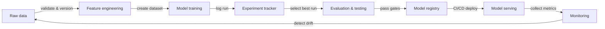

# MLOps

## Definition

MLOps — Machine Learning Operations — ist die Disziplin, DevOps-Prinzipien und -Praktiken auf den Lebenszyklus des maschinellen Lernens anzuwenden. Es liefert die Werkzeuge, Prozesse und kulturellen Normen, die benötigt werden, um ML-Modelle in der Produktion zuverlässig zu erstellen, bereitzustellen und zu pflegen. Ohne MLOps liefern Teams regelmäßig Modelle, die in Notebooks funktionieren, aber in der Produktion still verschlechtern, nach sechs Monaten nicht mehr reproduziert werden können oder Wochen für Aktualisierungen benötigen.

Die Kernprinzipien von MLOps sind **Reproduzierbarkeit** (jedes Experiment und jede Bereitstellung kann exakt nachgebaut werden), **Automatisierung** (Datenpipelines, Training, Evaluierung und Bereitstellung werden durch Code ausgelöst, nicht durch manuelle Schritte), **Monitoring** (die Modellleistung wird kontinuierlich in der Produktion verfolgt) und **Zusammenarbeit** (Data Scientists, ML-Ingenieure und Plattformteams teilen Werkzeuge, Standards und Verantwortung). Diese Prinzipien entsprechen direkt den DevOps-Säulen — Continuous Integration, Delivery und Feedback — angewandt auf Daten- und Modellartefakte statt nur auf Code.

MLOps entstand, als Teams feststellten, dass sich die Software-Engineering-Praktiken, die Software-Komplexität bändigen, nicht automatisch auf ML übertragen. Code ist nur ein Eingabefaktor: Datenverteilungen verschieben sich, Modellgenauigkeit nimmt ab, Experimente proliferieren, und ein Modell, das im Januar auf einem Validierungsdatensatz gut abschnitt, kann im Juli unvorhersehbar sein. MLOps liefert das Gerüst, um diese Probleme systematisch zu erkennen und darauf zu reagieren.

## Funktionsweise

### Datenverwaltung

Rohdaten werden aufgenommen, validiert, versioniert und in einem Feature Store oder Data Lake gespeichert. Die Datenvalidierung erkennt Schema-Drift und Verteilungsverschiebungen, bevor sie einen Trainingslauf korrumpieren. Versionierung stellt sicher, dass Modelle auf genau den Daten nachtrainiert werden können, die eine vorherige Version erzeugt haben.

### Experimentierung und Training

Data Scientists führen Experimente durch — mit variierenden Hyperparametern, Architekturen und Feature-Sets — und alle Läufe werden in einem Experiment-Tracker protokolliert. Der beste Lauf wird für weitere Evaluierung vorgeschlagen. Automatisierte Trainingspipelines (ausgelöst durch neue Daten oder einen Code-Commit) beseitigen manuelle Schritte und ermöglichen kontinuierliches Nachtraining.

### Evaluierung und Validierung

Kandidatenmodelle werden gegen ausgelagerte Test-Sets, Fairness-Prüfungen und Latenz-Budgets evaluiert, bevor sie promoviert werden. Evaluierungs-Gates verhindern, dass Regressionen die Produktion erreichen. A/B-Tests oder Shadow-Deployments können Kandidaten- und Produktionsmodelle mit echtem Traffic vergleichen.

### Bereitstellung und Serving

Genehmigte Modelle werden verpackt, in einer Modell-Registry registriert und über CI/CD-Pipelines auf der Serving-Infrastruktur bereitgestellt. Canary-Deployments und Rollback-Mechanismen reduzieren das Risiko. Infrastructure-as-Code stellt sicher, dass Serving-Umgebungen reproduzierbar sind.

### Monitoring und Feedback

Produktionsmetriken — Vorhersageverteilungen, Datendrift, Latenz, Fehlerraten — werden gesammelt und dem Team zurückgemeldet. Alerts lösen Nachtraining-Pipelines oder Modell-Rollbacks aus. Feedback-Schleifen schließen den ML-Lebenszyklus und verwandeln Produktionssignale in neue Trainingsdaten.



## Wann verwenden / Wann NICHT verwenden

| Verwenden wenn | Vermeiden wenn |
|----------------|----------------|
| Modelle werden in der Produktion eingesetzt und bedienen echte Nutzer | Das Projekt ist eine einmalige Analyse oder ein Forschungsprototyp |
| Mehrere Teammitglieder arbeiten an denselben Modellen zusammen | Das Team hat weniger als zwei Personen und ein einzelnes Modell |
| Modelle erfordern periodisches Nachtraining, wenn Daten driften | Das Modell ist statisch und wird nie aktualisiert |
| Regulatorische oder Prüfanforderungen verlangen Reproduzierbarkeit | Erkundungsgeschwindigkeit ist die einzige Priorität und kein Produktionseinsatz geplant |
| Mehr als ein Produktionsmodell zu verwalten ist | Der Overhead durch Werkzeuge überwiegt die erwartete Projektlebensdauer |

## Code-Beispiele

```python
# mlflow_quickstart.py
# Demonstrates basic MLflow experiment tracking for a simple classifier.
# Run: pip install mlflow scikit-learn

import mlflow
import mlflow.sklearn
from sklearn.datasets import load_iris
from sklearn.ensemble import RandomForestClassifier
from sklearn.model_selection import train_test_split
from sklearn.metrics import accuracy_score, f1_score

# Load data
X, y = load_iris(return_X_y=True)
X_train, X_test, y_train, y_test = train_test_split(
    X, y, test_size=0.2, random_state=42
)

# Define hyperparameters to log
params = {
    "n_estimators": 100,
    "max_depth": 5,
    "random_state": 42,
}

# Start an MLflow experiment run
mlflow.set_experiment("iris-classification")

with mlflow.start_run(run_name="random-forest-baseline"):
    # Log hyperparameters
    mlflow.log_params(params)

    # Train the model
    clf = RandomForestClassifier(**params)
    clf.fit(X_train, y_train)

    # Evaluate
    y_pred = clf.predict(X_test)
    accuracy = accuracy_score(y_test, y_pred)
    f1 = f1_score(y_test, y_pred, average="weighted")

    # Log metrics
    mlflow.log_metric("accuracy", accuracy)
    mlflow.log_metric("f1_score", f1)

    # Log the trained model with a registered name
    mlflow.sklearn.log_model(
        clf,
        artifact_path="model",
        registered_model_name="iris-random-forest",
    )

    print(f"Accuracy: {accuracy:.4f} | F1: {f1:.4f}")
    print(f"Run ID: {mlflow.active_run().info.run_id}")
```

## Praktische Ressourcen

- [Google – Practitioners Guide to MLOps](https://services.google.com/fh/files/misc/practitioners_guide_to_mlops_whitepaper.pdf) — Umfassendes Whitepaper zu MLOps-Reifegraden, Werkzeugwahl und Organisationsmustern von Google Cloud.
- [MLflow-Dokumentation](https://mlflow.org/docs/latest/index.html) — Offizielle Dokumentation der am weitesten verbreiteten Open-Source-MLOps-Plattform, mit Tracking, Registry, Projects und Deployment.
- [Made With ML – MLOps-Kurs](https://madewithml.com/) — Kostenloser, projektbasierter MLOps-Kurs durch den gesamten Lebenszyklus mit echtem Code.
- [Chip Huyen – Designing Machine Learning Systems](https://www.oreilly.com/library/view/designing-machine-learning/9781098107956/) — O'Reilly-Buch zu Produktions-ML-Systemdesign, Datenpipelines, Feature Stores und Monitoring.
- [CD Foundation – MLOps SIG](https://github.com/cdfoundation/sig-mlops) — Gemeinschaftsgetriebene Definitionen, Landschaft und Best Practices für MLOps.

## Siehe auch

- [Experiment-Tracking](/docs/mlops/experiment-tracking)
- [MLflow](/docs/mlops/mlflow)
- [Weights & Biases](/docs/mlops/wandb)
- [Feature Stores](/docs/mlops/feature-stores)
