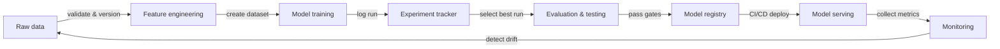

# MLOps

## Definition

MLOps — Machine Learning Operations — ist die Disziplin, DevOps-Prinzipien und -Praktiken auf den Machine-Learning-Lebenszyklus anzuwenden. Sie stellt die Werkzeuge, Prozesse und kulturellen Normen bereit, die nötig sind, um ML-Modelle in der Produktion zuverlässig zu entwickeln, bereitzustellen und zu warten. Ohne MLOps liefern Teams regelmäßig Modelle, die in Notebooks funktionieren, in der Produktion aber still degradieren, nach sechs Monaten nicht mehr reproduzierbar sind oder Wochen zur Aktualisierung benötigen.

Die Kernprinzipien von MLOps sind **Reproduzierbarkeit** (jedes Experiment und jede Bereitstellung kann exakt nachgebildet werden), **Automatisierung** (Datenpipelines, Training, Evaluierung und Bereitstellung werden durch Code ausgelöst, nicht durch manuelle Schritte), **Monitoring** (die Modellleistung wird kontinuierlich in der Produktion verfolgt) und **Zusammenarbeit** (Data Scientists, ML-Engineers und Plattformteams teilen Werkzeuge, Standards und Verantwortung). Diese Prinzipien entsprechen direkt den DevOps-Säulen — Continuous Integration, Delivery und Feedback — angewendet auf Daten und Modell-Artefakte statt nur auf Code.

MLOps entstand, als Teams feststellten, dass die Software-Engineering-Praktiken, die Softwarekomplexität bändigen, nicht automatisch auf ML übertragbar sind. Code ist nur ein Eingabewert: Datenverteilungen verschieben sich, die Modellgenauigkeit nimmt ab, Experimente proliferieren, und ein Modell, das im Januar auf einem Validierungsdatensatz gut abschnitt, kann im Juli unvorhersehbar reagieren. MLOps bietet das Gerüst, um diese Probleme systematisch zu erkennen und darauf zu reagieren.

## Funktionsweise

### Datenverwaltung

Rohdaten werden aufgenommen, validiert, versioniert und in einem Feature Store oder Data Lake gespeichert. Die Datenvalidierung erkennt Schema-Drift und Verteilungsverschiebungen, bevor sie einen Trainingslauf beschädigen. Versionierung stellt sicher, dass Modelle genau mit den Daten neu trainiert werden können, die eine frühere Version erzeugt haben.

### Experimente und Training

Data Scientists führen Experimente durch — sie variieren Hyperparameter, Architekturen und Feature-Sets — und alle Durchläufe werden in einem Experiment-Tracker protokolliert. Der beste Durchlauf wird zur weiteren Evaluierung ausgewählt. Automatisierte Trainingspipelines (ausgelöst durch neue Daten oder einen Code-Commit) entfernen manuelle Schritte und ermöglichen kontinuierliches Retraining.

### Evaluierung und Validierung

Modellkandidaten werden gegen gehaltene Testdatensätze, Fairness-Prüfungen und Latenzbudgets evaluiert, bevor sie in die Produktion gehen. Evaluierungsgatter verhindern Regressionen in der Produktion. A/B-Tests oder Shadow-Deployments können Kandidaten- und Produktionsmodelle mit echtem Traffic vergleichen.

### Bereitstellung und Serving

Genehmigte Modelle werden paketiert, in einer Modellregistrierung registriert und über CI/CD-Pipelines auf der Serving-Infrastruktur bereitgestellt. Canary-Deployments und Rollback-Mechanismen reduzieren das Risiko. Infrastructure-as-Code stellt sicher, dass Serving-Umgebungen reproduzierbar sind.

### Monitoring und Feedback

Produktionsmetriken — Vorhersageverteilungen, Datendrift, Latenz, Fehlerraten — werden gesammelt und dem Team zurückgespiegelt. Alarme lösen Retraining-Pipelines oder Modell-Rollbacks aus. Feedback-Schleifen schließen den ML-Lebenszyklus und verwandeln Produktionssignale in neue Trainingsdaten.



## Wann verwenden / Wann NICHT verwenden

| Verwenden wenn | Vermeiden wenn |
|----------|------------|
| Modelle in der Produktion eingesetzt werden und echten Benutzern dienen | Das Projekt eine einmalige Analyse oder ein Forschungsprototyp ist |
| Mehrere Teammitglieder an denselben Modellen zusammenarbeiten | Das Team weniger als zwei Personen und ein einziges Modell hat |
| Modelle periodisches Retraining benötigen, wenn Daten driften | Das Modell statisch ist und nie aktualisiert wird |
| Regulatorische oder Audit-Anforderungen Reproduzierbarkeit verlangen | Explorationsgeschwindigkeit die einzige Priorität ist und keine Produktionsbereitstellung geplant ist |
| Mehr als ein Produktionsmodell verwaltet werden muss | Der Overhead der Werkzeuge die erwartete Lebensdauer des Projekts überwiegt |

## Code-Beispiele

```python
# mlflow_quickstart.py
# Demonstrates basic MLflow experiment tracking for a simple classifier.
# Run: pip install mlflow scikit-learn

import mlflow
import mlflow.sklearn
from sklearn.datasets import load_iris
from sklearn.ensemble import RandomForestClassifier
from sklearn.model_selection import train_test_split
from sklearn.metrics import accuracy_score, f1_score

# Load data
X, y = load_iris(return_X_y=True)
X_train, X_test, y_train, y_test = train_test_split(
    X, y, test_size=0.2, random_state=42
)

# Define hyperparameters to log
params = {
    "n_estimators": 100,
    "max_depth": 5,
    "random_state": 42,
}

# Start an MLflow experiment run
mlflow.set_experiment("iris-classification")

with mlflow.start_run(run_name="random-forest-baseline"):
    # Log hyperparameters
    mlflow.log_params(params)

    # Train the model
    clf = RandomForestClassifier(**params)
    clf.fit(X_train, y_train)

    # Evaluate
    y_pred = clf.predict(X_test)
    accuracy = accuracy_score(y_test, y_pred)
    f1 = f1_score(y_test, y_pred, average="weighted")

    # Log metrics
    mlflow.log_metric("accuracy", accuracy)
    mlflow.log_metric("f1_score", f1)

    # Log the trained model with a registered name
    mlflow.sklearn.log_model(
        clf,
        artifact_path="model",
        registered_model_name="iris-random-forest",
    )

    print(f"Accuracy: {accuracy:.4f} | F1: {f1:.4f}")
    print(f"Run ID: {mlflow.active_run().info.run_id}")
```

## Praktische Ressourcen

- [Google – Practitioners Guide to MLOps](https://services.google.com/fh/files/misc/practitioners_guide_to_mlops_whitepaper.pdf) — Umfassendes Whitepaper über MLOps-Reifegrade, Werkzeugauswahl und organisatorische Muster von Google Cloud.
- [MLflow Documentation](https://mlflow.org/docs/latest/index.html) — Offizielle Dokumentation für die meistgenutzte Open-Source-MLOps-Plattform, mit Tracking, Registry, Projekten und Deployment.
- [Made With ML – MLOps Course](https://madewithml.com/) — Kostenloser, projektbasierter MLOps-Kurs, der den gesamten Lebenszyklus mit echtem Code durchläuft.
- [Chip Huyen – Designing Machine Learning Systems](https://www.oreilly.com/library/view/designing-machine-learning/9781098107956/) — O'Reilly-Buch über Produktions-ML-Systemdesign, Datenpipelines, Feature Stores und Monitoring.
- [CD Foundation – MLOps SIG](https://github.com/cdfoundation/sig-mlops) — Gemeinschaftsgetriebene Definitionen, Landschaft und Best Practices für MLOps.

## Siehe auch

- [Experiment tracking](/docs/mlops/experiment-tracking)
- [MLflow](/docs/mlops/mlflow)
- [Weights & Biases](/docs/mlops/wandb)
- [Feature stores](/docs/mlops/feature-stores)
