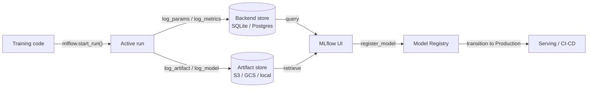

# MLflow

## Definition

MLflow ist eine Open-Source-Plattform, die darauf ausgelegt ist, den gesamten Machine-Learning-Lebenszyklus zu verwalten. Ursprünglich 2018 von Databricks veröffentlicht, ist sie dank ihrer Einfachheit, Framework-Unabhängigkeit und der Tatsache, dass sie vollständig on-premise ohne Cloud-Abhängigkeit betrieben werden kann, zu einem der am weitesten verbreiteten MLOps-Tools geworden. Ein einfaches `pip install mlflow` und eine Änderung von zwei Zeilen im Code reichen aus, um mit dem Tracking von Experimenten zu beginnen.

MLflow organisiert seine Funktionalität in vier eng integrierten Komponenten. **Tracking** erfasst Parameter, Metriken und Artefakte für jeden Trainingslauf. **Projects** verpacken ML-Code in reproduzierbare, ausführbare Einheiten, die durch eine `MLproject`-Datei definiert werden. **Models** bieten ein Standardformat zum Verpacken von Modellen, die von jedem unterstützten Deployment-Ziel bereitgestellt werden können. **Model Registry** bietet einen zentralen Modell-Store mit Lifecycle-Management (Staging-, Production-, Archived-Zustände) und Versionshistorie. Zusammen decken diese Komponenten den Weg vom rohen Experiment bis zur Produktionsbereitstellung ab.

MLflow kann lokal (SQLite-Backend, lokales Dateisystem für Artefakte), auf einem selbstverwalteten Server (PostgreSQL + S3) oder als vollständig verwalteter Dienst über Databricks Managed MLflow betrieben werden. Der Open-Source-Kern ist unter Apache 2.0 lizenziert, was ihn für regulierte Branchen geeignet macht, in denen Daten die eigene Infrastruktur nicht verlassen dürfen.

## Funktionsweise

### Tracking-Server

Wenn Sie `mlflow.start_run()` aufrufen, öffnet der Client einen Lauf auf dem Tracking-Server und beginnt damit, Logs zu puffern. Parameter (`log_param`, `log_params`) und Metriken (`log_metric`, `log_metrics`) werden in den Backend-Store (SQLite oder PostgreSQL) geschrieben. Artefakte werden in den Artefakt-Store hochgeladen (lokales Dateisystem, S3, GCS, Azure Blob, HDFS). Der Server stellt eine REST-API bereit, die vom Client-SDK und der Web-UI genutzt wird.

### MLflow Projects

Ein Projekt ist ein Verzeichnis (oder ein Git-Repository) mit einer `MLproject`-YAML-Datei, die die Einstiegspunkte, Parameter und die conda/pip-Umgebung deklariert. Das Ausführen von `mlflow run . -P lr=0.01` löst die Umgebung auf, setzt Parameter und startet den Einstiegspunkt — wodurch automatisch ein getrackte Lauf erzeugt wird. Dies macht Experimente für jeden mit Zugriff auf das Repository reproduzierbar.

### MLflow Models

Ein mit `mlflow.<flavor>.log_model()` gespeichertes Modell wird im MLmodel-Format gespeichert: ein Verzeichnis, das das serialisierte Modell, einen `MLmodel`-YAML-Deskriptor und eine `conda.yaml` / `requirements.txt` enthält. Die `pyfunc`-Variante bietet eine einheitliche `model.predict(data)`-Schnittstelle unabhängig vom zugrunde liegenden Framework, sodass dasselbe Modell von verschiedenen Serving-Backends geladen werden kann.

### Model Registry

Die Registry speichert benannte Modellversionen mit Übergangszuständen. Automatisierte CI/CD-Systeme fragen die Registry nach der neuesten `Production`-Version für die Bereitstellung ab. Menschliche Genehmiger oder automatisierte Validierungsjobs übertragen Versionen zwischen Zuständen. Jede Version verweist zurück auf ihren Quelllauf und bewahrt so die vollständige Herkunft.



## Wann verwenden / Wann NICHT verwenden

| Verwenden wenn | Vermeiden wenn |
|----------|------------|
| Eine vollständig selbst gehostete, Open-Source-MLOps-Plattform benötigt wird | Das Team umfangreiche kollaborative Funktionen (gemeinsame Berichte, Slack-Benachrichtigungen) out of the box benötigt |
| Daten die eigene Infrastruktur nicht verlassen dürfen (regulierte Branchen) | Ein SaaS-Produkt ohne eigene Infrastruktur bevorzugt wird |
| Databricks bereits verwendet wird und native Integration gewünscht ist | Der Workflow nur aus Notebooks besteht und kein Produktionsdeployment geplant ist |
| Framework-Unabhängigkeit wichtig ist (sklearn, XGBoost, PyTorch, TF usw.) | Fortgeschrittene integrierte Hyperparameter-Optimierung benötigt wird |
| Kostenkontrolle entscheidend ist und Open-Source-Lizenzierung erforderlich ist | Das Team keine Engineering-Ressourcen hat, um einen Server und Artefakt-Store zu verwalten |

## Vergleiche

| Kriterium | MLflow | Weights & Biases (W&B) |
|-----------|--------|------------------------|
| Einrichtungsaufwand | Selbst hostbar mit einem Befehl; kein Account erforderlich | SaaS; kostenloser Account erforderlich; keine Infrastruktur zu verwalten |
| UI-Qualität | Sauber, aber einfach; fokussiert auf tabellarische Metriken und Lauf-Vergleiche | Sehr poliert; exzellentes Media-Logging, benutzerdefinierte Charts, Berichte |
| Zusammenarbeit | Geteilter Server erforderlich; kein integriertes RBAC in OSS | Integrierte Team-Workspaces, Sharing-Links und rollenbasierter Zugriff |
| Preisgestaltung | Kostenlos und Open-Source; Databricks Managed MLflow kostet extra | Kostenlos für Einzelpersonen; bezahlte Pläne für Teams |
| Hyperparameter-Optimierung | Integration mit Optuna, Ray Tune extern | Sweeps integriert mit Bayesian/Grid/Random Search |

## Code-Beispiele

```python
# mlflow_full_example.py
# Full MLflow tracking example: logs params, metrics, a custom artifact,
# and registers the model in the Model Registry.
# pip install mlflow scikit-learn matplotlib

import mlflow
import mlflow.sklearn
import matplotlib.pyplot as plt
import numpy as np
from sklearn.ensemble import GradientBoostingClassifier
from sklearn.datasets import load_breast_cancer
from sklearn.model_selection import train_test_split, cross_val_score
from sklearn.metrics import (
    accuracy_score, roc_auc_score, classification_report
)
import os, tempfile, json

# ── 1. Data ──────────────────────────────────────────────────────────────────
X, y = load_breast_cancer(return_X_y=True)
X_train, X_test, y_train, y_test = train_test_split(
    X, y, test_size=0.2, stratify=y, random_state=0
)

# ── 2. Hyperparameters ────────────────────────────────────────────────────────
params = {
    "n_estimators": 200,
    "learning_rate": 0.05,
    "max_depth": 4,
    "subsample": 0.8,
    "random_state": 0,
}

# ── 3. MLflow run ─────────────────────────────────────────────────────────────
mlflow.set_experiment("breast-cancer-gbt")

with mlflow.start_run(run_name="gbt-tuned") as run:

    # Log hyperparameters
    mlflow.log_params(params)

    # Train
    clf = GradientBoostingClassifier(**params)
    clf.fit(X_train, y_train)

    # Evaluate
    y_pred = clf.predict(X_test)
    y_prob = clf.predict_proba(X_test)[:, 1]
    cv_scores = cross_val_score(clf, X_train, y_train, cv=5, scoring="roc_auc")

    metrics = {
        "accuracy": accuracy_score(y_test, y_pred),
        "roc_auc": roc_auc_score(y_test, y_prob),
        "cv_roc_auc_mean": cv_scores.mean(),
        "cv_roc_auc_std": cv_scores.std(),
    }
    mlflow.log_metrics(metrics)

    # Log a feature importance plot as an artifact
    with tempfile.TemporaryDirectory() as tmp:
        fig, ax = plt.subplots(figsize=(8, 5))
        feat_imp = clf.feature_importances_
        top_idx = np.argsort(feat_imp)[-10:]
        ax.barh(range(10), feat_imp[top_idx])
        ax.set_title("Top 10 feature importances")
        fig.tight_layout()
        plot_path = os.path.join(tmp, "feature_importance.png")
        fig.savefig(plot_path)
        plt.close(fig)
        mlflow.log_artifact(plot_path, artifact_path="plots")

        # Log classification report as JSON
        report = classification_report(y_test, y_pred, output_dict=True)
        report_path = os.path.join(tmp, "classification_report.json")
        with open(report_path, "w") as f:
            json.dump(report, f, indent=2)
        mlflow.log_artifact(report_path, artifact_path="evaluation")

    # Log and register the model
    mlflow.sklearn.log_model(
        clf,
        artifact_path="model",
        registered_model_name="breast-cancer-gbt",  # creates registry entry
    )

    print(f"Run ID  : {run.info.run_id}")
    for k, v in metrics.items():
        print(f"  {k}: {v:.4f}")

# ── 4. Load a registered model (simulates downstream serving) ─────────────────
# model_uri = "models:/breast-cancer-gbt/1"
# loaded = mlflow.sklearn.load_model(model_uri)
# print(loaded.predict(X_test[:3]))
```

## Praktische Ressourcen

- [MLflow Official Documentation](https://mlflow.org/docs/latest/index.html) — Vollständige Referenz aller vier Komponenten, REST-API und Deployment-Ziele.
- [MLflow GitHub Repository](https://github.com/mlflow/mlflow) — Quellcode, Issue-Tracker und Beispiele; nützlich zum Verstehen der Internals und für Beiträge.
- [Databricks – MLflow Tutorials](https://docs.databricks.com/en/mlflow/index.html) — Produktionsreife MLflow-Nutzung auf Databricks mit Unity Catalog-Integration.
- [Towards Data Science – MLflow in Production](https://towardsdatascience.com/deploy-mlflow-with-docker-compose-8059f16b6039) — Community-Walkthrough zur Bereitstellung eines selbst gehosteten MLflow-Servers mit Docker Compose, PostgreSQL und MinIO.

## Siehe auch

- [Experiment tracking](/docs/mlops/experiment-tracking)
- [Weights & Biases](/docs/mlops/wandb)
- [MLOps](/docs/mlops)
