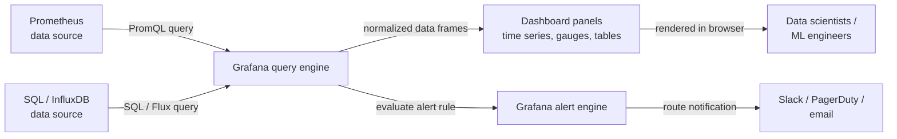

# Grafana

## Definition

Grafana ist eine Open-Source-Analyse- und interaktive Visualisierungsplattform, die sich mit einer Vielzahl von Datenquellen verbindet — [Prometheus](/docs/mlops/monitoring/prometheus), InfluxDB, Elasticsearch, Loki, PostgreSQL, Cloud-native Monitoring-APIs und Dutzende mehr — und die Daten als interaktive, teilbare Dashboards darstellt. Es verfügt über keinen eigenen Speicher; es ist eine reine Query-und-Visualisierungsschicht, die vor bestehender Dateninfrastruktur sitzt. Dieses Design macht Grafana komplementär zu jedem Zeitreihen- oder Log-Speichersystem, anstatt eines davon zu ersetzen.

In ML- und MLOps-Kontexten dient Grafana als einheitliche Observability-Oberfläche. Data Scientists und ML-Engineers nutzen es, um Modellleistungsmetriken (Genauigkeit, F1, AUC) über die Zeit zu verfolgen, Vorhersagelatenz und Durchsatz zusammen mit Infrastrukturressourcennutzung zu visualisieren und Datenqualitätssignale wie Feature-Drift-Scores zu überwachen. Da Grafana mehrere Datenquellen gleichzeitig unterstützt, kann ein einziges Dashboard Prometheus-Metriken, Anwendungslogs von Loki und Business-KPIs aus einer SQL-Datenbank kombinieren — und so einen vollständigen, kontextualisierten Überblick über das Verhalten eines Modells in der Produktion geben.

Grafana ist als selbst gehostete Open-Source-Distribution, als Grafana Cloud (ein verwaltetes SaaS-Angebot) und als Grafana Enterprise mit zusätzlichen Enterprise-Features erhältlich. Die Open-Source-Distribution ist voll funktionsfähig und ist die häufigste Wahl für Teams, die bereits Kubernetes betreiben oder Infrastructure-as-Code-Workflows haben, da Grafana-Dashboards, Datenquellenkonfigurationen und Alert-Regeln alle als JSON oder über Terraform-Provider verwaltet werden können.

## Funktionsweise

### Datenquellenkonfiguration

Grafana verbindet sich über Plugins mit Datenquellen. Ein Datenquellen-Plugin übersetzt Grafanas internes Query-Modell in die native Abfragesprache des Backends (PromQL für Prometheus, SQL für relationale Datenbanken, Lucene für Elasticsearch usw.) und gibt Daten in einem normalisierten Format zurück. Datenquellen werden in der Grafana-UI oder über Provisioning-Dateien (YAML) konfiguriert, was die Verwaltung von Konfigurationen als Code in einem Git-Repository ermöglicht. Authentifizierung, TLS und Timeout-Einstellungen sind pro Datenquelle konfigurierbar.

### Dashboard- und Panel-Komposition

Ein Grafana-Dashboard ist ein JSON-Dokument, das eine geordnete Liste von Panels enthält. Jedes Panel definiert eine Abfrage gegen eine Datenquelle, einen Visualisierungstyp (Zeitreihe, Gauge, Balkendiagramm, Tabelle, Heatmap, Stat usw.) und Anzeigeoptionen (Achsen, Schwellenwerte, Legenden, Überschreibungen). Panels können mit anderen Dashboards verknüpft werden, unterstützen Variablen (Template-Variablen ermöglichen es einem einzigen Dashboard, zwischen Umgebungen, Modellversionen oder Diensten per Dropdown zu wechseln) und können Annotationen referenzieren — Ereignisse, die als Überlagerung auf Zeitreihen-Graphen Deployments, Retraining-Läufe oder Incident-Starts markieren.

### Variablen und Templating

Template-Variablen verwandeln ein statisches Dashboard in ein dynamisches. Eine Variable fragt die Datenquelle nach einer Liste von Werten ab (z. B. alle verschiedenen `model_version`-Label-Werte aus Prometheus) und fügt den ausgewählten Wert in jede Panel-Abfrage des Dashboards ein. Damit ist es möglich, ein einziges ML-Modell-Dashboard zu erstellen, das für alle Modelle und Versionen funktioniert, anstatt für jedes Modell ein separates Dashboard zu pflegen.

### Alerting

Grafana Alerting (eingeführt in Grafana 8+) bietet einheitliche, multi-Datenquellen-Alert-Regeln, die Panel-Abfragen nach einem Zeitplan auswerten und ausgelöste Alerts an Kontaktpunkte (Slack, PagerDuty, E-Mail, Webhooks) weiterleiten. Alert-Regeln werden in Benachrichtigungsrichtlinien gruppiert, die Routing-, Gruppierungs- und Stummschaltungsverhalten bestimmen. Grafana Alerting kann neben dem Prometheus Alertmanager koexistieren oder ihn vollständig ersetzen, je nach Teampräferenz.

### Provisioning und Infrastructure as Code

Grafana unterstützt deklaratives Provisioning von Datenquellen, Dashboards und Alert-Regeln über YAML- und JSON-Dateien, die beim Start geladen werden. In Kombination mit dem Grafana-Terraform-Provider kann die gesamte Grafana-Konfiguration versioniert und über CI/CD-Pipelines deployt werden — eine kritische Fähigkeit für Teams, die mehrere Umgebungen verwalten oder reproduzierbare Monitoring-Infrastruktur wünschen.



## Wann verwenden / Wann NICHT verwenden

| Verwenden wenn | Vermeiden wenn |
|----------|------------|
| Interaktive, teilbare Dashboards über Prometheus oder andere Zeitreihendaten benötigt werden | Eine vollständige ML-Experiment-Tracking-UI benötigt wird (stattdessen MLflow oder W&B verwenden) |
| Infrastrukturmetriken mit Modellleistung in einer Ansicht korreliert werden sollen | Das Team keine bestehende Zeitreihendatenquelle hat, mit der Grafana verbunden werden kann |
| Mehrere Datenquellen (Prometheus, SQL, Loki) in einem Dashboard vereint werden sollen | Eine einfache Text- oder Tabellenübersicht ausreicht und ein Dashboard keinen Mehrwert bietet |
| Dashboards als Code via JSON oder Terraform verwaltet werden sollen | Die Organisation bereits auf eine proprietäre Observability-Plattform standardisiert ist |
| Alerting benötigt wird, das mehrere Datenquellen umfasst | Rohe Vorhersage-Logs gespeichert oder analysiert werden müssen (Grafana fragt ab, speichert nicht) |

## Vergleiche

Grafana und Prometheus ergänzen sich — Prometheus sammelt und speichert Metriken; Grafana visualisiert sie. Die folgende Tabelle vergleicht sie, um ihre unterschiedlichen Rollen zu verdeutlichen.

| Kriterium | Grafana | Prometheus |
|-----------|---------|-----------|
| Primäre Rolle | Visualisierung und Dashboarding | Metriken-Sammlung, Speicherung und Alerting |
| Datenspeicherung | Keine — fragt externe Backends ab | Lokale TSDB (pull-basiertes Scraping) |
| Abfragesprache | Abhängig von Datenquelle (PromQL, SQL usw.) | PromQL |
| Alerting | Einheitliches multi-Datenquellen-Alerting (Grafana 8+) | PromQL-basierte Regeln + Alertmanager |
| Datenquellen | 50+ Plugins (Prometheus, SQL, Loki, Cloud usw.) | Nur selbst (TSDB) |
| Gemeinsamer Einsatz | Immer — Grafana ist die UI für Prometheus-Daten | Immer — Prometheus ist das Backend für Grafana-Dashboards |

## Vor- und Nachteile

| Aspekt | Vorteile | Nachteile |
|--------|------|------|
| Multi-Datenquellen | Vereint Metriken, Logs und SQL in einem Dashboard | Konfigurationskomplexität wächst mit der Anzahl der Datenquellen |
| Dashboard-as-Code | JSON-Export und Terraform-Provider ermöglichen GitOps-Workflows | JSON-Dashboards sind ausführlich und schwer manuell zu vergleichen |
| Template-Variablen | Ein Dashboard deckt alle Modelle, Umgebungen und Versionen ab | Variablenabfragen erhöhen die Latenz beim Dashboard-Laden |
| Visualisierungsbibliothek | Umfangreiche, anpassbare Panel-Typen | Einige erweiterte Diagrammtypen erfordern Plugins oder Grafana Enterprise |
| Alerting | Einheitliche, multi-Datenquellen-Alert-Regeln | Lernkurve für Benachrichtigungsrichtlinien und Routing-Bäume |
| Selbst gehostete Option | Volle Kontrolle, keine Daten verlassen die eigene Infrastruktur | Erfordert operativen Aufwand: Upgrades, Backups, Plugin-Verwaltung |

## Code-Beispiele

```json
// grafana_ml_dashboard.json
// Grafana dashboard definition for monitoring an ML model serving endpoint.
// Import this JSON via Grafana UI: Dashboards → Import → Upload JSON file.
// Prerequisites: Prometheus data source named "Prometheus" with ml_* metrics.
{
  "title": "ML Model Monitoring",
  "description": "Dashboard for monitoring ML model latency, throughput, confidence distribution, and data drift.",
  "uid": "ml-model-monitoring-v1",
  "schemaVersion": 36,
  "version": 1,
  "refresh": "30s",
  "time": { "from": "now-3h", "to": "now" },
  "templating": {
    "list": [
      {
        "name": "model_name",
        "label": "Model",
        "type": "query",
        "datasource": { "type": "prometheus", "uid": "Prometheus" },
        "query": "label_values(ml_predictions_total, model_name)",
        "includeAll": false,
        "multi": false,
        "current": {}
      },
      {
        "name": "model_version",
        "label": "Version",
        "type": "query",
        "datasource": { "type": "prometheus", "uid": "Prometheus" },
        "query": "label_values(ml_predictions_total{model_name=\"$model_name\"}, model_version)",
        "includeAll": true,
        "multi": true,
        "current": {}
      }
    ]
  },
  "panels": [
    {
      "id": 1,
      "title": "Prediction Throughput (req/s)",
      "type": "timeseries",
      "gridPos": { "x": 0, "y": 0, "w": 12, "h": 8 },
      "datasource": { "type": "prometheus", "uid": "Prometheus" },
      "targets": [
        {
          "expr": "sum(rate(ml_predictions_total{model_name=\"$model_name\", status=\"success\"}[2m])) by (model_version)",
          "legendFormat": "{{model_version}} — success",
          "refId": "A"
        },
        {
          "expr": "sum(rate(ml_predictions_total{model_name=\"$model_name\", status=\"error\"}[2m])) by (model_version)",
          "legendFormat": "{{model_version}} — error",
          "refId": "B"
        }
      ],
      "fieldConfig": {
        "defaults": {
          "unit": "reqps",
          "custom": { "lineWidth": 2, "fillOpacity": 10 }
        }
      }
    },
    {
      "id": 2,
      "title": "P50 / P95 / P99 Prediction Latency",
      "type": "timeseries",
      "gridPos": { "x": 12, "y": 0, "w": 12, "h": 8 },
      "datasource": { "type": "prometheus", "uid": "Prometheus" },
      "targets": [
        {
          "expr": "histogram_quantile(0.50, sum(rate(ml_prediction_latency_seconds_bucket{model_name=\"$model_name\"}[2m])) by (le, model_version))",
          "legendFormat": "p50 {{model_version}}",
          "refId": "A"
        },
        {
          "expr": "histogram_quantile(0.95, sum(rate(ml_prediction_latency_seconds_bucket{model_name=\"$model_name\"}[2m])) by (le, model_version))",
          "legendFormat": "p95 {{model_version}}",
          "refId": "B"
        },
        {
          "expr": "histogram_quantile(0.99, sum(rate(ml_prediction_latency_seconds_bucket{model_name=\"$model_name\"}[2m])) by (le, model_version))",
          "legendFormat": "p99 {{model_version}}",
          "refId": "C"
        }
      ],
      "fieldConfig": {
        "defaults": {
          "unit": "s",
          "thresholds": {
            "mode": "absolute",
            "steps": [
              { "color": "green", "value": null },
              { "color": "yellow", "value": 0.1 },
              { "color": "red", "value": 0.5 }
            ]
          }
        }
      }
    },
    {
      "id": 3,
      "title": "Data Drift Score",
      "type": "gauge",
      "gridPos": { "x": 0, "y": 8, "w": 8, "h": 6 },
      "datasource": { "type": "prometheus", "uid": "Prometheus" },
      "targets": [
        {
          "expr": "ml_data_drift_score{model_name=\"$model_name\"}",
          "legendFormat": "{{feature_set}}",
          "refId": "A"
        }
      ],
      "fieldConfig": {
        "defaults": {
          "unit": "none",
          "min": 0,
          "max": 1,
          "thresholds": {
            "mode": "absolute",
            "steps": [
              { "color": "green", "value": null },
              { "color": "yellow", "value": 0.1 },
              { "color": "red", "value": 0.25 }
            ]
          }
        }
      }
    },
    {
      "id": 4,
      "title": "Prediction Confidence Distribution (heatmap)",
      "type": "heatmap",
      "gridPos": { "x": 8, "y": 8, "w": 16, "h": 6 },
      "datasource": { "type": "prometheus", "uid": "Prometheus" },
      "targets": [
        {
          "expr": "sum(rate(ml_prediction_confidence_bucket{model_name=\"$model_name\"}[5m])) by (le)",
          "legendFormat": "{{le}}",
          "refId": "A",
          "format": "heatmap"
        }
      ]
    }
  ]
}
```

## Praktische Ressourcen

- [Grafana-Dokumentation](https://grafana.com/docs/grafana/latest/) — Offizielle Dokumentation zu Installation, Datenquellen, Dashboards, Alerting und Provisioning.
- [Grafana-Dashboard-Best-Practices](https://grafana.com/docs/grafana/latest/dashboards/build-dashboards/best-practices/) — Offizieller Leitfaden zur Strukturierung effektiver Dashboards, Verwendung von Template-Variablen und Organisation von Panels.
- [Grafana-Terraform-Provider](https://registry.terraform.io/providers/grafana/grafana/latest/docs) — Grafana-Datenquellen, Dashboards und Alert-Regeln als Infrastructure-as-Code verwalten.
- [Awesome Grafana](https://github.com/monitoringartist/grafana-aws-cloudwatch-dashboards) — Community-kuratierte Sammlung vorgefertigter Grafana-Dashboards für gängige Infrastruktur-Stacks.
- [Grafana Labs Blog — ML-Observability](https://grafana.com/blog/2021/08/09/how-to-monitor-machine-learning-models-with-grafana/) — Praktische Anleitung zur Einrichtung von ML-Modell-Monitoring-Dashboards mit Grafana und Prometheus.

## Siehe auch

- [Prometheus](/docs/mlops/monitoring/prometheus)
- [ML-Monitoring](/docs/mlops/monitoring)
- [MLOps](/docs/mlops)
