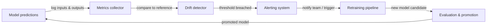

# ML-Monitoring

## Definition

ML-Monitoring ist die Praxis der kontinuierlichen Beobachtung von Machine-Learning-Modellen und der Daten, auf denen sie nach dem Deployment operieren. Im Gegensatz zu traditioneller Software, die entweder funktioniert oder einen Fehler auslöst, kann ein Modell still degradieren: Es erzeugt weiterhin Ausgaben, aber diese Ausgaben werden zunehmend falsch, da sich die Welt verändert. ML-Monitoring bietet die Frühwarnsysteme, die diese Degradation erkennen, bevor sie Geschäftsschaden verursacht.

Drei Phänomene treiben den größten Teil der Modellverschlechterung in der Produktion an. **Concept Drift** tritt auf, wenn sich die statistische Beziehung zwischen Eingabe-Features und der Zielvariablen ändert — ein Betrugserkennungsmodell, das vor dem Auftreten eines neuen Angriffsvektors trainiert wurde, wird das neue Muster systematisch verfehlen. **Data Drift** (auch Covariate Shift genannt) tritt auf, wenn sich die Verteilung der Eingabe-Features ändert, ohne eine entsprechende Änderung der Zielbeziehung — saisonale Muster, demografische Verschiebungen und Upstream-Datenpipeline-Änderungen verursachen alle Data Drift. **Modellverfall** ist der kumulative Leistungsverlust, der aus einem oder beiden dieser Drifts resultiert; unkontrolliert manifestiert er sich als steigende Fehlerraten, sinkende Einnahmen und verschlechterte Benutzererfahrungen.

Effektives ML-Monitoring erstreckt sich über drei Ebenen: **Datenqualitäts-Monitoring** (Schema, Null-Raten, Wertebereiche), **Verteilungs-Monitoring** (statistische Tests auf Drift in Features und Vorhersagen) und **Modellleistungs-Monitoring** (Business- und ML-Metriken berechnet gegen Ground Truth, wenn Labels verfügbar sind). Die Kombination aller drei Ebenen bietet Defense-in-Depth — frühzeitiges Auffangen von Problemen, an ihrer Quelle und in ihrer nachgelagerten Wirkung.

## Funktionsweise

### Daten- und Vorhersageerfassung

Jede Vorhersageanfrage durchläuft eine instrumentierte Serving-Schicht, die Eingaben, Ausgaben, Zeitstempel und Metadaten in einem zentralisierten Store protokolliert (Object Storage, ein Data Warehouse oder eine Streaming-Plattform wie Kafka). Referenz-Datensätze — typischerweise der Trainings- oder Validierungsdatensatz — werden neben Produktionsprotokollen gespeichert, um als statistische Basis für Drift-Berechnungen zu dienen. Label-Pipelines nehmen verzögerte Ground Truth auf (Labels kommen oft Stunden oder Wochen nach der Vorhersage an) und fügen sie den protokollierten Vorhersagen wieder hinzu.

### Drift-Erkennung

Drift-Detektoren vergleichen die aktuelle Produktionsverteilung mit der Referenz-Baseline mithilfe statistischer Tests. Für kontinuierliche Features messen der Population Stability Index (PSI), der Kolmogorov-Smirnov-Test oder die Wasserstein-Distanz Verteilungsänderungen. Für kategoriale Features sind Chi-Quadrat-Tests oder Jensen-Shannon-Divergenz üblich. Vorhersagen selbst werden als Feature behandelt: Eine Verschiebung in der Vorhersageverteilung (z. B. ein Klassifikator, der plötzlich 80% der Zeit "positiv" ausgibt, wenn die Basis 30% war) ist ein starkes Frühsignal, bevor Ground-Truth-Labels ankommen.

### Berechnung von Leistungsmetriken

Wenn Ground-Truth-Labels verfügbar sind, werden Leistungsmetriken über rollende Fenster oder zeitbasierte Kohorten berechnet. Genauigkeit, Präzision, Recall, F1, RMSE und AUC-ROC sind gängige ML-Metriken. Business-Metriken — Umsatz, der auf modellgesteuerte Entscheidungen zurückzuführen ist, Call-Deflection-Rate, Empfehlungs-Click-Through — sind oft handlungsfähiger. Latenz, Durchsatz und Fehlerraten sind Infrastrukturmetriken, die den Serving-Gesundheitszustand anzeigen und neben der Modellqualität überwacht werden sollten.

### Alerting und Eskalation

Schwellenwerte und Anomalieerkennungsregeln feuern Alerts, wenn eine Metrik eine Grenze überschreitet. Statische Schwellenwerte sind einfach, aber spröde; statistische Prozesskontrolle (z. B. Kontrollkarten) und ML-basierte Anomalieerkennung passen sich an Saisonalität an. Alerts routen zu PagerDuty, Slack oder E-Mail je nach Schweregrad. Gut gestaltete Alert-Hierarchien unterscheiden zwischen informativen Ereignissen (nur protokollieren), Warnungen (ML-Team benachrichtigen) und kritischen Ereignissen (On-Call pagen, automatischen Rollback oder Nachtraining auslösen).

### Nachtraining-Feedback-Schleife

Monitoring ist der Input für die Nachtraining-Schleife. Wenn Drift erkannt wird oder die Leistung unter einen Schwellenwert fällt, löst eine automatisierte Pipeline (oder eine menschliche Entscheidung) einen Nachtraining-Job auf neuen Daten aus. Nach dem Nachtraining durchläuft der neue Modellkandidat Evaluierungsgates vor der Promotion und schließt damit die Schleife.



## Wann verwenden / Wann NICHT verwenden

| Verwenden wenn | Vermeiden wenn |
|----------|------------|
| Ein Modell in der Produktion bereitgestellt wird und echte Nutzer bedient | Das Modell eine einmalige Analyse ist, die nie wieder verwendet wird |
| Modellentscheidungen messbaren Geschäftseinfluss haben | Das Vorhersagevolumen so gering ist, dass statistische Tests keine Aussagekraft haben |
| Ground-Truth-Labels schließlich verfügbar sind | Kein Feedback-Mechanismus zum Sammeln von Labels oder Geschäftsergebnissen vorhanden ist |
| Regulatorische Anforderungen auditierbare Modellleistung verlangen | Die Kosten für Monitoring-Werkzeuge den erwarteten Mehrwert des bereitgestellten Modells übersteigen |
| Der datengenierende Prozess bekanntermaßen sich im Laufe der Zeit ändert | Das Modell kontinuierlich nachtrainiert wird und Drift implizit behandelt wird |
| Mehrere Modelle gleichzeitig in der Produktion sind | Ein Mensch jede Vorhersage einzeln überprüft, was automatisiertes Monitoring überflüssig macht |

## Vergleiche

| Werkzeug | Hauptfokus | Drift-Erkennung | Leistungsverfolgung | Hosting |
|------|--------------|-----------------|---------------------|---------|
| Evidently AI | Daten- und Modellqualitätsberichte | Ja (30+ Tests) | Ja | Self-hosted / Cloud |
| WhyLabs | LLM- und ML-Beobachtbarkeit | Ja (statistisch) | Ja | SaaS |
| Arize AI | ML-Beobachtbarkeitsplattform | Ja | Ja | SaaS |
| Benutzerdefinierte Dashboards | Vollständig maßgeschneidert | Manuelle Implementierung | Manuelle Implementierung | Self-hosted |
| MLflow | Experiment-Tracking + grundlegendes Monitoring | Begrenzt | Ja (offline) | Self-hosted / Cloud |

## Vor- und Nachteile

| Aspekt | Vorteile | Nachteile |
|--------|------|------|
| Concept-Drift-Erkennung | Fängt Modellverfall vor Geschäftsauswirkungen ab | Erfordert Ground-Truth-Labels, die mit Verzögerung ankommen |
| Data-Drift-Erkennung | Funktioniert ohne Labels — erkennt Probleme früh | Kann falsch-positive Ergebnisse bei harmlosen Verteilungsverschiebungen erzeugen |
| Automatisiertes Alerting | Reduziert Zeit-zu-Erkennung von Wochen auf Minuten | Schlecht eingestellte Schwellenwerte verursachen Alert-Übersättigung |
| Werkzeug-Ökosystem | Reiche Open-Source- und SaaS-Optionen | Fügt Infrastrukturkomplexität und Wartungsaufwand hinzu |
| Nachtraining-Trigger | Schließt die Schleife automatisch | Risiko von Trainingsinstabilität, wenn Nachtraining zu häufig ausgelöst wird |

## Code-Beispiele

```python
# drift_detection.py
# Demonstrates concept and data drift detection using Evidently AI.
# Run: pip install evidently scikit-learn pandas numpy

import numpy as np
import pandas as pd
from sklearn.datasets import make_classification
from sklearn.ensemble import RandomForestClassifier
from sklearn.model_selection import train_test_split

from evidently.report import Report
from evidently.metric_preset import DataDriftPreset, ClassificationPreset
from evidently import ColumnMapping

# --- 1. Simulate reference (training) data ---
X, y = make_classification(
    n_samples=1000,
    n_features=10,
    n_informative=5,
    random_state=42,
)
feature_names = [f"feature_{i}" for i in range(10)]
df = pd.DataFrame(X, columns=feature_names)
df["target"] = y

X_train, X_test, y_train, y_test = train_test_split(
    df[feature_names], df["target"], test_size=0.2, random_state=42
)

# --- 2. Train a simple classifier ---
clf = RandomForestClassifier(n_estimators=100, random_state=42)
clf.fit(X_train, y_train)

# Build reference DataFrame with predictions
reference = X_test.copy()
reference["target"] = y_test.values
reference["prediction"] = clf.predict(X_test)

# --- 3. Simulate production data with drift ---
# Introduce feature shift: scale feature_0 to simulate distribution change
X_prod, y_prod = make_classification(
    n_samples=500,
    n_features=10,
    n_informative=5,
    random_state=99,  # Different seed = different distribution
)
df_prod = pd.DataFrame(X_prod, columns=feature_names)
df_prod["feature_0"] = df_prod["feature_0"] * 3.0  # Artificial drift on feature_0
df_prod["target"] = y_prod

production = df_prod[feature_names].copy()
production["target"] = df_prod["target"].values
production["prediction"] = clf.predict(df_prod[feature_names])

# --- 4. Run Evidently drift + performance report ---
column_mapping = ColumnMapping(
    target="target",
    prediction="prediction",
    numerical_features=feature_names,
)

report = Report(metrics=[DataDriftPreset(), ClassificationPreset()])
report.run(
    reference_data=reference,
    current_data=production,
    column_mapping=column_mapping,
)

# Save HTML report for inspection
report.save_html("drift_report.html")
print("Drift report saved to drift_report.html")

# --- 5. Extract drift results programmatically ---
result = report.as_dict()
drift_summary = result["metrics"][0]["result"]
n_drifted = drift_summary.get("number_of_drifted_columns", 0)
total = drift_summary.get("number_of_columns", 0)
share = drift_summary.get("share_of_drifted_columns", 0)

print(f"Drifted columns: {n_drifted}/{total} ({share:.1%})")
if share > 0.3:
    print("WARNING: Significant drift detected — consider retraining.")
else:
    print("Drift within acceptable bounds.")
```

## Praktische Ressourcen

- [Evidently AI-Dokumentation](https://docs.evidentlyai.com/) — Offizielle Dokumentation der führenden Open-Source-ML-Monitoring-Bibliothek, mit Drift-Tests, Berichten und Echtzeit-Monitoring.
- [WhyLabs ML-Beobachtbarkeitsplattform](https://whylabs.ai/docs) — SaaS-Plattform-Dokumentation für das Monitoring von LLM- und ML-Modellen mit statistischem Profiling und Alerting.
- [Chip Huyen — Monitoring ML models in production](https://huyenchip.com/2022/02/07/data-distribution-shifts-and-monitoring.html) — Ausführlicher Blogbeitrag zu Datenverteilungsverschiebungen, Monitoring-Strategien und praktischen Kompromissen.
- [Google — Rules of Machine Learning: monitoring section](https://developers.google.com/machine-learning/guides/rules-of-ml#monitoring) — Googles Engineering-Leitlinien dazu, was überwacht werden soll und wie Alerts für Produktions-ML eingerichtet werden.
- [Arize AI — ML observability guide](https://arize.com/ml-observability/) — Praktikerhandbuch zu Drift, Embeddings-Monitoring und dem Beobachtbarkeits-Stack für ML.

## Siehe auch

- [Prometheus](/docs/mlops/monitoring/prometheus)
- [Grafana](/docs/mlops/monitoring/grafana)
- [Model Serving](/docs/mlops/deployment/model-serving)
