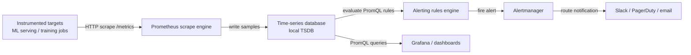

# Prometheus

## Definition

Prometheus ist ein Open-Source-System-Monitoring- und Alerting-Toolkit, das ursprünglich bei SoundCloud entwickelt wurde und jetzt ein abgeschlossenes CNCF-Projekt ist. Es speichert alle Daten als Zeitreihen: Ströme von zeitgestempelten Gleitkomma-Werten, identifiziert durch einen Metriknamen und einen Satz von Schlüssel-Wert-Labels. Dieses Modell eignet sich natürlich für operative Daten — CPU-Auslastung, Anfragezahlen, Fehlerraten — und für ML-spezifische Signale wie Vorhersagelatenz, Durchsatz und Feature-Wertverteilungen im Zeitverlauf.

Die definierende Architekturrentscheidung in Prometheus ist sein **pull-basiertes Scraping-Modell**. Anstatt instrumentierte Anwendungen zu zwingen, Metriken an einen zentralen Collector zu pushen, scrapt Prometheus periodisch HTTP-Endpunkte (standardmäßig `/metrics`), die von Zielen bereitgestellt werden. Diese Umkehrung der Kontrolle macht Service-Discovery, Zugriffskontrolle und Debugging erheblich einfacher: Man kann den Metriken-Endpunkt jedes Ziels direkt aufrufen, um zu sehen, was Prometheus sammeln wird. Ziele werden über statische Konfiguration oder dynamische Service-Discovery (Kubernetes, Consul, EC2 usw.) entdeckt.

Prometheus ist konzeptionell keine Langzeitspeicherlösung. Seine lokale Zeitreihendatenbank (TSDB) ist für schnelle Aufnahme und Abfrage aktueller Daten optimiert und behält typischerweise 15 Tage bei. Für Langzeitspeicherung kann Prometheus remote-schreiben in Systeme wie Thanos, Cortex oder VictoriaMetrics. In ML-Kontexten ist Prometheus die Erfassungs- und Alerting-Schicht; [Grafana](/docs/mlops/monitoring/grafana) bietet die Visualisierungs- und Dashboarding-Schicht darauf.

## Funktionsweise

### Ziel-Instrumentierung

Anwendungen stellen Metriken über einen HTTP-`/metrics`-Endpunkt im Prometheus-Expositionsformat bereit — ein Klartext-Format von `metric_name{label="value"} numeric_value timestamp`-Zeilen. In Python bietet die `prometheus_client`-Bibliothek Counter-, Gauge-, Histogram- und Summary-Typen, die das Expositionsformat automatisch handhaben. Ein ML-Serving-Prozess stellt typischerweise Counter für gesamte Vorhersageanfragen, Histogramme für Anfrage-Latenz und Gauges für aktuell geladene Modellversionen und Ressourcenauslastung bereit.

### Scraping und Speicherung

Prometheus wertet seine Konfigurationsdatei aus, um zu bestimmen, welche Ziele gescrapt werden und in welchem Intervall (Standard: 15 Sekunden). Bei jedem Scraping ruft er den `/metrics`-Endpunkt ab, parst das Expositionsformat und schreibt die Samples in seine lokale TSDB in komprimierten Chunks. Die TSDB verwendet ein Write-Ahead-Log (WAL) für Dauerhaftigkeit und komprimiert Daten im Laufe der Zeit in Blöcke. Label-Kardinalität ist der Hauptleistungshebel: Jede eindeutige Kombination von Label-Werten erstellt eine separate Zeitreihe, sodass unbegrenzte Labels (z. B. Nutzer-IDs) vermieden werden müssen.

### PromQL-Abfragen und Alerting

PromQL (Prometheus Query Language) ist eine funktionale Abfragesprache zur Auswahl und Aggregation von Zeitreihendaten. Instant-Vektoren wählen den aktuellen Wert einer Reihe von Serien aus; Range-Vektoren wählen ein Fenster von Samples aus; Funktionen berechnen Raten, Durchschnitte, Quantile und Vorhersagen über diese Vektoren. Alert-Regeln sind PromQL-Ausdrücke, die in einem konfigurierbaren Intervall ausgewertet werden; wenn ein Ausdruck ein nicht-leeres Ergebnis zurückgibt, feuert der Alert und wird an Alertmanager gesendet.

### Alertmanager

Alertmanager empfängt Alerts von Prometheus (und anderen Quellen), dedupliziert sie, wendet Gruppierungs- und Routing-Regeln an und sendet Benachrichtigungen an Empfänger (PagerDuty, Slack, E-Mail, Webhooks). Silences und Inhibierungsregeln verhindern Alert-Stürme während bekannter Wartungsfenster oder kaskadierende Fehler. In ML-Systemen routet Alertmanager Modell-Degradations-Alerts an den Slack-Kanal des ML-Teams, während Infrastruktur-Alerts (hohe CPU, OOM-Kills) an das Plattformteam gehen.

### Remote-Speicherung und Federation

Für Multi-Cluster- oder Langzeit-Retention-Szenarien schreibt Prometheus Samples remote an ein dauerhaftes Backend. Federation ermöglicht einem globalen Prometheus, aggregierte Metriken von regionalen Prometheus-Instanzen zu scrapen. Beide Muster sind in großen ML-Plattformen üblich, wo Trainingscluster und Serving-Cluster jeweils ihren eigenen Prometheus betreiben und eine zentrale Instanz Service-Level-Metriken aggregiert.



## Wann verwenden / Wann NICHT verwenden

| Verwenden wenn | Vermeiden wenn |
|----------|------------|
| Operative Metriken für ML-Serving-Infrastruktur benötigt werden (Latenz, Durchsatz, Fehlerrate) | Rohe Vorhersage-Logs oder High-Cardinality-Ereignisdaten gespeichert werden müssen |
| Ein pull-basierter, self-gehosteter Monitoring-Stack ohne Vendor Lock-in gewünscht wird | Das Team nicht die Infrastrukturerfahrung hat, einen Prometheus-Stack zu betreiben und zu tunen |
| Auf Kubernetes betrieben wird und native Service-Discovery gewünscht wird | Langzeit-Retention (>15 Tage) ohne zusätzliches Remote-Storage-Setup benötigt wird |
| Leistungsstarkes Alerting mit Deduplizierung und Routing via Alertmanager benötigt wird | Sub-Sekunden-Scrape-Intervalle benötigt werden; Prometheus ist für 10–60-Sekunden-Intervalle ausgelegt |
| Ein Standard-Backend für Grafana-Dashboards benötigt wird | Die Anwendung unbegrenzte Label-Kardinalität generiert, die die TSDB-Leistung verschlechtern wird |

## Vergleiche

Prometheus und Grafana sind komplementäre, nicht konkurrierende Werkzeuge. Die folgende Tabelle beschreibt, wann sie zusammen vs. Alternativen verwendet werden sollen.

| Kriterium | Prometheus | Grafana |
|-----------|-----------|---------|
| Rolle | Metriken erfassen, speichern und darüber alerting | Metriken aus jeder Datenquelle visualisieren und erkunden |
| Abfragesprache | PromQL (metriken-optimierte funktionale Sprache) | Pro-Datenquelle (PromQL für Prometheus, SQL für andere) |
| Alerting | Eingebaute Alert-Regeln + Alertmanager | Grafana Alerting (einheitlich, Multi-Datenquelle) |
| Datenquellen | Selbst (TSDB) | Prometheus, InfluxDB, Loki, Elasticsearch, Datenbanken usw. |
| Speicherung | Lokale TSDB, Remote-Write für Langzeit | Kein Speicher — reine Query- und Visualisierungsschicht |
| Wann zusammen verwenden | Immer — Prometheus sammelt, Grafana zeigt | Immer — Grafana als UI für Prometheus-Daten verwenden |

## Vor- und Nachteile

| Aspekt | Vorteile | Nachteile |
|--------|------|------|
| Pull-basierte Architektur | Einfaches Debugging, Zugriffskontrolle auf Ziel-Ebene | Erfordert, dass Ziele HTTP-Endpunkte bereitstellen |
| PromQL | Ausdrucksstark, komposierbar, zweckorientiert für Metriken | Steile Lernkurve im Vergleich zu SQL |
| Lokale TSDB | Schnelle Aufnahme und Abfrage für aktuelle Daten | Begrenzte Retention; Remote-Storage für Langzeit erforderlich |
| Label-Modell | Flexible mehrdimensionale Filterung und Aggregation | Hohe Kardinalitätslabels verursachen Speicher- und Abfrageleistungsprobleme |
| Alertmanager | Umfangreiches Routing, Gruppierung und Stilling | Separate Komponente zu betreiben; Konfiguration kann komplex werden |
| Ökosystem | Große Bibliothek von Exportern und Client-Bibliotheken | Operativer Overhead für self-hosted Deployments |

## Code-Beispiele

```python
# ml_metrics_server.py
# Exposes ML model metrics via prometheus_client for Prometheus scraping.
# Run: pip install prometheus_client flask scikit-learn numpy
# Then configure Prometheus to scrape localhost:8000

import time
import threading
import random
import numpy as np
from prometheus_client import (
    Counter,
    Histogram,
    Gauge,
    start_http_server,
    REGISTRY,
)
from sklearn.datasets import load_iris
from sklearn.ensemble import RandomForestClassifier

# --- Define metrics ---

PREDICTION_COUNTER = Counter(
    "ml_predictions_total",
    "Total number of prediction requests",
    ["model_name", "model_version", "status"],  # labels
)

PREDICTION_LATENCY = Histogram(
    "ml_prediction_latency_seconds",
    "Prediction request latency in seconds",
    ["model_name", "model_version"],
    buckets=[0.005, 0.01, 0.025, 0.05, 0.1, 0.25, 0.5, 1.0, 2.5],
)

MODEL_CONFIDENCE = Histogram(
    "ml_prediction_confidence",
    "Distribution of model prediction confidence scores",
    ["model_name", "model_version"],
    buckets=[0.1, 0.2, 0.3, 0.4, 0.5, 0.6, 0.7, 0.8, 0.9, 1.0],
)

ACTIVE_MODEL_VERSION = Gauge(
    "ml_active_model_version",
    "Currently active model version (encoded as numeric)",
    ["model_name"],
)

DATA_DRIFT_SCORE = Gauge(
    "ml_data_drift_score",
    "Current data drift score (PSI) for the primary feature set",
    ["model_name", "feature_set"],
)

# --- Load and train a simple model ---
X, y = load_iris(return_X_y=True)
clf = RandomForestClassifier(n_estimators=50, random_state=42)
clf.fit(X, y)

MODEL_NAME = "iris-classifier"
MODEL_VERSION = "1.0.0"
ACTIVE_MODEL_VERSION.labels(model_name=MODEL_NAME).set(1)


def simulate_prediction(features: np.ndarray) -> dict:
    """Run a prediction and record Prometheus metrics."""
    start = time.time()
    try:
        proba = clf.predict_proba(features.reshape(1, -1))[0]
        predicted_class = int(np.argmax(proba))
        confidence = float(np.max(proba))

        # Record latency and confidence
        duration = time.time() - start
        PREDICTION_LATENCY.labels(
            model_name=MODEL_NAME, model_version=MODEL_VERSION
        ).observe(duration)
        MODEL_CONFIDENCE.labels(
            model_name=MODEL_NAME, model_version=MODEL_VERSION
        ).observe(confidence)
        PREDICTION_COUNTER.labels(
            model_name=MODEL_NAME,
            model_version=MODEL_VERSION,
            status="success",
        ).inc()

        return {"class": predicted_class, "confidence": confidence}
    except Exception as exc:
        PREDICTION_COUNTER.labels(
            model_name=MODEL_NAME,
            model_version=MODEL_VERSION,
            status="error",
        ).inc()
        raise exc


def simulate_drift_monitoring():
    """Periodically update a synthetic drift score gauge."""
    while True:
        # In production this would run a real PSI/KS test
        drift_score = random.uniform(0.01, 0.35)
        DATA_DRIFT_SCORE.labels(
            model_name=MODEL_NAME, feature_set="sepal"
        ).set(drift_score)
        time.sleep(30)


def simulate_traffic():
    """Generate synthetic prediction traffic for demonstration."""
    samples = X[np.random.choice(len(X), size=10)]
    for sample in samples:
        simulate_prediction(sample)
        time.sleep(random.uniform(0.05, 0.3))


if __name__ == "__main__":
    # Start Prometheus metrics HTTP server on port 8000
    start_http_server(8000)
    print("Prometheus metrics server running on http://localhost:8000/metrics")
    print("Configure Prometheus to scrape this endpoint.")

    # Start background drift monitor
    drift_thread = threading.Thread(target=simulate_drift_monitoring, daemon=True)
    drift_thread.start()

    # Simulate continuous prediction traffic
    print("Simulating prediction traffic...")
    while True:
        simulate_traffic()
        time.sleep(1)
```

## Praktische Ressourcen

- [Prometheus-Dokumentation](https://prometheus.io/docs/introduction/overview/) — Offizielle Dokumentation zu Architektur, Konfiguration, PromQL, Alerting und Best Practices.
- [prometheus_client Python-Bibliothek](https://github.com/prometheus/client_python) — Offizieller Python-Client zur Instrumentierung von Anwendungen; deckt alle Metriktypen und das Expositionsformat ab.
- [PromQL Cheat Sheet](https://promlabs.com/promql-cheat-sheet/) — Prägnante Referenz für PromQL-Operatoren, Funktionen und gängige Muster.
- [Robust Perception — Monitoring with Prometheus](https://www.robustperception.io/blog/) — Brian Brazils ausführlicher Blog zu Prometheus-Interna, PromQL-Mustern und operativen Ratschlägen.
- [Awesome Prometheus](https://github.com/roaldnefs/awesome-prometheus) — Kuratierte Liste von Prometheus-Exportern, Dashboards und Community-Ressourcen.

## Siehe auch

- [Grafana](/docs/mlops/monitoring/grafana)
- [ML-Monitoring](/docs/mlops/monitoring)
- [Model Serving](/docs/mlops/deployment/model-serving)
