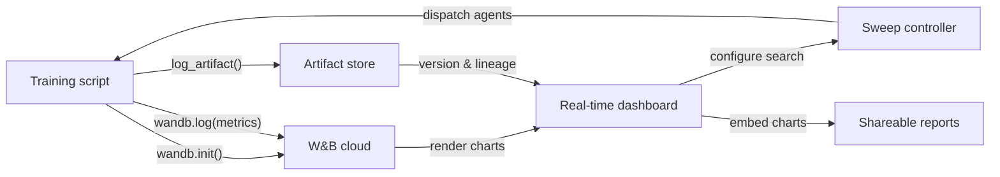

# Weights & Biases (W&B)

## Definition

Weights & Biases (allgemein als W&B oder wandb abgekürzt) ist eine Cloud-native MLOps-Plattform, die Experiment-Tracking, Dataset- und Modell-Versionierung, Hyperparameter-Optimierung und interaktives Reporting in einem integrierten Produkt vereint. 2017 gegründet und sowohl in der akademischen Forschung als auch in der Industrie weit verbreitet, ist W&B besonders beliebt bei Teams, die Deep-Learning-Modelle trainieren, die reichhaltige Media-Ausgaben erzeugen — Bilder, Audio, Video, Punktwolken — die von einer visuellen Inspektion während des Trainings profitieren.

Das Kernwertversprechen von W&B ist, dass nahezu keine Infrastruktur zum Einstieg benötigt wird: Man meldet sich für einen kostenlosen Account an, installiert das `wandb` Python-Paket, fügt `wandb.init()` zum Skript hinzu, und alles wird automatisch in der W&B-Cloud protokolliert. Die Plattform ist in **Projekte** (Sammlungen verwandter Läufe), **Runs** (einzelne Trainingsausführungen), **Artifacts** (versionierte Datasets und Modelldateien), **Sweeps** (automatisierte Hyperparameter-Suche) und **Reports** (teilbare narrative Dokumente mit eingebetteten Live-Charts) gegliedert.

Im Gegensatz zu selbst gehosteten Lösungen wie MLflow verwaltet W&B die gesamte Backend-Infrastruktur. Dies eliminiert den operativen Aufwand, bedeutet aber, dass Daten das eigene Gelände verlassen — ein relevanter Aspekt für regulierte Branchen. W&B bietet private Cloud- und On-Premise-Deployment-Optionen für Enterprise-Kunden mit Datenhaltungsanforderungen, die jedoch einen bezahlten Plan erfordern.

## Funktionsweise

### Initialisierung und Auto-Logging

Der Aufruf von `wandb.init(project="...", config={...})` startet einen Lauf, sendet die Konfiguration an W&B und gibt ein Run-Objekt zurück. Viele beliebte Frameworks (PyTorch Lightning, Hugging Face Trainer, Keras, XGBoost, scikit-learn) bieten W&B-Callbacks oder -Integrationen, die Gradienten, Lernraten-Schedules und Evaluierungsmetriken ohne zusätzlichen Code automatisch protokollieren. Im Hintergrund bündelt und komprimiert ein Hintergrund-Thread Logdaten, bevor er sie über HTTPS sendet, um den Trainingsoverhead zu minimieren.

### Echtzeit-Dashboards

Die W&B-UI rendert Metrik-Kurven, Systemauslastung (GPU/CPU/Speicher) und Medien, während der Lauf läuft. Mehrere Läufe können im selben Chart mit automatischer Farbkodierung überlagert werden. Läufe können nach jeder Konfigurations-Dimension gefiltert und gruppiert werden (z.B. nach Lernrate gruppieren, um deren Effekt über alle Experimente hinweg zu sehen), was eine schnelle visuelle Diagnose ermöglicht.

### Sweeps

Ein Sweep wird durch ein YAML oder Python-Dict definiert, das den Suchraum, die Suchstrategie (Grid, Random oder Bayesian) und Stoppkriterien festlegt. Der W&B-Sweep-Controller koordiniert mehrere parallel laufende Agenten, die jeweils Hyperparameter-Kombinationen vom Controller aufgreifen und Ergebnisse zurückprotokollieren. Bayesian Search passt sich basierend auf beobachteten Ergebnissen an und konvergiert schneller als Grid Search.

### Artifacts

W&B Artifacts versionieren Datasets, Modell-Checkpoints und Evaluierungsausgaben als inhaltsadressierte Objekte. Ein Artifact ist mit dem Lauf verknüpft, der es produziert hat, und mit den Läufen, die es konsumiert haben, wodurch ein Daten-Lineage-Graph entsteht. Mit zwei Python-Zeilen kann eine bestimmte Artifact-Version heruntergeladen werden, was die Reproduzierbarkeit von Datasets und Modellen so einfach macht wie die Angabe eines Versions-Strings.

### Reports

Reports sind interaktive Dokumente, die Live-W&B-Charts, Run-Vergleiche und Markdown-Narrative einbetten. Sie sind die primäre Kollaborationsfläche: Ein Forscher kann einen Report-Link in einer Slack-Nachricht oder einem GitHub-PR teilen, um reproduzierbare experimentelle Belege ohne den Export statischer Bilder zu teilen.



## Wann verwenden / Wann NICHT verwenden

| Verwenden wenn | Vermeiden wenn |
|----------|------------|
| Deep-Learning-Modelle trainiert werden und reichhaltiges Media-Logging benötigt wird | Daten das Gelände nicht verlassen dürfen und kein Enterprise-On-Premise-Plan erschwinglich ist |
| Team-Zusammenarbeit, Ergebnis-Sharing und narrative Reports wichtig sind | Eine vollständig Open-Source-, selbst gehostete Lösung ohne SaaS-Abhängigkeit benötigt wird |
| Integrierte Hyperparameter-Optimierung ohne zusätzliche Werkzeuge gewünscht wird | Experimente einfach sind und der Overhead eines SaaS-Accounts nicht gerechtfertigt ist |
| Das Team in der Forschung oder Wissenschaft arbeitet und von einem kostenlosen Zugang profitiert | Das Budget knapp ist und die Funktionen des bezahlten Tiers für die Teamgröße notwendig sind |

## Vergleiche

| Kriterium | W&B | MLflow |
|-----------|-----|--------|
| Einrichtungsaufwand | Kostenloser SaaS-Account; keine Infra; `wandb login` + zwei Codezeilen | Lokal selbst hostbar; kein Account; `mlflow ui` zum Starten |
| UI-Qualität | Poliert, interaktiv; für visuelle und medienintensive Workloads gebaut | Sauber und funktional; besser für tabellarischen Metrik-Vergleich |
| Zusammenarbeit | Native Team-Workspaces, Reports, Sharing-Links, Slack-Integration | Erfordert geteilten Server; keine integrierten Kollaborationsfunktionen in OSS |
| Preisgestaltung | Kostenlos für Einzelpersonen; bezahlt für größere Teams; Enterprise für On-Prem | Kostenlos und Open-Source; Databricks Managed MLflow kostet extra |
| Hyperparameter-Optimierung | Sweeps integriert mit Bayesian/Grid/Random + Early Stopping | Erfordert externe Werkzeuge (Optuna, Ray Tune) |

## Code-Beispiele

```python
# wandb_tracking_example.py
# W&B experiment tracking: logs config, metrics, images, and registers a model artifact.
# pip install wandb scikit-learn matplotlib Pillow

import wandb
import numpy as np
import matplotlib.pyplot as plt
from sklearn.ensemble import RandomForestClassifier
from sklearn.datasets import load_digits
from sklearn.model_selection import train_test_split
from sklearn.metrics import (
    accuracy_score, f1_score, confusion_matrix, ConfusionMatrixDisplay
)
import os, tempfile

run = wandb.init(
    project="digits-classification",
    name="random-forest-v1",
    config={
        "n_estimators": 150,
        "max_depth": 12,
        "min_samples_split": 4,
        "random_state": 7,
        "dataset": "sklearn-digits",
    },
)
cfg = wandb.config

X, y = load_digits(return_X_y=True)
X_train, X_test, y_train, y_test = train_test_split(
    X, y, test_size=0.2, stratify=y, random_state=cfg.random_state
)

clf = RandomForestClassifier(
    n_estimators=cfg.n_estimators,
    max_depth=cfg.max_depth,
    min_samples_split=cfg.min_samples_split,
    random_state=cfg.random_state,
)
clf.fit(X_train, y_train)

y_pred = clf.predict(X_test)
metrics = {
    "accuracy": accuracy_score(y_test, y_pred),
    "f1_macro": f1_score(y_test, y_pred, average="macro"),
    "n_train": len(X_train),
    "n_test": len(X_test),
}
wandb.log(metrics)

cm = confusion_matrix(y_test, y_pred)
fig, ax = plt.subplots(figsize=(8, 8))
ConfusionMatrixDisplay(cm).plot(ax=ax)
ax.set_title("Confusion Matrix – digits RF")
wandb.log({"confusion_matrix": wandb.Image(fig)})
plt.close(fig)

import joblib

with tempfile.TemporaryDirectory() as tmp:
    model_path = os.path.join(tmp, "model.joblib")
    joblib.dump(clf, model_path)

    artifact = wandb.Artifact(
        name="digits-rf-model",
        type="model",
        description="Random Forest trained on sklearn digits dataset",
        metadata=dict(metrics),
    )
    artifact.add_file(model_path)
    run.log_artifact(artifact)

run.finish()
print(f"Accuracy: {metrics['accuracy']:.4f} | F1 macro: {metrics['f1_macro']:.4f}")
print(f"View run at: {run.url}")
```

## Praktische Ressourcen

- [W&B Official Documentation](https://docs.wandb.ai/) — Vollständige Referenz für das Python-SDK, Integrationen, Sweeps, Artifacts und Reports.
- [W&B Quickstart](https://docs.wandb.ai/quickstart) — Protokollieren Sie Ihren ersten W&B-Lauf in unter fünf Minuten mit einem minimalen Beispiel.
- [W&B Sweeps Documentation](https://docs.wandb.ai/guides/sweeps) — Umfassender Leitfaden zur Konfiguration und Ausführung verteilter Hyperparameter-Suchen.
- [W&B Fully Connected Blog](https://wandb.ai/fully-connected) — Practitioner-Blog mit ausführlichen Tutorials, Benchmark-Reports und ML-Engineering-Artikeln.
- [Hugging Face + W&B Integration](https://docs.wandb.ai/guides/integrations/huggingface) — Leitfaden zum automatischen Protokollieren aller Hugging Face Trainer-Metriken mit einem einzigen `report_to="wandb"`-Argument.

## Siehe auch

- [Experiment tracking](/docs/mlops/experiment-tracking)
- [MLflow](/docs/mlops/mlflow)
- [MLOps](/docs/mlops)
