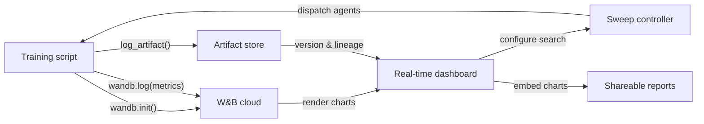

# Weights & Biases (W&B)

## Definition

Weights & Biases (allgemein als W&B oder wandb abgekürzt) ist eine Cloud-native MLOps-Plattform, die Experiment-Tracking, Datensatz- und Modell-Versionierung, Hyperparameter-Optimierung und interaktive Berichterstattung in einem integrierten Produkt bereitstellt. 2017 gegründet und sowohl in der akademischen Forschung als auch in der Industrie weit verbreitet, ist W&B besonders beliebt bei Teams, die Deep-Learning-Modelle trainieren und reiche Medienausgaben erzeugen — Bilder, Audio, Video, Punktwolken — die von visueller Inspektion während des Trainings profitieren.

W&Bs Kernwertversprechen liegt darin, dass für den Einstieg fast keine Infrastruktur benötigt wird: man registriert sich für ein kostenloses Konto, installiert das `wandb`-Python-Paket, fügt `wandb.init()` zum Skript hinzu, und alles wird automatisch in die W&B-Cloud protokolliert. Die Plattform ist in **Projekte** (Sammlungen verwandter Läufe), **Läufe** (einzelne Trainingsausführungen), **Artefakte** (versionierte Datensätze und Modelldateien), **Sweeps** (automatisierte Hyperparameter-Suche) und **Berichte** (teilbare narrative Dokumente mit eingebetteten Live-Charts) unterteilt.

Im Gegensatz zu self-gehosteten Lösungen wie MLflow verwaltet W&B die gesamte Backend-Infrastruktur. Dies eliminiert den operativen Aufwand, bedeutet aber, dass Daten die eigene Infrastruktur verlassen — eine relevante Überlegung für regulierte Branchen. W&B bietet Private-Cloud- und On-Premise-Deployment-Optionen für Unternehmenskunden, die Datenresidenz-Garantien benötigen, obwohl diese einen kostenpflichtigen Plan erfordern.

## Funktionsweise

### Initialisierung und Auto-Logging

Der Aufruf von `wandb.init(project="...", config={...})` startet einen Lauf, sendet die Konfiguration an W&B und gibt ein Lauf-Objekt zurück. Viele populäre Frameworks (PyTorch Lightning, Hugging Face Trainer, Keras, XGBoost, scikit-learn) bieten W&B-Callbacks oder -Integrationen, die Gradienten, Lernraten-Zeitpläne und Evaluierungsmetriken ohne zusätzlichen Code automatisch protokollieren. Im Hintergrund bündelt ein Hintergrundthread Protokolldaten und komprimiert sie, bevor sie über HTTPS gesendet werden, was den Trainings-Overhead minimiert.

### Echtzeit-Dashboards

Die W&B-UI rendert Metrik-Kurven, Systemauslastung (GPU/CPU/Speicher) und Medien, während der Lauf fortschreitet. Mehrere Läufe können auf demselben Diagramm mit automatischer Farbkodierung überlagert werden. Läufe können nach jeder Konfigurationsdimension gefiltert und gruppiert werden (z. B. nach Lernrate gruppieren, um ihre Wirkung über alle Experimente gleichzeitig zu sehen), was schnelle visuelle Diagnose ermöglicht.

### Sweeps

Ein Sweep wird durch ein YAML oder Python-Dict definiert, das Suchraum, Suchstrategie (Gitter, Zufall oder Bayesian) und Abbruchkriterien (z. B. frühzeitiger Abbruch unterdurchschnittlicher Läufe) spezifiziert. Der W&B-Sweep-Controller koordiniert mehrere parallel laufende Agenten, von denen jeder Hyperparameter-Kombinationen vom Controller auswählt und Ergebnisse zurückmeldet. Die Bayesian-Suche passt sich basierend auf beobachteten Ergebnissen an und konvergiert schneller als die Gittersuche.

### Artefakte

W&B Artifacts versionieren Datensätze, Modell-Checkpoints und Evaluierungsausgaben als inhaltsadressierte Objekte. Ein Artefakt ist mit dem Lauf verknüpft, der es erzeugte, und mit den Läufen, die es konsumierten, was einen Datenherkunftsgraph erstellt. Eine bestimmte Artefaktversion kann mit zwei Python-Zeilen heruntergeladen werden, was Datensatz- und Modell-Reproduzierbarkeit so einfach macht wie die Angabe einer Versionszeichenkette.

### Berichte

Berichte sind interaktive Dokumente, die Live-W&B-Charts, Laufvergleiche und Markdown-Erzählung einbetten. Sie sind die primäre Kollaborationsoberfläche: Ein Forscher kann einen Bericht in einer Slack-Nachricht oder einem GitHub-PR verlinken, um reproduzierbare experimentelle Erkenntnisse zu teilen, ohne statische Bilder zu exportieren.



## Wann verwenden / Wann NICHT verwenden

| Verwenden wenn | Vermeiden wenn |
|----------------|----------------|
| Deep-Learning-Modelle trainiert werden und reiches Medien-Logging benötigt wird (Bilder, Audio, Embeddings) | Daten die eigene Infrastruktur nicht verlassen dürfen und der Enterprise-On-Premise-Plan nicht erschwinglich ist |
| Team-Zusammenarbeit, Ergebnisteilung und narrative Berichte wichtig sind | Eine vollständig Open-Source, self-gehostete Lösung ohne SaaS-Abhängigkeit benötigt wird |
| Eingebaute Hyperparameter-Optimierung ohne zusätzliche Werkzeuge gewünscht wird | Experimente einfach sind und der Overhead eines SaaS-Kontos nicht gerechtfertigt ist |
| Das Team in Forschung oder Wissenschaft arbeitet und von kostenlosem Tier-Zugang profitiert | Budget knapp ist und die Features des kostenpflichtigen Tiers für die Teamgröße notwendig sind |

## Vergleiche

| Kriterium | W&B | MLflow |
|-----------|-----|--------|
| Einrichtungsfreundlichkeit | Kostenloses SaaS-Konto; keine Infrastruktur; `wandb login` + zwei Codezeilen | Lokal self-hostbar; kein Konto erforderlich; `mlflow ui` zum Starten |
| UI-Qualität | Ausgefeilt, interaktiv; für visuelle und medienreiche Workloads gebaut | Sauber und funktional; besser für tabellarischen Metrik-Vergleich |
| Zusammenarbeit | Native Team-Arbeitsbereiche, Berichte, Sharing-Links, Slack-Integration | Gemeinsamer Server erforderlich; keine eingebauten Kollaborationsfunktionen in OSS |
| Preisgestaltung | Kostenlos für Einzelpersonen; kostenpflichtig für größere Teams; Enterprise für On-Prem | Kostenlos und Open Source; Databricks Managed MLflow kostet extra |
| Hyperparameter-Optimierung | Sweeps eingebaut mit Bayesian/Gitter/Zufall + frühzeitiger Abbruch | Externe Werkzeuge erforderlich (Optuna, Ray Tune) |

## Code-Beispiele

```python
# wandb_tracking_example.py
# W&B experiment tracking: logs config, metrics, images, and registers a model artifact.
# pip install wandb scikit-learn matplotlib Pillow

import wandb
import numpy as np
import matplotlib.pyplot as plt
from sklearn.ensemble import RandomForestClassifier
from sklearn.datasets import load_digits
from sklearn.model_selection import train_test_split
from sklearn.metrics import (
    accuracy_score, f1_score, confusion_matrix, ConfusionMatrixDisplay
)
import os, tempfile

# ── 1. Initialize the W&B run ─────────────────────────────────────────────────
run = wandb.init(
    project="digits-classification",
    name="random-forest-v1",
    config={                         # All hyperparameters go here
        "n_estimators": 150,
        "max_depth": 12,
        "min_samples_split": 4,
        "random_state": 7,
        "dataset": "sklearn-digits",
    },
)
cfg = wandb.config  # Access config values through this proxy

# ── 2. Data ───────────────────────────────────────────────────────────────────
X, y = load_digits(return_X_y=True)
X_train, X_test, y_train, y_test = train_test_split(
    X, y, test_size=0.2, stratify=y, random_state=cfg.random_state
)

# ── 3. Train ──────────────────────────────────────────────────────────────────
clf = RandomForestClassifier(
    n_estimators=cfg.n_estimators,
    max_depth=cfg.max_depth,
    min_samples_split=cfg.min_samples_split,
    random_state=cfg.random_state,
)
clf.fit(X_train, y_train)

# ── 4. Evaluate and log metrics ───────────────────────────────────────────────
y_pred = clf.predict(X_test)
metrics = {
    "accuracy": accuracy_score(y_test, y_pred),
    "f1_macro": f1_score(y_test, y_pred, average="macro"),
    "n_train": len(X_train),
    "n_test": len(X_test),
}
wandb.log(metrics)

# ── 5. Log a confusion matrix image ──────────────────────────────────────────
cm = confusion_matrix(y_test, y_pred)
fig, ax = plt.subplots(figsize=(8, 8))
ConfusionMatrixDisplay(cm).plot(ax=ax)
ax.set_title("Confusion Matrix – digits RF")
wandb.log({"confusion_matrix": wandb.Image(fig)})
plt.close(fig)

# ── 6. Save model as a versioned W&B Artifact ─────────────────────────────────
import joblib

with tempfile.TemporaryDirectory() as tmp:
    model_path = os.path.join(tmp, "model.joblib")
    joblib.dump(clf, model_path)

    artifact = wandb.Artifact(
        name="digits-rf-model",
        type="model",
        description="Random Forest trained on sklearn digits dataset",
        metadata=dict(metrics),
    )
    artifact.add_file(model_path)
    run.log_artifact(artifact)

# ── 7. Finish the run ─────────────────────────────────────────────────────────
run.finish()
print(f"Accuracy: {metrics['accuracy']:.4f} | F1 macro: {metrics['f1_macro']:.4f}")
print(f"View run at: {run.url}")
```

## Praktische Ressourcen

- [W&B offizielle Dokumentation](https://docs.wandb.ai/) — Vollständige Referenz für das Python-SDK, Integrationen, Sweeps, Artefakte und Berichte.
- [W&B Quickstart](https://docs.wandb.ai/quickstart) — Ersten W&B-Lauf in unter fünf Minuten mit einem minimalen Beispiel protokollieren.
- [W&B Sweeps-Dokumentation](https://docs.wandb.ai/guides/sweeps) — Umfassender Leitfaden zur Konfiguration und Durchführung verteilter Hyperparameter-Suchen.
- [W&B Fully Connected Blog](https://wandb.ai/fully-connected) — Praxis-Blog mit ausführlichen Tutorials, Benchmark-Berichten und ML-Engineering-Artikeln.
- [Hugging Face + W&B Integration](https://docs.wandb.ai/guides/integrations/huggingface) — Leitfaden zum automatischen Protokollieren aller Hugging Face Trainer-Metriken mit einem einzigen `report_to="wandb"` Argument.

## Siehe auch

- [Experiment-Tracking](/docs/mlops/experiment-tracking)
- [MLflow](/docs/mlops/mlflow)
- [MLOps](/docs/mlops)
