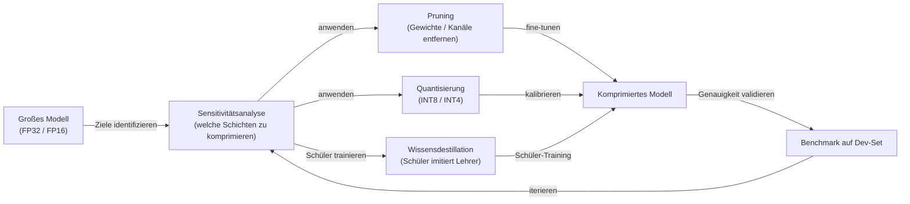

# Modellkomprimierung

## Definition

Modellkomprimierung ist der Sammelbegriff für eine Familie von Techniken, die Größe, Speicherplatzbedarf, Inferenzlatenz oder Energieverbrauch trainierter neuronaler Netze reduzieren, ohne ihre Genauigkeit wesentlich zu beeinträchtigen. Die primären Methoden sind [Pruning](/docs/pruning) (redundante Parameter entfernen), [Quantisierung](/docs/quantization) (numerische Präzision reduzieren) und [Wissensdestillation](/docs/knowledge-distillation) (ein kleineres Modell trainieren, ein größeres nachzuahmen). Diese Techniken werden oft kombiniert — zum Beispiel erreicht ein destilliertes Modell, das dann quantisiert und gepruned wird, eine deutlich kleinere Größe als jede einzelne Methode allein.

Die Motivation für Modellkomprimierung hat sich mit dem Wachstum von [LLMs](/docs/llms) intensiviert: Ein Frontier-Modell in FP16 kann 80–320 GB GPU-Speicher erfordern, was die Bereitstellung auf etwas anderem als einem Hochleistungsserver unpraktisch macht. Komprimierung ermöglicht, dasselbe oder ähnliches Wissen in einer Form auszudrücken, die in eine Consumer-GPU (16–48 GB), ein mobiles Gerät (4–12 GB RAM) oder sogar einen Mikrocontroller (Hunderte von KB) passt. Die Herausforderung besteht darin, den Genauigkeits-Komprimierungs-Kompromiss über diverse Downstream-Aufgaben hinweg zu managen.

Komprimierung wird in verschiedenen Phasen angewendet: **Post-Training** (nach abgeschlossenem Training, kein Zugang zu Trainingsdaten erforderlich), **Training-Aware** (Simulation der Komprimierung während des Trainings, sodass sich das Modell anpassen kann) und **Structured Search** (Neural Architecture Search oder iteratives Pruning mit Fine-Tuning). Die Wahl der Methode hängt von der Ziel-Hardware, dem akzeptablen Genauigkeitsbudget und der Machbarkeit von Neutraining ab.

## Funktionsweise

### Komprimierungs-Pipeline



### Methodenvergleich

| Methode | Wie sie Größe reduziert | Training erforderlich | Speedup-Typ |
|--------|-------------------|-------------------|-------------|
| Unstrukturiertes Pruning | Nullt individuelle Gewichte | Fine-Tune danach | Speicher (Sparse Storage) |
| Strukturiertes Pruning | Entfernt Kanäle, Heads oder Schichten | Fine-Tune danach | Wall-Clock (Dense Ops) |
| Quantisierung (PTQ) | Niedrigere Präzision (INT8, INT4) | Nein (nur Kalibrierung) | Speicher + Rechenleistung |
| Quantisierung (QAT) | Niedrigere Präzision mit Trainingsanpassung | Ja | Speicher + Rechenleistung |
| Wissensdestillation | Kleineres Modell End-to-End trainieren | Ja (vollständiges Training) | Alle Dimensionen |

## Wann verwenden / Wann NICHT verwenden

| Szenario | Modellkomprimierung verwenden | Modellkomprimierung NICHT verwenden |
|----------|----------------------|------------------------------|
| LLMs auf Consumer-GPUs oder Edge-Geräten bereitstellen | Ja — Quantisierung macht es machbar | |
| Inferenzlatenz in der Produktion reduzieren | Ja — INT8 oder strukturiertes Pruning reduziert Latenz | |
| Destilliertes Modell für Downstream-Fine-Tuning teilen | Ja — Destillation überträgt Wissen effizient | |
| Genauigkeit ist die primäre Einschränkung (kein Hardware-Limit) | | Vollständiges Modell bedienen; Komprimierung führt Genauigkeitsrisiko ein |
| Modell wird häufig auf neuen Daten neu trainiert | | Neutraining-Overhead überwiegt möglicherweise Komprimierungsgewinne |
| Hardware unterstützt FP16 nativ effizient | | Quantisierung bietet möglicherweise minimalen Nutzen auf FP16-Hardware |

## Vor- und Nachteile

| Vorteile | Nachteile |
|------|------|
| Ermöglicht Bereitstellung auf eingeschränkter Hardware | Genauigkeitsverschlechterung — besonders bei aggressiven Komprimierungsraten |
| Reduziert Inferenzkosten und Energieverbrauch | Kalibrierung und Fine-Tuning erfordern Aufwand und Expertise |
| Mehrere Methoden können für maximale Komprimierung kombiniert werden | Strukturiertes Pruning erfordert oft architekturspezifisches Tuning |
| PTQ erfordert kein Neutraining (schnell anzuwenden) | QAT und Destillation erfordern Zugang zu Trainingsdaten und Rechenleistung |

## Code-Beispiele

```python
# Post-training quantization with PyTorch (dynamic INT8)
import torch
import torch.quantization

# Load a trained model
model = MyModel()
model.load_state_dict(torch.load("model.pt"))
model.eval()

# Apply dynamic quantization to Linear layers (no calibration data needed)
quantized_model = torch.quantization.quantize_dynamic(
    model,
    qconfig_spec={torch.nn.Linear},
    dtype=torch.qint8,
)

# Check size reduction
original_size = sum(p.numel() for p in model.parameters()) * 4  # FP32 bytes
quantized_size = sum(p.numel() for p in quantized_model.parameters()) * 1  # INT8 bytes
print(f"Size reduction: {original_size / quantized_size:.1f}x")

# Save compressed model
torch.save(quantized_model.state_dict(), "quantized_model.pt")
```

## Tipps für effektive Nutzung

- Vor der Komprimierung eine Sensitivitätsanalyse durchführen: Nicht alle Schichten tolerieren dasselbe Komprimierungsverhältnis — frühe und finale Schichten sind in der Regel empfindlicher.
- Methoden sequenziell kombinieren: Zuerst destillieren (neue Architektur), dann prunen (redundante Struktur entfernen), dann quantisieren (Präzision reduzieren) für maximale Komprimierung.
- Nach jedem Komprimierungsschritt immer auf einem zurückgehaltenen Dev-Set validieren — Genauigkeit kann nicht-monoton verschlechtern.
- INT8-Quantisierung als standardmäßigen ersten Schritt verwenden; sie ist am einfachsten anzuwenden und liefert den größten Speichervorteil mit minimalem Genauigkeitsverlust.
- Für LLMs bietet GPTQ- oder AWQ-INT4-Quantisierung oft ein besseres Genauigkeits-Komprimierungs-Verhältnis als Magnitude-Pruning.

## Praktische Ressourcen

- [PyTorch — Quantisierung](https://pytorch.org/docs/stable/quantization.html) — PTQ, QAT und dynamische Quantisierung
- [TensorFlow — Model Optimization Toolkit](https://www.tensorflow.org/model_optimization) — Pruning, Quantisierung und Clustering
- [HuggingFace — PEFT und GPTQ](https://huggingface.co/docs/peft) — Parameter-effizientes Fine-Tuning mit quantisierten LLMs
- [llm.int8() Paper](https://arxiv.org/abs/2208.07339) — 8-Bit-Inferenz für große Sprachmodelle

## Siehe auch

- [Quantisierung](/docs/quantization)
- [Pruning](/docs/pruning)
- [Wissensdestillation](/docs/knowledge-distillation)
- [Lokale Inferenz](/docs/local-inference)
- [Edge Reasoning](/docs/edge-reasoning)
- [Infrastruktur](/docs/infrastructure)
