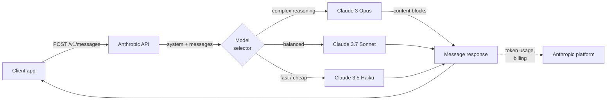
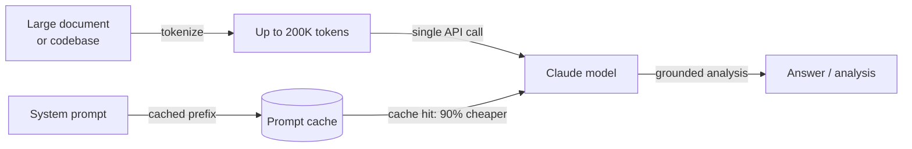

# Anthropic

## Definition

**Anthropic** ist ein KI-Sicherheitsunternehmen und Modellanbieter, das 2021 von ehemaligen OpenAI-Forschern gegründet wurde. Die Kernthese lautet, dass der Aufbau leistungsfähiger KI-Modelle und die Lösung des Ausrichtungsproblems untrennbare Ziele sind – das Unternehmen verfolgt modernste Fähigkeiten zusammen mit Sicherheitsforschung wie Constitutional AI, Interpretierbarkeit und mechanistischem Verständnis von Modellinterna. Das kommerzielle Produkt dieser Forschung ist die **Claude**-Modellfamilie, verfügbar über die Anthropic-API und Enterprise-Produkte.

Die Claude-Modellreihe folgt einer dreigliedrigen Namenskonvention, die Fähigkeits- und Kostenkompromisse widerspiegelt: **Opus** (höchste Qualität, komplexes Schlussfolgern), **Sonnet** (ausgewogene Qualität und Geschwindigkeit) und **Haiku** (schnellstes und kosteneffizientestes). Stand 2025 ist die aktuelle Generation **Claude 3.7 Sonnet** – das Flaggschiffmodell mit erweiterten Denkfähigkeiten – zusammen mit **Claude 3 Opus**, **Claude 3.5 Sonnet** und **Claude 3.5 Haiku**. Alle Claude-3+-Modelle unterstützen visuelle Eingaben (Bilder), und die gesamte Familie ist um ein 200K-Token-Kontextfenster herum konzipiert, das Bücher, große Codebasen und lange Gesprächsverläufe ohne Kürzung verarbeiten kann.

Aus Plattformperspektive dreht sich Anthropics API um die **Messages API** – eine saubere, zweckgebaute Schnittstelle für mehrstufige Gespräche. Die Plattform umfasst Tool-Nutzung (Anthropics Begriff für Funktionsaufrufe), erweitertes Denken (sichtbares Chain-of-Thought-Schlussfolgern), Prompt-Caching (reduziert Kosten und Latenz für große wiederholte Kontexte) und Stapelverarbeitung. Das Python-SDK (`anthropic`) und das TypeScript-SDK sind die primären Client-Bibliotheken. Claude-Modelle sind auch über Amazon Bedrock, Google Cloud Vertex AI und Enterprise-Verträge mit Optionen zur Datenspeicherung verfügbar.

## Funktionsweise

### Messages API

Die Messages API (`POST /v1/messages`) ist Anthropics primäre Schnittstelle. Im Gegensatz zu einigen APIs, die einen flachen `prompt`-String verwenden, ist die Messages API gesprächsorientiert: Sie senden ein `messages`-Array mit abwechselnden `user`- und `assistant`-Runden, mit einem optionalen `system`-Parameter für Kontext und Persona. Das Modell gibt ein `Message`-Objekt zurück, das eine `content`-Liste enthält – standardmäßig Textblöcke, Tool-Use-Blöcke wenn das Modell beschließt, ein Tool aufzurufen. Streaming wird unterstützt und für interaktive Nutzung empfohlen; das SDK bietet sowohl Streaming-Helfer als auch rohen SSE-Zugang.



### Tool-Nutzung

Tool-Nutzung ermöglicht es Claude, externe Funktionen aufzurufen, indem strukturierte `tool_use`-Inhaltsblöcke ausgegeben werden. Sie deklarieren Tools als JSON-Schemas im `tools`-Parameter. Wenn Claude entscheidet, dass ein Tool benötigt wird, enthält die Antwort einen `tool_use`-Block mit dem Tool-Namen und der Eingabe; Ihr Code führt die Funktion aus und gibt ein `tool_result` im nächsten User-Zug zurück. Claude verwendet dann das Ergebnis, um seine Antwort zu vervollständigen. Dieses Muster ermöglicht Agenten, Code-Ausführungsumgebungen, Datenbankabfragen und API-Integrationen, ohne dass das Modell direkten Zugang zu einem System benötigt.


### Erweitertes Denken

Erweitertes Denken ist ein Modus, der auf Claude 3.7 Sonnet verfügbar ist und es dem Modell ermöglicht, ausführlich zu schlussfolgern, bevor es seine endgültige Antwort produziert. Wenn Sie `thinking: {type: "enabled", budget_tokens: N}` setzen, gibt das Modell `thinking`-Inhaltsblöcke aus, die sein internes Notizbuch enthalten – ähnlich wie Chain-of-Thought, aber nativ und strukturiert. Erweitertes Denken verbessert die Leistung bei Mathematikwettbewerben, komplexem Code, mehrstufigem Schlussfolgern und Aufgaben, die sorgfältige Schritt-für-Schritt-Analyse erfordern, erheblich. Die Denk-Tokens zählen zum Token-Budget, sind aber in der Antwort sichtbar, was Ihnen Transparenz darüber gibt, wie das Modell zu seiner Antwort gelangt ist.

### Prompt-Caching

Prompt-Caching reduziert Kosten und Latenz für Arbeitslasten, die wiederholt große System-Prompts oder Dokumentkontexte verwenden, drastisch. Sie markieren Präfixabschnitte Ihrer Anfrage mit `cache_control: {type: "ephemeral"}`. Beim ersten Aufruf speichert Anthropic das Prompt-Präfix auf seiner Infrastruktur; nachfolgende Aufrufe, die dem Präfix entsprechen, werden aus dem Cache bedient, mit 90 % niedrigeren Eingabe-Token-Kosten und erheblich reduzierter Zeit bis zum ersten Token. Dies ist besonders wertvoll für RAG-Pipelines (großer Kontext mit jeder Abfrage übergeben), Agenten-Schleifen (große System-Prompts bei jedem Durchlauf wiederholt) und Dokumentenstapelverarbeitung.

### Langer Kontext (200K Tokens)

Alle Claude-3- und späteren Modelle unterstützen ein 200K-Token-Kontextfenster – entspricht etwa 150.000 Wörtern oder ~500 Seiten Text. Langer Kontext ermöglicht es, ganze Codebasen, juristische Dokumente, Forschungsarbeiten oder vollständige Gesprächsverläufe in einem einzigen Aufruf ohne Chunking zu verarbeiten. Anthropics Forschung zur Langkontextleistung ("Nadel im Heuhaufen"-Auswertungen) zeigt, dass Claude über den gesamten 200K-Bereich eine starke Abrufgenauigkeit beibehält, was es zuverlässig für Dokument-Q&A, Vertragsanalyse und Code-Review über große Repositories macht. Dies ist einer von Anthropics deutlichsten Vorteilen gegenüber GPT-4os 128K-Fenster.



## Wann verwenden / Wann NICHT verwenden

| Anthropic verwenden wenn | Alternativen in Betracht ziehen wenn |
|--------------------|--------------------------------------|
| Sie ein 200K-Kontextfenster benötigen, um lange Dokumente, Codebasen oder erweiterte Gespräche ohne Chunking zu verarbeiten | Ihre Arbeitslast Bildgenerierung, Audiotranskription oder Text-to-Speech erfordert — Claude ist nur Text/Vision; OpenAI deckt Audio ab |
| Sicherheitseinschränkungen und vorhersehbares Ablehnungsverhalten kritisch sind (Compliance, Gesundheitswesen, Finanzen) | Sie Open-Weights-Modelle für Self-Hosting, Feinabstimmung oder Datenspeicherung benötigen — Anthropic bietet keine Open-Weights-Option |
| Sie erweitertes Denken für tiefe Schlussfolgerungsaufgaben wollen (Mathematik, komplexer Code, mehrstufige Analyse) | Ihr primärer Anwendungsfall die Generierung hochvolumiger Einbettungen ist — Anthropic bietet keine Einbettungs-API |
| Prompt-Caching die Kosten sinnvoll reduzieren wird (große wiederholte Kontexte, Agenten-System-Prompts) | Sie stark auf OpenAI-spezifisches Tooling angewiesen sind (Assistants API, DALL-E, Whisper), das kein Anthropic-Äquivalent hat |
| Sie Tool-Nutzung oder Computer-Use-Workflows aufbauen und ein gut kalibriertes Modell für strukturierte Ausgaben wollen | Sie die absolut niedrigsten Kosten pro Token im großen Maßstab benötigen — Claude Haiku ist preislich wettbewerbsfähig, aber GPT-4o-mini und offene Modelle sind günstiger |

## Vergleiche

| Kriterium | Anthropic | OpenAI | Google Gemini |
|----------|-----------|--------|---------------|
| Flaggschiffmodell | Claude 3.7 Sonnet | GPT-4o | Gemini 2.5 Pro |
| Kontextfenster | 200K (alle Claude 3+) | 128K (GPT-4o) | Bis zu 1M (Gemini 1.5 Pro) |
| Schlussfolgern / Denken | Erweitertes Denken (natives CoT) | o1-, o3-Serie | Gemini 2.5 Pro thinking |
| Multimodale Eingabe | Text, Bild | Text, Bild, Audio, Video | Text, Bild, Audio, Video |
| Audio / Sprache | Nein | Ja (Whisper, TTS) | Ja (Gemini) |
| Bildgenerierung | Nein | Ja (DALL-E 3) | Ja (Imagen) |
| Einbettungs-API | Nein | Ja | Ja |
| Offene Gewichte | Nein | Nein | Gemma (teilweise) |
| Prompt-Caching | Ja (nativ, 90 % Rabatt) | Kontext-Caching (begrenzt) | Ja (Gemini) |
| Tool-Nutzung / Funktionsaufrufe | Ausgereift, Computer-Use-Unterstützung | Ausgereift, weit verbreitet | Ausgereift |
| Sicherheitsphilosophie | Constitutional AI, ablehnungsabgestimmt | Moderation API, Nutzungsrichtlinie | Richtlinien für verantwortungsvolle KI |
| Datenspeicherungsoptionen | Enterprise-Vertrag | Enterprise-Vertrag | Google-Cloud-Regionen |

## Vor- und Nachteile

| Vorteile | Nachteile |
|------|------|
| 200K-Kontextfenster für alle Modelle — branchenführend für lange Dokumente | Keine Audio-, Sprach- oder Bildgenerungs-APIs |
| Erweitertes Denken bietet transparentes Chain-of-Thought für schwierige Schlussfolgerungsaufgaben | Keine Einbettungs-API — Sie benötigen einen zweiten Anbieter für RAG |
| Prompt-Caching reduziert Kosten für wiederholte große Kontexte erheblich | Geschlossenes Modell ohne Open-Weights-Option |
| Sicherheitsorientiertes Design mit sorgfältiger Ablehnungskalibrierung und Constitutional AI | Kleineres Ökosystem als OpenAI — weniger Drittanbieter-Tutorials und Integrationen |
| Computer Use (Beta) ermöglicht agentische Steuerung von Desktop-GUIs | Preise können für einfache Aufgaben höher sein als GPT-4o-mini oder Open-Weights-Alternativen |

## Codebeispiele

### Messages API — grundlegende Vervollständigung und System-Prompt

```python
import anthropic

client = anthropic.Anthropic(api_key="sk-ant-...")  # or set ANTHROPIC_API_KEY env var

# Basic message
message = client.messages.create(
    model="claude-3-7-sonnet-20250219",
    max_tokens=1024,
    system="You are a concise technical assistant. Answer in plain English.",
    messages=[
        {"role": "user", "content": "What is the Anthropic Messages API?"}
    ],
)
print(message.content[0].text)

# Multi-turn conversation
messages = [
    {"role": "user", "content": "What is prompt caching?"},
    {"role": "assistant", "content": "Prompt caching stores repeated large context..."},
    {"role": "user", "content": "How much does it save?"},
]
response = client.messages.create(
    model="claude-3-5-haiku-20241022",
    max_tokens=512,
    messages=messages,
)
print(response.content[0].text)
```

### Tool-Nutzung

```python
import json
import anthropic

client = anthropic.Anthropic()

# Define tools as JSON schemas
tools = [
    {
        "name": "search_docs",
        "description": "Search the documentation for a given query and return relevant passages.",
        "input_schema": {
            "type": "object",
            "properties": {
                "query": {"type": "string", "description": "Search query"},
                "max_results": {"type": "integer", "default": 3},
            },
            "required": ["query"],
        },
    }
]

messages = [{"role": "user", "content": "How do I enable prompt caching?"}]

# First call — Claude may request a tool
response = client.messages.create(
    model="claude-3-7-sonnet-20250219",
    max_tokens=1024,
    tools=tools,
    messages=messages,
)

# Process tool calls
if response.stop_reason == "tool_use":
    messages.append({"role": "assistant", "content": response.content})

    tool_results = []
    for block in response.content:
        if block.type == "tool_use":
            # Simulated tool execution
            result = f"Prompt caching docs for '{block.input['query']}': use cache_control param..."
            tool_results.append({
                "type": "tool_result",
                "tool_use_id": block.id,
                "content": result,
            })

    messages.append({"role": "user", "content": tool_results})

    # Final call with tool result
    final = client.messages.create(
        model="claude-3-7-sonnet-20250219",
        max_tokens=1024,
        tools=tools,
        messages=messages,
    )
    print(final.content[0].text)
```

### Erweitertes Denken

```python
import anthropic

client = anthropic.Anthropic()

response = client.messages.create(
    model="claude-3-7-sonnet-20250219",
    max_tokens=16000,
    thinking={
        "type": "enabled",
        "budget_tokens": 10000,  # tokens allocated for internal reasoning
    },
    messages=[{
        "role": "user",
        "content": (
            "A train leaves city A at 9am traveling at 80 km/h. "
            "Another train leaves city B (320 km away) at 10am traveling at 100 km/h. "
            "At what time do they meet, and how far from city A?"
        ),
    }],
)

for block in response.content:
    if block.type == "thinking":
        print("=== Model's internal reasoning ===")
        print(block.thinking[:500], "...")  # first 500 chars for brevity
    elif block.type == "text":
        print("=== Final answer ===")
        print(block.text)
```

### Prompt-Caching für wiederholten großen Kontext

```python
import anthropic

client = anthropic.Anthropic()

# Large document loaded once — cached after first call
large_document = open("contract.txt").read()  # e.g., 50K tokens

response = client.messages.create(
    model="claude-3-5-sonnet-20241022",
    max_tokens=1024,
    system=[
        {
            "type": "text",
            "text": "You are a legal document analyst. Answer questions based solely on the document provided.",
        },
        {
            "type": "text",
            "text": large_document,
            "cache_control": {"type": "ephemeral"},  # mark for caching
        },
    ],
    messages=[{"role": "user", "content": "What are the termination clauses?"}],
)

print(response.content[0].text)
# usage.cache_creation_input_tokens — tokens cached this call (full price)
# usage.cache_read_input_tokens — tokens served from cache (10% price)
print(response.usage)
```

## Praktische Ressourcen

- [Anthropic-API-Referenz](https://docs.anthropic.com/en/api/getting-started) — Vollständige Endpunkt-Dokumentation mit Anfrage-/Antwort-Schemas und Parameterreferenz
- [Anthropic-Leitfaden zum Prompt Engineering](https://docs.anthropic.com/en/docs/build-with-claude/prompt-engineering/overview) — Offizielle Best Practices für System-Prompts, Chain-of-Thought und aufgabenspezifische Techniken
- [Anthropic Cookbook](https://github.com/anthropics/anthropic-cookbook) — Ausführbare Notebooks zu Tool-Nutzung, RAG, multimodal, Prompt-Caching und Agenten
- [Claude-Modellübersicht](https://docs.anthropic.com/en/docs/about-claude/models) — Aktuelle Modell-IDs, Kontextfenster, Fähigkeitsvergleich und Abkündigungsplan
- [Anthropic Python SDK auf GitHub](https://github.com/anthropics/anthropic-sdk-python) — Quellcode, Changelog, Typ-Stubs und Migrationsleitfäden

## Siehe auch

- [Modellanbieter](/docs/model-providers) — Übersicht und Vergleich aller Anbieter einschließlich einer 7-Anbieter-Vergleichstabelle
- [Fallstudie: Claude](/docs/case-studies/claude) — Für einen tieferen Einblick in Modellarchitektur und Trainingsmethodik, siehe die Claude-Fallstudie
- [OpenAI](/docs/model-providers/openai) — GPT-4o, o-Serien-Schlussfolgern, Funktionsaufrufe, DALL-E, Whisper
- [Prompt Engineering](/docs/prompt-engineering) — Techniken, die für alle Claude-Modelle gelten
- [Tools](/docs/tools/claude-code) — Claude Code, Anthropics KI-Coding-Agent, der auf der Claude-API aufbaut
- [Agenten](/docs/agents) — Aufbau agentischer Workflows mit Claude-Tool-Nutzung
