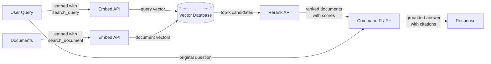

# Cohere

## Definition

**Cohere** ist ein Enterprise-KI-Unternehmen, das Sprachmodelle und APIs entwickelt, die speziell für Geschäftsanwendungen konzipiert sind, mit einem klaren Fokus auf Suche, Informationsabruf und Retrieval-Augmented Generation (RAG). Im Gegensatz zu Allzweck-Anbietern, die ein breites Spektrum an Verbraucher- und Entwicklerfunktionen anbieten, richtet sich Cohere an Enterprise-Kunden, die zuverlässige, produktionsreife NLP-Infrastruktur benötigen — insbesondere für Anwendungsfälle, bei denen das *Finden und Präsentieren der richtigen Informationen* das Kernproblem ist.

Coheres Modellpalette spiegelt diesen Fokus wider. **Command R** und **Command R+** sind konversations- und instruktionsorientierte Modelle, die speziell für RAG-Workflows optimiert sind — sie unterstützen große Kontextfenster und sind darauf trainiert, abrufverankerte Prompts zuverlässig zu befolgen. **Embed** bietet hochmoderne mehrsprachige dichte Vektoreinbettungen in über 100 Sprachen und ist damit die erste Wahl für globale Enterprise-Suchanwendungen. **Rerank** ist ein Cross-Encoder-Modell, das eine Ausgangsmenge abgerufener Dokumente nimmt und diese gegen die ursprüngliche Abfrage neu bewertet, um eine Präzision zu erreichen, die sparse und dense Retrieval allein nicht erzielen können.

Was Cohere von Allzweck-Anbietern wie OpenAI unterscheidet, ist, dass die gesamte Produktpalette um die Abruf-Pipeline als erstklassigen Workflow herum konzipiert ist. Die Modelle Embed, Rerank und Command R sind so aufgebaut, dass sie als kohärenter Stack zusammenarbeiten, und Cohere bietet On-Premises- und Private-Cloud-Bereitstellungsoptionen, die strenge Enterprise-Datenverwaltungs- und Compliance-Anforderungen erfüllen — ein kritischer Unterschied für regulierte Branchen wie Finanzen, Gesundheitswesen und Behörden.

## Funktionsweise

### Chat- und Generate-API

Auf die Modelle Command R und Command R+ wird über Coheres Chat-API zugegriffen und sie unterstützen sowohl konversationale Multi-Turn-Interaktionen als auch Single-Turn-Generierungsaufgaben. Command R+ ist die größere, leistungsfähigere Variante für komplexes Reasoning und dokumentenintensive RAG, während Command R für niedrigere Latenz und Kosten in hochdurchsatzigen Produktionspipelines optimiert ist. Beide Modelle akzeptieren einen `documents`-Parameter, mit dem Sie abgerufenen Kontext direkt in den Prompt einbetten können, was einen nativen RAG-Modus ermöglicht, bei dem das Modell angewiesen wird, seine Antwort auf den bereitgestellten Inhalt zu stützen und Quellen zu zitieren.

### Embed-API (mehrsprachige Einbettungen)

Die Embed-API konvertiert Text in dichte Vektordarstellungen, die für semantische Ähnlichkeitssuche geeignet sind. Coheres Einbettungsmodelle unterstützen über 100 Sprachen in einem einzigen Modell, was sprachübergreifende Suche und mehrsprachiges Dokumentenabruf ohne separate sprachspezifische Modelle ermöglicht. Einbettungen können mit verschiedenen `input_type`-Werten generiert werden — `search_document` für die Indizierung von ruhenden Inhalten und `search_query` für die Kodierung von Abfragen zur Laufzeit — eine Unterscheidung, die asymmetrische Trainingssignale anwendet und die Abrufgenauigkeit im Vergleich zu symmetrischen Einbettungsschemata typischerweise verbessert.

### Rerank-API

Die Rerank-API akzeptiert eine Abfrage und eine Liste von Kandidatendokumenten (üblicherweise die Top-k-Ergebnisse einer Vektor- oder Schlüsselwortsuche) und gibt jedes Dokument mit einem Relevanzscore zurück, der von einem Cross-Encoder berechnet wird. Cross-Encoder bewerten Abfrage und Dokument gemeinsam in einem einzigen Forward-Pass, was eine viel höhere Präzision liefert als Bi-Encoder, die Abfrage und Dokument separat kodieren. Reranking ist ein leichtgewichtiger, aber hochwirksamer Schritt, der die Präzision@k dramatisch verbessert — er ist am wertvollsten, wenn das anfängliche Retrieval relativ günstig ist (BM25 oder ANN-Suche), aber die Präzision maximiert werden muss, bevor der Kontext an ein LLM übergeben wird.

### RAG-Integration

Coheres RAG-Integration verknüpft Embed, Rerank und Command R zu einer einheitlichen Pipeline. Der typische Ablauf ist: Abfrage einbetten, approximierte nächste Nachbarn-Suche in einer Vektordatenbank durchführen, die Top-Kandidaten reranken um die relevantesten Dokumente zu erhalten, dann diese Dokumente zusammen mit der ursprünglichen Abfrage an Command R übergeben für verankerte Generierung. Das Modell gibt eine Antwort zusammen mit Zitationsobjekten zurück, die auf bestimmte Passagen in den abgerufenen Dokumenten verweisen, was den Aufbau prüfbarer, quellenangaben-basierter KI-Anwendungen unkompliziert macht.



## Wann verwenden / Wann NICHT verwenden

| Verwenden wenn | Vermeiden wenn |
|----------------|----------------|
| Enterprise-Suche oder Wissensdatenbank-Q&A aufgebaut wird, wo Abrufpräzision kritisch ist | Sie allgemeine Chat-Unterstützung ohne Abrufkomponente benötigen |
| Ihr Inhalt mehrere Sprachen umfasst und Sie ein einziges Einbettungsmodell für alle benötigen | Ihr Anwendungsfall primär Bild-, Audio- oder multimodale Verarbeitung ist — Cohere ist nur Text |
| Sie einen Reranking-Schritt hinzufügen möchten, um die Präzision nach einer initialen Vektor- oder BM25-Suche zu verbessern | Sie hochleistungsfähiges Reasoning, Mathematik oder Coding für eigenständige Aufgaben benötigen |
| Datenverwaltungsanforderungen On-Premises- oder Private-Cloud-Bereitstellung vorschreiben | Ihr Projekt ein schnelles Prototyp ist und Sie das breiteste Ökosystem an Integrationen wünschen |
| Sie Quellenangaben und Dokumentenverankerung nativ in der Modellausgabe benötigen | Das Budget sehr eng ist — Coheres Enterprise-Preise sind höher als einige Alternativen |

## Vergleiche

| Kriterium | Cohere | OpenAI | Mistral |
|-----------|--------|--------|---------|
| Einbettungsqualität (MTEB) | Erstklassig mehrsprachig, 100+ Sprachen | Starkes Englisch-First (text-embedding-3-large) | Wettbewerbsfähig; mistral-embed verfügbar |
| Reranking | Native Rerank-API (Cross-Encoder) | Kein natives Reranking-Endpunkt | Kein natives Reranking-Endpunkt |
| RAG-native Modelle | Command R/R+ für RAG mit Zitationen ausgelegt | GPT-4o funktioniert gut mit RAG-Prompts, aber nicht RAG-nativ | Mixtral/Mistral funktionieren mit RAG-Prompts |
| Open Weights | Nein (nur proprietäre API) | Nein (nur proprietäre API) | Ja (Mistral-Modelle auf Hugging Face) |
| On-Premises / Private Cloud | Ja (Enterprise-Verträge) | Azure OpenAI (begrenzt) | Ja (Open-Weights selbst hosten) |
| Mehrsprachige Einbettung | Einzelnes Modell, 100+ Sprachen | Separate oder begrenzte mehrsprachige Unterstützung | Begrenzte mehrsprachige Einbettungsunterstützung |
| Preismodell | Enterprise / pay-per-token | Pay-per-token, gut dokumentiert | Pay-per-token; Self-Host-Option kostenlos |

## Vor- und Nachteile

| Vorteile | Nachteile |
|----------|-----------|
| Erstklassige mehrsprachige Einbettungen in einem einzigen Modell | Kleineres allgemeines Ökosystem im Vergleich zu OpenAI |
| Native Rerank-API verbessert die Abrufpräzision erheblich | Keine Open-Weights-Option für Self-Hosting |
| Command R/R+ sind speziell für verankerte, zitierte RAG entwickelt | Weniger leistungsfähig als GPT-4o / Claude für komplexes eigenständiges Reasoning |
| Enterprise-Bereitstellungsoptionen einschließlich Private Cloud | Dokumentation und Community-Ressourcen dünner als OpenAI |
| RAG-Pipeline-Komponenten (Embed + Rerank + Command R) arbeiten als kohärenter Stack | Preise können für kleine Experimente höher sein |

## Codebeispiele

### Chat mit Command R

```python
import cohere

co = cohere.Client("YOUR_COHERE_API_KEY")

response = co.chat(
    model="command-r-plus",
    message="Explain retrieval-augmented generation in plain English.",
)
print(response.text)
```

### Einbettungen für semantische Suche

```python
import cohere

co = cohere.Client("YOUR_COHERE_API_KEY")

# Embed documents at indexing time
documents = [
    "Cohere specializes in enterprise NLP and semantic search.",
    "RAG combines retrieval with language model generation.",
    "Multilingual embeddings support over 100 languages.",
]
doc_embeddings = co.embed(
    texts=documents,
    model="embed-multilingual-v3.0",
    input_type="search_document",
).embeddings

# Embed a query at search time
query_embedding = co.embed(
    texts=["What does Cohere specialize in?"],
    model="embed-multilingual-v3.0",
    input_type="search_query",
).embeddings[0]

# Compute cosine similarity (or use a vector DB)
import numpy as np

doc_array = np.array(doc_embeddings)
query_array = np.array(query_embedding)
scores = doc_array @ query_array / (
    np.linalg.norm(doc_array, axis=1) * np.linalg.norm(query_array)
)
top_idx = int(np.argmax(scores))
print(f"Most relevant: '{documents[top_idx]}' (score: {scores[top_idx]:.4f})")
```

### Reranking abgerufener Kandidaten

```python
import cohere

co = cohere.Client("YOUR_COHERE_API_KEY")

query = "How does multilingual embedding work?"
candidates = [
    "Cohere Embed supports over 100 languages in a single model.",
    "Command R+ is optimized for RAG workflows with long context.",
    "Rerank re-scores retrieved documents with a cross-encoder.",
    "BM25 is a classic keyword-based retrieval algorithm.",
]

results = co.rerank(
    model="rerank-multilingual-v3.0",
    query=query,
    documents=candidates,
    top_n=3,
)

for hit in results.results:
    print(f"[{hit.relevance_score:.4f}] {candidates[hit.index]}")
```

### Vollständige RAG-Pipeline mit Command R+ Zitationen

```python
import cohere

co = cohere.Client("YOUR_COHERE_API_KEY")

# Documents retrieved from your vector store (simplified)
retrieved_docs = [
    {"id": "doc1", "text": "Cohere Embed supports 100+ languages for multilingual search."},
    {"id": "doc2", "text": "Command R+ is designed for grounded generation with source citations."},
    {"id": "doc3", "text": "Rerank improves precision by re-scoring candidates with a cross-encoder."},
]

response = co.chat(
    model="command-r-plus",
    message="How does Cohere's pipeline improve search quality?",
    documents=retrieved_docs,
)

print(response.text)
print("\n--- Citations ---")
for citation in response.citations:
    print(f"  [{citation.start}:{citation.end}] → {[doc['id'] for doc in citation.documents]}")
```

## Praktische Ressourcen

- [Cohere-API-Dokumentation](https://docs.cohere.com/) — Vollständige Referenz für alle Cohere-APIs einschließlich Chat, Embed und Rerank
- [Cohere Embed-Dokumentation](https://docs.cohere.com/docs/embeddings) — Detaillierter Leitfaden zu Einbettungsmodellen, Eingabetypen und mehrsprachiger Unterstützung
- [Cohere Rerank-Dokumentation](https://docs.cohere.com/docs/reranking) — Leitfaden zur Rerank-API mit Beispielen und Modellauswahl-Ratschlägen
- [Cohere RAG-Leitfaden](https://docs.cohere.com/docs/retrieval-augmented-generation-rag) — End-to-End-Durchführung des Aufbaus einer RAG-Pipeline mit Command R
- [MTEB Leaderboard](https://huggingface.co/spaces/mteb/leaderboard) — Unabhängiger Benchmark zum Vergleich von Einbettungsmodellen einschließlich Cohere Embed

## Siehe auch

- [Modellanbieter](/docs/model-providers)
- [RAG](/docs/rag)
- [Embeddings](/docs/rag/embeddings)
- [Semantische Suche](/docs/semantic-search)
