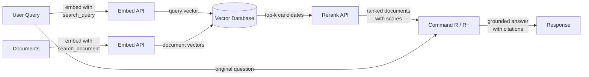

# Cohere

## Definition

**Cohere** ist ein Enterprise-KI-Unternehmen, das Sprachmodelle und APIs entwickelt, die speziell für Geschäftsanwendungen mit einem klaren Fokus auf Suche, Informationsabruf und Retrieval-Augmented Generation (RAG) konzipiert sind. Im Gegensatz zu Allzweckanbietern, die ein breites Spektrum an Verbraucher- und Entwicklerfunktionen bieten, richtet Cohere sich an Enterprise-Kunden, die zuverlässige, produktionsreife NLP-Infrastruktur benötigen – insbesondere für Anwendungsfälle, bei denen das *Finden und Bereitstellen der richtigen Informationen* das Kernproblem ist.

Coheres Modellreihe spiegelt diesen Fokus wider. **Command R** und **Command R+** sind Konversations- und Anweisungsfolgemodelle, die speziell für RAG-Workflows optimiert sind – sie unterstützen lange Kontextfenster und sind darauf trainiert, abrufverankerten Prompts zuverlässig zu folgen. **Embed** bietet hochmoderne mehrsprachige dichte Vektoreinbettungen für über 100 Sprachen, was es zur bevorzugten Wahl für globale Enterprise-Suchanwendungen macht. **Rerank** ist ein Cross-Encoder-Modell, das einen anfänglichen Satz abgerufener Dokumente nimmt und diese gegen die ursprüngliche Abfrage neu bewertet, um eine Präzision zu erreichen, die spärliche und dichte Abrufmethoden allein nicht erzielen können.

Was Cohere von Allzweckanbietern wie OpenAI unterscheidet, ist, dass seine gesamte Produktpalette rund um die Abrufpipeline als erstklassigen Workflow konzipiert ist. Die Modelle Embed, Rerank und Command R sind so aufgebaut, dass sie als kohärenter Stack zusammenarbeiten, und Cohere bietet On-Premises- und Private-Cloud-Bereitstellungsoptionen, die strenge Enterprise-Datenverwaltungs- und Compliance-Anforderungen erfüllen – eine kritische Unterscheidung für regulierte Branchen wie Finanzen, Gesundheitswesen und Regierung.

## Funktionsweise

### Chat und Generate API

Auf die Modelle Command R und Command R+ wird über Coheres Chat-API zugegriffen, die sowohl konversationelle mehrstufige Interaktionen als auch Einzeldurchlauf-Generierungsaufgaben unterstützt. Command R+ ist die größere, leistungsfähigere Variante, die für komplexes Schlussfolgern und dokumentenintensives RAG geeignet ist, während Command R für niedrigere Latenz und Kosten in Hochdurchsatz-Produktionspipelines optimiert ist. Beide Modelle akzeptieren einen `documents`-Parameter, mit dem Sie abgerufenen Kontext direkt in den Prompt übergeben können, was einen nativen RAG-Modus ermöglicht, bei dem das Modell angewiesen wird, seine Antwort auf den bereitgestellten Inhalt zu stützen und Quellen anzugeben.

### Embed API (mehrsprachige Einbettungen)

Die Embed-API konvertiert Text in dichte Vektorrepräsentationen, die für semantische Ähnlichkeitssuche geeignet sind. Coheres Einbettungsmodelle unterstützen über 100 Sprachen in einem einzigen Modell, was sprachübergreifende Suche und mehrsprachigen Dokumentenabruf ohne separate sprachspezifische Modelle möglich macht. Einbettungen können mit verschiedenen `input_type`-Werten generiert werden – `search_document` für die Indizierung von Inhalten im Ruhezustand und `search_query` für die Kodierung von Abfragen zur Laufzeit – eine Unterscheidung, die asymmetrische Trainingssignale anwendet und typischerweise die Abrufgenauigkeit im Vergleich zu symmetrischen Einbettungsschemas verbessert.

### Rerank API

Die Rerank-API akzeptiert eine Abfrage und eine Liste von Kandidatendokumenten (meist die Top-k-Ergebnisse aus einer Vektor- oder Schlüsselwortsuche) und gibt jedem Dokument eine Relevanzbewertung zurück, die von einem Cross-Encoder berechnet wird. Cross-Encoder bewerten die Abfrage und das Dokument gemeinsam in einem einzigen Vorwärtsdurchlauf, was eine viel höhere Präzision als Bi-Encoder ergibt, die Abfrage und Dokument separat kodieren. Reranking ist ein leichtgewichtiger, aber hochwirksamer Schritt, der die Precision@k dramatisch verbessert – er ist am wertvollsten, wenn der anfängliche Abruf relativ günstig ist (BM25 oder ANN-Suche), aber die Präzision maximiert werden muss, bevor der Kontext an ein LLM übergeben wird.

### RAG-Integration

Coheres RAG-Integration verbindet Embed, Rerank und Command R zu einer einheitlichen Pipeline. Der typische Ablauf ist: die Abfrage einbetten, eine approximative Nearest-Neighbor-Suche in einer Vektordatenbank durchführen, die Top-Kandidaten neu ordnen, um die relevantesten Dokumente zu erhalten, und diese Dokumente dann mit der ursprünglichen Abfrage zur fundierten Generierung an Command R übergeben. Das Modell gibt eine Antwort zusammen mit Zitatobjekten zurück, die auf bestimmte Passagen in den abgerufenen Dokumenten verweisen, was den Aufbau prüfbarer, quellenzitierfähiger KI-Anwendungen vereinfacht.



## Wann verwenden / Wann NICHT verwenden

| Verwenden wenn | Vermeiden wenn |
|----------|------------|
| Sie Enterprise-Suche oder Wissensdatenbank-Q&A aufbauen, bei dem die Abrufpräzision kritisch ist | Sie allgemeine Chat-Unterstützung ohne Abrufkomponente benötigen |
| Ihre Inhalte mehrere Sprachen umfassen und Sie ein einziges Einbettungsmodell für alle benötigen | Ihr Anwendungsfall primär Bild-, Audio- oder multimodal ist — Cohere ist nur Text |
| Sie einen Reranking-Schritt hinzufügen möchten, um die Präzision nach einer anfänglichen Vektor- oder BM25-Suche zu verbessern | Sie hochleistungsfähiges Schlussfolgern, Mathematik oder Coding für eigenständige Aufgaben benötigen (GPT-4o oder Claude könnten besser abschneiden) |
| Datenverwaltungsanforderungen On-Premises- oder Private-Cloud-Bereitstellung vorschreiben | Ihr Projekt ein schnelles Prototyp ist und Sie das breiteste Ökosystem an Integrationen wünschen |
| Sie native Quellzitate und Dokumentverankerung in der Modellausgabe benötigen | Das Budget sehr eng ist — Coheres Enterprise-Preise sind höher als einige Alternativen |

## Vergleiche

| Kriterium | Cohere | OpenAI | Mistral |
|----------|--------|--------|---------|
| Einbettungsqualität (MTEB) | Erstklassig mehrsprachig, 100+ Sprachen | Stark englischzentriert (text-embedding-3-large) | Wettbewerbsfähig; mistral-embed verfügbar |
| Reranking | Native Rerank API (Cross-Encoder) | Kein nativer Reranking-Endpunkt | Kein nativer Reranking-Endpunkt |
| RAG-native Modelle | Command R/R+ für RAG mit Zitaten konzipiert | GPT-4o funktioniert gut mit RAG-Prompts, aber nicht RAG-nativ | Mixtral/Mistral funktionieren mit RAG-Prompts |
| Offene Gewichte | Nein (nur proprietäre API) | Nein (nur proprietäre API) | Ja (Mistral-Modelle auf Hugging Face) |
| On-Premises / Private Cloud | Ja (Enterprise-Verträge) | Azure OpenAI (begrenzt) | Ja (Self-Host offene Gewichte) |
| Mehrsprachige Einbettungen | Einzelmodell, 100+ Sprachen | Separate oder begrenzte mehrsprachige Unterstützung | Begrenzte mehrsprachige Einbettungsunterstützung |
| Preismodell | Enterprise / Pay-per-Token | Pay-per-Token, gut dokumentiert | Pay-per-Token; Self-Host-Option kostenlos |

## Vor- und Nachteile

| Vorteile | Nachteile |
|------|------|
| Beste mehrsprachige Einbettungen in einem einzigen Modell | Kleineres allgemeines Ökosystem im Vergleich zu OpenAI |
| Native Rerank API verbessert die Abrufpräzision erheblich | Keine Open-Weights-Option für Self-Hosting |
| Command R/R+ sind speziell für fundiertes, zitiertes RAG konzipiert | Weniger leistungsfähig als GPT-4o / Claude für komplexes eigenständiges Schlussfolgern |
| Enterprise-grade Bereitstellungsoptionen einschließlich Private Cloud | Dokumentation und Community-Ressourcen sind dünner als bei OpenAI |
| RAG-Pipeline-Komponenten (Embed + Rerank + Command R) funktionieren als kohärenter Stack | Preise können für kleine Experimente höher sein |

## Codebeispiele

### Chat mit Command R

```python
import cohere

co = cohere.Client("YOUR_COHERE_API_KEY")

response = co.chat(
    model="command-r-plus",
    message="Explain retrieval-augmented generation in plain English.",
)
print(response.text)
```

### Einbettungen für semantische Suche

```python
import cohere

co = cohere.Client("YOUR_COHERE_API_KEY")

# Embed documents at indexing time
documents = [
    "Cohere specializes in enterprise NLP and semantic search.",
    "RAG combines retrieval with language model generation.",
    "Multilingual embeddings support over 100 languages.",
]
doc_embeddings = co.embed(
    texts=documents,
    model="embed-multilingual-v3.0",
    input_type="search_document",
).embeddings

# Embed a query at search time
query_embedding = co.embed(
    texts=["What does Cohere specialize in?"],
    model="embed-multilingual-v3.0",
    input_type="search_query",
).embeddings[0]

# Compute cosine similarity (or use a vector DB)
import numpy as np

doc_array = np.array(doc_embeddings)
query_array = np.array(query_embedding)
scores = doc_array @ query_array / (
    np.linalg.norm(doc_array, axis=1) * np.linalg.norm(query_array)
)
top_idx = int(np.argmax(scores))
print(f"Most relevant: '{documents[top_idx]}' (score: {scores[top_idx]:.4f})")
```

### Neuordnung abgerufener Kandidaten

```python
import cohere

co = cohere.Client("YOUR_COHERE_API_KEY")

query = "How does multilingual embedding work?"
candidates = [
    "Cohere Embed supports over 100 languages in a single model.",
    "Command R+ is optimized for RAG workflows with long context.",
    "Rerank re-scores retrieved documents with a cross-encoder.",
    "BM25 is a classic keyword-based retrieval algorithm.",
]

results = co.rerank(
    model="rerank-multilingual-v3.0",
    query=query,
    documents=candidates,
    top_n=3,
)

for hit in results.results:
    print(f"[{hit.relevance_score:.4f}] {candidates[hit.index]}")
```

### Vollständige RAG-Pipeline mit Command R+-Zitaten

```python
import cohere

co = cohere.Client("YOUR_COHERE_API_KEY")

# Documents retrieved from your vector store (simplified)
retrieved_docs = [
    {"id": "doc1", "text": "Cohere Embed supports 100+ languages for multilingual search."},
    {"id": "doc2", "text": "Command R+ is designed for grounded generation with source citations."},
    {"id": "doc3", "text": "Rerank improves precision by re-scoring candidates with a cross-encoder."},
]

response = co.chat(
    model="command-r-plus",
    message="How does Cohere's pipeline improve search quality?",
    documents=retrieved_docs,
)

print(response.text)
print("\n--- Citations ---")
for citation in response.citations:
    print(f"  [{citation.start}:{citation.end}] → {[doc['id'] for doc in citation.documents]}")
```

## Praktische Ressourcen

- [Cohere-API-Dokumentation](https://docs.cohere.com/) — Vollständige Referenz für alle Cohere-APIs einschließlich Chat, Embed und Rerank
- [Cohere-Embed-Dokumentation](https://docs.cohere.com/docs/embeddings) — Detaillierter Leitfaden zu Einbettungsmodellen, Eingabetypen und mehrsprachiger Unterstützung
- [Cohere-Rerank-Dokumentation](https://docs.cohere.com/docs/reranking) — Leitfaden zur Rerank-API mit Beispielen und Modellauswahlempfehlungen
- [Cohere-RAG-Leitfaden](https://docs.cohere.com/docs/retrieval-augmented-generation-rag) — Schritt-für-Schritt-Anleitung zum Aufbau einer RAG-Pipeline mit Command R
- [MTEB-Leaderboard](https://huggingface.co/spaces/mteb/leaderboard) — Unabhängiger Benchmark zum Vergleich von Einbettungsmodellen einschließlich Cohere Embed

## Siehe auch

- [Modellanbieter](/docs/model-providers)
- [RAG](/docs/rag)
- [Einbettungen](/docs/rag/embeddings)
- [Semantische Suche](/docs/semantic-search)
