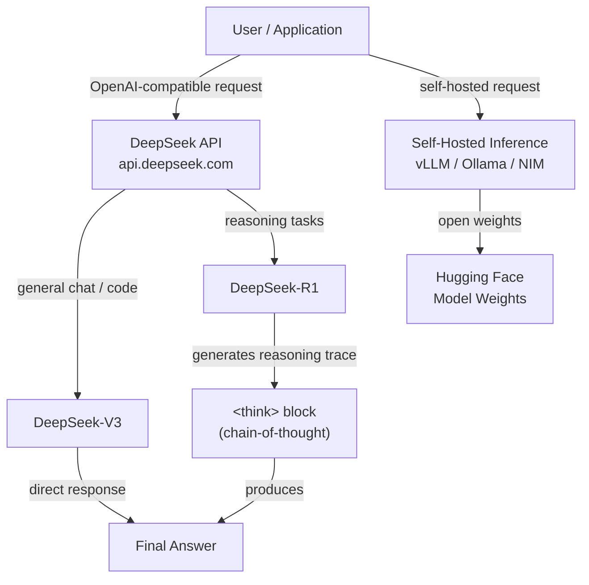

# DeepSeek

## Definition

**DeepSeek** ist ein chinesisches KI-Forschungslabor und eine kommerzielle Plattform, die internationale Aufmerksamkeit für die Entwicklung von Modellen erregt hat, die mit den besten proprietären Modellen konkurrenzfähige Leistung erzielen, während die Gewichte offen veröffentlicht werden und zu einem Bruchteil der Kosten betrieben werden. DeepSeek wurde 2023 als Tochterunternehmen von High-Flyer (einem quantitativen Hedgefonds) gegründet und zeichnet sich durch rigorose Forschung zur Trainingseffizienz aus – einschließlich Innovationen in Mixture-of-Experts-(MoE-)Architekturen, Reinforcement Learning from Human Feedback und neuartigen Ansätzen zum Schlussfolgern, die nicht auf massive Rechenbudgets angewiesen sind.

Die Modellreihe umfasst drei große Fähigkeitsbereiche. **DeepSeek-V3** ist ein Allzweck-Chat- und Anweisungsfolgemodell, das GPT-4o und Claude 3.5 Sonnet auf Standardbenchmarks übertrifft und dabei deutlich günstiger über die API zugänglich ist. **DeepSeek-R1** ist ein dediziertes Schlussfolgerungsmodell, das erweitertes Chain-of-Thought (CoT) verwendet – das Modell generiert explizite Schlussfolgerungsspuren vor einer endgültigen Antwort –, was es besonders stark bei Mathematik, logischer Deduktion und mehrstufigem Problemlösen macht. **DeepSeek-Coder** (und seine Nachfolgervarianten, die in V3/R1 integriert sind) ist auf Codegenerierung, Vervollständigung und Debugging in einer Vielzahl von Programmiersprachen spezialisiert.

DeepSeeks Open-Weights-Ansatz bedeutet, dass alle wichtigen Modelle auf Hugging Face unter permissiven Lizenzen verfügbar sind und auf Ihrer eigenen Infrastruktur selbst gehostet werden können – eine kritische Fähigkeit für Organisationen mit Datensouveränitätsanforderungen oder solche, die per-Token-API-Kosten im großen Maßstab vermeiden möchten. Die DeepSeek-Plattform stellt auch eine API bereit, die mit dem OpenAI-API-Format kabelkompatibel ist, was bedeutet, dass jede Anwendung, die mit dem OpenAI-Python-SDK erstellt wurde, durch Änderung der `base_url` und des API-Schlüssels ohne weitere Codeänderungen zu DeepSeek-Modellen wechseln kann.

## Funktionsweise

### API-Plattform

DeepSeek hostet eine Cloud-Inferenz-API unter `api.deepseek.com`, die Anfragen im OpenAI-Chat-Completions-Format akzeptiert. Diese Kompatibilitätsschicht bedeutet, dass der Integrationsaufwand minimal ist – Entwickler, die mit dem OpenAI-SDK vertraut sind, können DeepSeek-Modelle in Minuten migrieren oder testen. Die Plattform unterstützt Streaming-Antworten, Funktionsaufrufe und System-Prompts. Die Preise sind tokenbasiert und öffentlich aufgeführt, wobei die Raten typischerweise 90–95 % niedriger sind als bei gleichwertigen OpenAI-Modellen, was Hochvolumen-Produktionsbereitstellungen erheblich günstiger macht.

### Schlussfolgerungsmodelle (DeepSeek-R1)

DeepSeek-R1 wird mit einem mehrstufigen Prozess trainiert, der Reinforcement Learning einbezieht, um das Modell dafür zu belohnen, korrekte Endantworten zu produzieren – ohne sich in der Kerntainingsstufe auf überwachte Chain-of-Thought-Daten zu verlassen. Das Modell generiert einen `<think>`-Block mit seiner Schlussfolgerungsspur vor der endgültigen Antwort. Dieses explizite Notizbuch ermöglicht es dem Modell, mehrstufige Deduktionen durchzuführen, seine Arbeit zu überprüfen und von falschen Pfaden zurückzukehren – Verhaltensweisen, die die Leistung bei Mathematikolympiade-Problemen, formaler Logik und komplexen Codierungsaufgaben, die Planung über viele Schritte hinweg erfordern, dramatisch verbessern.

### Codemodelle und DeepSeek-Coder

DeepSeeks codespecialisierte Modelle werden auf großen Corpora von Quellcode (GitHub, Wettkampfprogrammierplattformen, Dokumentation) vortrainiert und für das Befolgen von Anweisungen bei Codierungsaufgaben feinabgestimmt. Sie unterstützen Fill-in-the-Middle-(FIM-)Vervollständigung, das Standardformat für IDE-Autovervollständigungstools wie Copilot. DeepSeek-Coder erreicht Spitzenleistung bei HumanEval, MBPP und SWE-bench und übertrifft oft Modelle, die von anderen Anbietern mehrfach größer sind. Die Codierungsfähigkeiten sind auch in DeepSeek-V3 und R1 integriert, sodass Allzweckmodelle ebenfalls gut bei Codeaufgaben abschneiden.

### Open-Weights-Bereitstellung

Alle wichtigen DeepSeek-Modelle haben ihre Gewichte unter permissiven Lizenzen auf Hugging Face veröffentlicht, was selbst gehostete Inferenz auf Consumer- oder Enterprise-GPU-Hardware ermöglicht. DeepSeek-V3 verwendet eine Mixture-of-Experts-Architektur, bei der nur ein Teilsatz der Parameter pro Token aktiviert wird, was die Inferenzkosten im Vergleich zu dichten Modellen vergleichbarer Fähigkeit erheblich reduziert. Beliebte Bereitstellungsoptionen umfassen vLLM, Ollama (für quantisierte Versionen) und NVIDIA NIM-Container. Selbst gehostete Bereitstellung ist besonders attraktiv für Großbatch-Workloads, Feinabstimmung auf proprietären Daten oder Szenarien, in denen alle Daten On-Premises verbleiben müssen.



## Wann verwenden / Wann NICHT verwenden

| Verwenden wenn | Vermeiden wenn |
|----------|------------|
| Kosten eine primäre Einschränkung sind — DeepSeek-API ist 90 %+ günstiger als GPT-4o bei vergleichbarer Qualität | Sie einen Anbieter mit einem etablierten Enterprise-SLA, Compliance-Zertifizierungen (SOC 2, HIPAA) oder US-basierter Datenverarbeitung benötigen |
| Aufgaben tiefes mehrstufiges Schlussfolgern erfordern: Mathematik, Logik, formale Beweise, komplexe Codierung | Ihre Aufgabe primär multimodal ist — DeepSeek-V3/R1 sind nur Text-Modelle |
| Sie Open-Weight-Modelle für Datensouveränität oder benutzerdefinierte Feinabstimmung selbst hosten möchten | Sie das breitestmögliche Plugin-/Tool-Ökosystem und Drittanbieter-Integrationen benötigen |
| Sie Hochvolumen-Batch-Pipelines aufbauen, bei denen die Reduzierung der per-Token-Kosten erheblich zunimmt | Latenzempfindliche Verbraucheranwendungen, bei denen R1s Schlussfolgerungsspur die Antwortzeit verlängert |
| Codegenerierung, Code-Review oder Debugging Ihre primären Anwendungsfälle sind | Sie sich in einer Rechtsordnung mit regulatorischen Anforderungen an den Ursprung von KI-Modellen befinden |

## Vergleiche

| Kriterium | DeepSeek (V3 / R1) | OpenAI (GPT-4o / o1) | Meta / Llama |
|----------|--------------------|----------------------|--------------|
| Schlussfolgerungsleistung | R1 wettbewerbsfähig mit o1 bei Mathematik-/Logik-Benchmarks | o1 ist erstklassig; GPT-4o stark bei allgemeinem Schlussfolgern | Llama 3.x wettbewerbsfähig, aber unter R1/o1 bei hartem Schlussfolgern |
| Allgemeine Chat-Qualität | V3 wettbewerbsfähig mit GPT-4o | GPT-4o bestklassige allgemeine Qualität | Llama 3.3 70B wettbewerbsfähig für die Größe |
| Offene Gewichte | Ja (alle Modelle auf Hugging Face) | Nein (nur proprietär) | Ja (Meta veröffentlicht Llama als Open Source) |
| API-Kosten | Sehr niedrig (~0,27 $/M Eingabe-Token für V3) | Hoch (~2,50 $/M für GPT-4o-Eingabe) | Kostenlos (self-host); Fireworks/Together API erschwinglich |
| Ökosystem & Integrationen | Wachsend; OpenAI-kompatible API erleichtert die Übernahme | Größtes Ökosystem, die meisten Integrationen | Großes Open-Source-Ökosystem |
| Datensouveränität | Self-Host möglich; API-Daten in China verarbeitet | Azure OpenAI für US-Regionalverarbeitung | Vollständiges Self-Host möglich |
| Multimodal | Nur Text (V3/R1) | Ja (GPT-4o, DALL-E) | Llama 3.2 hat Vision-Fähigkeiten |

## Vor- und Nachteile

| Vorteile | Nachteile |
|------|------|
| Dramatisch niedrigere API-Kosten als OpenAI/Anthropic | API-Daten werden über chinesische Server geleitet — Bedenken für einige regulierte Branchen |
| R1 liefert Schlussfolgerungsleistung auf Frontier-Niveau | R1-Schlussfolgerungsspuren erhöhen Latenz und Token-Nutzung |
| OpenAI-kompatible API — nahezu null Wechselkosten | Geringere Vertrauens-/Markenbekanntheit in westlichen Enterprise-Verkaufszyklen |
| Offene Gewichte ermöglichen Self-Hosting und Feinabstimmung | V3/R1 sind nur Text; keine nativen Bild- oder Audiofähigkeiten |
| Starke Codegenerierung über die meisten gängigen Sprachen hinweg | Community und Dokumentation hauptsächlich auf Chinesisch; englische Ressourcen holen noch auf |

## Codebeispiele

### Chat-Vervollständigung mit DeepSeek-V3 (OpenAI-kompatibel)

```python
from openai import OpenAI

# DeepSeek uses the OpenAI SDK with a custom base_url
client = OpenAI(
    api_key="YOUR_DEEPSEEK_API_KEY",
    base_url="https://api.deepseek.com",
)

response = client.chat.completions.create(
    model="deepseek-chat",  # maps to DeepSeek-V3
    messages=[
        {"role": "system", "content": "You are a helpful AI assistant."},
        {"role": "user", "content": "Explain the difference between MoE and dense transformer architectures."},
    ],
    temperature=0.7,
    max_tokens=1024,
)

print(response.choices[0].message.content)
```

### Schlussfolgern mit DeepSeek-R1 (Chain-of-Thought)

```python
from openai import OpenAI

client = OpenAI(
    api_key="YOUR_DEEPSEEK_API_KEY",
    base_url="https://api.deepseek.com",
)

response = client.chat.completions.create(
    model="deepseek-reasoner",  # maps to DeepSeek-R1
    messages=[
        {
            "role": "user",
            "content": (
                "A train leaves City A at 08:00 and travels at 120 km/h. "
                "Another train leaves City B (300 km away) at 09:00 and travels "
                "toward City A at 80 km/h. At what time do they meet?"
            ),
        }
    ],
)

# R1 exposes the reasoning trace in reasoning_content
message = response.choices[0].message
if hasattr(message, "reasoning_content") and message.reasoning_content:
    print("=== Reasoning trace ===")
    print(message.reasoning_content)
    print()

print("=== Final answer ===")
print(message.content)
```

### Streaming-Antwort mit DeepSeek-V3

```python
from openai import OpenAI

client = OpenAI(
    api_key="YOUR_DEEPSEEK_API_KEY",
    base_url="https://api.deepseek.com",
)

stream = client.chat.completions.create(
    model="deepseek-chat",
    messages=[
        {"role": "user", "content": "Write a Python function that implements binary search."},
    ],
    stream=True,
)

for chunk in stream:
    delta = chunk.choices[0].delta
    if delta.content:
        print(delta.content, end="", flush=True)
print()
```

### Selbst gehostete Inferenz mit vLLM

```python
# Start vLLM server (run in terminal):
# vllm serve deepseek-ai/DeepSeek-V3 --tensor-parallel-size 4 --port 8000

from openai import OpenAI

# Point to your local vLLM server instead of DeepSeek cloud
client = OpenAI(
    api_key="not-needed",  # vLLM does not require a real key
    base_url="http://localhost:8000/v1",
)

response = client.chat.completions.create(
    model="deepseek-ai/DeepSeek-V3",
    messages=[
        {"role": "user", "content": "Summarize the key advantages of mixture-of-experts models."},
    ],
)

print(response.choices[0].message.content)
```

## Praktische Ressourcen

- [DeepSeek-API-Dokumentation](https://platform.deepseek.com/api-docs/) — Offizielle Referenz für die DeepSeek-Plattform-API einschließlich Modelle, Parameter und Preise
- [DeepSeek GitHub](https://github.com/deepseek-ai) — Open-Source-Repositories für DeepSeek-Modelle, Trainings-Code und Forschungsarbeiten
- [DeepSeek-R1 auf Hugging Face](https://huggingface.co/deepseek-ai/DeepSeek-R1) — Modellkarte mit Gewichten, Benchmark-Ergebnissen und Bereitstellungsanweisungen
- [DeepSeek-V3 technischer Bericht](https://arxiv.org/abs/2412.19437) — Forschungsarbeit zur V3-Architektur, Trainingsansatz und Benchmark-Vergleiche
- [vLLM DeepSeek-Bereitstellungsleitfaden](https://docs.vllm.ai/en/latest/models/supported_models.html) — Anweisungen für Self-Hosting von DeepSeek-Modellen mit vLLM für Produktionsinferenz

## Siehe auch

- [Modellanbieter](/docs/model-providers)
- [DeepSeek-Fallstudie](/docs/case-studies/deepseek)
- [Schlussfolgerungsmuster](/docs/reasoning-patterns)
