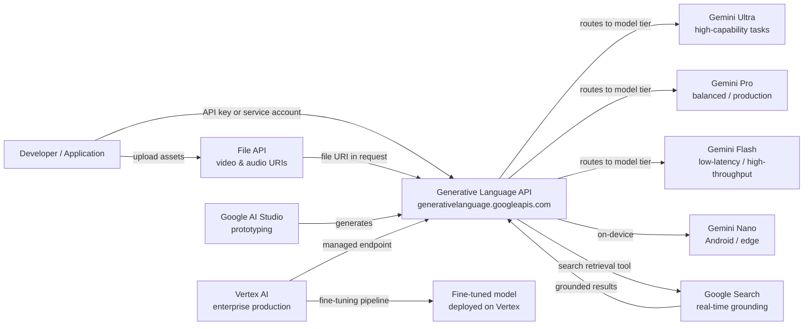

# Google Gemini

## Definition

Google Gemini ist Googles Flaggschiff-Familie multimodaler großer Sprachmodelle und die sie umgebende Plattform. Ende 2023 angekündigt und als Nachfolger der PaLM-2-Familie konzipiert, wurde Gemini von Grund auf entwickelt, um über Text, Bilder, Video, Audio und Code innerhalb einer einzigen einheitlichen Modellarchitektur zu schlussfolgern. Anders als Systeme, die Vision durch separate Pipelines nachrüsten, bedeutet Geminis native Multimodalität, dass das Modell alle Modalitäten gemeinsam während Training und Inferenz verarbeitet und so reicheres modalitätsübergreifendes Schlussfolgern ermöglicht.

Die Gemini-Familie umfasst vier Stufen, die für verschiedene Anwendungsfälle optimiert sind: **Gemini Ultra** (die leistungsfähigste, für komplexe Unternehmens- und Forschungsaufgaben), **Gemini Pro** (das ausgewogene Arbeitstier für breite kommerzielle Nutzung), **Gemini Flash** (optimiert für Anwendungen mit geringer Latenz und hohem Durchsatz bei reduzierten Kosten) und **Gemini Nano** (On-Device-Inferenz für Android und Edge-Hardware). Jede Stufe ist versioniert (z. B. Gemini 1.5 Pro, Gemini 2.0 Flash), und Google veröffentlicht neue Versionen fortlaufend.

Entwickler greifen auf Gemini über zwei komplementäre Oberflächen zu. **Google AI Studio** ist eine kostenlose, browserbasierte Prototyping-Umgebung, die API-Schlüssel bereitstellt und es ermöglicht, mit Prompts, Systemanweisungen und multimodalen Eingaben ohne Infrastrukturaufbau zu experimentieren. **Vertex AI** ist Googles verwaltete ML-Plattform und der empfohlene Weg für Produktions-Workloads — sie ergänzt Unternehmenskontrollen wie VPC Service Controls, IAM, Audit-Protokollierung, Fine-Tuning-Pipelines und SLA-gestützte Endpunkte. Beide Oberflächen nutzen dieselben zugrunde liegenden Gemini-Modelle über die Generative Language API.

## Funktionsweise

### Generative Language API

Die Generative Language API (`generativelanguage.googleapis.com`) ist die einheitliche REST-Schnittstelle für alle Gemini-Modelle. Anfragen sind als `contents`-Array strukturiert — jedes Element hat eine `role` (`user` oder `model`) und einen oder mehrere `parts` (Text, Inline-Daten oder Datei-URIs). Die API gibt ein `candidates`-Array mit `content`, `finishReason` und `safetyRatings` zurück. Token-Zählungen, Grounding-Metadaten und Funktionsaufruf-Antworten werden im selben Envelope zurückgegeben. API-Schlüssel aus AI Studio funktionieren für die Entwicklung; Produktions-Workloads verwenden Dienstkonto-Anmeldedaten über Vertex AI.

### Multimodale Eingaben — Bild, Video und Audio

Gemini akzeptiert Bilder (JPEG, PNG, WebP, HEIC), Videos (MP4, MOV, AVI bis zu mehreren Stunden) und Audio (MP3, WAV, FLAC) direkt neben Text in einer einzigen Anfrage. Bilder können als Inline-Base64-Daten oder über Cloud Storage URIs gesendet werden. Für lange Videos lädt die File API das Asset asynchron hoch und gibt eine Datei-URI zurück, die in nachfolgenden `generateContent`-Aufrufen referenziert werden kann. Das Modell tokenisiert nicht-textuelle Modalitäten intern, sodass dieselbe Kontextfenster-Abrechnung und Aufmerksamkeitsmechanismen einheitlich gelten und Aufgaben wie „Fasse die Audiospur dieses Videos zusammen und identifiziere, wann der Sprecher das Thema wechselt" ermöglichen.

### Grounding mit Google Search

Gemini unterstützt abrufgestützte Generierung durch einen optionalen `tools`-Parameter, der `google_search_retrieval` aktiviert. Wenn dieses Tool aktiv ist, kann das Modell während der Generierung Suchanfragen stellen, Echtzeit-Webergebnisse abrufen und in seine Antwort einbeziehen — mit Zitaten neben dem generierten Text. Dies ist besonders wertvoll für faktenintensive oder zeitkritische Anfragen, bei denen ein statisches parametrisches Modell halluzinieren oder veraltete Informationen zurückgeben würde. Grounding ist sowohl in AI Studio als auch in Vertex AI verfügbar und kann mit anderen Tools kombiniert werden.

### Vertex AI-Integration

Auf Vertex AI wird auf Gemini über das Python-SDK `vertexai` (`aiplatform`) zugegriffen. Vertex ergänzt Fine-Tuning (Supervised Fine-Tuning und RLHF-Pipelines), Modellevaluierungsdatensätze, Modellgärten zum Modellvergleich, Deployment auf dedizierte Endpunkte mit Auto-Scaling und Vertex AI Pipelines zur Orchestrierung von End-to-End-ML-Workflows. Unternehmenskunden profitieren von Datenresidenz-Garantien, privatem Networking über VPC Service Controls und Cloud Audit Logs für jeden API-Aufruf — Funktionen, die in AI Studio nicht verfügbar sind.



## Wann verwenden / Wann NICHT verwenden

| Verwenden wenn | Vermeiden wenn |
|----------|------------|
| Native multimodale Schlussfolgerung über Bilder, Videos oder Audio neben Text benötigt wird | Der Workload rein textbasiert ist und ein Anbieter mit längerem öffentlichem API-Track-Record bevorzugt wird |
| Bereits auf Google Cloud gearbeitet wird und eine tiefe Vertex AI / GCP-Integration (IAM, VPC, Audit Logs) gewünscht ist | Strenge Datenresidenz-Anforderungen in Regionen bestehen, in denen Vertex AI noch nicht verfügbar ist |
| Echtzeit-Grounding über Google Search benötigt wird | Die Anwendung deterministische, reproduzierbare Ausgaben benötigt (Grounding führt durch Live-Suche zu Variabilität) |
| Kosteneffizienz im großen Maßstab wichtig ist — Gemini Flash ist preislich sehr wettbewerbsfähig | Ein umfangreich dokumentiertes Open-Weights-Modell für den On-Premise-Betrieb benötigt wird |
| Eine kostenlose, reibungslose Prototyping-Umgebung ohne Kreditkarte gewünscht wird (AI Studio Free Tier) | Das Team bereits stark in die OpenAI-API-Oberfläche investiert ist und die Migrationskosten hoch sind |

## Vergleiche

| Kriterium | Google Gemini | OpenAI GPT-4o | Anthropic Claude 3.5 |
|-----------|--------------|--------------|----------------------|
| Multimodale Fähigkeit | Nativ — Text, Bild, Video, Audio in einem Modell | Text + Bild (GPT-4V); Audio über separate Whisper/TTS-APIs | Text + Bild (Claude 3); kein natives Video/Audio |
| Unternehmens-/Cloud-Integration | Tiefe GCP-Integration über Vertex AI — IAM, VPC, Audit Logs, Fine-Tuning | Azure OpenAI Service für Unternehmen; begrenzte Nicht-Azure-Cloud-Portabilität | AWS Bedrock und direkte API; keine native GCP-Integration |
| Grounding / Echtzeit-Abruf | Eingebautes Google Search Grounding-Tool | Web-Browsing-Plugin (ChatGPT); kein natives API-Grounding | Kein eingebautes Suchen; nutzt benutzerseitig bereitgestelltes RAG |
| Kontextfenster | Bis zu 1 Mio. Token (Gemini 1.5 Pro) | 128.000 Token (GPT-4o) | 200.000 Token (Claude 3.5 Sonnet) |
| Open-Weights-Verfügbarkeit | Nur geschlossene API | Nur geschlossene API | Nur geschlossene API |
| Preismodell | Pro Token; Flash-Stufe sehr wettbewerbsfähig | Pro Token; GPT-4o mittelpreisig | Pro Token; vergleichbar mit GPT-4o |
| Fine-Tuning | Supervised Fine-Tuning auf Vertex AI | Fine-Tuning-API für GPT-3.5/4o-mini | Keine öffentliche Fine-Tuning-API |

## Code-Beispiele

```python
# google_gemini_examples.py
# Demonstrates text generation, multimodal image input, and embeddings
# using the google-generativeai SDK.
# pip install google-generativeai pillow

import google.generativeai as genai
import pathlib

# ── Configuration ─────────────────────────────────────────────────────────────
# Set your API key from https://aistudio.google.com/app/apikey
genai.configure(api_key="YOUR_API_KEY")


# ── 1. Text generation ────────────────────────────────────────────────────────
def text_generation_example():
    """Simple single-turn text completion with Gemini Flash."""
    model = genai.GenerativeModel(
        model_name="gemini-1.5-flash",
        system_instruction="You are a concise technical writer.",
    )

    response = model.generate_content(
        "Explain the difference between supervised and unsupervised learning "
        "in three sentences.",
        generation_config=genai.GenerationConfig(
            temperature=0.4,
            max_output_tokens=256,
        ),
    )

    print("=== Text Generation ===")
    print(response.text)
    print(f"Finish reason : {response.candidates[0].finish_reason}")
    print(f"Total tokens  : {response.usage_metadata.total_token_count}")


# ── 2. Multimodal — image input ───────────────────────────────────────────────
def multimodal_image_example(image_path: str):
    """
    Send a local image alongside a text prompt to Gemini Pro.
    The model reasons over both modalities jointly.
    """
    model = genai.GenerativeModel("gemini-1.5-pro")

    image_data = pathlib.Path(image_path).read_bytes()
    # Inline image part
    image_part = {
        "mime_type": "image/jpeg",  # adjust to image/png, image/webp as needed
        "data": image_data,
    }

    response = model.generate_content(
        [image_part, "Describe this image and identify any text present in it."]
    )

    print("\n=== Multimodal Image Input ===")
    print(response.text)


# ── 3. Embeddings ─────────────────────────────────────────────────────────────
def embeddings_example(texts: list[str]):
    """
    Generate text embeddings using the text-embedding-004 model.
    Embeddings can be used for semantic search, clustering, and classification.
    """
    result = genai.embed_content(
        model="models/text-embedding-004",
        content=texts,
        task_type="retrieval_document",  # or retrieval_query, semantic_similarity
    )

    print("\n=== Embeddings ===")
    for text, embedding in zip(texts, result["embedding"]):
        print(f"Text    : {text[:60]}...")
        print(f"Dims    : {len(embedding)}")
        print(f"First 5 : {embedding[:5]}\n")


# ── 4. Multi-turn chat ────────────────────────────────────────────────────────
def multi_turn_chat_example():
    """Maintain conversational context using the chat interface."""
    model = genai.GenerativeModel("gemini-1.5-flash")
    chat = model.start_chat(history=[])

    turns = [
        "What is gradient descent?",
        "How does the learning rate affect it?",
        "What is Adam optimizer and how does it improve on basic gradient descent?",
    ]

    print("\n=== Multi-turn Chat ===")
    for user_message in turns:
        response = chat.send_message(user_message)
        print(f"User  : {user_message}")
        print(f"Model : {response.text}\n")


# ── Entry point ───────────────────────────────────────────────────────────────
if __name__ == "__main__":
    text_generation_example()

    # Provide a path to a local JPEG/PNG for multimodal demo
    # multimodal_image_example("path/to/your/image.jpg")

    embeddings_example([
        "Machine learning is a subset of artificial intelligence.",
        "Deep learning uses neural networks with many layers.",
        "Reinforcement learning trains agents through reward signals.",
    ])

    multi_turn_chat_example()
```

## Praktische Ressourcen

- [Google AI Studio](https://aistudio.google.com/) — Kostenlose browserbasierte Umgebung für Prototypen mit Gemini; generiert API-Schlüssel und ermöglicht interaktives Prompt-Tuning ohne erforderliche Infrastruktur.
- [Gemini API-Dokumentation](https://ai.google.dev/gemini-api/docs) — Offizielle Referenz für alle Modelle, Endpunkte, multimodale Eingabeformate, Grounding, Funktionsaufrufe und die File API.
- [Vertex AI — Generative AI-Dokumentation](https://cloud.google.com/vertex-ai/generative-ai/docs/overview) — Unternehmensweg: Fine-Tuning, Modellevaluierung, Deployment und GCP-Sicherheitskontrollen.
- [google-generativeai Python SDK auf PyPI](https://pypi.org/project/google-generativeai/) — SDK-Quellcode, Changelog und Nutzungsbeispiele.

## Siehe auch

- [Modellanbieter](/docs/model-providers)
- [Multimodale KI](/docs/multimodal-ai)
- [Fallstudien — Gemini](/docs/case-studies/gemini)
