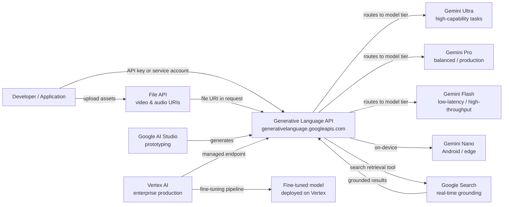

# Google Gemini

## Definition

Google Gemini ist Googles Flaggschiff-Familie multimodaler großer Sprachmodelle und die sie umgebende Plattform. Ende 2023 angekündigt und als Nachfolger der PaLM-2-Familie konzipiert, wurde Gemini von Grund auf für das Schlussfolgern über Text, Bilder, Video, Audio und Code in einer einzigen vereinheitlichten Modellarchitektur entwickelt. Im Gegensatz zu Systemen, die Vision durch separate Pipelines hinzufügen, bedeutet Geminis native Multimodalität, dass das Modell alle Modalitäten gemeinsam während Training und Inferenz verarbeitet, was reichhaltigeres modality-übergreifendes Schlussfolgern ermöglicht.

Die Gemini-Familie umfasst vier Stufen, die für verschiedene Anwendungsfälle abgestimmt sind: **Gemini Ultra** (die leistungsfähigste, für komplexe Enterprise- und Forschungsaufgaben), **Gemini Pro** (das ausgewogene Arbeitspferd für breite kommerzielle Nutzung), **Gemini Flash** (optimiert für niedriglatenz, Hochdurchsatz-Anwendungen zu reduzierten Kosten) und **Gemini Nano** (On-Device-Inferenz für Android und Edge-Hardware). Jede Stufe ist versioniert (z. B. Gemini 1.5 Pro, Gemini 2.0 Flash), und Google veröffentlicht kontinuierlich neue Versionen.

Entwickler greifen auf Gemini über zwei komplementäre Oberflächen zu. **Google AI Studio** ist eine kostenlose, browserbasierte Prototyping-Umgebung, die API-Schlüssel bereitstellt und Ihnen ermöglicht, mit Prompts, System-Anweisungen und multimodalen Eingaben zu experimentieren, ohne eine Infrastruktureinrichtung. **Vertex AI** ist die verwaltete ML-Plattform von Google Cloud und der empfohlene Pfad für Produktions-Workloads – sie fügt Enterprise-Kontrollen wie VPC-Dienststeuerungen, IAM, Audit-Logging, Feinabstimmungs-Pipelines und SLA-gesicherte Endpunkte hinzu. Beide Oberflächen nutzen die gleichen zugrunde liegenden Gemini-Modelle über die Generative Language API.

## Funktionsweise

### Generative Language API

Die Generative Language API (`generativelanguage.googleapis.com`) ist die einheitliche REST-Schnittstelle für alle Gemini-Modelle. Anfragen sind als `contents`-Array strukturiert – jedes Element hat eine `role` (`user` oder `model`) und einen oder mehrere `parts` (Text, Inline-Daten oder Datei-URIs). Die API gibt ein `candidates`-Array mit `content`, `finishReason` und `safetyRatings` zurück. Token-Anzahlen, Verankerungsmetadaten und Funktionsaufruf-Antworten werden in demselben Envelope zurückgegeben. API-Schlüssel von AI Studio funktionieren für die Entwicklung; Produktions-Workloads verwenden Dienstkonto-Anmeldedaten über Vertex AI.

### Multimodale Eingaben — Bild, Video und Audio

Gemini akzeptiert Bilder (JPEG, PNG, WebP, HEIC), Video (MP4, MOV, AVI bis zu mehreren Stunden) und Audio (MP3, WAV, FLAC) direkt neben Text in einer einzigen Anfrage. Bilder können als Inline-Base64-Daten oder über Cloud-Storage-URIs gesendet werden. Für lange Videos lädt die File API das Asset asynchron hoch und gibt einen Datei-URI zurück, der in nachfolgenden `generateContent`-Aufrufen referenziert werden kann. Das Modell tokenisiert intern nicht-textliche Modalitäten, sodass dieselbe Kontextfenster-Abrechnung und Aufmerksamkeitsmechanismen einheitlich gelten, was Aufgaben wie "Fasse die Audiospur dieses Videos zusammen und identifiziere, wann der Sprecher das Thema wechselt" ermöglicht.

### Verankerung mit Google-Suche

Gemini unterstützt abrufverankerte Generierung durch einen optionalen `tools`-Parameter, der `google_search_retrieval` aktiviert. Wenn dieses Tool aktiv ist, kann das Modell während der Generierung Suchanfragen stellen, Echtzeit-Webergebnisse abrufen und diese in seine Antwort einbeziehen – dabei Zitate neben dem generierten Text zurückgeben. Dies ist besonders wertvoll für faktendichte oder zeitkritische Abfragen, bei denen ein statisches parametrisches Modell halluzinieren oder veraltete Informationen zurückgeben würde. Verankerung ist sowohl in AI Studio als auch in Vertex AI verfügbar und kann mit anderen Tools kombiniert werden.

### Vertex AI-Integration

Auf Vertex AI wird auf Gemini über das Python-SDK `vertexai` (`aiplatform`) zugegriffen. Vertex fügt Feinabstimmung (überwachte Feinabstimmungs- und RLHF-Pipelines), Modell-Evaluierungsdatensätze, Modellgärten zum Vergleich von Modellen, Bereitstellung auf dedizierten Endpunkten mit Auto-Skalierung und Vertex AI Pipelines zur Orchestrierung von End-to-End-ML-Workflows hinzu. Enterprise-Kunden profitieren von Datenspeicherungsgarantien, privatem Netzwerk über VPC-Dienststeuerungen und Cloud-Audit-Logs für jeden API-Aufruf – Funktionen, die in AI Studio nicht verfügbar sind.



## Wann verwenden / Wann NICHT verwenden

| Verwenden wenn | Vermeiden wenn |
|----------|------------|
| Sie natives multimodales Schlussfolgern über Bilder, Video oder Audio neben Text benötigen | Ihre Arbeitslast nur Text ist und Sie einen Anbieter mit einer längeren öffentlichen API-Geschichte bevorzugen |
| Sie bereits auf Google Cloud sind und tiefe Vertex AI / GCP-Integration wollen (IAM, VPC, Audit-Logs) | Sie strenge Datenspeicherungsanforderungen in Regionen haben, in denen Vertex AI noch nicht verfügbar ist |
| Sie Echtzeit-Verankerung durch Google-Suche benötigen | Ihre Anwendung deterministische, reproduzierbare Ausgaben benötigt (Verankerung führt durch Live-Suche zu Variabilität) |
| Kosteneffizienz im großen Maßstab wichtig ist — Gemini Flash ist bei den Kosten pro Token sehr wettbewerbsfähig | Sie ein umfangreich dokumentiertes Open-Weights-Modell benötigen, das Sie On-Premises betreiben können |
| Sie eine kostenlose, reibungslose Prototyping-Umgebung ohne Kreditkarte wollen (AI Studio kostenlose Stufe) | Ihr Team bereits tief in die OpenAI-API-Oberfläche investiert ist und die Migrationskosten hoch sind |

## Vergleiche

| Kriterium | Google Gemini | OpenAI GPT-4o | Anthropic Claude 3.5 |
|-----------|--------------|--------------|----------------------|
| Multimodale Fähigkeit | Nativ — Text, Bild, Video, Audio in einem Modell | Text + Bild (GPT-4V); Audio über separate Whisper/TTS-APIs | Text + Bild (Claude 3); kein natives Video/Audio |
| Enterprise / Cloud-Integration | Tiefe GCP-Integration über Vertex AI — IAM, VPC, Audit-Logs, Feinabstimmung | Azure OpenAI Service für Enterprise; begrenzte Nicht-Azure-Cloud-Portabilität | AWS Bedrock und direkte API; keine native GCP-Integration |
| Verankerung / Echtzeit-Abruf | Eingebautes Google-Suche-Verankerungstool | Web-Browsing-Plugin (ChatGPT); keine native API-Verankerung | Keine eingebaute Suche; setzt auf vom Benutzer bereitgestelltes RAG |
| Kontextfenster | Bis zu 1M Tokens (Gemini 1.5 Pro) | 128K Tokens (GPT-4o) | 200K Tokens (Claude 3.5 Sonnet) |
| Verfügbarkeit offener Gewichte | Nur geschlossene API | Nur geschlossene API | Nur geschlossene API |
| Preismodell | Pro Token; Flash-Stufe sehr wettbewerbsfähig | Pro Token; GPT-4o mittlerer Preisbereich | Pro Token; vergleichbar mit GPT-4o |
| Feinabstimmung | Überwachte Feinabstimmung auf Vertex AI | Feinabstimmungs-API für GPT-3.5/4o-mini | Keine öffentliche Feinabstimmungs-API |

## Codebeispiele

```python
# google_gemini_examples.py
# Demonstrates text generation, multimodal image input, and embeddings
# using the google-generativeai SDK.
# pip install google-generativeai pillow

import google.generativeai as genai
import pathlib

# ── Configuration ─────────────────────────────────────────────────────────────
# Set your API key from https://aistudio.google.com/app/apikey
genai.configure(api_key="YOUR_API_KEY")


# ── 1. Text generation ────────────────────────────────────────────────────────
def text_generation_example():
    """Simple single-turn text completion with Gemini Flash."""
    model = genai.GenerativeModel(
        model_name="gemini-1.5-flash",
        system_instruction="You are a concise technical writer.",
    )

    response = model.generate_content(
        "Explain the difference between supervised and unsupervised learning "
        "in three sentences.",
        generation_config=genai.GenerationConfig(
            temperature=0.4,
            max_output_tokens=256,
        ),
    )

    print("=== Text Generation ===")
    print(response.text)
    print(f"Finish reason : {response.candidates[0].finish_reason}")
    print(f"Total tokens  : {response.usage_metadata.total_token_count}")


# ── 2. Multimodal — image input ───────────────────────────────────────────────
def multimodal_image_example(image_path: str):
    """
    Send a local image alongside a text prompt to Gemini Pro.
    The model reasons over both modalities jointly.
    """
    model = genai.GenerativeModel("gemini-1.5-pro")

    image_data = pathlib.Path(image_path).read_bytes()
    # Inline image part
    image_part = {
        "mime_type": "image/jpeg",  # adjust to image/png, image/webp as needed
        "data": image_data,
    }

    response = model.generate_content(
        [image_part, "Describe this image and identify any text present in it."]
    )

    print("\n=== Multimodal Image Input ===")
    print(response.text)


# ── 3. Embeddings ─────────────────────────────────────────────────────────────
def embeddings_example(texts: list[str]):
    """
    Generate text embeddings using the text-embedding-004 model.
    Embeddings can be used for semantic search, clustering, and classification.
    """
    result = genai.embed_content(
        model="models/text-embedding-004",
        content=texts,
        task_type="retrieval_document",  # or retrieval_query, semantic_similarity
    )

    print("\n=== Embeddings ===")
    for text, embedding in zip(texts, result["embedding"]):
        print(f"Text    : {text[:60]}...")
        print(f"Dims    : {len(embedding)}")
        print(f"First 5 : {embedding[:5]}\n")


# ── 4. Multi-turn chat ────────────────────────────────────────────────────────
def multi_turn_chat_example():
    """Maintain conversational context using the chat interface."""
    model = genai.GenerativeModel("gemini-1.5-flash")
    chat = model.start_chat(history=[])

    turns = [
        "What is gradient descent?",
        "How does the learning rate affect it?",
        "What is Adam optimizer and how does it improve on basic gradient descent?",
    ]

    print("\n=== Multi-turn Chat ===")
    for user_message in turns:
        response = chat.send_message(user_message)
        print(f"User  : {user_message}")
        print(f"Model : {response.text}\n")


# ── Entry point ───────────────────────────────────────────────────────────────
if __name__ == "__main__":
    text_generation_example()

    # Provide a path to a local JPEG/PNG for multimodal demo
    # multimodal_image_example("path/to/your/image.jpg")

    embeddings_example([
        "Machine learning is a subset of artificial intelligence.",
        "Deep learning uses neural networks with many layers.",
        "Reinforcement learning trains agents through reward signals.",
    ])

    multi_turn_chat_example()
```

## Praktische Ressourcen

- [Google AI Studio](https://aistudio.google.com/) — Kostenlose browserbasierte Umgebung für Prototyping mit Gemini; generiert API-Schlüssel und ermöglicht interaktives Abstimmen von Prompts ohne Infrastruktur.
- [Gemini API-Dokumentation](https://ai.google.dev/gemini-api/docs) — Offizielle Referenz zu allen Modellen, Endpunkten, multimodalen Eingabeformaten, Verankerung, Funktionsaufrufen und der File API.
- [Vertex AI — Generative KI-Dokumentation](https://cloud.google.com/vertex-ai/generative-ai/docs/overview) — Enterprise-Pfad: Feinabstimmung, Modell-Evaluierung, Bereitstellung und GCP-Sicherheitskontrollen.
- [google-generativeai Python SDK auf PyPI](https://pypi.org/project/google-generativeai/) — SDK-Quellcode, Changelog und Verwendungsbeispiele.

## Siehe auch

- [Modellanbieter](/docs/model-providers)
- [Multimodale KI](/docs/multimodal-ai)
- [Fallstudien — Gemini](/docs/case-studies/gemini)
