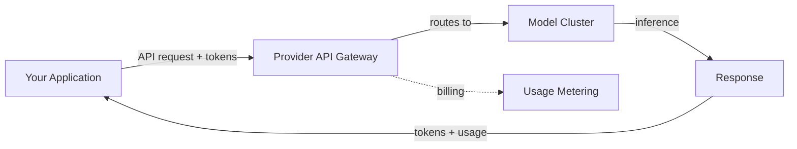
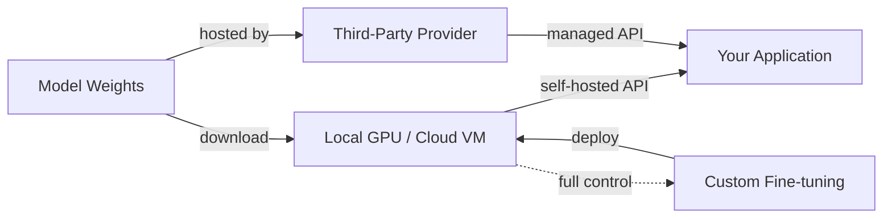

# Modellanbieter

## Definition

Ein Modellanbieter ist eine Organisation, die Zugang zu großen Sprachmodellen bietet – entweder über gehostete APIs, herunterladbare offene Gewichte oder beides. Die Wahl des Anbieters beeinflusst die Fähigkeiten Ihrer Anwendung, die Kostenstruktur, den Datenschutz und die Flexibilität bei der Bereitstellung. Das Verständnis der Anbieterlandschaft ist eine Voraussetzung für jedes produktive KI-System.

Der Markt gliedert sich in drei Kategorien. **API-basierte Anbieter** wie OpenAI, Anthropic und Google bieten Modelle ausschließlich über verwaltete APIs an – Sie senden Anfragen, sie kümmern sich um die Inferenzinfrastruktur. **Open-Weights-Anbieter** wie Meta und Mistral veröffentlichen Modellgewichte, die Sie herunterladen und auf Ihrer eigenen Hardware oder über Drittanbieter-Hosting betreiben können. **Hybride Anbieter** wie Mistral und DeepSeek bieten sowohl Open-Weights-Modelle als auch kommerziellen API-Zugang, was Entwicklern die Flexibilität gibt, je nach Bedarf zu wählen.

Die Wahl eines Anbieters beinhaltet Kompromisse über mehrere Dimensionen hinweg: Modellqualität, Preis, Kontextfenstergröße, multimodale Fähigkeiten, Datenschutz, Unterstützung für Feinabstimmung und Reife des Ökosystems. Kein einzelner Anbieter dominiert in allen Kriterien, weshalb die meisten Produktionssysteme mehrere Optionen evaluieren und manchmal verschiedene Anbieter für unterschiedliche Aufgaben innerhalb derselben Anwendung nutzen.

## Funktionsweise

### API-basierte Anbieter

API-Anbieter hosten Modelle auf ihrer Infrastruktur und stellen sie über REST-APIs bereit. Sie authentifizieren sich mit einem API-Schlüssel, senden eine Anfrage mit Ihrem Prompt und Konfigurationsparametern und erhalten eine Antwort. Der Anbieter kümmert sich um Skalierung, GPU-Zuweisung, Modell-Updates und Verfügbarkeit. Dies ist der einfachste Weg zur Produktion – keine Infrastruktur zu verwalten – aber Sie senden Ihre Daten an Dritte und zahlen pro Token.



### Open-Weights-Anbieter

Open-Weights-Anbieter veröffentlichen Modelldateien (typischerweise auf Hugging Face), die Sie herunterladen und lokal oder auf Ihrer Cloud-Infrastruktur betreiben. Sie kontrollieren den gesamten Stack: Hardware-Auswahl, Quantisierung, Serving-Framework (vLLM, TGI, llama.cpp) und Skalierung. Dies bietet maximale Privatsphäre und Anpassungsmöglichkeiten, erfordert aber ML-Infrastruktur-Expertise. Drittanbieter-Inferenzanbieter (Together AI, Groq, Fireworks) bieten einen Mittelweg – sie hosten offene Modelle mit einer API-Schnittstelle.



### Anbieter auswählen

Der Entscheidungsbaum hängt von Ihren Einschränkungen ab. Beginnen Sie mit Ihren Anforderungen – Datenschutz, Budget, Latenz, Modellqualität – und grenzen Sie von dort aus ein. Viele Teams beginnen mit API-Anbietern für Prototypen und evaluieren Open-Weights-Alternativen für die Produktionskostenoptimierung oder Anforderungen an die Datensouveränität.

## Wann verwenden / Wann NICHT verwenden

| Verwenden wenn | Vermeiden wenn |
|----------|------------|
| **API-Anbieter**: schnelles Prototyping, kein ML-Infra-Team, sofort Zugang zu modernsten Modellen benötigt | Daten dürfen Ihre Infrastruktur nicht verlassen (regulierte Branchen, personenbezogene Daten) |
| **Open-Weights**: Datenschutzanforderungen, Kontrolle über Feinabstimmung, Kostenoptimierung bei hohem Volumen | Ihnen fehlt GPU-Infrastruktur und ML-Ops-Expertise |
| **Drittanbieter-gehostete offene Modelle**: Open-Model-Flexibilität ohne Infrastrukturverwaltung | Sie benötigen garantierte SLAs und Enterprise-Support (verwenden Sie erstklassige APIs) |
| **Mehrere Anbieter**: verschiedene Aufgaben haben unterschiedliche Qualitäts-/Kostenanforderungen | Ihr Anwendungsfall ist einfach genug, dass ein Anbieter alles abdeckt |

## Vergleiche

| Kriterium | OpenAI | Anthropic | Google Gemini | Meta Llama | Mistral | Cohere | DeepSeek |
|----------|--------|-----------|---------------|------------|---------|--------|----------|
| Modellzugang | Nur API | Nur API | API + Vertex AI | Offene Gewichte | Offen + API | Nur API | Offen + API |
| Oberste Modellstufe | GPT-4o, o3 | Claude Opus/Sonnet | Gemini Ultra/Pro | Llama 3.1 405B | Mistral Large | Command R+ | DeepSeek-V3 |
| Kontextfenster | 128K | 200K | 1M+ | 128K | 128K | 128K | 128K |
| Multimodal | Vision, Audio, Bildgenerierung | Vision | Vision, Audio, Video | Vision (3.2) | Vision | Textfokussiert | Textfokussiert |
| Stärke | Allgemein, Ökosystem | Sicherheit, langer Kontext | Multimodal, Suchverankerung | Offene Gewichte, Anpassung | Effizienz, mehrsprachig | Einbettungen, RAG, Reranking | Schlussfolgern, Kosteneffizienz |
| Feinabstimmung | API-Feinabstimmung | Nicht verfügbar | Vertex AI-Abstimmung | Voller Gewichtszugang | API-Feinabstimmung | Nicht verfügbar | Voller Gewichtszugang |
| Preismodell | Pro Token | Pro Token | Pro Token + kostenlose Stufe | Kostenlos (selbst gehostet) oder Drittanbieter | Pro Token + kostenlose Modelle | Pro Token | Pro Token (sehr niedrige Kosten) |

## Codebeispiele

### Nebeneinander API-Aufrufe (Python)

```python
# OpenAI
from openai import OpenAI

openai_client = OpenAI()
openai_response = openai_client.chat.completions.create(
    model="gpt-4o",
    messages=[{"role": "user", "content": "Explain RAG in one sentence."}],
)
print("OpenAI:", openai_response.choices[0].message.content)
```

```python
# Anthropic
import anthropic

anthropic_client = anthropic.Anthropic()
anthropic_response = anthropic_client.messages.create(
    model="claude-sonnet-4-20250514",
    max_tokens=256,
    messages=[{"role": "user", "content": "Explain RAG in one sentence."}],
)
print("Anthropic:", anthropic_response.content[0].text)
```

```python
# Google Gemini
import google.generativeai as genai

model = genai.GenerativeModel("gemini-1.5-pro")
gemini_response = model.generate_content("Explain RAG in one sentence.")
print("Gemini:", gemini_response.text)
```

### Einheitliche Schnittstelle mit LiteLLM (Python)

```python
from litellm import completion

# Same interface, different providers
providers = {
    "OpenAI": "gpt-4o",
    "Anthropic": "claude-sonnet-4-20250514",
    "Gemini": "gemini/gemini-1.5-pro",
}

for name, model in providers.items():
    response = completion(
        model=model,
        messages=[{"role": "user", "content": "Explain RAG in one sentence."}],
    )
    print(f"{name}: {response.choices[0].message.content}")
```

## Praktische Ressourcen

- [Artificial Analysis](https://artificialanalysis.ai/) — Unabhängige LLM-Benchmarks und Preisvergleich
- [LiteLLM](https://docs.litellm.ai/) — Einheitliche API für über 100 LLM-Anbieter
- [OpenRouter](https://openrouter.ai/) — Einzelnes API-Gateway zu mehreren Anbietern
- [Hugging Face Open LLM Leaderboard](https://huggingface.co/spaces/open-llm-leaderboard/open_llm_leaderboard) — Benchmarks für offene Modelle
- [LMSYS Chatbot Arena](https://chat.lmsys.org/) — Crowdsourced LLM-Rankings durch blinde menschliche Bewertung

## Siehe auch

- [OpenAI](/docs/model-providers/openai)
- [Anthropic](/docs/model-providers/anthropic)
- [Google Gemini](/docs/model-providers/google-gemini)
- [Meta Llama](/docs/model-providers/meta-llama)
- [Mistral](/docs/model-providers/mistral)
- [Cohere](/docs/model-providers/cohere)
- [DeepSeek](/docs/model-providers/deepseek)
- [LLMs](/docs/llms)
- [Infrastruktur](/docs/infrastructure)
- [Lokale Inferenz](/docs/local-inference)
