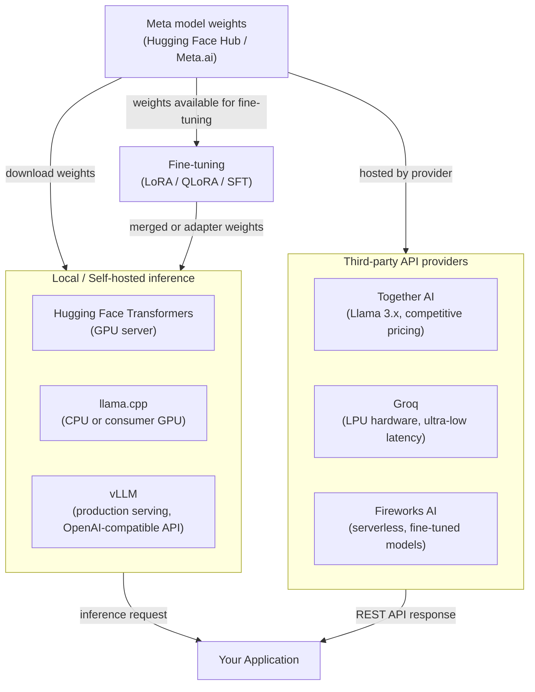

# Meta Llama

## Definition

Metas Llama (Large Language Model Meta AI) ist eine Familie von Open-Weights-Sprachmodellen, die von Meta AI Research veröffentlicht wurde. Im Gegensatz zu vollständig proprietären Modellen, die nur über eine bezahlte API vertrieben werden, werden Llama-Modelle mit Gewichten veröffentlicht, die Entwickler herunterladen, inspizieren, modifizieren und unter Metas benutzerdefinierter Community-Lizenz weitergeben können. Das bedeutet, dass Organisationen die Inferenz vollständig innerhalb ihrer eigenen Infrastruktur durchführen können, ohne Daten über einen Drittanbieter-Cloud-Dienst zu leiten – ein erheblicher Vorteil für datenschutzsensible Arbeitslasten. Die Serie begann 2023 mit Llama 1 und Llama 2 und erreichte einen wichtigen Meilenstein mit der **Llama-3**-Generation.

Die **Llama-3-Familie** umfasst mehrere Größen und Spezialisierungen. Die Basisversion Llama 3 enthielt instruktionfeinabgestimmte und Basisvarianten mit 8B und 70B Parametern. Spätere Versionen führten **Llama 3.1** ein (mit 405B Parametern, erweitertem 128K-Kontextfenster und mehrsprachigen Verbesserungen), **Llama 3.2** (leichte 1B- und 3B-Modelle für On-Device-Nutzung, plus 11B- und 90B-multimodale Vision-Varianten) und **Llama 3.3** (ein 70B-Modell mit erheblich verbesserter mehrsprachiger und Schlussfolgerungsleistung). Zusammen decken diese ein breites Spektrum von Edge-Bereitstellung bis hin zu Frontier-naher Leistung ab.

Der Open-Weights-Modellraum steht an der Schnittstelle einer philosophischen und praktischen Debatte: **offen vs. geschlossen**. Befürworter offener Gewichte argumentieren, dass Transparenz, Auditierbarkeit, Community-Innovation und Kostenkontrolle die Bequemlichkeit einer verwalteten API überwiegen. Kritiker weisen darauf hin, dass große Open-Weights-Modelle teuer sind, im großen Maßstab zu betreiben, Ingenieur-Expertise für Bereitstellung und Sicherung erfordern, und dass "offene Gewichte" nicht dasselbe wie "Open Source" ist – die Trainingsdaten und die vollständige Methodik bleiben proprietär. In der Praxis landen die meisten Organisationen in einem hybriden Ansatz: Open-Weights-Modelle für sensible oder kostenempfindliche Arbeitslasten verwenden, während sie sich weiterhin auf geschlossene API-Anbieter für modernste Fähigkeiten verlassen.

## Funktionsweise

### Lokale Bereitstellung — Transformers, llama.cpp, vLLM

Der direkteste Weg, Llama-Modelle zu betreiben, ist lokal mit Hugging Face **Transformers**, das eine einheitliche Python-Schnittstelle über Hunderte von Modellarchitekturen bereitstellt. Für kleinere Modelle (7B–13B) auf Consumer-Hardware ist **llama.cpp** der Goldstandard: Es handelt sich um eine reine C/C++-Inferenz-Engine mit GGUF-Quantisierungsunterstützung, die Llama 3 8B in 4-Bit-Quantisierung auf einer Laptop-CPU oder bescheidenen GPU mit akzeptabler Latenz ausführen kann. Für Produktions-Serving im großen Maßstab ist **vLLM** die empfohlene Lösung – es implementiert PagedAttention für effizientes KV-Cache-Management, ermöglicht kontinuierliches Batching und stellt eine OpenAI-kompatible REST-API bereit, was es einfach macht, Llama mit minimalen Code-Änderungen für jede GPT-4-Integration einzutauschen. Jede Option nimmt einen anderen Punkt auf der Kurve Latenz/Durchsatz/Hardware-Kompromiss ein.

### Drittanbieter-API-Anbieter — Together AI, Groq, Fireworks AI

Für Teams, die die Flexibilität von Open-Weights-Modellen ohne die Infrastrukturbelastung wünschen, hosten mehrere spezialisierte Anbieter Llama-Modelle über verwaltete APIs. **Together AI** bietet Llama-3.x-Modelle mit wettbewerbsfähiger per-Token-Preisgestaltung und einem Python-SDK, das die OpenAI-Schnittstelle widerspiegelt. **Groq** betreibt Llama-Modelle auf benutzerdefinierter LPU-(Language Processing Unit-)Hardware, was extrem niedrige Latenz (oft einstellige Millisekunden pro Token) liefert, die für interaktive Anwendungen geeignet ist. **Fireworks AI** konzentriert sich auf feinabgestimmte und serverlose Modellbereitstellungen mit einem starken Fokus auf Entwicklererfahrung. Diese Anbieter sind besonders wertvoll für Proof-of-Concept-Arbeit, Burst-Arbeitslasten oder Teams ohne GPU-Infrastruktur.

### Feinabstimmung offener Gewichte

Einer der überzeugendsten Vorteile von Open-Weights-Modellen ist der vollständige Feinabstimmungszugang. Organisationen können Llama an domänenspezifische Aufgaben, Stilanforderungen oder Sicherheitsprofile mit überwachter Feinabstimmung (SFT) und Reinforcement Learning from Human Feedback (RLHF) anpassen. In der Praxis verwenden die meisten Praktiker parametereffiziente Feinabstimmung über **LoRA** (Low-Rank Adaptation) oder **QLoRA** (LoRA auf quantisierten Gewichten), was den GPU-Speicherbedarf um 4–10x reduziert. Die feinabgestimmten Adapter-Gewichte sind im Vergleich zum Basismodell winzig und können separat zusammengeführt oder geladen werden. Tools wie **Hugging Face TRL**, **Axolotl** und **LLaMA-Factory** bieten hochstufige Trainingsschleifen für Llama-Feinabstimmung mit minimalem Boilerplate.



## Wann verwenden / Wann NICHT verwenden

| Verwenden wenn | Vermeiden wenn |
|----------|------------|
| Datenschutz von höchster Bedeutung ist — regulierte Branchen, personenbezogene Daten, vertrauliches geistiges Eigentum, das Ihre Infrastruktur nicht verlassen darf | Sie modernste Frontier-Fähigkeit benötigen (GPT-4o / Claude 3.5 übertreffen Llama 3 bei vielen komplexen Schlussfolgerungs-Benchmarks noch) |
| Kostenkontrolle bei hohem Volumen — per-Token-API-Kosten summieren sich schnell; Self-Hosting großer Modelle kann ab bestimmten QPS-Schwellenwerten erheblich günstiger sein | Ihnen die ML-Ingenieurskapazität fehlt, um GPU-Infrastruktur zu verwalten, Modelle aktuell zu halten und Sicherheits-Patches zu verarbeiten |
| Sie das Modell auf proprietären Daten feinabstimmen müssen, um Verhalten oder Stil tiefgreifend anzupassen | Sie eine produktionsreife verwaltete API mit SLAs, automatischer Skalierung und null Betriebsaufwand benötigen |
| Sie vollständige Auditierbarkeit wünschen und die Modellgewichte für Compliance oder Red-Teaming inspizieren möchten | Ihre Arbeitslast Echtzeit-Web-Verankerung oder natives multimodales Video/Audio erfordert (Llama 3.2 fügt Vision hinzu, ist aber nicht auf dem Niveau von Gemini 1.5) |
| Sie On-Device-Inferenz ohne Netzwerkabhängigkeit ausführen möchten (Llama 3.2 1B/3B, llama.cpp) | Ihr Team Modelle schnell evaluiert und Iterationsgeschwindigkeit wichtiger ist als Datenkontrolle |

## Vergleiche

| Kriterium | Meta Llama 3.x | OpenAI GPT-4o | Mistral (offene Gewichte) |
|-----------|---------------|--------------|------------------------|
| Gewichtsverfügbarkeit | Open-Weights-Download (Community-Lizenz) | Nur geschlossene API | Offene Gewichte für 7B / Mixtral; geschlossen für Mistral Large |
| Größte Modellgröße | 405B (Llama 3.1) | Nicht offengelegt | ~141B effektiv (Mixtral 8x22B) |
| Self-Hosting | Vollständig unterstützt; llama.cpp, vLLM, Transformers | Nicht möglich | Vollständig unterstützt; gleiche Toolchain wie Llama |
| Verwaltete API-Optionen | Together AI, Groq, Fireworks, AWS Bedrock, Azure AI | OpenAI direkt, Azure OpenAI | La Plateforme (mistral.ai), Together AI |
| Feinabstimmung | Ja — LoRA, QLoRA, SFT auf vollständigen Gewichten | Feinabstimmungs-API nur für GPT-3.5/4o-mini | Ja — gleiche Open-Weights-Toolchain |
| Multimodal | Llama 3.2 (11B/90B Vision) | GPT-4o (Text + Bild, Audio nativ) | Nur Text für offene Modelle; Pixtral über API |
| Europäische Datensouveränität | Möglich mit EU-Region-Self-Hosting | Begrenzt (nur Azure-EU-Regionen) | Nativer EU-Anbieter (Hauptsitz Paris) |

## Codebeispiele

```python
# meta_llama_examples.py
# Demonstrates two deployment paths:
#   1. Local inference with Hugging Face Transformers
#   2. Third-party API via Together AI (OpenAI-compatible interface)
#
# pip install transformers accelerate torch together

# ─────────────────────────────────────────────────────────────────────────────
# Path 1: Local inference with Hugging Face Transformers
# Requires a GPU with enough VRAM (e.g. RTX 3090 for 8B in bfloat16,
# or use load_in_4bit=True with bitsandbytes for lower VRAM).
# ─────────────────────────────────────────────────────────────────────────────
from transformers import AutoTokenizer, AutoModelForCausalLM
import torch


def local_llama_inference(prompt: str, model_id: str = "meta-llama/Meta-Llama-3.1-8B-Instruct"):
    """
    Run Llama 3.1 8B Instruct locally.
    Requires a Hugging Face token with access granted at meta-llama/Meta-Llama-3.1-8B-Instruct.
    Set HF_TOKEN environment variable or pass token= to from_pretrained.
    """
    tokenizer = AutoTokenizer.from_pretrained(model_id)
    model = AutoModelForCausalLM.from_pretrained(
        model_id,
        torch_dtype=torch.bfloat16,
        device_map="auto",          # automatically distribute across available GPUs
        # load_in_4bit=True,        # uncomment for QLoRA / low VRAM inference
    )

    # Llama 3 instruct models use a chat template
    messages = [
        {"role": "system", "content": "You are a helpful data science assistant."},
        {"role": "user", "content": prompt},
    ]
    input_ids = tokenizer.apply_chat_template(
        messages,
        add_generation_prompt=True,
        return_tensors="pt",
    ).to(model.device)

    outputs = model.generate(
        input_ids,
        max_new_tokens=512,
        temperature=0.6,
        top_p=0.9,
        do_sample=True,
        eos_token_id=tokenizer.eos_token_id,
    )

    # Decode only the generated tokens (skip the input)
    generated = outputs[0][input_ids.shape[-1]:]
    return tokenizer.decode(generated, skip_special_tokens=True)


# ─────────────────────────────────────────────────────────────────────────────
# Path 2: Together AI — managed Llama API (OpenAI-compatible)
# Requires a Together AI account: https://api.together.ai
# pip install together
# ─────────────────────────────────────────────────────────────────────────────
from together import Together


def together_ai_inference(prompt: str):
    """
    Call Llama 3.1 405B via Together AI's managed inference API.
    Together AI uses an OpenAI-compatible interface, so the openai SDK
    also works — just point base_url at https://api.together.xyz/v1.
    """
    client = Together(api_key="YOUR_TOGETHER_API_KEY")

    response = client.chat.completions.create(
        model="meta-llama/Meta-Llama-3.1-405B-Instruct-Turbo",
        messages=[
            {"role": "system", "content": "You are a helpful data science assistant."},
            {"role": "user", "content": prompt},
        ],
        max_tokens=512,
        temperature=0.6,
        top_p=0.9,
    )

    return response.choices[0].message.content


# ─────────────────────────────────────────────────────────────────────────────
# Path 3: vLLM — production-grade OpenAI-compatible server (run separately)
# Start server: vllm serve meta-llama/Meta-Llama-3.1-8B-Instruct --port 8000
# Then query it as if it were the OpenAI API:
# ─────────────────────────────────────────────────────────────────────────────
from openai import OpenAI


def vllm_server_inference(prompt: str, base_url: str = "http://localhost:8000/v1"):
    """
    Query a locally running vLLM server.
    vLLM exposes an OpenAI-compatible API at /v1/chat/completions.
    """
    client = OpenAI(api_key="not-needed-for-local", base_url=base_url)

    response = client.chat.completions.create(
        model="meta-llama/Meta-Llama-3.1-8B-Instruct",
        messages=[{"role": "user", "content": prompt}],
        max_tokens=256,
        temperature=0.7,
    )
    return response.choices[0].message.content


# ─────────────────────────────────────────────────────────────────────────────
if __name__ == "__main__":
    test_prompt = "Explain the bias-variance tradeoff in machine learning."

    # Uncomment to run local inference (requires GPU + HF access)
    # print("=== Local (Transformers) ===")
    # print(local_llama_inference(test_prompt))

    print("=== Together AI ===")
    print(together_ai_inference(test_prompt))

    # Uncomment if you have a vLLM server running
    # print("=== vLLM Server ===")
    # print(vllm_server_inference(test_prompt))
```

## Praktische Ressourcen

- [Llama-GitHub-Repository (Meta)](https://github.com/meta-llama/llama-models) — Offizielle Modellkarten, Download-Anweisungen und die Community-Lizenz für die gesamte Llama-3-Familie.
- [Llama 3 auf Hugging Face](https://huggingface.co/meta-llama) — Modellgewichte, Tokenizer-Dateien und Community-Feinabstimmungen; erfordert ein Hugging-Face-Konto mit gewährtem Zugang.
- [llama.cpp](https://github.com/ggerganov/llama.cpp) — Leichtgewichtige C/C++-Inferenz-Engine mit GGUF-Quantisierung; das bevorzugte Tool für CPU- und Consumer-GPU-Bereitstellung.
- [Together AI-Dokumentation](https://docs.together.ai/) — Verwaltete Llama-API-Referenz, Preise und Feinabstimmungsleitfäden für gehostete Open-Weights-Modelle.
- [vLLM-Dokumentation](https://docs.vllm.ai/) — Produktions-Serving-Framework mit PagedAttention, kontinuierlichem Batching und OpenAI-kompatiblem Server.

## Siehe auch

- [Modellanbieter](/docs/model-providers)
- [Lokale Inferenz](/docs/local-inference)
- [Infrastruktur](/docs/infrastructure)
- [LLMs — Feinabstimmung](/docs/llms/fine-tuning)
- [Meta Llama → Mistral-Vergleich](/docs/model-providers/mistral)
