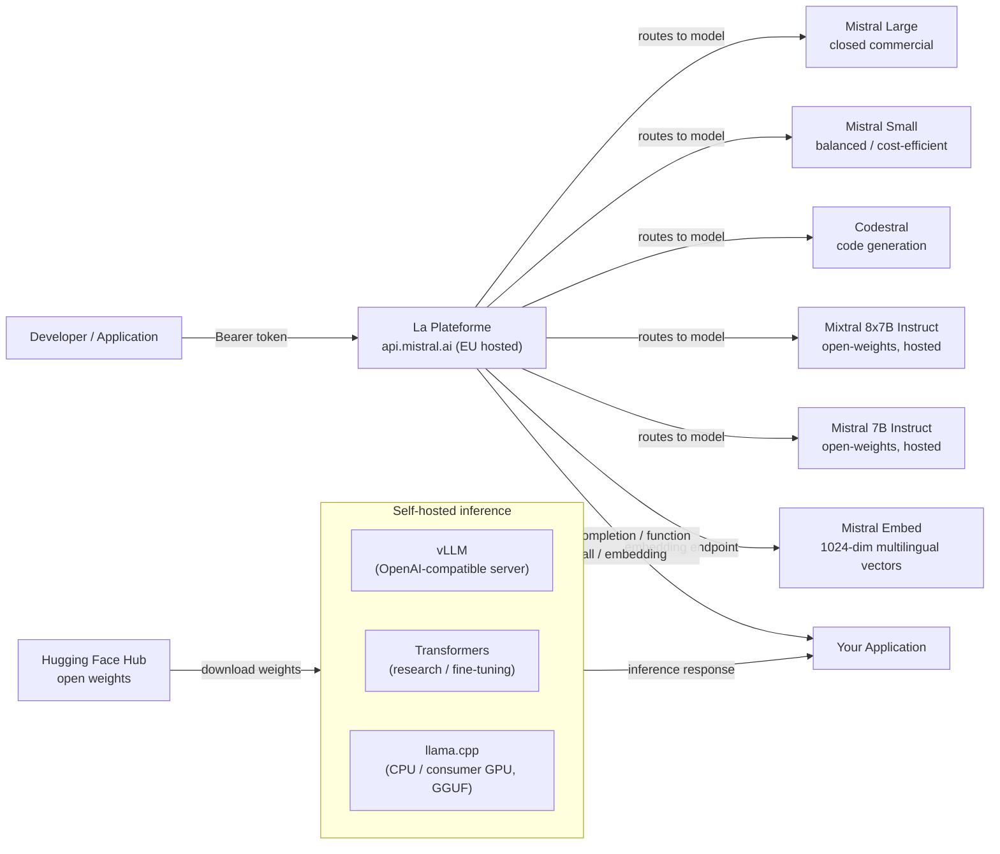

# Mistral AI

## Definition

Mistral AI ist ein französisches KI-Startup, das 2023 gegründet wurde und sich schnell als einer der einflussreichsten Akteure im europäischen KI-Ökosystem etabliert hat. Die definierende Philosophie des Unternehmens ist ein **dualer Ansatz**: Veröffentlichung effizienter Open-Weights-Modelle für die Forschungsgemeinschaft und das Entwicklerökosystem, während gleichzeitig eine kommerzielle API-Plattform (**La Plateforme**) mit Premium-Modellen und Enterprise-Funktionen angeboten wird. Diese Kombination hat Mistral besonders bei Entwicklern beliebt gemacht, die frei experimentieren möchten, bevor sie sich für eine bezahlte Bereitstellung entscheiden, und bei europäischen Unternehmen, die einen souveränen KI-Anbieter mit DSGVO-konformer Infrastruktur in EU-Rechenzentren suchen.

Mistrals Open-Weights-Veröffentlichungen waren bemerkenswert effizient für ihre Parameterzahl. **Mistral 7B**, veröffentlicht im September 2023, übertraf Llama 2 13B auf den meisten Benchmarks, obwohl es fast halb so groß ist – hauptsächlich durch die Verwendung von Grouped-Query Attention (GQA) für schnelle Inferenz und ein 32K-Kontextfenster, das für diese Größenordnung ungewöhnlich war. **Mixtral 8x7B** führte eine Mixture-of-Experts-(MoE-)Architektur mit acht Experten-Feed-Forward-Netzwerken pro Schicht ein, wobei nur zwei pro Token aktiviert werden. Dies gibt Mixtral die effektive Parameteranzahl von 13B aktiven Parametern während der Inferenz bei 47B Gesamtparametern – was nahezu die Qualität eines 70B-Modells zu niedrigeren Berechnungskosten liefert. Spätere Versionen haben die kommerzielle Reihe um **Mistral Small**, **Mistral Medium** und **Mistral Large** erweitert, wobei letzteres mit GPT-4-Klasse-Modellen bei komplexen Schlussfolgerungs- und Codierungsaufgaben konkurriert.

Mistrals Stärken konzentrieren sich auf Effizienz, mehrsprachige Leistung (insbesondere in europäischen Sprachen — Französisch, Spanisch, Deutsch, Italienisch) und eine entwicklerfreundliche API, die der OpenAI-Schnittstelle nahekommt. Das Unternehmen ist auch in der KI-Governance-Landschaft bemerkenswert, da es aktiv an EU-KI-Gesetz-Diskussionen teilnimmt und sich als verantwortungsvolle, europäische Alternative zu US-amerikanischen Frontier-Lab-APIs positioniert.

## Funktionsweise

### La Plateforme API

La Plateforme (`api.mistral.ai`) ist Mistrals verwaltete Inferenz-API, die um die OpenAI-Chat-Completions-Schnittstelle herum aufgebaut ist. Anfragen sind als `{"model": "...", "messages": [...]}` strukturiert – jede Client-Bibliothek, die für die OpenAI-API entwickelt wurde, kann mit einer einzigen `base_url`-Änderung umgeleitet werden. Die API bedient sowohl Mistrals proprietäre kommerzielle Modelle (Mistral Large, Mistral Small, Mistral Medium, Codestral) als auch die Open-Weights-Modelle (Mistral 7B Instruct, Mixtral 8x7B Instruct, Mixtral 8x22B Instruct). Die Authentifizierung verwendet Bearer-Tokens. La Plateforme wird in europäischen Rechenzentren gehostet, was es zur natürlichen Wahl für Organisationen mit EU-Datenspeicherungsanforderungen macht. Ratenlimits, Abrechnung und API-Schlüsselverwaltung sind über die Mistral-Konsole unter `console.mistral.ai` zugänglich.

### Open-Weights-Modelle — Mistral 7B, Mixtral 8x7B, Mistral Large

Die Flaggschiff-Open-Weights-Modelle werden über Hugging Face vertrieben und können mit der Standard-Toolchain Transformers, vLLM oder llama.cpp (GGUF-Format) selbst gehostet werden. **Mistral 7B** ist ideal für Feinabstimmungsexperimente, On-Premises-Bereitstellung und ressourcenbeschränkte Umgebungen. **Mixtral 8x7B** liefert erheblich höhere Qualität mit nur marginal höheren aktiven Parameterkosten und ist eine beliebte Wahl für Produktions-Self-Hosting. **Mixtral 8x22B** skaliert weiter für Aufgaben, die tieferes Schlussfolgern erfordern. **Mistral Large** ist ein geschlossenes kommerzielles Modell, das nur über La Plateforme und ausgewählte Cloud-Partner (Azure AI, AWS Bedrock, Google Cloud) verfügbar ist. Die Open-Weights-Modelle verwenden einen Sliding-Window-Attention-Mechanismus mit einem 32K-Kontextfenster, BPE-Tokenisierung mit einem 32K-Vokabular und einen sentencepiece-basierten Tokenizer, der mit dem offiziellen mistralai-Python-SDK kompatibel ist.

### Funktionsaufrufe

Mistral unterstützt strukturierte Funktionsaufrufe (auch Tool-Nutzung genannt) sowohl auf den Open-Weights-Instruct-Modellen als auch auf allen La-Plateforme-Modellen. Die Schnittstelle spiegelt den OpenAI-`tools`-Parameter wider: Sie übergeben eine Liste von JSON-Schema-definierten Tool-Definitionen, das Modell gibt ein `tool_calls`-Array zurück, das angibt, welche Funktion mit welchen Argumenten aufgerufen werden soll, Ihre Anwendung führt die Funktion aus und das Ergebnis wird als `tool`-Rollennachricht zurückgegeben, um das Gespräch fortzusetzen. Mistrals Funktionsaufrufe sind besonders nützlich für den Aufbau agentischer Workflows, Datenextraktionspipelines und API-Orchestrierungsschichten ohne zusätzlichen Prompt-Engineering-Aufwand.

### Einbettungen

La Plateforme bietet einen Text-Einbettungs-Endpunkt (`/v1/embeddings`), der von Mistral Embed unterstützt wird, einem dedizierten Einbettungsmodell, das 1024-dimensionale dichte Vektoren produziert. Das Einbettungsmodell überzeugt bei semantischer Ähnlichkeit, Abruf und Klassifizierungsaufgaben in mehreren europäischen Sprachen. Die Schnittstelle ist identisch mit der OpenAI-Einbettungs-API: Übergeben Sie eine Zeichenfolge oder eine Liste von Zeichenfolgen, erhalten Sie Gleitkomma-Vektoren. Mistral Embed ist einer der kosteneffizienteren Einbettungs-Endpunkte, was es gut für groß angelegte Dokumentenindizierung in mehrsprachigen RAG-Pipelines geeignet macht.



## Wann verwenden / Wann NICHT verwenden

| Verwenden wenn | Vermeiden wenn |
|----------|------------|
| Sie EU-Datenspeicherung und DSGVO-konforme KI-Infrastruktur von Anfang an benötigen | Sie native multimodale Bild-/Video-/Audio-Eingabe benötigen (Mistral ist nur Text, außer Pixtral, das nur API-seitig und früh ist) |
| Sie eine OpenAI-kompatible API mit minimalen Migrationskosten aus bestehenden GPT-Integrationen wollen | Sie die absolut höchste Fähigkeit bei komplexem mehrstufigem Schlussfolgern benötigen — Mistral Large liegt bei einigen schwierigen Benchmarks hinter GPT-4o und Claude 3.5 Sonnet zurück |
| Effizienz wichtig ist — Mixtral 8x7B liefert hohe Qualität bei niedrigeren aktiven Rechenkosten als gleichwertig leistende dichte Modelle | Sie ein umfangreiches Ökosystem an Drittanbieter-Feinabstimmungen und Community-Support benötigen (Meta Llama hat eine größere offene Community) |
| Mehrsprachige europäische Sprachen (Französisch, Spanisch, Deutsch, Italienisch) zentral für Ihren Anwendungsfall sind | Ihre Arbeitslast langen Kontext über 32K Tokens in Open-Weights-Modellen erfordert (Llama 3.1 bietet 128K) |
| Sie ein Open-Weights-Modell selbst hosten und möglicherweise auf proprietären Daten feinabstimmen möchten | Sie On-Device-/Edge-Inferenz mit Sub-1B-Parametermodellen benötigen (Llama 3.2 1B/3B füllt diese Nische besser) |

## Vergleiche

| Kriterium | Mistral AI | Meta Llama 3.x | OpenAI GPT-4o |
|-----------|-----------|---------------|--------------|
| Gewichtsverfügbarkeit | Offen für 7B, Mixtral 8x7B, 8x22B; geschlossen für Mistral Large | Offen für alle Größen (8B bis 405B) | Nur geschlossene API |
| API-Anbieterstandort | EU (Paris); DSGVO-nativ | US-basierte Drittanbieter-Hosts (Together, Groq) | USA (Azure-EU-Regionen verfügbar) |
| MoE-Architektur | Ja (Mixtral 8x7B, 8x22B) | Nein (dichter Transformer) | Nicht offengelegt |
| Funktionsaufrufe | Volle Tool-Nutzung auf allen Instruct-/API-Modellen | Ja (Llama 3.x) | Ja (ausgereift, am besten dokumentiert) |
| Mehrsprachig (EU-Sprachen) | Stark — zentrales Designziel | Gut, aber US-zentrischer Trainingsschwerpunkt | Stark in allen wichtigen Sprachen |
| Feinabstimmungsunterstützung | Offene Gewichte: LoRA/QLoRA; API-Feinabstimmung Beta | Offene Gewichte: vollständige Feinabstimmung verfügbar | Feinabstimmungs-API nur für kleinere Modelle |
| Einbettungs-API | Mistral Embed (1024-Dim, mehrsprachig) | Nicht direkt über Meta verfügbar | text-embedding-3-small/large |
| Kontextfenster (offene Modelle) | 32K Tokens | 128K Tokens (Llama 3.1+) | 128K Tokens |

## Vor- und Nachteile

| Vorteile | Nachteile |
|------|------|
| Starkes Effizienz-zu-Qualitäts-Verhältnis, besonders Mixtral 8x7B vs. dichte Modelle ähnlicher Qualität | Open-Weights-Kontextfenster (32K) ist kürzer als Llama 3.1s 128K |
| EU-gehostete API mit starker DSGVO-Positionierung; ansprechend für europäische Enterprise-Kunden | Kleineres Community-Ökosystem und weniger Community-Feinabstimmungen im Vergleich zu Llama |
| OpenAI-kompatible Schnittstelle minimiert den Migrationsaufwand | Keine native multimodale Fähigkeit in produktionsreifen Open-Weights-Modellen |
| Wirklich nützliche Open-Weights-Veröffentlichungen, die über ihrer Gewichtsklasse schlagen | Mistral Large liegt bei den härtesten Benchmarks immer noch hinter den Top-Modellen von OpenAI und Anthropic |

## Codebeispiele

```python
# mistral_examples.py
# Demonstrates chat completion and function calling with the mistralai Python SDK.
# pip install mistralai

from mistralai import Mistral
import json

# ── Configuration ─────────────────────────────────────────────────────────────
# Get your API key at: https://console.mistral.ai/api-keys
client = Mistral(api_key="YOUR_MISTRAL_API_KEY")


# ── 1. Chat completion ─────────────────────────────────────────────────────────
def chat_completion_example():
    """Standard multi-turn chat with Mistral Large."""
    response = client.chat.complete(
        model="mistral-large-latest",
        messages=[
            {
                "role": "system",
                "content": (
                    "You are a senior machine learning engineer. "
                    "Provide concise, technically accurate answers."
                ),
            },
            {
                "role": "user",
                "content": "What are the key differences between MoE and dense transformer architectures?",
            },
        ],
        temperature=0.4,
        max_tokens=512,
    )

    print("=== Chat Completion ===")
    print(response.choices[0].message.content)
    print(f"\nModel : {response.model}")
    print(f"Usage : {response.usage}")


# ── 2. Function calling ────────────────────────────────────────────────────────
def function_calling_example():
    """
    Mistral function calling (tool use).
    The model decides which tool to call and with what arguments.
    Your application executes the function and returns the result.
    """
    # Define available tools with JSON Schema
    tools = [
        {
            "type": "function",
            "function": {
                "name": "get_model_benchmark",
                "description": (
                    "Retrieves benchmark scores for a specified language model "
                    "on a given benchmark suite."
                ),
                "parameters": {
                    "type": "object",
                    "properties": {
                        "model_name": {
                            "type": "string",
                            "description": "The name of the model, e.g. 'mixtral-8x7b'",
                        },
                        "benchmark": {
                            "type": "string",
                            "enum": ["MMLU", "HumanEval", "GSM8K", "HellaSwag"],
                            "description": "The benchmark suite to query.",
                        },
                    },
                    "required": ["model_name", "benchmark"],
                },
            },
        }
    ]

    # First turn — model decides to call a tool
    messages = [
        {
            "role": "user",
            "content": "What is Mixtral 8x7B's score on the MMLU benchmark?",
        }
    ]

    response = client.chat.complete(
        model="mistral-large-latest",
        messages=messages,
        tools=tools,
        tool_choice="auto",
    )

    assistant_message = response.choices[0].message
    print("=== Function Calling — Step 1: model requests tool call ===")
    print(f"Tool calls: {assistant_message.tool_calls}")

    # Simulate executing the tool
    if assistant_message.tool_calls:
        tool_call = assistant_message.tool_calls[0]
        function_args = json.loads(tool_call.function.arguments)
        print(f"\nExecuting: {tool_call.function.name}({function_args})")

        # Simulated function result
        tool_result = {
            "model": function_args["model_name"],
            "benchmark": function_args["benchmark"],
            "score": 70.6,
            "source": "Open LLM Leaderboard (Hugging Face)",
        }

        # Second turn — return the tool result and get the final response
        messages.append({"role": "assistant", "content": None, "tool_calls": assistant_message.tool_calls})
        messages.append({
            "role": "tool",
            "tool_call_id": tool_call.id,
            "content": json.dumps(tool_result),
        })

        final_response = client.chat.complete(
            model="mistral-large-latest",
            messages=messages,
            tools=tools,
        )

        print("\n=== Function Calling — Step 2: final answer ===")
        print(final_response.choices[0].message.content)


# ── 3. Embeddings ──────────────────────────────────────────────────────────────
def embeddings_example(texts: list[str]):
    """
    Generate multilingual embeddings with Mistral Embed.
    Returns 1024-dimensional dense vectors suitable for semantic search and RAG.
    """
    response = client.embeddings.create(
        model="mistral-embed",
        inputs=texts,
    )

    print("\n=== Embeddings ===")
    for i, embedding_obj in enumerate(response.data):
        vec = embedding_obj.embedding
        print(f"Text    : {texts[i][:60]}...")
        print(f"Dims    : {len(vec)}")
        print(f"First 5 : {vec[:5]}\n")


# ── Entry point ────────────────────────────────────────────────────────────────
if __name__ == "__main__":
    chat_completion_example()
    function_calling_example()
    embeddings_example([
        "L'intelligence artificielle transforme l'industrie.",
        "Machine learning models require careful evaluation.",
        "Die Verarbeitung natürlicher Sprache verbessert sich rasant.",
    ])
```

## Praktische Ressourcen

- [Mistral AI-Dokumentation](https://docs.mistral.ai/) — Vollständige API-Referenz zu Chat, Einbettungen, Funktionsaufrufen, Feinabstimmung und allen verfügbaren Modellen.
- [La Plateforme-Konsole](https://console.mistral.ai/) — API-Schlüsselverwaltung, Nutzungsdashboards und Modell-Playground für interaktives Testen.
- [Mistral-Modelle auf Hugging Face](https://huggingface.co/mistralai) — Offizielle Modellgewichte für Mistral 7B, Mixtral 8x7B und Mixtral 8x22B mit Download-Anweisungen und Modellkarten.
- [mistralai Python SDK auf PyPI](https://pypi.org/project/mistralai/) — SDK-Quellcode, Changelog und Codebeispiele für alle API-Funktionen.

## Siehe auch

- [Modellanbieter](/docs/model-providers)
- [Meta Llama](/docs/model-providers/meta-llama)
- [Lokale Inferenz](/docs/local-inference)
- [RAG — Einbettungen](/docs/rag/embeddings)
