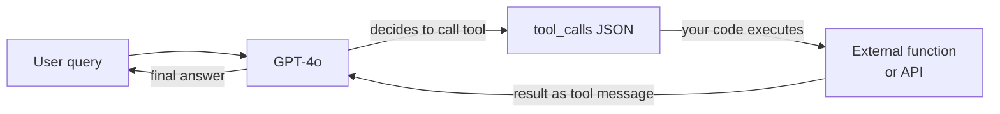

# OpenAI

## Definition

**OpenAI** ist ein KI-Forschungsunternehmen und eine Entwicklerplattform mit Sitz in San Francisco. 2015 gegründet und weithin bekannt für die Veröffentlichung von ChatGPT Ende 2022, betreibt OpenAI eine der meistgenutzten Modell-APIs der Branche. Die Plattform bietet Entwicklern programmatischen Zugang zu einer Modellfamilie, die Sprache, Vision, Audio und Bildgenerierung abdeckt – was sie zu einem One-Stop-Shop für die meisten generativen KI-Anwendungsfälle macht.

Die OpenAI-Modellreihe umfasst Stand 2025: **GPT-4o** (Flaggschiff-Multimodal-Modell, das Text, Bilder und Audio in einem einzigen Modell verarbeitet), **GPT-4o-mini** (kostengünstige Variante für Hochvolumen-Aufgaben), die **o-Serien**-Schlussfolgerungsmodelle — **o1**, **o1-mini**, **o3** und **o3-mini** — die erweitertes Chain-of-Thought-Schlussfolgern für Mathematik, Coding und komplexe Analyse verwenden, **DALL-E 3** für Text-zu-Bild-Generierung, **Whisper** für Sprache-zu-Text-Transkription und **TTS** (Text-to-Speech) für Audiosynthese. Einbettungsmodelle (text-embedding-3-small und text-embedding-3-large) unterstützen semantische Suche und RAG-Pipelines.

Aus Plattformperspektive bietet OpenAI eine tiered API mit nutzungsbasierter Preisgestaltung, einen Playground für interaktives Testen, eine Batch-API für asynchrone Masseninferenz mit 50 % Kostenreduktion, Feinabstimmung für GPT-4o-mini und GPT-3.5-turbo, eine Assistants-API für zustandsbehaftete Agenten-ähnliche Interaktionen und ein Evals-Framework für systematische Modellevaluierung. Das Python-SDK (`openai`) und ein TypeScript/Node.js-SDK sind die primären Client-Bibliotheken, und das API-Format ist zu einem De-facto-Standard geworden, den andere Anbieter (Mistral, Together, Groq) teilweise widerspiegeln.

## Funktionsweise

### Chat-Completions-API

Der Chat-Completions-Endpunkt (`POST /v1/chat/completions`) ist das Kernstück der OpenAI-Plattform. Sie senden ein Array von Nachrichten mit Rollen (`system`, `user`, `assistant`) und erhalten eine Vervollständigung. Die `system`-Nachricht legt die Persona und Einschränkungen des Assistenten fest; `user`-Nachrichten tragen Benutzereingaben; `assistant`-Nachrichten repräsentieren frühere Modellrunden für mehrstufige Gespräche. Streaming wird über Server-Sent-Events unterstützt, sodass die Antwort Token für Token angezeigt werden kann. Temperatur und Top-p steuern die Antwort-Zufälligkeit; `max_tokens` begrenzt die Ausgabelänge.

```mermaid
flowchart LR
  Client[Client app] -->|POST messages array| ChatAPI[/v1/chat/completions]
  ChatAPI -->|model routing| Selector{Model\nselector}
  Selector -->|standard| GPT4o[GPT-4o]
  Selector -->|reasoning| O3[o3 / o1]
  Selector -->|budget| Mini[GPT-4o-mini]
  GPT4o -->|stream or complete| Resp[JSON response]
  O3 --> Resp
  Mini --> Resp
  Resp --> Client
```

### Funktionsaufrufe und Tools

Funktionsaufrufe (auch "Tool-Nutzung" genannt) ermöglichen es dem Modell, externe Tools aufzurufen, indem strukturiertes JSON anstelle von freiem Text ausgegeben wird. Sie deklarieren Tool-Schemas in der Anfrage; das Modell entscheidet, wann ein Tool aufgerufen werden soll und füllt dessen Argumente aus. Ihr Code führt die Funktion aus und gibt das Ergebnis als `tool`-Nachricht zurück; das Modell verwendet dann dieses Ergebnis, um seine endgültige Antwort zu produzieren. Dies ist die Grundlage der meisten Agenten-Frameworks: Das Modell fungiert als Schlussfolgerungs- und Routing-Schicht, während die eigentliche Berechnung in Ihrem Code stattfindet.



### Einbettungs-API

Der Einbettungs-Endpunkt (`POST /v1/embeddings`) konvertiert Text in dichte numerische Vektoren. Diese Vektoren kodieren semantische Bedeutung: Ähnliche Texte produzieren ähnliche Vektoren. `text-embedding-3-large` (3072 Dimensionen) liefert die beste Abrufqualität; `text-embedding-3-small` (1536 Dimensionen) ist schneller und günstiger. Einbettungen sind das Rückgrat von [RAG](/docs/rag)-Pipelines: Sie betten Dokumente zum Indexierungszeitpunkt ein und betten Abfragen zum Suchzeitpunkt ein, dann rufen Sie Dokumente durch Kosinus-Ähnlichkeit ab.

### Bild- und Audio-APIs

**DALL-E 3** (`POST /v1/images/generations`) generiert Bilder aus Textprompts. Sie geben Größe (1024×1024, 1792×1024 oder 1024×1792), Qualität (Standard oder HD) und Stil (lebendig oder natürlich) an. **Whisper** (`POST /v1/audio/transcriptions`) transkribiert Audiodateien mit hoher Genauigkeit in über 57 Sprachen. **TTS** (`POST /v1/audio/speech`) konvertiert Text in natürlich klingende Sprache mit sechs eingebauten Stimmen. Diese APIs teilen dasselbe Authentifizierungs- und Abrechnungsmodell wie die Text-APIs, was den Aufbau multimodaler Pipelines in einer einzigen Anwendung vereinfacht.

## Wann verwenden / Wann NICHT verwenden

| OpenAI verwenden wenn | Alternativen in Betracht ziehen wenn |
|-----------------|--------------------------------------|
| Sie das breiteste Ökosystem benötigen: Bibliotheken, Tutorials und Community-Unterstützung sind standardmäßig OpenAI | Ihre Arbeitslast hochsensible oder regulierte Daten umfasst und Sie diese nicht an einen US-Drittanbieter senden können |
| Sie multimodale Unterstützung (Text + Bild + Audio) von einem einzigen Anbieter wollen | Sie tief feinabstimmen oder jeden Aspekt des Modells kontrollieren müssen — Open-Weights-Modelle bieten mehr Flexibilität |
| Sie fortgeschrittenes Schlussfolgern bei Mathematik, Code oder Logikproblemen benötigen (o1-, o3-Serie) | Kosten im großen Maßstab unerschwinglich sind — bei sehr hohen Token-Volumina übertrifft Open-Weights-Hosting oft per-Token-Preisgestaltung |
| Sie Funktionsaufruf- oder Agenten-Workflows aufbauen — OpenAIs strukturierte Ausgaben und Tool-Aufruf sind ausgereift | Sie eine Nicht-Englisch-zentrierte Erfahrung benötigen — Qwen oder Mistral könnten in bestimmten Sprachen besser abschneiden |
| Sie die Assistants-API für zustandsbehaftete, dateigestützte Agenten ohne eigene Zustandsschicht wollen | Sie reproduzierbare deterministische Ausgaben von einer eingefrorenen Modellversion benötigen — OpenAI aktualisiert Modelle regelmäßig |

## Vergleiche

| Kriterium | OpenAI | Anthropic | Google Gemini |
|----------|--------|-----------|---------------|
| Flaggschiffmodell | GPT-4o | Claude 3.7 Sonnet / Opus | Gemini 2.5 Pro |
| Schlussfolgerungsmodell | o3, o1 | Erweitertes Denken (Claude 3.7) | Gemini 2.5 Pro (thinking) |
| Kontextfenster | 128K (GPT-4o), 200K (o1) | 200K | Bis zu 1M (Gemini 1.5 Pro) |
| Multimodale Eingabe | Text, Bild, Audio, Video | Text, Bild | Text, Bild, Audio, Video, Code |
| Open-Weights-Option | Nein | Nein | Gemma (teilweise) |
| Funktions-/Tool-Aufrufe | Ausgereift, weit verbreitet | Stark, mit Computer Use | Ausgereift, Google-Ökosystem |
| Preisgestaltung (Flaggschiff) | ~2,50 $/1M Eingabe-Tokens (GPT-4o) | ~3 $/1M Eingabe-Tokens (Sonnet) | ~1,25 $/1M Eingabe-Tokens (Gemini 1.5 Pro) |
| Sicherheitsansatz | Moderation API, Nutzungsrichtlinien | Constitutional AI, Ablehnungsabstimmung | Richtlinien für verantwortungsvolle KI |
| Datenspeicherung | USA (Standard), Enterprise-Optionen | USA (Standard), Enterprise-Optionen | Multi-Region, Google Cloud |
| Am besten für | Breitestes Ökosystem, Agenten-Tooling, Schlussfolgern | Lange Dokumente, Sicherheit, nuancierte Anweisungen | Langer Kontext, multimodal, Google-Cloud-Nutzer |

## Vor- und Nachteile

| Vorteile | Nachteile |
|------|------|
| Branchenstandard-API, die von den meisten Frameworks und Bibliotheken übernommen wurde | Geschlossenes Modell — keine Transparenz bezüglich Gewichte oder Trainingsdaten |
| Breiteste Modellreihe: Sprache, Vision, Audio, Bild in einer Plattform | Standardmäßig US-gehostet; Datenspeicherung ist begrenzt |
| o-Serien-Schlussfolgerungsmodelle glänzen bei Mathematik, Code und Logik | Preise können im großen Maßstab hoch sein im Vergleich zu selbst gehosteten offenen Modellen |
| Starkes Ökosystem: Cookbook, Evals, Feinabstimmung, Batch-API | Modellversionen ändern sich regelmäßig — Verhalten kann sich ohne Vorankündigung ändern |
| Zuverlässige Ratenlimits und Enterprise-SLAs | Kein echtes Open-Weights-Angebot |

## Codebeispiele

### Chat-Vervollständigung mit Streaming

```python
from openai import OpenAI

client = OpenAI(api_key="sk-...")  # or set OPENAI_API_KEY env var

# Basic completion
response = client.chat.completions.create(
    model="gpt-4o",
    messages=[
        {"role": "system", "content": "You are a concise technical assistant."},
        {"role": "user", "content": "Explain embeddings in two sentences."},
    ],
    temperature=0.2,
    max_tokens=256,
)
print(response.choices[0].message.content)

# Streaming response
with client.chat.completions.stream(
    model="gpt-4o",
    messages=[{"role": "user", "content": "Write a haiku about APIs."}],
) as stream:
    for text in stream.text_stream:
        print(text, end="", flush=True)
```

### Funktionsaufrufe

```python
import json
from openai import OpenAI

client = OpenAI()

# Define a tool schema
tools = [
    {
        "type": "function",
        "function": {
            "name": "get_weather",
            "description": "Get the current weather for a city",
            "parameters": {
                "type": "object",
                "properties": {
                    "city": {"type": "string", "description": "City name"},
                    "unit": {"type": "string", "enum": ["celsius", "fahrenheit"]},
                },
                "required": ["city"],
            },
        },
    }
]

messages = [{"role": "user", "content": "What's the weather in Tokyo?"}]

# First call — model may decide to call a tool
response = client.chat.completions.create(
    model="gpt-4o",
    messages=messages,
    tools=tools,
    tool_choice="auto",
)

msg = response.choices[0].message
messages.append(msg)

# If the model called a tool, execute it and return the result
if msg.tool_calls:
    for tc in msg.tool_calls:
        args = json.loads(tc.function.arguments)
        # Simulated function execution
        result = {"city": args["city"], "temp": "18°C", "condition": "Partly cloudy"}
        messages.append({
            "role": "tool",
            "tool_call_id": tc.id,
            "content": json.dumps(result),
        })

# Second call — model uses the tool result to answer
final = client.chat.completions.create(model="gpt-4o", messages=messages)
print(final.choices[0].message.content)
```

### Einbettungen für semantische Suche

```python
from openai import OpenAI
import numpy as np

client = OpenAI()

def embed(texts: list[str], model: str = "text-embedding-3-small") -> list[list[float]]:
    response = client.embeddings.create(input=texts, model=model)
    return [item.embedding for item in response.data]

# Index documents
docs = [
    "Python is a high-level programming language.",
    "OpenAI provides a REST API for language models.",
    "RAG combines retrieval with generation.",
]
doc_vectors = embed(docs)

# Query
query = "How do I call OpenAI from Python?"
query_vector = embed([query])[0]

# Cosine similarity
def cosine_sim(a, b):
    a, b = np.array(a), np.array(b)
    return float(np.dot(a, b) / (np.linalg.norm(a) * np.linalg.norm(b)))

scores = [(cosine_sim(query_vector, dv), doc) for dv, doc in zip(doc_vectors, docs)]
scores.sort(reverse=True)
for score, doc in scores:
    print(f"{score:.3f}  {doc}")
```

## Praktische Ressourcen

- [OpenAI-API-Referenz](https://platform.openai.com/docs/api-reference) — Vollständige Endpunkt-Dokumentation mit Anfrage-/Antwort-Schemas
- [OpenAI-Preisgestaltung](https://openai.com/api/pricing/) — Per-Token-Preisgestaltung für alle Modelle einschließlich Batch-Rabatte
- [OpenAI Cookbook](https://cookbook.openai.com/) — Praktische Beispiele zu Funktionsaufrufen, RAG, Feinabstimmung, Evals und mehr
- [OpenAI-Modellübersicht](https://platform.openai.com/docs/models) — Modell-IDs, Kontextfenster, Fähigkeiten und Abkündigungszeitpläne
- [OpenAI Python SDK auf GitHub](https://github.com/openai/openai-python) — Quellcode, Changelog und Migrationsleitfäden

## Siehe auch

- [Modellanbieter](/docs/model-providers) — Übersicht und Vergleich aller Anbieter
- [Fallstudie: ChatGPT](/docs/case-studies/chatgpt) — Für einen tieferen Einblick in die Modellarchitektur, siehe die ChatGPT-Fallstudie
- [Anthropic](/docs/model-providers/anthropic) — Claude-Modellfamilie, Tool-Nutzung, langer Kontext
- [Prompt Engineering](/docs/prompt-engineering) — Techniken, die für alle OpenAI-Modelle gelten
- [Agenten](/docs/agents) — Aufbau agentischer Workflows mit Funktionsaufrufen
- [RAG](/docs/rag) — Verwendung von OpenAI-Einbettungen in Retrieval-Augmented Generation
