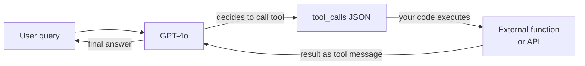

# OpenAI

## Definition

**OpenAI** ist ein KI-Forschungsunternehmen und eine Entwicklerplattform mit Hauptsitz in San Francisco. 2015 gegründet und weithin bekannt durch die Veröffentlichung von ChatGPT Ende 2022, betreibt OpenAI eine der meistgenutzten Modell-APIs der Branche. Die Plattform gibt Entwicklern programmatischen Zugang zu einer Familie von Modellen, die Sprache, Vision, Audio und Bildgenerierung umfassen — und ist damit eine One-Stop-Shop-Lösung für die meisten generativen KI-Anwendungsfälle.

Das OpenAI-Modell-Portfolio umfasst ab 2025: **GPT-4o** (Flaggschiff-Multimodal-Modell für Text, Bilder und Audio in einem einzigen Modell), **GPT-4o-mini** (kostenoptimierte Variante für hochvolumige Aufgaben), die **o-Series**-Schlussfolgermodelle — **o1**, **o1-mini**, **o3** und **o3-mini** — die erweitertes Chain-of-Thought-Schlussfolgern für Mathematik, Coding und komplexe Analysen nutzen, **DALL-E 3** für Text-zu-Bild-Generierung, **Whisper** für Sprache-zu-Text-Transkription und **TTS** (Text-to-Speech) für Audio-Synthese. Einbettungsmodelle (text-embedding-3-small und text-embedding-3-large) unterstützen semantische Suche und RAG-Pipelines.

Aus Plattformperspektive bietet OpenAI eine gestufte API mit nutzungsbasierter Preisgestaltung, ein Playground für interaktive Tests, eine Batch-API für asynchrone Bulk-Inferenz mit 50% Kostenreduzierung, Fine-Tuning für GPT-4o-mini und GPT-3.5-turbo, eine Assistants API für zustandsbehaftete agenten-ähnliche Interaktionen und ein Evals-Framework für systematische Modellevaluierung. Das Python-SDK (`openai`) und ein TypeScript/Node.js-SDK sind die primären Client-Bibliotheken, und das API-Format ist zu einem De-facto-Standard geworden, den andere Anbieter (Mistral, Together, Groq) teilweise übernommen haben.

## Funktionsweise

### Chat-Completions-API

Der Chat-Completions-Endpunkt (`POST /v1/chat/completions`) ist das Kernstück der OpenAI-Plattform. Sie senden ein Array von Nachrichten mit Rollen (`system`, `user`, `assistant`) und erhalten eine Vervollständigung. Die `system`-Nachricht legt die Persona und Einschränkungen des Assistenten fest; `user`-Nachrichten tragen Benutzereingaben; `assistant`-Nachrichten stellen frühere Modell-Turns für mehrturnige Konversationen dar. Streaming wird über Server-Sent-Events unterstützt, sodass die Antwort Token für Token angezeigt werden kann. Temperatur und Top-P steuern die Zufälligkeit der Antwort; `max_tokens` begrenzt die Ausgabelänge.

```mermaid
flowchart LR
  Client[Client app] -->|POST messages array| ChatAPI[/v1/chat/completions]
  ChatAPI -->|model routing| Selector{Model\nselector}
  Selector -->|standard| GPT4o[GPT-4o]
  Selector -->|reasoning| O3[o3 / o1]
  Selector -->|budget| Mini[GPT-4o-mini]
  GPT4o -->|stream or complete| Resp[JSON response]
  O3 --> Resp
  Mini --> Resp
  Resp --> Client
```

### Funktionsaufrufe und Tools

Funktionsaufrufe (auch „Tool-Nutzung" genannt) ermöglichen es dem Modell, externe Tools aufzurufen, indem es strukturiertes JSON statt Freitext ausgibt. Sie deklarieren Tool-Schemas in der Anfrage; das Modell entscheidet, wann ein Tool aufgerufen werden soll, und füllt seine Argumente aus. Ihr Code führt die Funktion aus und gibt das Ergebnis als `tool`-Nachricht zurück; das Modell nutzt dieses Ergebnis dann zur Erstellung seiner endgültigen Antwort. Dies ist die Grundlage der meisten Agenten-Frameworks: Das Modell fungiert als Schlussfolger- und Routing-Schicht, während die eigentliche Berechnung in Ihrem Code stattfindet.



### Einbettungs-API

Der Einbettungs-Endpunkt (`POST /v1/embeddings`) konvertiert Text in dichte numerische Vektoren. Diese Vektoren codieren semantische Bedeutung: ähnliche Texte erzeugen ähnliche Vektoren. `text-embedding-3-large` (3072 Dimensionen) liefert die beste Abrufqualität; `text-embedding-3-small` (1536 Dimensionen) ist schneller und günstiger. Einbettungen sind das Rückgrat von [RAG](/docs/rag)-Pipelines: Dokumente werden zur Indexierungszeit eingebettet und Anfragen zur Suchzeit, dann werden Dokumente durch Kosinus-Ähnlichkeit abgerufen.

### Bild- und Audio-APIs

**DALL-E 3** (`POST /v1/images/generations`) generiert Bilder aus Textprompts. Sie geben Größe (1024×1024, 1792×1024 oder 1024×1792), Qualität (Standard oder HD) und Stil (lebhaft oder natürlich) an. **Whisper** (`POST /v1/audio/transcriptions`) transkribiert Audiodateien mit hoher Genauigkeit in mehr als 57 Sprachen. **TTS** (`POST /v1/audio/speech`) konvertiert Text in natürlich klingende Sprache mit sechs eingebauten Stimmen. Diese APIs teilen dasselbe Authentifizierungs- und Abrechnungsmodell wie die Text-APIs, was es einfach macht, multimodale Pipelines in einer einzigen Anwendung zu erstellen.

## Wann verwenden / Wann NICHT verwenden

| OpenAI verwenden wenn | Alternativen erwägen wenn |
|-----------------|--------------------------------------|
| Das breiteste Ökosystem benötigt wird: Bibliotheken, Tutorials und Community-Support setzen standardmäßig auf OpenAI | Der Workload hochsensible oder regulierte Daten umfasst und diese nicht an einen US-amerikanischen Drittanbieter gesendet werden dürfen |
| Multimodale Unterstützung (Text + Bild + Audio) von einem einzigen Anbieter gewünscht wird | Tiefes Fine-Tuning oder vollständige Kontrolle über das Modell benötigt wird — Open-Weights-Modelle bieten mehr Flexibilität |
| Erweitertes Schlussfolgern bei Mathematik, Code oder Logikproblemen benötigt wird (o1, o3 Serie) | Kosten im großen Maßstab prohibitiv sind — bei sehr hohen Token-Volumina schlägt Open-Weights-Hosting oft die Pro-Token-Preisgestaltung |
| Funktionsaufruf- oder Agenten-Workflows entwickelt werden — OpenAIs strukturierte Ausgaben und Tool-Aufrufe sind ausgereift | Eine nicht-englisch-erste Erfahrung benötigt wird — Qwen oder Mistral können bei bestimmten Sprachen besser abschneiden |
| Die Assistants API für zustandsbehaftete, dateiaktivierte Agenten ohne eigene Zustandsschicht gewünscht wird | Reproduzierbare deterministische Ausgaben von einer eingefrorenen Modellversion benötigt werden — OpenAI aktualisiert Modelle fortlaufend |

## Vergleiche

| Kriterium | OpenAI | Anthropic | Google Gemini |
|----------|--------|-----------|---------------|
| Flaggschiff-Modell | GPT-4o | Claude 3.7 Sonnet / Opus | Gemini 2.5 Pro |
| Schlussfolger-Modell | o3, o1 | Erweitertes Denken (Claude 3.7) | Gemini 2.5 Pro (Denken) |
| Kontextfenster | 128.000 Token (GPT-4o), 200.000 Token (o1) | 200.000 Token | Bis zu 1 Mio. Token (Gemini 1.5 Pro) |
| Multimodale Eingabe | Text, Bild, Audio, Video | Text, Bild | Text, Bild, Audio, Video, Code |
| Open-Weights-Option | Nein | Nein | Gemma (teilweise) |
| Funktions-/Tool-Aufrufe | Ausgereift, weit verbreitet | Stark, mit Computer-Nutzung | Ausgereift, Google-Ökosystem |
| Preisgestaltung (Flaggschiff) | ~2,50 $/1 Mio. Eingabe-Token (GPT-4o) | ~3 $/1 Mio. Eingabe-Token (Sonnet) | ~1,25 $/1 Mio. Eingabe-Token (Gemini 1.5 Pro) |
| Sicherheitsansatz | Moderations-API, Nutzungsrichtlinien | Constitutional AI, Ablehnungs-Tuning | Responsible AI-Richtlinien |
| Datenresidenz | USA (Standard), Enterprise-Optionen | USA (Standard), Enterprise-Optionen | Multi-Region, Google Cloud |
| Am besten für | Breitestes Ökosystem, Agenten-Tooling, Schlussfolgern | Lange Dokumente, Sicherheit, nuancierte Anweisung | Langer Kontext, Multimodal, Google-Cloud-Nutzer |

## Vor- und Nachteile

| Vorteile | Nachteile |
|------|------|
| Branchen-Standard-API, von den meisten Frameworks und Bibliotheken übernommen | Geschlossenes Modell — keine Sichtbarkeit in Gewichte oder Trainingsdaten |
| Breitestes Modell-Portfolio: Sprache, Vision, Audio, Bild auf einer Plattform | Standardmäßig US-gehostet; Datenresidenz ist begrenzt |
| o-Series-Schlussfolgermodelle zeichnen sich bei Mathematik, Code und Logik aus | Preisgestaltung kann im großen Maßstab im Vergleich zu selbst gehosteten offenen Modellen hoch sein |
| Starkes Ökosystem: Cookbook, Evals, Fine-Tuning, Batch-API | Modellversionen ändern sich fortlaufend — Verhalten kann sich ohne Ankündigung verschieben |
| Zuverlässige Ratenlimits und Enterprise-SLAs | Kein echtes Open-Weights-Angebot |

## Code-Beispiele

### Chat-Completion mit Streaming

```python
from openai import OpenAI

client = OpenAI(api_key="sk-...")  # or set OPENAI_API_KEY env var

# Basic completion
response = client.chat.completions.create(
    model="gpt-4o",
    messages=[
        {"role": "system", "content": "You are a concise technical assistant."},
        {"role": "user", "content": "Explain embeddings in two sentences."},
    ],
    temperature=0.2,
    max_tokens=256,
)
print(response.choices[0].message.content)

# Streaming response
with client.chat.completions.stream(
    model="gpt-4o",
    messages=[{"role": "user", "content": "Write a haiku about APIs."}],
) as stream:
    for text in stream.text_stream:
        print(text, end="", flush=True)
```

### Funktionsaufrufe

```python
import json
from openai import OpenAI

client = OpenAI()

# Define a tool schema
tools = [
    {
        "type": "function",
        "function": {
            "name": "get_weather",
            "description": "Get the current weather for a city",
            "parameters": {
                "type": "object",
                "properties": {
                    "city": {"type": "string", "description": "City name"},
                    "unit": {"type": "string", "enum": ["celsius", "fahrenheit"]},
                },
                "required": ["city"],
            },
        },
    }
]

messages = [{"role": "user", "content": "What's the weather in Tokyo?"}]

# First call — model may decide to call a tool
response = client.chat.completions.create(
    model="gpt-4o",
    messages=messages,
    tools=tools,
    tool_choice="auto",
)

msg = response.choices[0].message
messages.append(msg)

# If the model called a tool, execute it and return the result
if msg.tool_calls:
    for tc in msg.tool_calls:
        args = json.loads(tc.function.arguments)
        # Simulated function execution
        result = {"city": args["city"], "temp": "18°C", "condition": "Partly cloudy"}
        messages.append({
            "role": "tool",
            "tool_call_id": tc.id,
            "content": json.dumps(result),
        })

# Second call — model uses the tool result to answer
final = client.chat.completions.create(model="gpt-4o", messages=messages)
print(final.choices[0].message.content)
```

### Einbettungen für semantische Suche

```python
from openai import OpenAI
import numpy as np

client = OpenAI()

def embed(texts: list[str], model: str = "text-embedding-3-small") -> list[list[float]]:
    response = client.embeddings.create(input=texts, model=model)
    return [item.embedding for item in response.data]

# Index documents
docs = [
    "Python is a high-level programming language.",
    "OpenAI provides a REST API for language models.",
    "RAG combines retrieval with generation.",
]
doc_vectors = embed(docs)

# Query
query = "How do I call OpenAI from Python?"
query_vector = embed([query])[0]

# Cosine similarity
def cosine_sim(a, b):
    a, b = np.array(a), np.array(b)
    return float(np.dot(a, b) / (np.linalg.norm(a) * np.linalg.norm(b)))

scores = [(cosine_sim(query_vector, dv), doc) for dv, doc in zip(doc_vectors, docs)]
scores.sort(reverse=True)
for score, doc in scores:
    print(f"{score:.3f}  {doc}")
```

## Praktische Ressourcen

- [OpenAI API-Referenz](https://platform.openai.com/docs/api-reference) — Vollständige Endpunkt-Dokumentation mit Anfrage-/Antwort-Schemas
- [OpenAI-Preisgestaltung](https://openai.com/api/pricing/) — Pro-Token-Preisgestaltung für alle Modelle einschließlich Batch-Rabatte
- [OpenAI Cookbook](https://cookbook.openai.com/) — Praktische Beispiele für Funktionsaufrufe, RAG, Fine-Tuning, Evals und mehr
- [OpenAI Modelle-Übersicht](https://platform.openai.com/docs/models) — Modell-IDs, Kontextfenster, Fähigkeiten und Veraltungs-Zeitpläne
- [OpenAI Python SDK auf GitHub](https://github.com/openai/openai-python) — Quellcode, Changelog und Migrationsleitfäden

## Siehe auch

- [Modellanbieter](/docs/model-providers) — Übersicht und Vergleich aller Anbieter
- [Fallstudie: ChatGPT](/docs/case-studies/chatgpt) — Für einen tieferen Einblick in die Modellarchitektur, siehe die ChatGPT-Fallstudie
- [Anthropic](/docs/model-providers/anthropic) — Claude-Modellfamilie, Tool-Nutzung, langer Kontext
- [Prompt-Engineering](/docs/prompt-engineering) — Techniken, die für alle OpenAI-Modelle gelten
- [Agenten](/docs/agents) — Aufbau agentischer Workflows mit Funktionsaufrufen
- [RAG](/docs/rag) — Nutzung von OpenAI-Einbettungen in der retrieval-augmentierten Generierung
