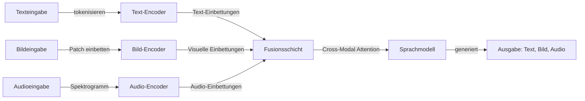

# Multimodale KI

## Definition

Multimodale KI bezeichnet Systeme, die Inhalte über mehrere Datenmodalitäten hinweg verarbeiten, verstehen und generieren können — Text, Bilder, Audio, Video und mehr — innerhalb eines einzelnen Modells oder einer Pipeline. Im Gegensatz zu unimodalen Systemen, die nur einen Eingabetyp verarbeiten, lernen multimodale Modelle, Repräsentationen über Modalitäten hinweg auszurichten, was Aufgaben wie Bildunterschriften, visuelles Frage-Antwort, Audiotranskription und modalitätsübergreifende Suche ermöglicht.

Das Feld hat sich durch mehrere Phasen entwickelt. Frühe Ansätze verwendeten separate Encoder für jede Modalität mit einer Fusionsschicht darüber (z. B. CLIP, das Text- und Bildeinbettungen durch kontrastives Lernen ausrichtet). Moderne Architekturen wie GPT-4V, Gemini und Claude integrieren multimodales Verständnis nativ in große Sprachmodelle — Bilder, Audio und Video werden tokenisiert oder in denselben Repräsentationsraum wie Text-Token projiziert, was das Modell innerhalb eines einzelnen Forward Passes über Modalitäten hinweg reasoning ermöglicht.

Multimodale KI wird zunehmend wichtiger, da reale Anwendungen reichhaltigere Interaktionen erfordern. Dokumentenverständnis erfordert die gemeinsame Verarbeitung von Text, Tabellen und Abbildungen. Sprachassistenten kombinieren Speech-to-Text, Sprachverständnis und Text-to-Speech. Autonome Systeme fusionieren Kamera-, Lidar- und Sensordaten. Da Foundation-Modelle nativ multimodal werden, löst sich die Grenze zwischen „Sprachmodell" und „Vision-Modell" in allgemeine multimodale Systeme auf.

## Funktionsweise

### Kodierung und Ausrichtung

Jede Modalität erfordert eine eigene Kodierungsstrategie. Text wird in Subwort-Token tokenisiert. Bilder werden in Patches aufgeteilt (z. B. ViT-artige Patch-Einbettungen) oder durch einen Convolutional Encoder verarbeitet. Audio wird in Spektrogramme oder Mel-Frequenz-Features umgewandelt. Die Hauptherausforderung ist die **Ausrichtung** — diese verschiedenen Repräsentationen in einen gemeinsamen Raum zu mappen, wo semantisch ähnliche Inhalte über Modalitäten hinweg nahe beieinander liegen.



### Fusionsstrategien

Es gibt drei Hauptansätze zur Kombination von Modalitäten. **Frühe Fusion** verkettet rohe oder leicht verarbeitete Eingaben vor einem gemeinsamen Modell — das machen moderne VLMs, indem sie Bild-Patches in den Token-Raum projizieren. **Späte Fusion** verarbeitet jede Modalität unabhängig und kombiniert sie auf Entscheidungsebene — verwendet in Retrieval-Systemen wie CLIP. **Cross-Attention-Fusion** verwendet Attention-Mechanismen, um einer Modalität zu ermöglichen, bei Zwischenschichten auf eine andere zu achten — häufig in Encoder-Decoder-Architekturen für Bildunterschriften und Übersetzung.

### Generierung über Modalitäten hinweg

Multimodale Generierung geht über Textausgabe hinaus. **Bilderzeugungsmodelle** (DALL-E, Stable Diffusion) erzeugen Bilder aus Textprompts mithilfe von Diffusions- oder autogressiven Ansätzen. **Text-to-Speech (TTS)**-Systeme konvertieren Text in natürlich klingendes Audio. **Speech-to-Text (STT)**-Modelle wie Whisper transkribieren Audio in Text. Einige Modelle werden wirklich multimodal in sowohl Eingabe als auch Ausgabe — generieren Text, Bilder und Audio aus beliebigen Kombinationen von Eingaben.

## Wann verwenden / Wann NICHT verwenden

| Verwenden wenn | Vermeiden wenn |
|----------|------------|
| Die Aufgabe inhärent mehrere Modalitäten beinhaltet (z. B. Bild + Text QA, Video-Untertitelung) | Die Aufgabe rein textbasiert ist und das Hinzufügen von Vision/Audio keinen Mehrwert bringt |
| Cross-Modal-Verständnis benötigt wird (z. B. „beschreibe dieses Bild", „was zeigt dieses Diagramm") | Spezialisierte Einzel-Modalitäts-Leistung, die ein dediziertes Modell besser leistet |
| Eine einheitliche Schnittstelle für Text, Bilder und Audio benötigt wird (z. B. ein allgemeiner Assistent) | Latenz kritisch ist und multimodale Kodierung inakzeptablen Overhead hinzufügt |
| Dokumentenverständnis die gemeinsame Verarbeitung von Text, Tabellen, Abbildungen und Layout erfordert | Die Daten strukturiert/tabellarisch sind — SQL oder traditionelles ML ist möglicherweise angemessener |
| Barrierefreiheitsfunktionen Modalitätstransformation erfordern (Bild→Text, Text→Sprache) | Datenschutzeinschränkungen das Senden von Bildern oder Audio an externe APIs verhindern |

## Vergleiche

| Kriterium | Multimodales LLM (GPT-4V, Gemini) | CLIP-artig (kontrastiv) | Diffusionsmodelle (DALL-E, SD) |
|----------|----------------------------------|--------------------------|-------------------------------|
| Primäre Aufgabe | Verständnis + Reasoning | Retrieval + Klassifizierung | Generierung |
| Eingabe-Modalitäten | Text, Bild, Audio, Video | Text + Bild | Text (Prompt) |
| Ausgabe | Text (Analyse, Antworten) | Einbettungen (Ähnlichkeitswerte) | Bilder |
| Trainingsziel | Nächste-Token-Vorhersage | Kontrastive Ausrichtung | Denoising |
| Zero-Shot-Fähigkeit | Stark | Stark | Nicht anwendbar (generativ) |
| Rechenkosten | Hoch (großes Modell) | Moderat | Hoch (iteratives Denoising) |

## Vor- und Nachteile

| Vorteile | Nachteile |
|------|------|
| Einzelnes Modell verarbeitet diverse Eingabetypen ohne separate Pipelines | Höhere Inferenzkosten und Latenz als unimodale Modelle |
| Starkes Zero-Shot Cross-Modal Reasoning | Modalitätsspezifisches Fine-Tuning kann allgemeine multimodale Modelle übertreffen |
| Ermöglicht reichhaltige, natürliche Interaktionen (Sprache + Vision + Text) | Komplexe Ausfallmodi, die schwerer zu debuggen sind als unimodale Fehler |
| Foundation-Modelle übertragen gut über multimodale Aufgaben | Datenschutz- und Compliance-Bedenken multiplizieren sich über Modalitäten |

## Code-Beispiele

### Multimodaler Chat mit OpenAI GPT-4o (Python)

```python
from openai import OpenAI
import base64

client = OpenAI()

# Encode a local image to base64
with open("chart.png", "rb") as f:
    image_data = base64.standard_b64encode(f.read()).decode("utf-8")

response = client.chat.completions.create(
    model="gpt-4o",
    messages=[
        {
            "role": "user",
            "content": [
                {"type": "text", "text": "What trends does this chart show? Summarize the key findings."},
                {
                    "type": "image_url",
                    "image_url": {"url": f"data:image/png;base64,{image_data}"},
                },
            ],
        }
    ],
    max_tokens=500,
)

print(response.choices[0].message.content)
```

### Multimodal mit Anthropic Claude (Python)

```python
import anthropic
import base64

client = anthropic.Anthropic()

with open("diagram.png", "rb") as f:
    image_data = base64.standard_b64encode(f.read()).decode("utf-8")

message = client.messages.create(
    model="claude-sonnet-4-20250514",
    max_tokens=1024,
    messages=[
        {
            "role": "user",
            "content": [
                {
                    "type": "image",
                    "source": {"type": "base64", "media_type": "image/png", "data": image_data},
                },
                {
                    "type": "text",
                    "text": "Explain the architecture shown in this diagram. What are the key components?",
                },
            ],
        }
    ],
)

print(message.content[0].text)
```

## Praktische Ressourcen

- [CLIP Paper — Radford et al. (2021)](https://arxiv.org/abs/2103.00020) — Grundlegender kontrastiver Lernansatz für Text-Bild-Ausrichtung
- [OpenAI Vision Guide](https://platform.openai.com/docs/guides/vision) — GPT-4o mit Bildeingaben verwenden
- [Google Gemini Multimodal Docs](https://ai.google.dev/gemini-api/docs/vision) — Geminis native multimodale Fähigkeiten
- [Hugging Face Multimodale Modelle](https://huggingface.co/docs/transformers/main/en/tasks/image_text_to_text) — Open-Source VLMs und Pipelines
- [Whisper Paper — Radford et al. (2022)](https://arxiv.org/abs/2212.04356) — Robuste Spracherkennung durch großmaßstäbliche schwache Überwachung

## Siehe auch

- [LLMs](/docs/llms)
- [Computer Vision](/docs/cv)
- [NLP](/docs/nlp)
- [Diffusionsmodelle](/docs/diffusion-models)
- [Lokale Inferenz](/docs/local-inference)
- [Edge Reasoning](/docs/edge-reasoning)
