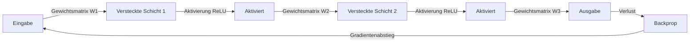

# Neuronale Netze

## Definition

Neuronale Netze sind Funktionsapproximatoren, die aus Schichten von Einheiten (Neuronen) mit lernbaren Gewichten und nichtlinearen Aktivierungen aufgebaut sind. Sie können komplexe Abbildungen von Eingaben zu Ausgaben approximieren, wenn sie auf Daten trainiert werden.

Sie sind die Bausteine des [Deep Learning](/docs/fundamentals/deep-learning). Varianten wie [CNNs](/docs/neural-networks/cnn) und [RNNs](/docs/neural-networks/rnn) fügen induktive Biases (z.B. Lokalität, Rekurrenz) für spezifische Datentypen hinzu; dasselbe Trainingsmaschinerie (Backprop, Gradientenabstieg) gilt.

Der universale Approximationssatz garantiert, dass ein ausreichend breites, einschichtiges Netzwerk jede stetige Funktion approximieren kann — aber in der Praxis ist **Tiefe** (Stapeln vieler Schichten) weit parametereffizienter als Breite allein. Jede zusätzliche Schicht erhöht die Fähigkeit des Modells, einfachere Merkmale zu komplexeren zu kombinieren. Moderne neuronale Netze reichen von wenigen hundert Parametern (winzige Edge-Modelle) bis zu Hunderten von Milliarden (Frontier-LLMs), alle mit denselben grundlegenden Bausteinen: lineare Transformationen, Aktivierungsfunktionen und gradientenbasierte Optimierung.

## Funktionsweise



### Vorwärtsdurchlauf

Die **Eingabe** wird der ersten Schicht übergeben. Jede **Schicht** berechnet eine Linearkombination ihrer Eingaben (Gewichte + Bias) und dann eine nichtlineare Aktivierung (z.B. ReLU, Sigmoid, GELU). Die Ausgabe einer Schicht wird zur Eingabe der nächsten; das Stapeln von Schichten ermöglicht dem Netzwerk, hierarchische Merkmale zu lernen.

### Verlust und Rückwärtspropagation

Die finale **Ausgabe**-Schicht bildet auf Vorhersagen ab (z.B. Klassenscores oder ein Skalar). Eine **Verlustfunktion** (z.B. Cross-Entropy für Klassifikation, MSE für Regression) misst, wie weit die Vorhersagen von den Zielen entfernt sind. **Rückwärtspropagation** berechnet Gradienten durch die Kettenregel von der Ausgabe zur Eingabe.

### Gradientenabstieg und Regularisierung

**Gradientenabstieg** (oder seine stochastischen Varianten: SGD, Adam, AdamW) aktualisiert Gewichte zur Minimierung des Verlustes. Tiefe und Breite bestimmen die Kapazität; Regularisierung (Dropout, Weight Decay, Batch-Normalisierung) und Datengröße kontrollieren das Overfitting.

## Wann verwenden / Wann NICHT verwenden

| Szenario | Neuronale Netze verwenden? | Hinweise |
|---|---|---|
| Unstrukturierte Daten (Bilder, Text, Audio) | Ja | NNs lernen Merkmale automatisch |
| Kleine tabellarische Datensätze | Nein | Gradient Boosting übertrifft oft |
| Interpretierbares Modell benötigt | Nein | NNs sind weitgehend Black Boxes |
| Reichliche beschriftete Daten + Rechenkapazität | Ja | NNs skalieren gut mit beidem |
| Echtzeit-Inferenz auf eingeschränkter Hardware | Mit Vorsicht | Quantisierung oder kleinere Architekturen verwenden |
| Transfer Learning für Ihre Domäne verfügbar | Ja | Fine-Tuning eines vortrainierten NNs schlägt Training von Grund auf |

## Vergleiche

| Architektur | Induktiver Bias | Am besten für | Haupteinschränkung |
|---|---|---|---|
| Feedforward (MLP) | Keine | Tabellarisch, allgemein | Ignoriert räumliche/zeitliche Struktur |
| CNN | Räumliche Lokalität | Bilder, Raster | Weniger effektiv für lange Sequenzen |
| RNN / LSTM | Zeitliche Reihenfolge | Sequenzen, Zeitreihen | Langsam zu trainieren, verschwindende Gradienten |
| Transformer | Globale Attention | Text, multimodal | Hoher Speicherbedarf bei langem Kontext |

## Vor- und Nachteile

| Vorteile | Nachteile |
|---|---|
| Universale Funktionsapproximation | Erfordert erhebliche Datenmengen |
| Skaliert mit Daten und Rechenkapazität | Rechenintensiv |
| Transfer Learning reduziert den Bedarf an beschrifteten Daten | Schwer zu interpretieren |
| Flexible Architekturgestaltung | Empfindlich gegenüber Hyperparametern |

## Codebeispiele

```python
# Einfaches Feedforward-Neuronales Netz mit PyTorch
import torch
import torch.nn as nn

# Einfaches zweischichtiges Netzwerk definieren
class FeedForward(nn.Module):
    def __init__(self, input_dim: int, hidden_dim: int, output_dim: int):
        super().__init__()
        self.layers = nn.Sequential(
            nn.Linear(input_dim, hidden_dim),
            nn.ReLU(),
            nn.Dropout(0.2),
            nn.Linear(hidden_dim, hidden_dim),
            nn.ReLU(),
            nn.Linear(hidden_dim, output_dim),
        )

    def forward(self, x: torch.Tensor) -> torch.Tensor:
        return self.layers(x)

# Instanziieren, Dummy-Batch durchleiten, Ausgabeform inspizieren
model = FeedForward(input_dim=20, hidden_dim=64, output_dim=3)
x = torch.randn(32, 20)          # Batch von 32 Samples, 20 Merkmale
logits = model(x)
print(f"Ausgabeform: {logits.shape}")  # (32, 3)

# Parameter zählen
n_params = sum(p.numel() for p in model.parameters() if p.requires_grad)
print(f"Trainierbare Parameter: {n_params:,}")
```

## Praktische Ressourcen

- [Neural Networks and Deep Learning (Nielsen)](http://neuralnetworksanddeeplearning.com/) — Kostenloses Online-Buch mit mathematischer Tiefe
- [3Blue1Brown – Neural networks](https://www.youtube.com/playlist?list=PLZHQObOWTQDNU6R1_67000Dx_ZCJB-3pi) — Visuelle und intuitive Einführung
- [PyTorch-Tutorials](https://pytorch.org/tutorials/) — Offizielle praxisorientierte Tutorials von einfach bis fortgeschritten

## Siehe auch

- [CNN](/docs/neural-networks/cnn)
- [RNN](/docs/neural-networks/rnn)
- [Deep Learning](/docs/fundamentals/deep-learning)
